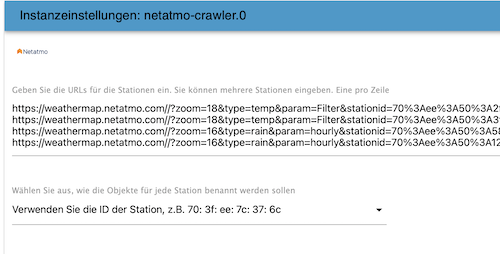

# ioBroker.netatmo-crawler

[](https://www.npmjs.com/package/iobroker.netatmo-crawler)
[](https://www.npmjs.com/package/iobroker.netatmo-crawler)


[](https://david-dm.org/Bart1909/iobroker.netatmo-crawler)
[](https://snyk.io/test/github/Bart1909/ioBroker.netatmo-crawler)
[](https://travis-ci.org/Bart1909/ioBroker.netatmo-crawler)

[](https://nodei.co/npm/iobroker.netatmo-crawler/)


netatmo-crawler adapter for ioBroker
=================

Crawls information from public netatmo stations

Table of contents
=================
* [Instructuion](#instruction)
* [General information](#general-information)
	* [Humidity](#humidity)
	* [Rain](#rain)
	* [Pressure](#pressure)
	* [Temperature](#temperature)
	* [Wind](#wind)
* [Credits](#credits)
* [Changelog](#changelog)
* [License](#license)


Instruction 
===========

To find the url of your preferred weather station, follow these steps:
1. Open the [Netatmo Weathermap](https://weathermap.netatmo.com)
2. Find your station and click the share icon

   

3. Click on *copy link*

   

4. Insert the link in the instance settings of the adapter

   

General information
===================

The “Netatmo Crawler” parse a lot of real local information near you. What do you do with all this information? 
Here are some general facts and examples:

Humidity
--------
Netatmo use the relative humidity, this is the ratio of the current absolute humidity to the highest possible absolute humidity (which depends on the current air temperature). A reading of 100 percent relative humidity means that the air is totally saturated with water vapor and cannot hold any more, creating the possibility of rain. This doesn't mean that the relative humidity must be 100 percent in order for it to rain — it must be 100 percent where the clouds are forming, but the relative humidity near the ground could be much less.

Rain
----
Uses the unit millimeter. If you wish the unit liter per meter cube, you can use this anyway. You can use it for watering in the garden (for example).

Pressure
--------
The air around you has weight, and it presses against everything it touches. That pressure is called atmospheric pressure, or air pressure. 
What should you do with this value? As simple as it sounds: Weather forecast! High pressure = good weather, low pressure = bad weather. 
The normal middle value is 1013 mBar.
For “real” weather forecast you should need pressure history for some hours (I use four hours).
If it falls it should be bad weather in future, if it rise it should be good weather.
I found a [script for forecast here](http://www.beteljuice.co.uk/zambretti/forecast.html) (it’s called zambretti method for a 90% forecast).
Other units: 1 mbar = 100 Pa = 1 hPa

Temperature
-----------
Here you can calculate chill temperature level. For low temperatures the windchill (10 °C or lower, calculate with wind) for high temperatures you can use the heat index (25 °C or higher, calculate with humidity).
example script:
```
windchill1 = windchill(temp, windkmh); //Vars to-from IOBroker

function windchill(temperature, windspeed) {
	var windchill = 13.12 + 0.6215 * temperature - 11.37 * Math.pow(windspeed, 0.16) + 0.3965 * 
			temperature * Math.pow(windspeed, 0.16);
	return windchill;
}

heatindex1 = heatindex(temp, hum); //Vars to-from IOBroker

function heat(temperature, humidity) {
	var heatindex = -8.784695 + 1.61139411 * temperature + 2.338549 * humidity - 0.14611605 * 
			temperature * humidity - 0.012308094 * (temperature * temperature) - 
			0.016424828 * (humidity * humidity) + 0.002211732* (temperature *
			temperature) * humidity + 0.00072546 * temperature * (humidity * humidity)
			- 0.000003582 * (temperature * temperature) * (humidity * humidity);
	return heatindex;
}
```

Wind
----
Wind speed is a measure from air moving from high to low pressure, usually due to changes in temperature.
The gust strength is the highest value of wind, measured in a short time (something like three seconds).
You should do a script for your awning or for the Zambretti method (look above).


## Credits

This adapter would not have been possible without the great work of @bart1909 (https://github.com/jbart1909)",
who created pre V1.x.x releases of this adapter.

Many thanks to [backfisch](https://github.com/backfisch88) for the initial idea and support!

## Changelog
<!--
	Placeholder for the next version (at the beginning of the line):
	### **WORK IN PROGRESS**
-->
### 1.1.0 (2025-09-27)
* (mcm1957) Adapter requires node.js 20, js-controller 6.0.11 and admin 7.6.17 now.
* (Bart1909) Missing headers have been added [#95, #96]
* (mcm1957) Dependencies have been updated.

### 1.0.0 (2025-06-13)
* (Bart1909) A problem handling urls and authentication has been fixed.
* (mcm1957) Adapter has been migrated into iobroker-community-adapters organisation.
* (Bart1909) Adapter requires node.js 20, js-controller 6.0.11 and admin 7.4.10 now.
* (mcm1957) Dependencies have been updated.

### 0.8.0
* (Bart19) Adds additional 'rain_lastHour' state as 'rain' state is now real time value

### 0.7.1
* (Bart19) removed old news (#17)

### 0.7.0
* (Bart19) saves states as read-only (#23)

## License

MIT License


Copyright (c) 2025-2026 iobroker-community-adapters <iobroker-community-adapters@gmx.de>  
Copyright (c) 2022 Bart19 <webmaster@bart19.de>

Permission is hereby granted, free of charge, to any person obtaining a copy
of this software and associated documentation files (the "Software"), to deal
in the Software without restriction, including without limitation the rights
to use, copy, modify, merge, publish, distribute, sublicense, and/or sell
copies of the Software, and to permit persons to whom the Software is
furnished to do so, subject to the following conditions:

The above copyright notice and this permission notice shall be included in all
copies or substantial portions of the Software.

THE SOFTWARE IS PROVIDED "AS IS", WITHOUT WARRANTY OF ANY KIND, EXPRESS OR
IMPLIED, INCLUDING BUT NOT LIMITED TO THE WARRANTIES OF MERCHANTABILITY,
FITNESS FOR A PARTICULAR PURPOSE AND NONINFRINGEMENT. IN NO EVENT SHALL THE
AUTHORS OR COPYRIGHT HOLDERS BE LIABLE FOR ANY CLAIM, DAMAGES OR OTHER
LIABILITY, WHETHER IN AN ACTION OF CONTRACT, TORT OR OTHERWISE, ARISING FROM,
OUT OF OR IN CONNECTION WITH THE SOFTWARE OR THE USE OR OTHER DEALINGS IN THE
SOFTWARE.
