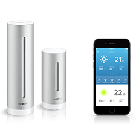

# ioBroker.netatmo

  [](https://www.npmjs.com/package/iobroker.netatmo)
[](https://www.npmjs.com/package/iobroker.netatmo)

[](https://nodei.co/npm/iobroker.netatmo/)

**This adapter uses Sentry libraries to automatically report exceptions and code errors to the developers.** For more details and for information how to disable the error reporting see [Sentry-Plugin Documentation](https://github.com/ioBroker/plugin-sentry#plugin-sentry)! Sentry reporting is used starting with js-controller 3.0.

Netatmo adapter for ioBroker

## Installation and Configuration
Just enter your Netatmo username & password within the adapter settings.

By default a general API key is used to do the requests which limits the update interval to 10 Minutes! 

To increase the interval or to get live updates from Welcome & Presence, CO- und Smoke-Detectors are only you need to enter an own ID/Secret from your NetAtmo App.
To do so, go to the following URL, login with your Netatmo account and fill out the requested form on https://auth.netatmo.com/access/login?next_url=https%3A%2F%2Fdev.netatmo.com%2Fapps%2Fcreateanapp !

Please make sure to configurer your limits that they respect https://dev.netatmo.com/guideline#rate-limits (and have in mind that these linits also exist for ALL USERS if you do not use an own ID/Secret)

## sendTo support

You can also use the sendTo command to set all persons as away (for example if in use as alarm system)
```
sendTo('netatmo.0', "setAway", {homeId: '1234567890abcdefg', personsId: []});
```
or
```
sendTo('netatmo.0', "setAway");
```
to mark all persons as away for all cameras

it's also possible to mark one or more specific persons as away
```
sendTo('netatmo.0', "setAway", {homeId: '1234567890abcdefg', personsId: ['123123123123123']});
```

The parameter homeId is the string listed behind the name of your Camera within the Objects tab (optional, if multiple cameras are installed),
the personsId is the id within the "Known" persons folder

<!--
	Placeholder for the next version (at the beginning of the line):
	### __WORK IN PROGRESS__
-->
## Changelog

### __WORK IN PROGRESS__
* (Apollon77) Integrate Doorbell (WIP!)

### 1.7.1 (2022-03-30)
* (Apollon77) Fix Event cleanup

### 1.7.0 (2022-03-24)
* IMPORTANT: js-controller 3.3.19 is needed at least!
* (Apollon77) Activate events again (manually delete objects once if you get type errors)
* (Apollon77) Adjust some roles and written data to prevent warnings in logs

### 1.6.0 (2022-03-13)
* (Apollon77) Important: In person names (Welcome) in state IDs forbidden characters are now replaces by _!!
* (Apollon77) Fix another potential crash case reported by sentry

### 1.5.1 (2022-03-09)
* (Apollon77) Fix jsonconfig for Client secret

### 1.5.0 (2022-03-08)
* (kyuka-dom) Added support for netatmo carbon monoxide sensor.
* (kyuka-dom) Added support for netatmo smoke alarm.
* (foxriver76) prevent crashes if application limit reached
* (Apollon77) Allow to specify own id/secret in all cases
* (Apollon77/foxriver76) ensure that minimum polling interval of 10 minutes is respected if no individual ID/Secret is provided
* (Apollon77) Several pother fixes and optimizations
* (Apollon77) Add Sentry for crash reporting

### 1.4.4 (2021-07-21)
* (Apollon77) Fix typo that lead to a crash

### 1.4.3 (2021-06-27)
* (Apollon77) Fix typo to fix crash

### 1.4.2 (2021-06-27)
* (bluefox) Removed warnings about the type of states

### 1.4.0 (2021-06-24)
* (bluefox) Added the support of admin5 
* (bluefox) Removed warnings about the type of states

### 1.3.3
* (PArns) removed person history

### 1.3.2
* (PArns) Updated libs & merged pending patches
* (PArns) Changed update interval from 5 to 10 minutes (requested by Netatmo)

### 1.3.1
* (PArns) Fixed event cleanup crash

### 1.3.0
* (HMeyer) Added Netatmo Coach

### 1.2.2
* (PArns) Updated meta info

### 1.2.0
* (PArns) Fixed camera picture for events
* (PArns) Added camera vignette for events
* (PArns) Added camera video for events
* (PArns) Added new sub event type (human, vehicle, animal, unknown)
* (PArns) Added LastEventID within the LastEventData section

### 1.1.7
* (PArns) Added missing lib dependencies

### 1.1.6
* (PArns) Removed GIT requirement and included netatmo lib directly

### 1.1.5
* (PArns) Removed 502 error output if API has backend problems

### 1.1.4
* (PArns) Added support for unnamed modules

### 1.1.1
* (PArns) Simplified setAway

### 1.1.0
* (PArns) Added setAway function (Welcome only) to mark all or specific persons as away (requires your own API key!)

### 1.0.1
* (PArns) Fixed scope problems for presence & welcome (requires your own API key!)

### 1.0.0
* (PArns) Added live camera picture & stream for presence & welcome
* (PArns) Fixed known & unknown face image url for presence & welcome

### 0.6.2
* (PArns) Added name of last seen known face

### 0.6.1
* (PArns) Changed realtime server to use new general realtime server
* (PArns) Changed enums to channels to avoid enum creation
* (PArns) Simplified detection for movement-, known- & unknown- face events

### 0.6.0
* (PArns) Rewritten realtime updates to not need a local server any longer! Realtime updates are now turned on by default if a Welcome or Present cam is available

### 0.5.1
* (PArns) Optimized realtime updates to avoid updates if only movement was detected

### 0.5.0
* (PArns) Added realtime events for Netatmo Welcome

### 0.4.1
* (PArns) Removed log warnings for Wind sensor

### 0.4.0
* (PArns) Added absolute humidity
* (PArns) Added dewpoint

### 0.3.1
* (PArns) Reuse of preconfigured OAuth Client data
* (PArns) Added backward compatibility with existing installations

### 0.3.0
* (wep4you) Initial implementation of Netatmo welcome camera

### 0.2.2
* (PArns) Fixed SumRain24MaxDate & SumRain24Max which won't update in some rare cases

### 0.2.1
* (PArns) Corrected DateTime values & object types

### 0.2.0
* (PArns) Added SumRain1Max/SumRain1MaxDate & SumRain24Max/SumRain24MaxDate to get overall rain max since adapter installation

### 0.1.1
* (PArns) Fixed TemperatureAbsoluteMin/TemperatureAbsoluteMax

### 0.1.0
* (PArns) Fixed CO2 calibrating status
* (PArns) Added last update for devices
* (PArns) Added TemperatureAbsoluteMin/TemperatureAbsoluteMax to get overall temperature min/max since adapter installation

### 0.0.4
* (PArns) Fixed typo/missing parameter in GustStrength

### 0.0.3
* (PArns) Added error handling to prevent exceptions for missing parameters

### 0.0.2
* (PArns) Fixed rain sensor

### 0.0.1
* (PArns) Initial release

## License
MIT

Copyright (c) 2016-2022 Patrick Arns <iobroker@patrick-arns.de>
