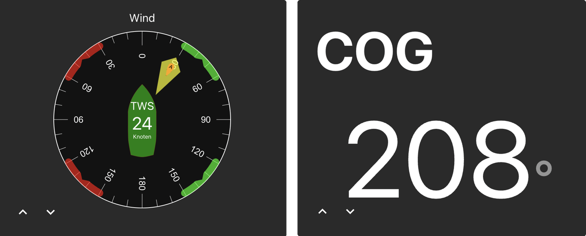

# ioBroker.nmea
This adapter allows connecting ioBroker to NMEA-2000 yacht bus.

**This adapter uses Sentry libraries to automatically report exceptions and code errors to the developers.**
For more details and for information how to disable the error reporting see [Sentry-Plugin Documentation](https://github.com/ioBroker/plugin-sentry#plugin-sentry)!
Sentry reporting is used starting with js-controller 3.0.

To use this adapter, you need a hardware that can read NMEA-2000 bus and convert it to the serial port:
- Actisense NGT-1 (USB)
- or Raspberry PI with PiCAN-M



[YouTube explanation](https://youtu.be/flp_-mypbRU?si=k0lp95OukQ88LBxj)

## How to use it on Raspberry PI with PiCAN-M

The PiCAN M is a compact add-on board designed for the Raspberry Pi 3/4.
It enables the connection of both NMEA2000 and NMEA0183 networks to a Raspberry Pi.
The board can be powered through an external 12V source.
Additionally, it offers the option to power the Raspberry Pi directly via the NMEA2000 bus when used with the PiCAN-M board.

**The PiCAN-M lacks appropriate protection against reverse polarity for the 12V supply voltage. When operated externally at 12V, it is necessary to include a 1A fuse in the power supply line.**

Because of the high requirements of Raspberry Pi to power supply, we suggest powering the Raspberry PI from the external power source (at least 3A).
Power over NMEA2000 and over USB could function in parallel without a problem.

### Installation
See chapter 3 in [PiCAN-M User Guide](img/pican-m_UGB_10.pdf) for more details, but here is a short summary:

Edit file `/boot/config.txt` (with `sudo nano /boot/config.txt`) and add the following lines to the end of the file:
```
enable_uart=1
dtparam=i2c_arm=on
dtparam=spi=on
dtoverlay=mcp2515-can0,oscillator=16000000,interrupt=25 
```

Disable outputs on UART console: 
- start in CLI `sudo raspi-config`
- go to `3 Interface Options`
- go ot `I5 Serial Port`
- Disable `shell accessible over serial` and `serial port hardware enabled`
- Exit from `raspi-config` and reboot

Install can-utils
```
sudo apt-get install can-utils
```

## Actisense NGT-1
Actisense NGT-1 is visible on Windows or Linux without any additional drivers. It is visible as a serial port 'COMn' (Windows) or ttyN(on linux).

## Todo
- Encode code
- AIS
- find out why sent data from address 100
- Integration of [iKonvert NMEA 2000](https://digitalyachtamerica.com/product/ikonvert-usb/)
- Integration of [Shipmodul MiniPlex-3-N2K](https://www.shipmodul.com/products.html)

## Data simulation
You can feed the data from external sensors to the NMEA2000 bus.
Actually, you can only simulate environmental data, like temperature, humidity, pressure.

With the flag `Combined environment` you can define the PGN number which will be used for temperature, humidity and pressure:
- If you unselect the flag `Combined environment`, so for the temperature will be used PGN 130314, for humidity PGN 130313 and for pressure PGN 130314.
- If you select the flag `Combined environment`, so all three values will be sent in PGN 130311 together with other possible environmental values.

## Time zone
There is a possibility to set the time zone from GPS coordinates.
For this the according option must be enabled in the adapter settings and allowed for `iobroker` user the command execution:
`sudo visudo`

```
iobroker ALL=(ALL) timedatectl set-timezone
```

<!--
	### **WORK IN PROGRESS**
-->
## Changelog
### 0.2.0 (2024-06-15)
* (bluefox) Backend was rewritten on TypeScript
* (bluefox) Support for AIS added
* (bluefox) Valid processing of temperature, pressure and humidity

### 0.1.8 (2024-03-20)
* (bluefox) Corrected vis-2 widgets

### 0.1.1 (2024-03-19)
* (bluefox) Corrected vis-2 widgets

### 0.0.4 (2024-03-12)
* (bluefox) Fixed CI tests

### 0.0.3 (2024-03-12)
* (bluefox) Initial commit

## License
The MIT License (MIT)

Copyright (c) 2024 bluefox <dogafox@gmail.com>

Permission is hereby granted, free of charge, to any person obtaining a copy
of this software and associated documentation files (the "Software"), to deal
in the Software without restriction, including without limitation the rights
to use, copy, modify, merge, publish, distribute, sublicense, and/or sell
copies of the Software, and to permit persons to whom the Software is
furnished to do so, subject to the following conditions:

The above copyright notice and this permission notice shall be included in
all copies or substantial portions of the Software.

THE SOFTWARE IS PROVIDED "AS IS", WITHOUT WARRANTY OF ANY KIND, EXPRESS OR
IMPLIED, INCLUDING BUT NOT LIMITED TO THE WARRANTIES OF MERCHANTABILITY,
FITNESS FOR A PARTICULAR PURPOSE AND NONINFRINGEMENT. IN NO EVENT SHALL THE
AUTHORS OR COPYRIGHT HOLDERS BE LIABLE FOR ANY CLAIM, DAMAGES OR OTHER
LIABILITY, WHETHER IN AN ACTION OF CONTRACT, TORT OR OTHERWISE, ARISING FROM,
OUT OF OR IN CONNECTION WITH THE SOFTWARE OR THE USE OR OTHER DEALINGS IN
THE SOFTWARE.
