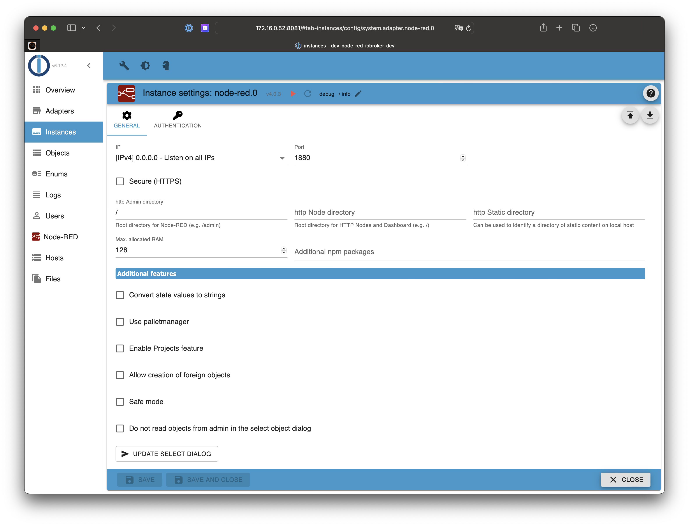
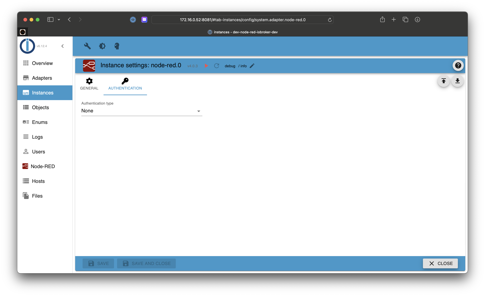
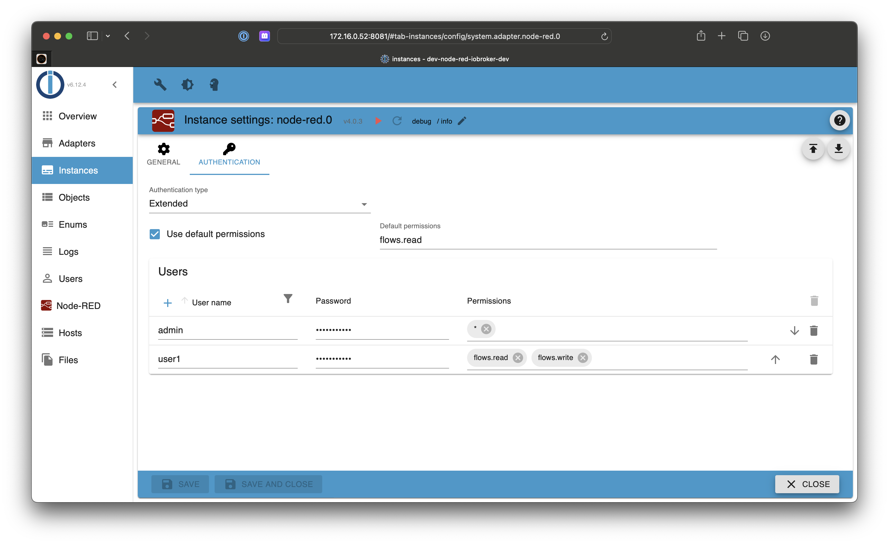

# ioBroker.node-red

**Note:** If you cannot find your state in the select ID dialog of the ioBroker nodes, press the update button in instance settings or restart the node-red instance. By restarting the new object list will be created.

## Settings

### Maximum RAM Setting

In the adapter/instance configuration you can adjust the maximum RAM/Heap for the node-red process. The default is sufficient for smaller node-red installations. If you have many nodes or you experience performance issues or crashes of the node.red process in the logs, please upgrade the maximum RAM setting! Depending on your available RAM (see e.g. using `free -m` on "avail") increase it to 1024 (=1GB) or even higher.

### Safe Mode

Flows will not be started, and you can edit the flows to fix some overload problem.

## Authentication

### None

### Simple

### Extended

## Nodes

### ioBroker in

### ioBroker out

### ioBroker get

### ioBroker get object

### ioBroker list

### ioBroker sendTo

## Changelog
### 6.0.1 (2024-09-30)

-   (@GermanBluefox) Corrected the case if `envVars` settings is undefined
-   (@GermanBluefox) Used common `@iobroker/eslint-config`
-   (@GermanBluefox) Node-red updated to 4.0.3

### 5.2.1 (2024-04-27)

-   (Apollon77) Update node-red to 3.1.9 to fix execution on windows
-   (Apollon77) Restore log behavior as it was in till 5.0.x

### 5.2.0 (2024-02-17)

-   (klein0r) Added persistence of context data (filesystem)

### 5.1.0 (2023-12-27)

-   (klein0r) Allow custom themes
-   (klein0r) Fixed scoped node-red packages

### 5.0.2 (2023-12-14)

-   (TheRealArthurDent) Fixed a fatal error when getting a non-existent value

## License

Copyright 2014-2024 bluefox <dogafox@gmail.com>.

Licensed under the Apache License, Version 2.0 (the "License");
you may not use this file except in compliance with the License.
You may obtain a copy of the License at

http://www.apache.org/licenses/LICENSE-2.0

Unless required by applicable law or agreed to in writing, software
distributed under the License is distributed on an "AS IS" BASIS,
WITHOUT WARRANTIES OR CONDITIONS OF ANY KIND, either express or implied.
See the License for the specific language governing permissions and
limitations under the License.