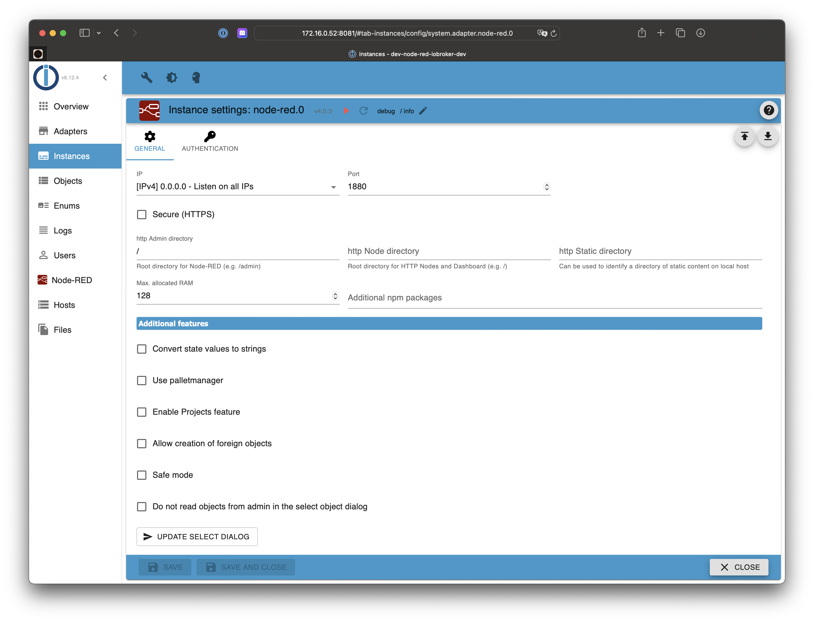
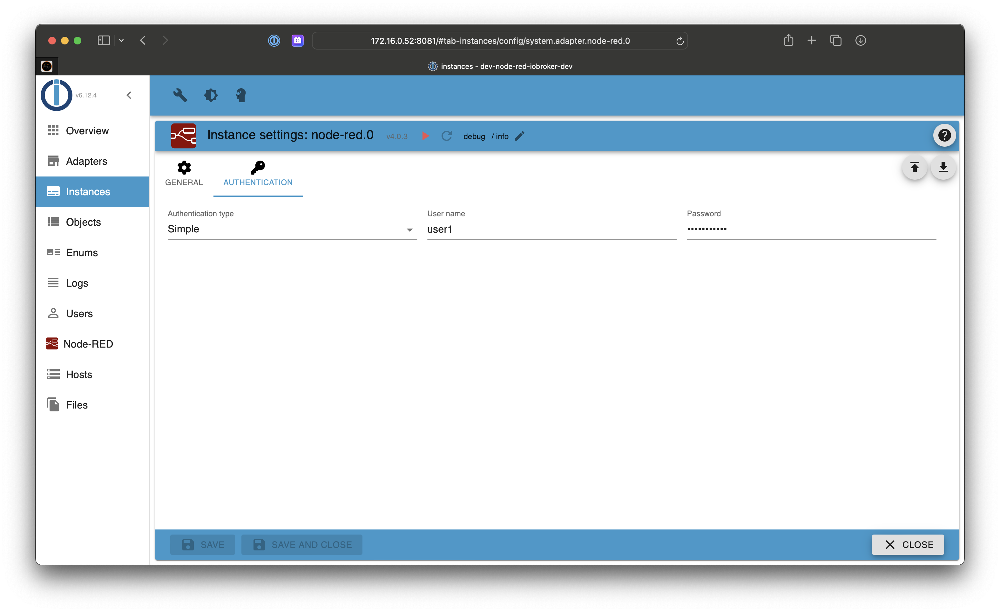
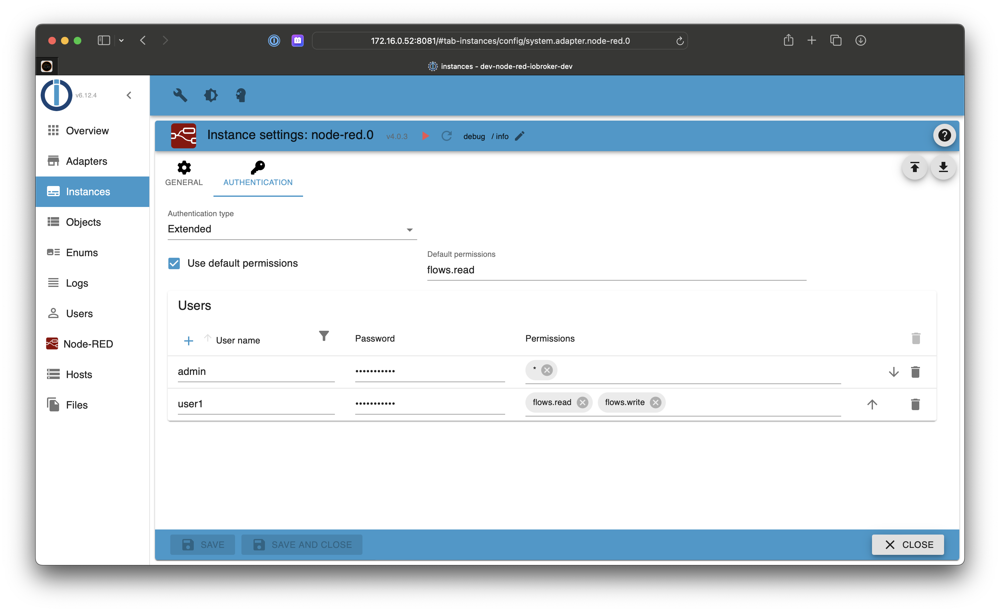

# ioBroker.node-red

**Note:** If you cannot find your state in the select ID dialog of the ioBroker nodes, press the update button in instance settings or restart the node-red instance. By restarting the new object list will be created.

## Settings

### Maximum RAM Setting

In the adapter/instance configuration you can adjust the maximum RAM/Heap for the node-red process. The default is sufficient for smaller node-red installations. If you have many nodes or you experience performance issues or crashes of the node.red process in the logs, please upgrade the maximum RAM setting! Depending on your available RAM (see e.g. using `free -m` on "avail") increase it to 1024 (=1GB) or even higher.

### Safe Mode

Flows will not be started, and you can edit the flows to fix some overload problem.

### Context Storage

Node-RED can store the context of a node (`context`, `flow` and `global`) in different [context stores](https://nodered.org/docs/user-guide/context). This adapter configures two of them:

| Store        | Persistent | Description                                                                                             |
| ------------ | ---------- | ------------------------------------------------------------------------------------------------------- |
| `file`       | yes        | Default store. The context is written to the ioBroker data directory and survives a restart of the adapter |
| `memoryOnly` | no         | The context is only kept in RAM and is lost as soon as the adapter restarts                              |

The store can be selected in the configuration dialog of every node that uses the context. If no store is selected, `file` is used.

**Note:** Up to version 6.0.8 the file based store was named `default`. If you selected the store explicitly in a node, open the node and select `file` again, otherwise node-red logs a warning about an unknown context store.

## Authentication

### None

### Simple

### Extended

## Nodes

### ioBroker in

### ioBroker out

### ioBroker get

### ioBroker get object

### ioBroker list

### ioBroker sendTo

## Changelog
### 7.0.2 (2026-08-15)
-   (@GermanBluefox) Allowed to use admin instance with authentication (Admin 7.6.4 is required)
-   (@thiloms) Added an additional memory based context storage (`memoryOnly`)
-   (@thiloms) The file based context storage was renamed from `default` to `file`. Existing data is kept, but nodes with an explicitly selected store must be re-selected in the editor
-   (@GermanBluefox) The adapter backend was rewritten in TypeScript. The sources are now located in `src` and are compiled into `build`
-   (@GermanBluefox) Disabled the node-red notification about a new node-red version, as node-red is updated together with the adapter
-   (@GermanBluefox) Updated nore-red to 5

### 6.0.8 (2025-03-24)
-   (@GermanBluefox) Do not try to connect to unsecure admin from secure page and vice versa

### 6.0.7 (2025-03-24)
-   (@GermanBluefox) Replace Select-ID dialog with a library
-   (@GermanBluefox) Packages were updated

### 6.0.5 (2024-12-30)

-   (@GermanBluefox) Restart node-red if admin settings changed
-   (@GermanBluefox) Node-red updated to 4.0.8

### 6.0.1 (2024-09-30)

-   (@GermanBluefox) Corrected the case if `envVars` settings is undefined
-   (@GermanBluefox) Used common `@iobroker/eslint-config`
-   (@GermanBluefox) Node-red updated to 4.0.3

[Older changelogs can be found there](CHANGELOG_OLD.md)

## License

Copyright 2014-2026 bluefox <dogafox@gmail.com>.

Licensed under the Apache License, Version 2.0 (the "License");
you may not use this file except in compliance with the License.
You may obtain a copy of the License at

http://www.apache.org/licenses/LICENSE-2.0

Unless required by applicable law or agreed to in writing, software
distributed under the License is distributed on an "AS IS" BASIS,
WITHOUT WARRANTIES OR CONDITIONS OF ANY KIND, either express or implied.
See the License for the specific language governing permissions and
limitations under the License.