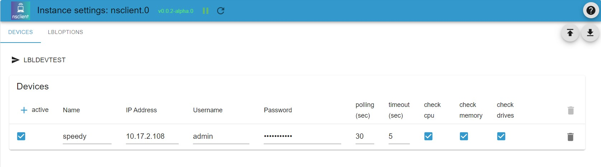

# NSCLIENT adapter configuration and usage

## General information and features

This adapter allows automatic polling of client systems equipped with NsClient++ agent and store the results in multiple states. So (for example) the following cleint data will be available within ioBroker:

- system uptime
- cpu load in percent for several time ranges
- memory load for several time ranges
- discspace with absolute values and as percentage values

Additionally every check returns a binary status and a textual status message.

This adapter supports an unlimited number of devices with configurable polling interval.

## Requirements

This adapter requires an NsClient++ agent to be installed at the target system. This agent is available for Windows (tested with Windows 10 and Windows 11) and Linux. The NsClient++ software is describes and available [here](https://nsclient.org/) free of charge.

__ATTENTION:__ The required nsclient agent is not activly maintained but stills works stable at Win10 / Win11 and is used in nagios network monitoring based environments.

## Downloading and installing the NsClient++ agent 

### Download client agent software

__IMPORTANT:__ Please note the nsclient++ agent software is neither developed nor maintained by ioBroker team. The ioBroker developmentteam cannot take any resonsibilty for any damage or security risk caused by nclient++ software.

### Installing on windows systems

You can download the nsclient installation kits [here](https://nsclient.org/download/). Please select the package matching you operating system.

* After downloading the nsclient++ software from [nsclient++ homepage](https://nsclient.org/) start the installation by executing the downloaded image (i.e. NSCP-0.5.2.35-x64.msi).

* When prompted select monitoring tool - generic

* Select installation type typical

* Add the ip addresses of those hosts which should be allowed to connect to the agent. You can add a list of ip addresses seperated by comma. For details see [nsclient++ documentation](https://docs.nsclient.org/web/)

* set a secure password.  
__IMPORTANT: nsclient stores the password unencrypted. So never use a password used for some other access then the nsclient++ agent.__

* enable _common_ _check_ _plugins_ and _WEB_ _server_ (other modules are not required for ioBroker access, but feel free to install them if any other usage is intended.)

* allow the installation to continiue and enter an admin password if requested by windows

* reboot the system to finalize the installation (yes, it's windows).

### Installing On Linux systems

Please see information at [nsclient++ homepage](https://nsclient.org) for details.

## Configuration of the NsClient++ agent 

* connect to nsclient++ web interface by opening https://localhost:8443. Authorize by using the password specified during installation.  
A description of the web UI can be found [in the documentation](https://docs.nsclient.org/web/)

* ensure that the required modules are loaded an enabled  
see the list of modules in the next picture

* most likely you will have to load and enable some modules. To do this, click onto the line listing the module to open the module config. Mark _loaded_ and _enabled_ buttons.  
__Do not forget to save the changes__

* feel free to enable others modules too.  
__WARNING:__ when enabling modules which can execute scripst at the target system security risks can arise. Be sure to understand how nsclient++ is working and how to avoid unauthorizes acess before enabling such modules. ioBoker.nsclient adapter does not support any action triggered at the target system.

## Configuration of the ioBroker.nsclient adapter

The configuratuon of the ioBroker.nsclient adapter is structured with several tabs. (Currently only tab _devices_ is used.)

### Tab _devices_

The _devices_ tab is used to configure all devices which should be monitored by the instance. You can add a new table line for each device with the following data:

| Parameter     | Type        | Description                       | Comment                             |
|---------------|-------------|-----------------------------------|-------------------------------------|
| active        | boolean     | if set to true, the device will be used  | This can be used to disable a single device |
| Name          | text        | name of the device                | Parameter will be used to create name of data points. Names must be unique and must not end with a dot oder conatin consecutive dots. |
| IP address    | text        | ip address (IPv4 or IPv6) or a domain name with optional port number attached    | |
| Username       | text         | username to authenticate          | Note: nsclient requires username to be _admin_ currently |
| Password       | text         | password to authenticate          |                               |
| polling (sec) | number        | poll intervall in seconds         |                               |
| timeout (sec) | number        | processing timeout in seconds     |                               |
| check cpu     | boolean       | enable cpu related checks         |                               |
| check memory  | boolean       | enable memory related checks      |                               |
| check drives  | boolean       | enable drivespace related checks  |                               |

IoBroker state bjects will be created after successful polling the target device.

## Changelog
<!--
    Placeholder for the next version (at the beginning of the line):
    ### **WORK IN PROGRESS**
-->
### 0.2.3 (2024-03-12)
* (mcm1957) Dependencies have been updated

### 0.2.2 (2023-12-10)
* (mcm1957) Sentry has been activated.

### 0.2.1 (2023-12-10)
* (mcm1957) Adapter has been moved to mcm4iob organization.
* (mcm1957) Dependencies have been updated

### 0.2.0 (2023-09-11)
* (mcm1957) This adapter requires node 18 or newer now
* (mcm1957) Dependencies have been updated

### 0.1.2 (2022-12-03)
* (mcm1957) missing config data has been added to io-package.json (#15)
* (mcm1957) timer functions have been replaced with iob adapter versions (#22)
* (mcm1957) support for sentry has been added (#23)

### 0.1.1 (2022-09-25)
* (mcm1957) initial release for testing

## License
MIT License

Copyright (c) 2022-2024 mcm1957 <mcm57@gmx.at>

Permission is hereby granted, free of charge, to any person obtaining a copy
of this software and associated documentation files (the "Software"), to deal
in the Software without restriction, including without limitation the rights
to use, copy, modify, merge, publish, distribute, sublicense, and/or sell
copies of the Software, and to permit persons to whom the Software is
furnished to do so, subject to the following conditions:

The above copyright notice and this permission notice shall be included in all
copies or substantial portions of the Software.

THE SOFTWARE IS PROVIDED "AS IS", WITHOUT WARRANTY OF ANY KIND, EXPRESS OR
IMPLIED, INCLUDING BUT NOT LIMITED TO THE WARRANTIES OF MERCHANTABILITY,
FITNESS FOR A PARTICULAR PURPOSE AND NONINFRINGEMENT. IN NO EVENT SHALL THE
AUTHORS OR COPYRIGHT HOLDERS BE LIABLE FOR ANY CLAIM, DAMAGES OR OTHER
LIABILITY, WHETHER IN AN ACTION OF CONTRACT, TORT OR OTHERWISE, ARISING FROM,
OUT OF OR IN CONNECTION WITH THE SOFTWARE OR THE USE OR OTHER DEALINGS IN THE
SOFTWARE.