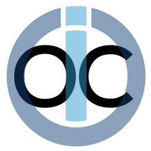

# ioBroker.onlycat

**Tests:** 

## Adapter for OnlyCat® cat flaps with prey detection

Adapter for OnlyCat® cat flaps with prey detection.

  

  

## Configuration

Add device token on the adapter configuration page.
Token can be found in the OnlyCat App on the Account page.

## Description

The adapter provides the events from the OnlyCat cat flap, i.e. entries, exits and prey detection.
It also lets you set the active transit policy.

The adapter requires Node 20 or newer.

## Notes

OnlyCat® is a registered trademarks of [VirtualV Trading Ltd.](https://www.onlycat.com/)

## Changelog

### 0.5.2 (2025-10-22)

* (Sickboy78) dependency updates
* (Sickboy78) migration to npm trusted publishing

### 0.5.1 (2025-09-08)

* (Sickboy78) fix error on firmware channel missing

### 0.5.0 (2025-09-07)

* (Sickboy78) transit policies added
* (Sickboy78) connectivity and firmware channel added to device

### 0.4.0 (2025-07-13)

* (Sickboy78) migrated to iobroker eslint rules

### 0.3.1 (2025-07-12)

* (Sickboy78) improved event type classification
* (Sickboy78) improved fetching of events in progress

### 0.3.0 (2025-06-04)

* (Sickboy78) code improvements from review

### 0.2.0 (2025-05-09)

* (Sickboy78) use pet names from RFID profiles

### 0.1.0 (2025-05-03)

* (Sickboy78) event classification and trigger source schema updated
* (Sickboy78) dependency updates

### 0.0.1 (2025-04-18)

* (Sickboy78) initial release

## License

MIT License

Permission is hereby granted, free of charge, to any person obtaining a copy
of this software and associated documentation files (the "Software"), to deal
in the Software without restriction, including without limitation the rights
to use, copy, modify, merge, publish, distribute, sublicense, and/or sell
copies of the Software, and to permit persons to whom the Software is
furnished to do so, subject to the following conditions:

The above copyright notice and this permission notice shall be included in all
copies or substantial portions of the Software.

THE SOFTWARE IS PROVIDED "AS IS", WITHOUT WARRANTY OF ANY KIND, EXPRESS OR
IMPLIED, INCLUDING BUT NOT LIMITED TO THE WARRANTIES OF MERCHANTABILITY,
FITNESS FOR A PARTICULAR PURPOSE AND NONINFRINGEMENT. IN NO EVENT SHALL THE
AUTHORS OR COPYRIGHT HOLDERS BE LIABLE FOR ANY CLAIM, DAMAGES OR OTHER
LIABILITY, WHETHER IN AN ACTION OF CONTRACT, TORT OR OTHERWISE, ARISING FROM,
OUT OF OR IN CONNECTION WITH THE SOFTWARE OR THE USE OR OTHER DEALINGS IN THE
SOFTWARE.

Copyright (c) 2025-2026 Sickboy78 <asmoday_666@gmx.de>