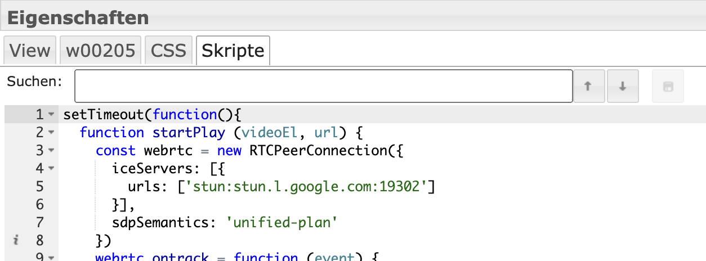

# ioBroker.onvif

[](https://www.npmjs.com/package/iobroker.onvif)
[](https://www.npmjs.com/package/iobroker.onvif)


[](https://nodei.co/npm/iobroker.onvif/)

**Tests:** 

## ONVIF adapter for ioBroker

**Adapter for ONVIF cameras**

**This adapter uses Sentry libraries to automatically report exceptions and code errors to the developers.** For more details and for information how to disable the error reporting see [Sentry-Plugin Documentation](https://github.com/ioBroker/plugin-sentry#plugin-sentry)! Sentry reporting is used starting with js-controller 3.0.

## Kameras hinzufügen

### Discovery:

Bei jedem Adapterstart wird mit dem in der Einstellungen eingetragen Benutzername und Passwort eine Discovery durchgeführt und versucht sich in die Kamera einzuloggen. Falls die Kamera noch nicht unter Objekte hinzugefügt wurde.

In den Einstellungen kann man die Discovery manuell ausführen. Falls die Kameras unterschiedliche Zugangsdaten haben müssen die jeweils eingegeben werden und eine discovery durchgeführt werden. Im Log sieht man Details zu dem Prozess.

Damit eine Kamera neu erkannt wird muss sie einfach unter Objekte gelöscht werden.

### Manuelle Suche

Es können Kameras manuell gesucht werden, falls Discovery nicht funktioniert. Dazu muss eine IP Range und Ports eingegeben und manuell ausgeführt werden. Im Log sieht man Details zu dem Prozess.

## Datenpunkte

onvif.0.IP_PORT.events Events der Kamera wie z.b. Bewegungserkennung. Manchmal muss ein Event ausgelöst werden damit er angezeigt wird.

onvif.0.IP_PORT.general Generelle Information über die Kameras

onvif.0.IP_PORT.infos Informationen über die Kamera werden nur bei Adapterstart aktualisiert oder bei remote.refresh

Video und Snapshot URL:

onvif.0.IP_PORT.infos.streamUris.MediaProfile_Channel1_MainStream.snapshotUrl.uri

onvif.0.IP_PORT.remote Steuerung der Kamera

onvif.0.IP_PORT.remote.refresh Aktualisierung der Infodaten

onvif.0.IP_PORT.remote.gotoHomePosition PTZ Kamera in die HomePosition setzen

onvif.0.IP_PORT.remote.gotoPreset PTZ Kamera Preset Nummer auswählen

onvif.0.IP_PORT.remote.snapshot Speichert ein snapshot unter onvif.0.IP_PORT.snapshot

## Message

Adapter nimmt Message "snapshot" entgegen und gibt ein Bild zurück

```javascript
sendTo("onvif.0", "snapshot", "192_168_178_100_80", (result) => {
  if (result) {
    sendTo("telegram.0", {
      text: result,
      type: "photo",
      caption: "Kamera 2",
    });
  }
});
```

## Bewegungsmeldung zu Telegram

```javascript
on("onvif.0.192_168_178_100_80.events.RuleEngine/CellMotionDetector/Motion", (obj) => {
  if (obj.state.val === true) {
    sendTo("onvif.0", "snapshot", "192_168_178_100_80", (result) => {
      if (result) {
        sendTo("telegram.0", {
          text: result,
          type: "photo",
          caption: "Camera 2",
        });
      }
    });
  }
});
```

# Stream in vis einbinden

Wenn Stream in Apple Homekit angezeigt werden soll dann bitte direkt in yahka eine camera erzeugen. Wenn das nicht funktioniert oder hksv benötigt wird, dann scrypted in einem docker installieren und die Kamera mit onvif und homekit plugin hinzufügen

## go2rtsp Docker

Ein Stream wird normalerweise via rtsp stream bereitgestellt. Eine Umwandlung via motion eye ist sehr resourcen aufwändig und hat ein Verzögerng. Ein Umwandlung in webrtc ist schneller und resourcenschonender. Meine Empfehlung ist ein [go2rtsp](https://github.com/AlexxIT/go2rtc). Dazu muss ein Docker von alexxit/go2rtc erstellt werden.
https://hub.docker.com/r/alexxit/go2rtc

Es gibt auch eine Version mit Hardware Unterstützung:
https://github.com/AlexxIT/go2rtc/wiki/Hardware-acceleration

Oder go2rtc lokal zu installieren:
https://forum.iobroker.net/post/1031526

```
 image: alexxit/go2rtc
    network_mode: host       # important for WebRTC, HomeKit, UDP cameras
    privileged: true         # only for FFmpeg hardware transcoding
    restart: unless-stopped  # autorestart on fail or config change from WebUI
    environment:
      - TZ=Europe/Berlin  # timezone in logs
    volumes:
      - "~/go2rtc:/config"   # folder for go2rtc.yaml file (edit from WebUI)
```

Es muss ein Volume für den Pfad /config und das Netzwerk als Host eingestellt werden.

Dann ist go2rtsp erreichbar über

```
http://IP:1984
```

Dann kann man ein Stream hinzufügen. Die Stream url findet man z.B. unter
`onvif.0.IP_PORT.infos.streamUris.ProfileName.live_stream_tcp.uri`


### Stream als iFrame einfügen

Das Widget `iFrame` in der Vis hinzufügen und als Quelle den stream link von go2rtsp verwenden

`http://192.168.178.1:1984/stream.html?src=camera&mode=webrtc`

Unter links kann noch die Art des Players ausgewählt werden (Mikrofon)

## Rtsp2Web Docker

Eine Alternative ist ein [RTSPtoWeb](https://github.com/deepch/RTSPtoWeb) Docker. Dies ist aber von der Einrichtun komplizierter.
Dazu muss ein Docker von ghcr.io/deepch/rtsptoweb:latest erstellt werden.

<details>

```
docker run --name rtsp-to-web -v /YOURPATHFORCONFIG:/config --network host ghcr.io/deepch/rtsptoweb:latest
```

Es muss ein Volume für den Pfad /config und das network als host eingestellt werden.

Dann ist rtsptoweb erreichbar über

```
http://IP:8083
```

Dann kann man ein Stream hinzufügen. Die Stream url findet man z.B. unter
`onvif.0.IP_PORT.infos.streamUris.ProfileName.live_stream_tcp.uri`


### Danach benötigen wir die Stream Id. Dafür Stream Edit und in der URL die Id rauskopieren

`http://192.168.178.2:8083/pages/stream/edit/ddbdb583-9f80-4b61-bafa-613aa7a5daa5`

## Einzelnen Stream in der Vis einfügen

Dann in der vis ein HTML Objekt auswählen. Dann im Widget unter HTML den rtsp2web server mit stream id eintragen:


## **Wenn mehrere Stream hinzugefügt werden soll muss `webrtc-url` und `webrtc-video` in html und skript mit einer neuen id ersetzt werden z.B. `webrtc-url2` und `webrtc-video2`**

```html
<input
  type="hidden"
  name="webrtc-url"
  id="webrtc-url"
  value="http://192.168.0.2:8083/stream/ddbdb583-9f80-4b61-bafa-613aa7a5daa5/channel/0/webrtc"
/>

<video id="webrtc-video" autoplay muted playsinline controls style="max-width: 100%; max-height: 100%;"></video>
```

In dem Widget unter Skripte dieses Skript hinzufügen:

```javascript
setTimeout(function () {
  function startPlay(videoEl, url) {
    const webrtc = new RTCPeerConnection({
      iceServers: [
        {
          urls: ["stun:stun.l.google.com:19302"],
        },
      ],
      sdpSemantics: "unified-plan",
    });
    webrtc.ontrack = function (event) {
      console.log(event.streams.length + " track is delivered");
      videoEl.srcObject = event.streams[0];
      videoEl.play();
    };
    webrtc.addTransceiver("video", { direction: "sendrecv" });
    webrtc.onnegotiationneeded = async function handleNegotiationNeeded() {
      const offer = await webrtc.createOffer();

      await webrtc.setLocalDescription(offer);

      fetch(url, {
        method: "POST",
        body: new URLSearchParams({ data: btoa(webrtc.localDescription.sdp) }),
      })
        .then((response) => response.text())
        .then((data) => {
          try {
            webrtc.setRemoteDescription(new RTCSessionDescription({ type: "answer", sdp: atob(data) }));
          } catch (e) {
            console.warn(e);
          }
        });
    };

    const webrtcSendChannel = webrtc.createDataChannel("rtsptowebSendChannel");
    webrtcSendChannel.onopen = (event) => {
      console.log(`${webrtcSendChannel.label} has opened`);
      webrtcSendChannel.send("ping");
    };
    webrtcSendChannel.onclose = (_event) => {
      console.log(`${webrtcSendChannel.label} has closed`);
      startPlay(videoEl, url);
    };
    webrtcSendChannel.onmessage = (event) => console.log(event.data);
  }

  const videoEl = document.querySelector("#webrtc-video");
  const webrtcUrl = document.querySelector("#webrtc-url").value;

  startPlay(videoEl, webrtcUrl);
}, 1000);
```



## Alle Streams als iFrame

Alternativ könnte man auch den Kamera Overview als Iframe einfügen:
Das Widget `iFrame` hinzufügen und als Quelle den rtsp2web Server eintragen:

`http://192.168.0.2:8083/pages/multiview/full?controls`

</details>

## FFMpeg Unterstützung

Wenn die Kamera keine Snapshot Unterstützng hat wird mit ffmpeg ein snapshot aus dem rtsp stream erzeugt.

## Snapshot Server in vis einbinden

Der Adapter bietet ein Snapshot Server ohne Passwort an. Dazu Server aktivieren in den Instanzeinstellungen und dann kann der aktuelle Snapshot http://iobrokerIp:8095/CAMERAIP_PORT z.B. http://192.168.0.1:8095/192_168_0_1_80 abgerufen werden.

In der Vis ein Image Widget einfügen und die Url als Quelle angeben und eine Updatezeit auswählen

## Snapshot in vis einbinden

Wenn möglich die snapshotUri verwenden z.B.
onvif.0.IP_PORT.infos.streamUris.MediaProfile_Channel1_MainStream.snapshotUrl.uri

### _Den Datenpunkt nicht als Stream verwenden, da sonst die Festplatte zu hohe Last hat._

#### Den Datenpunkt aktualisieren via onvif.0.IP_PORT.remote.snapshot

Den Datenpunkt onvif.0.IP_PORT.snapshot ein `String img src` element zuordnen

Oder als Alternative falls `String img src` nicht funktioniert

Den Datenpunkt onvif.0.IP_PORT.snapshot als `HTML` element in die vis einfügen mit folgendem Inhalt

```javascript

```

Neuen Snapshot erzeugen bei Event:

```javascript
on("onvif.0.192_168_178_100_80.events.RuleEngine/CellMotionDetector/Motion", (obj) => {
  if (obj.state.val === true) {
    setState("onvif.0.192_168_178_100_80.remote.snapshot", true, false);
  }
});
```

## Diskussion und Fragen

<https://forum.iobroker.net/topic/63145/test-adapter-onvif-camera-v1-0-0>

## Changelog

Das Changelog findet sich in der englischen README.md.

## License

MIT License

Copyright (c) 2023 TA2k <tombox2020@gmail.com>

Permission is hereby granted, free of charge, to any person obtaining a copy
of this software and associated documentation files (the "Software"), to deal
in the Software without restriction, including without limitation the rights
to use, copy, modify, merge, publish, distribute, sublicense, and/or sell
copies of the Software, and to permit persons to whom the Software is
furnished to do so, subject to the following conditions:

The above copyright notice and this permission notice shall be included in all
copies or substantial portions of the Software.

THE SOFTWARE IS PROVIDED "AS IS", WITHOUT WARRANTY OF ANY KIND, EXPRESS OR
IMPLIED, INCLUDING BUT NOT LIMITED TO THE WARRANTIES OF MERCHANTABILITY,
FITNESS FOR A PARTICULAR PURPOSE AND NONINFRINGEMENT. IN NO EVENT SHALL THE
AUTHORS OR COPYRIGHT HOLDERS BE LIABLE FOR ANY CLAIM, DAMAGES OR OTHER
LIABILITY, WHETHER IN AN ACTION OF CONTRACT, TORT OR OTHERWISE, ARISING FROM,
OUT OF OR IN CONNECTION WITH THE SOFTWARE OR THE USE OR OTHER DEALINGS IN THE
SOFTWARE.

```

```