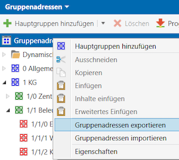
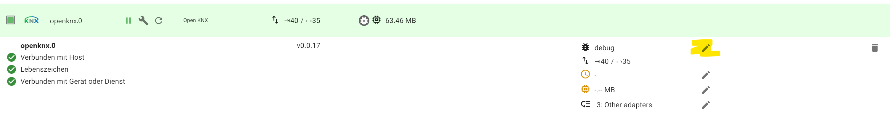

# ioBroker.openknx

[](https://www.npmjs.com/package/iobroker.openknx)
[](https://www.npmjs.com/package/iobroker.openknx)


[](https://nodei.co/npm/iobroker.openknx/)

**Tests:** 

This adapter serves as communication interface between Iobroker and your KNX IP Gateway.
The adapter allows to generate the iobroker communication objects automatically by importing an ETS group address xml export.  
All generated communication objects are initially configured readable and writeable, values are fetched from the knx bus on adapter restart.

**If you like it, please consider a donation:**

[](https://www.paypal.com/cgi-bin/webscr?cmd=_s-xclick&hosted_button_id=Z8UFC8QEC4ARW&source=url)

# Installation

The adapter is available in the latest / beta repository. If this is selected in the ioBroker system settings as standard repository, the adapter can be searched in the adapter list under "openknx" and installed by clicking the + Symbol. An alternative is to install in expert mode via the Github symbol by selecting "from Github" and searching for openknx.

# Adapter configuration


Press "save & close" or "save" to restart the adapter and take over the changes.
When starting, the adapter tries to read all GroupAdresses with have the autoread flag (default setting).
This could take a while and can produce a higher load on your KNX-bus. This ensures that the adapter operates with up-to-date values from the start.
Autoread is done on the first connection with the knx bus after an adapter start or restart, not on every knx reconnection.  
After adapter installation, open the adapter configuration. Fill in:

### KNX Gateway IP

IP of your KNX IP gateway.

### Port

this is normally port 3671 of the KNX IP gateway.

### Local IPv4 network interface

The interface that is connected to the KNX IP gateway.

### Detect

Searches via a standardized protocol all available KNX IP Gateways on the given network interface.

### Minimum send delay between two frames [ms]

This settings protects the KNX bus from data flooding by limiting data frames to a certain rate.
Not sent frames are delay until the delay time since last send on bus is elapsed. If more send requests are waiting, send order is random.
If you experience disconnects from your KNX IP Gateway in the log then increase this number.

### use common.type boolean for 1 bit enum instead of number

Use in IOB Object common.type boolean for 1 bit enum instead of number.

### readout values of autoread iob objects on startup

All IOB objects that are configured with the autoread flag are requested on the bus to be synchronized with IOB.

### import only GAs that do not exist already as IOB objects

If checked, the import will skip overwriting existing communication objects.

### remove existing IOB objects thtat are not in ETS import file

To clean up object tree

### import ETS xml and save



1. In ETS go to Group Addresses, select export group address and select XML export in latest format version.
   ETS4 Format is not supported, it does not contain DPT information.
2. upload your ETS Export XML in the adapter via the GA XML-Import dialog
3. Import will immediatelly start after file selection and give a status report after completion.  
   After the successful import a message shows how much objects have been recognized.
   An error dialog will shop problems during import and gives hints how to clean up the ets database.
   Additional information could be found in the log.
   Data will be stored and the adapter is reset.

Hint on ETS configuration:  
If you have different DPT Subtypes for the GA and in the communication objets that use this GA, then the ETS seems to use the DPT Type with the lowest number.
In this case manually ensure that all elements are using the same desired datatype.  
A GA without DPT basetype cannot be imported with this adapter. ETS4 projects must be converted into ETS5 or later and the DPT must be set to the GA.

### Group Address Style

The style only defines the appearance of the Group Address in the ETS user interface. The following styles are available:

    Presentation Style	Name	                Example

1 3-Level Main/Middle/Subgroup 1/3/5
2 2-Level Main Group/Subgroup 1/25
3 Free-Level Subgroup 300

The adapter supports all 3 style configurations in the project import xml file. For storing in the IOB object, the format is always converted into the 3-level form.
Please note that the combined ga and group name must be unique for the IOB object tree. Having for example an ETS configuration with two middle groups of the same name will result in a joint hierarchy element and having two identically named gas in there will result into an error.

### Alias

KNX devices can have ga's for state feedback that belong to a commanding ga. Some applications like certain VIS widgets expect a combined status and actuation object. You can combine these seperate objects into one so called alias. The menu helps to create matching pairs according to the naming convention with the given filtering rule.
Find more information here https://www.iobroker.net/#en/documentation/dev/aliases.md

### Regex

Filtering rule for the status object. Used to find matching write and read ga pairs.

### Minimum similarity

Defines how strict the matching algorithm filters out similar entries.

### Alias path

The object folder where the aliases get generated.

### inculde group range in search

The whole name including path is used to check for similarity.

# Adapter migration hints

## migrate Node Red

-   in right side menu, select Export
-   select All Flows, Download
-   in text editor replace knx.0. with openknx.0.
-   right side menu, select import
-   select changed file
-   in the dialog select Flows (Subflows, Configuration-Nodes only if they are affected) -> new tabs get added
-   delete old flows manually

## migrate VIS

-   Open Vis Editor
-   Setup -> Projekt-Export/import -> Exportieren normal
-   Open Zip File and vis-views.json in an editor
-   Search Replace knx.0. with openknx.0.
-   Compress vis-views.json and vis-user.css in a zip file
-   Setup -> Projekt-Export/import -> Import
-   Move zip file in Drop Area
-   Projektname = main
-   Import project

## migrate Scripts

-   Open Scripts
-   3 dots -> Export all scripts
-   Open Zip File and open the folder in a editor
-   Search Replace knx.0 with openknx.0
-   compress all changed files in a zip file
-   3 dots ->Import scripts
-   Move zip file in Drop Area

## migrate Grafana

-   go through all dashboards and select share - export - save to file
-   in text editor replace knx.0. with openknx.0.
-   To import a dashboard click the + icon in the side menu, and then click Import.
-   From here you can upload a dashboard JSON file
-   select Import (Overwrite)

## migrate Influx

-   login via SSH to your IOBroker and run command influx
-   use iobroker (or your specific database listed via command show databases)
-   list entries with: show measurements
-   copy tables with command: select \* into "entry_new" from "entry_old";
    where entry_new points to the old adapter object path and entry_new the openknx adapter instance
-   set influx enabled for new object entry_new

# howto use the adapter & basic concept

### ACK flags with tunneling connections

Applications shall not set the ack flag, application is notified from this adapter by the ack flag if data is updated.
KNX Stack sets the ack flag of the corresponding IoBroker object on receiption of a group address if another knx host writes to the bus.

| GA is                               | connected to device with a R flag | connected to devices with no R flag | unconnected |
| ----------------------------------- | --------------------------------- | ----------------------------------- | ----------- |
| Application issues GroupValue_Write | ack                               | ack                                 | no ack      |
| Application issues GroupValue_Read  | ack                               | no ack                              | no ack      |

### Node Red complex datatype example

Create a function node that connects to a ioBroker out node that connects with a KNX object of DPT2.
msg.payload = {"priority":1 ,"data":0};
return msg;

# log level

Enable expert mode to enable switching between different log levels. Default loglevel is info.  


# IOBroker Communication Object description

IoBroker defines Objects to hold communication interfaces settings.  
GA import generates a communication object folder structure following the ga main-group/middle-group scheme. Each groupaddress is an oject with following automatically generated data.

IoBroker state roles (https://github.com/ioBroker/ioBroker/blob/master/doc/STATE_ROLES.md) have value 'state' by default. Some more granular values are derieved from the DPT, for example Date or Switch.

Autoread is set to false where it is clear from the DPT that this is a trigger signal. This applies to scene numbers.

```json
{
    "_id": "path.and.name.to.object", // derieved from the KNX structure
    "type": "state",
    "common": {
        // values here can be interpreted by iobroker
        "desc": "Basetype: 1-bit value, Subtype: switch", // informative, from dpt
        "name": "Aussen Melder Licht schalten", // informative description from ets export
        "read": true, // default set, if false incoming bus values are not updating the object
        "role": "state", // default state, derieved from DPT
        "type": "boolean", // boolean, number, string, object, derieved from dpt
        "unit": "", // derived from dpt
        "write": true // default true, if set change on object is triggering knx write, succ. write sets then ack flag to true
    },
    "native": {
        // values here can be interpreted by openknx adapter
        "address": "0/1/2", // knx group address
        "answer_groupValueResponse": false, // default false, if set to true adapter responds with value on GroupValue_Read
        "autoread": true, // default true for non trigger signals , adapter sends a GroupValue_read on start to sync its states
        "bitlength": 1, // size ob knx data, derived from dpt
        "dpt": "DPT1.001", // DPT
        "encoding": {
            // values of the interface if it is an enum DPT type
            "0": "Off",
            "1": "On"
        },
        "force_encoding": "", // informative
        "signedness": "", // informative
        "valuetype": "basic" // composite means set via a specific javascript object
    },
    "from": "system.adapter.openknx.0",
    "user": "system.user.admin",
    "ts": 1638913951639
}
```

# Adapter communication Interface Description

Handeled DPTs are: 1-21,232,237,238  
Unhandeled DPTs are written as raw buffers, the interface is a sequencial string of hexadecimal numbers. For example write '0102feff' to send values 0x01 0x02 0xfe 0xff on the bus.
Where number datatype is used please note that interface values can be scaled.

### API call

IoBroker defines States as communication interface.

```javascript
setState(
    '',                                             // @param {string}                                id of the object with path
    {                                               // @param {object|string|number|boolean}          state simple value or object with attribues.
	val:    value,
	ack:    true|false,                         // optional, should be false by convention
	ts:     timestampMS,                        // optional, default - now
	q:      qualityAsNumber,                    // optional, set it to value 0x10 to trigger a bus group value read to this object, given StateValue is ignored
	from:   origin,                             // optional, default - this adapter
	c:      comment,                            // optional, set it to value GroupValue_Read to trigger a bus group value read to this object, given StateValue is ignored
	expire: expireInSeconds                     // optional, default - 0
	lc:     timestampMS                         // optional, default - calculated value
    },
    false,                                          // @param {boolean} [ack]                         optional, should be false by convention
    {},                                             // @param {object} [options]                      optional, user context
    (err, id) => {}                                 // @param {ioBroker.SetStateCallback} [callback]  optional, return error and id
);
```

example to trigger a GroupValue_Read:

```javascript
setState(myState, { val: false, ack: false, c: "GroupValue_Read" });
setState(myState, { val: false, ack: false, q: 0x10 });
```

GroupValue_Read comment does not work for javascript adapter. Use qualityAsNumber value 0x10 instead.

### Description of all DPTs

| KNX DPT   | javascript datatype    | special values                                                                                       | value range                               | remark                                                |
| --------- | ---------------------- | ---------------------------------------------------------------------------------------------------- | ----------------------------------------- | ----------------------------------------------------- |
| DPT-1     | number enum            |                                                                                                      | false, true                               |                                                       |
| DPT-2     | object                 | {"priority":1 bit,"data":1 bit}                                                                      | -                                         |                                                       |
| DPT-3     | object                 | {"decr_incr":1 bit,"data":2 bit}                                                                     | -                                         |                                                       |
| DPT-18    | object                 | {"save_recall":0,"scenenumber":0}                                                                    | -                                         | Datapoint Type DPT_SceneControl removed from autoread |
|           |                        |                                                                                                      |                                           | save_recall: 0 = recall scene, 1 = save scene         |
| DPT-21    | object                 | {"outofservice":0,"fault":0,"overridden":0,"inalarm":0,"alarmunack":0}                               | -                                         |                                                       |
| DPT-232   | object                 | {red:0..255, green:0.255, blue:0.255}                                                                | -                                         |                                                       |
| DPT-237   | object                 | {"address":0,"addresstype":0,"readresponse":0,"lampfailure":0,"ballastfailure":0,"convertorerror":0} | -                                         |                                                       |
| DPT-4     | string                 |                                                                                                      | one character sent as 8-bit character     |                                                       |
| DPT-16    | string                 |                                                                                                      | one character sent as 16 character string |                                                       |
| DPT-5     | number                 |                                                                                                      | 8-bit unsigned value                      |                                                       |
| DPT-5.001 | number                 |                                                                                                      | 0..100 [%] scaled to 1-byte               |                                                       |
| DPT-5.003 | number                 |                                                                                                      | 0..360 [°] scaled to 1-byte               |                                                       |
| DPT-6     | number                 |                                                                                                      | 8-bit signed -128..127                    |                                                       |
| DPT-7     | number                 |                                                                                                      | 16-bit unsigned value                     |                                                       |
| DPT-8     | number                 |                                                                                                      | 2-byte signed value -32768..32767         |                                                       |
| DPT-9     | number                 |                                                                                                      | 2-byte floating point value               |                                                       |
| DPT-14    | number                 |                                                                                                      | 4-byte floating point value               |                                                       |
| DPT-12    | number                 |                                                                                                      | 4-byte unsigned value                     |                                                       |
| DPT-13    | number                 |                                                                                                      | 4-byte signed value                       |                                                       |
| DPT-15    | number                 |                                                                                                      | 4-byte                                    |                                                       |
| DPT-17    | number                 |                                                                                                      | 1-byte                                    | DPT_SceneNumber removed from autoread                 |
| DPT-20    | number                 |                                                                                                      | 1-byte                                    |                                                       |
| DPT-238   | number                 |                                                                                                      | 1-byte                                    |                                                       |
| DPT-10    | number for Date Object |                                                                                                      | -                                         |                                                       |
| DPT-11    | number for Date Object |                                                                                                      | -                                         |                                                       |
| DPT-19    | number for Date Object |                                                                                                      | -                                         |                                                       |
| DPT-26    | string                 | e.g. 00010203..                                                                                      | -                                         | Datapoint Type DPT_SceneInfo not read by autread      |
| DPT-238   | string                 | e.g. 00010203..                                                                                      | -                                         | DPT_SceneConfig not read by autread                   |
| rest      | string                 | e.g. 00010203..                                                                                      | -                                         |                                                       |

Only time and date information is exchanged with KNX time based datatypes, e.g. DPT-19 has unsupported fields for signal quality.

Object send and receive values are of type boolean DPT1), number (scaled, or unscaled), string.  
DPT 2 'expects a object {"priority":0,"data":1}' receive provides a strinified object of same type.  
Other joint DPTs have similar object notation.  
DPT19 expects a Number from a Date Object, Iobroker can not handle objects, fields of KNX ko that cannot be derived from timestamp are not implemented eg. quality flags.

Date and time DPTs (DPT10, DPT11)  
Please have in mind that Javascript and KNX have very different base type for time and date.
DPT10 is time (hh:mm:ss) plus "day of week". This concept is unavailable in JS, so you'll be getting/setting a regular Date Js object, but please remember you'll need to ignore the date, month and year. The exact same datagram that converts to "Mon, Jul 1st 12:34:56", will evaluate to a wildly different JS Date of "Mon, Jul 8th 12:34:56" one week later. Be warned!
DPT11 is date (dd/mm/yyyy): the same applies for DPT11, you'll need to ignore the time part.

(KNX specification of DPTs https://www.knx.org/wAssets/docs/downloads/Certification/Interworking-Datapoint-types/03_07_02-Datapoint-Types-v02.02.01-AS.pdf)

### group value write

Sending group value write message is triggered by writing a communication object.
Communication object is triggered when a write frame is received on the bus.

### group value read

Sending a group value read can be triggered by writing a communicaton object with comment. Please see API call section for details.
Receiving, if configured, will trigger a group value response (limitation: group value write at the moment) of the actual communication object value, see below.

### group value response

If answer_groupValueResponse is set to true, then the adapter will reply with a GroupValue_Response to a previously received GroupValue_Read request.
This is the KNX Read flag. Only one communication object on the bus or the IOBroker object should have this flag set, ideally the one that knows the state best.

### mapping to KNX Flags

The KNX object flags define the bus behavior of the object they represent.
6 different object flags are defined.

| Flag                       | Flag de                  | Adapter usage                           |                                                |
| -------------------------- | ------------------------ | --------------------------------------- | ---------------------------------------------- |
| C: the Communication flag  | K: Kommunikations-Flag   | always set                              |                                                |
| R: the Read flag           | L: Lese-Flag             | object native.answer_groupValueResponse |                                                |
| T: the Transmit flag       | Ü: Übertragen-Flag       | object common.write                     |                                                |
| W: the Write flag          | S: Schreiben-Flag        | object common.read                      | bus can modify the object                      |
| U: the Update flag         | A: Aktualisieren-Flag    | object common.read                      | update object on incoming GroupValue_Responses |
| I: the Initialization flag | I: Initialisierungs-Flag | object native.autoread                  |                                                |

# Monitoring and Error Tracking

Openknx uses sentry.io for application monitoring and error tracking.
It aids developers to better hunt bugs and gain field usage data. The identification of an user is tracked in a pseudonymised way.
Data is sent to Iobroker Sentry server hosted in Germany. If you have allowed iobroker GmbH to collect diagnostic data then also your anonymous installation ID is included. This allows Sentry to group errors and show how many unique users are affected by such an error.

Openknx estimates the current bus load of the KNX line it is connected to in object `info.busload`.

# Features

-   stable and reliable knx stack
-   Automatic encoding/deconding of KNX datagrams for most importants DPTs, raw read and write for other DPTs
-   support of KNX group value read and group value write and group value response
-   free open source
-   no dependencies to cloud services, runs without internet access
-   Autoread on start
-   fast import of group addresses in XML format
-   create joint alias objects that react on status inputs
-   supports project of all possible group address styles

# Limitations

-   ETS 4 export file format is not supported
-   KNX secure is not supported
-   only IPv4 supported

# FAQ

-   Autoread trigger actors on the bus to react
    Check in ETS if group objects of certain devices that are connected to the suspicious GA have the R/L flag configured. This should not be the case if te device is a consumer of the signal. If the signal has an event character, a groupValueRead would trigger that event. Change configuration in ETS or disable autoread for this object.
-   DISCONNECT_REQUEST on startup
    Increase setting for Minimum send delay between two frames to avoid flooding the interface

## Changelog

<!--
  Placeholder for the next version (at the beginning of the line):
  ### **WORK IN PROGRESS**
  * .... -> this is used by script to generate a new entry, copy after a new release
  * npm run release major/minor/patch major.minor.patch
-->

### **WORK IN PROGRESS**

-   feature: KNX bus load measurement
-   bugfix: translation

### 0.5.3 (2023-03-17)

-   savek-cc bugfix: Fix handling of addinfo_length - used to crash if addinfo was actually supplied #338
-   bugfix: admin menu scroll small screen #339
-   feature: add dpt 9.009

### 0.5.2 (2023-01-02)

-   bugfix: correct falsly generated "confirmation false received" notifications on high sending load

### 0.5.0 (2022-12-30)

-   feature: use common.type boolean for 1 bit enum instead of number
    import enum with one bit as common.type mixed and not strict as number
-   handling of iob ack improved for tunneling connections, see description

### 0.4.5 (2022-12-19)

-   bugfix in knx lib: make dpt2 not an enum datatype

### 0.4.2 (2022-12-18)

-   bugfix: swap value for dpt 1 for enums

### 0.4.1 (2022-12-17)

-   bugfix: fix statup issue
-   feature: add support for more datatypes

### 0.4.0 (2022-12-15)

-   feature: support for Free and Two Level Group Address Style in addition to the existing Three Level support #320
-   feature: map knx datapoint type enconding to object common.states #313
-   debug message for send queue size

### 0.3.2 (2022-11-20)

-   feature: sync knx library
-   feature: sync with create adapter 0.2.3
-   feature: update to newer versions of dependant packages
-   feature: setting autoreadEnabled autoread
-   bugfix: allow alias generation with missing gateway configuration
-   bugfix in knx lib: keep correct order of send datagrams in case of burst write

### 0.2.7 (2022-08-26)

-   bugfix: fix issue with writing to dpt 19 object

### 0.2.6 (2022-07-09)

-   bugfix: fix filtering of addresses 1.1.1

### 0.2.5 (2022-06-22)

-   feature: option remove existing KNX objects that are not in import file

### 0.2.4 (2022-05-27)

-   feature: cleanly disconnect on shutdown, upgrade to knx lib 2.5.2

### 0.2.2 (2022-05-26)

-   feature: writing to bus l_data.con creates a ack on the iobroker object if successful (the knx conf flag unset) #133
-   bugfix: remove manual Physical KNX address dialog, use 0.0.0 instead
-   bugfix: remove error log when answering to GroupValueRead: #183
-   bugfix: improve warning logs on intended and unintended disconnects

### 0.1.25 (2022-04-18)

-   feature: datatype check for raw value
-   feature: check if knx is connected before usage
-   bugfix: if update ack after write, use correct timestamp and set adapter as user
-   bugfix: remove enless loop if event received before initialisation

### 0.1.24 (2022-03-31)

-   feature: support for latin1 charset in dpt16

### 0.1.23 (2022-03-19)

-   feature: change default regexp for alias
-   feature: new option to set ack flag when application writes to object
-   feature: supportes knx device scan in iobroker.discovery 2.8.0
-   bugfix: min max common object values only for number

### 0.1.22 (2022-02-26)

-   bufix: repair reception error

### 0.1.21 (2022-02-25)

-   feature: dont sent ack request in ldata.ind, this is disturbing clients if not filtered out by gateway
-   bugfix: reinit if event received before connection established to avoid deadlock
-   dependency:adapter core must be 2.6.0 or higher

### 0.1.20 (2022-02-19)

-   feature: add more dpts
-   bugfix: corrected some min max values
-   bugfix: some unhandeled dpts could not be received
-   bugfix: fix import
-   bugfix: min max values

### 0.1.19 (2022-02-11)

-   feature: allow usage of same KNX GAs in multiple objects
-   bugfix: less warnings in alias generation
-   bugfix: adapter reset after project import

### 0.1.18 (2022-01-30)

-   bugfix: issue #61 Alias dialog not working 1st time

### 0.1.17 (2022-01-29)

-   feature: more information in alias import dialog
-   feature: warning on startup if ga are inconsistent
-   fix: corrected object count statistics on startup

### 0.1.16 (2022-01-27)

-   feature: add back sentry
-   fix: stability alias generation
-   fix: better input settings plausibilization in admin
-   fix: reset after settings change was broken, dont reset for alias change

### 0.1.15 (2022-01-23)

-   feature: more sanity checks for gui
-   feature: issue #84, add openknx to discovery adapter
-   feature: issue #82, warnings on import of duplicate ga addresses, also check iob object for duplicates
-   fix: issue #87, added q interface to trigger GroupValue_Read, comments are overwritten in javascript adapter
-   fix: remove currently unused reference to sentry

### 0.1.14 (2022-01-08)

-   feature: autodetect the KNX IP interface parameters
-   feature: create warning if DPT of alias pair does not match
-   feature: create warning in log in case of possible data loss if gateway disconnects
-   feature: better gui for import status, newline per warning, count number of succeeding ga's
-   fix: local ip interface in admin was not taken
-   fix: default regexp for status ga's corrected to match common nomenclature

### 0.1.13 (2021-12-30)

-   bugfix: state.value of of type object must be serialized
-   bugfix: alias algorithm error handling, takover more info to alias

### 0.1.12 (2021-12-30)

-   feature: improve alias status search algorithm, add units
-   feature: notify user after import if no dpt subtype is set
-   fix: library did not allow to write possible 0 values to certain dpts
-   fix: admin dialog ui fixes, better presentation of some warnings

### 0.1.11 (2021-12-28)

-   feature: remove more scene DPTs from default autoread
-   feature: sends GroupValue_Response on GroupValue_Read if configured
-   feature: admin dialog with option to generate aliases (beta)
-   feature: admin dialog reactivates after adapter reset
-   feature: add support for DPT 7.600
-   feature: show logs of knx library
-   fix: filter out logs with device address bus interactions
-   fix: filter ga names that are forbidden in IOB
-   fix: reply with GroupValue_Response on request, not with GroupValue_Write
-   fix: remove more scene dpts from autoread

### 0.1.10 (2021-12-24)

-   fix: interface to write objects corrected

### 0.1.9 (2021-12-22)

-   fix: algorith to generate the iob objects improved
-   fix: min max removed for boolean
-   fix: ackqnowledgement handling
-   removed feature: override path of knx objects
-   feature: new logo

### 0.1.8

-   (tombox) feature: changed ui and many fixes
-   (boellner) feature: skip wrong initial disconnect warning
-   (boellner) feature: add translation
-   (boellner) doc: github ci pipleline, testing

### 0.1.6

-   (boellner) fix: missing dependencies

### 0.1.5

-   (boellner) feature: corrected adapter status info.connection (green, yellow, red indicator)
-   (boellner) fix: remove default fallback ip settings from stack to get error message on missing configuration
-   (boellner) fix: autoread
-   (boellner) fix: finding non knx objects int tree leading to problems on startup

### 0.1.3

-   (boellner) feature: state roles now set to best match for some elements, default is state
-   (boellner) feature: exclude scene dtc (trigger) from autoread
-   (boellner) doc: corrected warwings reported by https://adapter-check.iobroker.in/
-   (boellner) fix: improve ui of admin dialog
-   (boellner) fix: project import, now continue to write iob objects in case of incorrect input file

### 0.1.2

-   (boellner) doc: initial test release

### 0.0.19

-   (boellner) feature: display warning on ga import file errors

### 0.0.17

-   (boellner) feature: raw value handling, can now write and receive ga of unsupported dpt
-   (boellner) bugfix: setting onlyAddNewObjects fixed
-   (boellner) feature: adapter restart after import

### 0.0.14

-   (boellner) feature: import ga xml

### initial version

-   initial version from https://www.npmjs.com/package/iobroker.knx/v/0.8.3

## License

Copyright 2023 contributors to the ioBroker.openknx project

    				GNU GENERAL PUBLIC LICENSE

==========================  
Copyright Contributors to the ioBroker.openknx project

    				   Version 3, 29 June 2007

Copyright (C) 2007 Free Software Foundation, Inc. <https://fsf.org/>
Everyone is permitted to copy and distribute verbatim copies
of this license document, but changing it is not allowed.

    						Preamble

The GNU General Public License is a free, copyleft license for
software and other kinds of works.

The licenses for most software and other practical works are designed
to take away your freedom to share and change the works. By contrast,
the GNU General Public License is intended to guarantee your freedom to
share and change all versions of a program--to make sure it remains free
software for all its users. We, the Free Software Foundation, use the
GNU General Public License for most of our software; it applies also to
any other work released this way by its authors. You can apply it to
your programs, too.

When we speak of free software, we are referring to freedom, not
price. Our General Public Licenses are designed to make sure that you
have the freedom to distribute copies of free software (and charge for
them if you wish), that you receive source code or can get it if you
want it, that you can change the software or use pieces of it in new
free programs, and that you know you can do these things.

To protect your rights, we need to prevent others from denying you
these rights or asking you to surrender the rights. Therefore, you have
certain responsibilities if you distribute copies of the software, or if
you modify it: responsibilities to respect the freedom of others.

For example, if you distribute copies of such a program, whether
gratis or for a fee, you must pass on to the recipients the same
freedoms that you received. You must make sure that they, too, receive
or can get the source code. And you must show them these terms so they
know their rights.

Developers that use the GNU GPL protect your rights with two steps:
(1) assert copyright on the software, and (2) offer you this License
giving you legal permission to copy, distribute and/or modify it.

For the developers' and authors' protection, the GPL clearly explains
that there is no warranty for this free software. For both users' and
authors' sake, the GPL requires that modified versions be marked as
changed, so that their problems will not be attributed erroneously to
authors of previous versions.

Some devices are designed to deny users access to install or run
modified versions of the software inside them, although the manufacturer
can do so. This is fundamentally incompatible with the aim of
protecting users' freedom to change the software. The systematic
pattern of such abuse occurs in the area of products for individuals to
use, which is precisely where it is most unacceptable. Therefore, we
have designed this version of the GPL to prohibit the practice for those
products. If such problems arise substantially in other domains, we
stand ready to extend this provision to those domains in future versions
of the GPL, as needed to protect the freedom of users.

Finally, every program is threatened constantly by software patents.
States should not allow patents to restrict development and use of
software on general-purpose computers, but in those that do, we wish to
avoid the special danger that patents applied to a free program could
make it effectively proprietary. To prevent this, the GPL assures that
patents cannot be used to render the program non-free.

The precise terms and conditions for copying, distribution and
modification follow.

    				   TERMS AND CONDITIONS

0. Definitions.

"This License" refers to version 3 of the GNU General Public License.

"Copyright" also means copyright-like laws that apply to other kinds of
works, such as semiconductor masks.

"The Program" refers to any copyrightable work licensed under this
License. Each licensee is addressed as "you". "Licensees" and
"recipients" may be individuals or organizations.

To "modify" a work means to copy from or adapt all or part of the work
in a fashion requiring copyright permission, other than the making of an
exact copy. The resulting work is called a "modified version" of the
earlier work or a work "based on" the earlier work.

A "covered work" means either the unmodified Program or a work based
on the Program.

To "propagate" a work means to do anything with it that, without
permission, would make you directly or secondarily liable for
infringement under applicable copyright law, except executing it on a
computer or modifying a private copy. Propagation includes copying,
distribution (with or without modification), making available to the
public, and in some countries other activities as well.

To "convey" a work means any kind of propagation that enables other
parties to make or receive copies. Mere interaction with a user through
a computer network, with no transfer of a copy, is not conveying.

An interactive user interface displays "Appropriate Legal Notices"
to the extent that it includes a convenient and prominently visible
feature that (1) displays an appropriate copyright notice, and (2)
tells the user that there is no warranty for the work (except to the
extent that warranties are provided), that licensees may convey the
work under this License, and how to view a copy of this License. If
the interface presents a list of user commands or options, such as a
menu, a prominent item in the list meets this criterion.

1. Source Code.

The "source code" for a work means the preferred form of the work
for making modifications to it. "Object code" means any non-source
form of a work.

A "Standard Interface" means an interface that either is an official
standard defined by a recognized standards body, or, in the case of
interfaces specified for a particular programming language, one that
is widely used among developers working in that language.

The "System Libraries" of an executable work include anything, other
than the work as a whole, that (a) is included in the normal form of
packaging a Major Component, but which is not part of that Major
Component, and (b) serves only to enable use of the work with that
Major Component, or to implement a Standard Interface for which an
implementation is available to the public in source code form. A
"Major Component", in this context, means a major essential component
(kernel, window system, and so on) of the specific operating system
(if any) on which the executable work runs, or a compiler used to
produce the work, or an object code interpreter used to run it.

The "Corresponding Source" for a work in object code form means all
the source code needed to generate, install, and (for an executable
work) run the object code and to modify the work, including scripts to
control those activities. However, it does not include the work's
System Libraries, or general-purpose tools or generally available free
programs which are used unmodified in performing those activities but
which are not part of the work. For example, Corresponding Source
includes interface definition files associated with source files for
the work, and the source code for shared libraries and dynamically
linked subprograms that the work is specifically designed to require,
such as by intimate data communication or control flow between those
subprograms and other parts of the work.

The Corresponding Source need not include anything that users
can regenerate automatically from other parts of the Corresponding
Source.

The Corresponding Source for a work in source code form is that
same work.

2. Basic Permissions.

All rights granted under this License are granted for the term of
copyright on the Program, and are irrevocable provided the stated
conditions are met. This License explicitly affirms your unlimited
permission to run the unmodified Program. The output from running a
covered work is covered by this License only if the output, given its
content, constitutes a covered work. This License acknowledges your
rights of fair use or other equivalent, as provided by copyright law.

You may make, run and propagate covered works that you do not
convey, without conditions so long as your license otherwise remains
in force. You may convey covered works to others for the sole purpose
of having them make modifications exclusively for you, or provide you
with facilities for running those works, provided that you comply with
the terms of this License in conveying all material for which you do
not control copyright. Those thus making or running the covered works
for you must do so exclusively on your behalf, under your direction
and control, on terms that prohibit them from making any copies of
your copyrighted material outside their relationship with you.

Conveying under any other circumstances is permitted solely under
the conditions stated below. Sublicensing is not allowed; section 10
makes it unnecessary.

3. Protecting Users' Legal Rights From Anti-Circumvention Law.

No covered work shall be deemed part of an effective technological
measure under any applicable law fulfilling obligations under article
11 of the WIPO copyright treaty adopted on 20 December 1996, or
similar laws prohibiting or restricting circumvention of such
measures.

When you convey a covered work, you waive any legal power to forbid
circumvention of technological measures to the extent such circumvention
is effected by exercising rights under this License with respect to
the covered work, and you disclaim any intention to limit operation or
modification of the work as a means of enforcing, against the work's
users, your or third parties' legal rights to forbid circumvention of
technological measures.

4. Conveying Verbatim Copies.

You may convey verbatim copies of the Program's source code as you
receive it, in any medium, provided that you conspicuously and
appropriately publish on each copy an appropriate copyright notice;
keep intact all notices stating that this License and any
non-permissive terms added in accord with section 7 apply to the code;
keep intact all notices of the absence of any warranty; and give all
recipients a copy of this License along with the Program.

You may charge any price or no price for each copy that you convey,
and you may offer support or warranty protection for a fee.

5. Conveying Modified Source Versions.

You may convey a work based on the Program, or the modifications to
produce it from the Program, in the form of source code under the
terms of section 4, provided that you also meet all of these conditions:

    a) The work must carry prominent notices stating that you modified
    it, and giving a relevant date.

    b) The work must carry prominent notices stating that it is
    released under this License and any conditions added under section
    7.  This requirement modifies the requirement in section 4 to
    "keep intact all notices".

    c) You must license the entire work, as a whole, under this
    License to anyone who comes into possession of a copy.  This
    License will therefore apply, along with any applicable section 7
    additional terms, to the whole of the work, and all its parts,
    regardless of how they are packaged.  This License gives no
    permission to license the work in any other way, but it does not
    invalidate such permission if you have separately received it.

    d) If the work has interactive user interfaces, each must display
    Appropriate Legal Notices; however, if the Program has interactive
    interfaces that do not display Appropriate Legal Notices, your
    work need not make them do so.

A compilation of a covered work with other separate and independent
works, which are not by their nature extensions of the covered work,
and which are not combined with it such as to form a larger program,
in or on a volume of a storage or distribution medium, is called an
"aggregate" if the compilation and its resulting copyright are not
used to limit the access or legal rights of the compilation's users
beyond what the individual works permit. Inclusion of a covered work
in an aggregate does not cause this License to apply to the other
parts of the aggregate.

6. Conveying Non-Source Forms.

You may convey a covered work in object code form under the terms
of sections 4 and 5, provided that you also convey the
machine-readable Corresponding Source under the terms of this License,
in one of these ways:

    a) Convey the object code in, or embodied in, a physical product
    (including a physical distribution medium), accompanied by the
    Corresponding Source fixed on a durable physical medium
    customarily used for software interchange.

    b) Convey the object code in, or embodied in, a physical product
    (including a physical distribution medium), accompanied by a
    written offer, valid for at least three years and valid for as
    long as you offer spare parts or customer support for that product
    model, to give anyone who possesses the object code either (1) a
    copy of the Corresponding Source for all the software in the
    product that is covered by this License, on a durable physical
    medium customarily used for software interchange, for a price no
    more than your reasonable cost of physically performing this
    conveying of source, or (2) access to copy the
    Corresponding Source from a network server at no charge.

    c) Convey individual copies of the object code with a copy of the
    written offer to provide the Corresponding Source.  This
    alternative is allowed only occasionally and noncommercially, and
    only if you received the object code with such an offer, in accord
    with subsection 6b.

    d) Convey the object code by offering access from a designated
    place (gratis or for a charge), and offer equivalent access to the
    Corresponding Source in the same way through the same place at no
    further charge.  You need not require recipients to copy the
    Corresponding Source along with the object code.  If the place to
    copy the object code is a network server, the Corresponding Source
    may be on a different server (operated by you or a third party)
    that supports equivalent copying facilities, provided you maintain
    clear directions next to the object code saying where to find the
    Corresponding Source.  Regardless of what server hosts the
    Corresponding Source, you remain obligated to ensure that it is
    available for as long as needed to satisfy these requirements.

    e) Convey the object code using peer-to-peer transmission, provided
    you inform other peers where the object code and Corresponding
    Source of the work are being offered to the general public at no
    charge under subsection 6d.

A separable portion of the object code, whose source code is excluded
from the Corresponding Source as a System Library, need not be
included in conveying the object code work.

A "User Product" is either (1) a "consumer product", which means any
tangible personal property which is normally used for personal, family,
or household purposes, or (2) anything designed or sold for incorporation
into a dwelling. In determining whether a product is a consumer product,
doubtful cases shall be resolved in favor of coverage. For a particular
product received by a particular user, "normally used" refers to a
typical or common use of that class of product, regardless of the status
of the particular user or of the way in which the particular user
actually uses, or expects or is expected to use, the product. A product
is a consumer product regardless of whether the product has substantial
commercial, industrial or non-consumer uses, unless such uses represent
the only significant mode of use of the product.

"Installation Information" for a User Product means any methods,
procedures, authorization keys, or other information required to install
and execute modified versions of a covered work in that User Product from
a modified version of its Corresponding Source. The information must
suffice to ensure that the continued functioning of the modified object
code is in no case prevented or interfered with solely because
modification has been made.

If you convey an object code work under this section in, or with, or
specifically for use in, a User Product, and the conveying occurs as
part of a transaction in which the right of possession and use of the
User Product is transferred to the recipient in perpetuity or for a
fixed term (regardless of how the transaction is characterized), the
Corresponding Source conveyed under this section must be accompanied
by the Installation Information. But this requirement does not apply
if neither you nor any third party retains the ability to install
modified object code on the User Product (for example, the work has
been installed in ROM).

The requirement to provide Installation Information does not include a
requirement to continue to provide support service, warranty, or updates
for a work that has been modified or installed by the recipient, or for
the User Product in which it has been modified or installed. Access to a
network may be denied when the modification itself materially and
adversely affects the operation of the network or violates the rules and
protocols for communication across the network.

Corresponding Source conveyed, and Installation Information provided,
in accord with this section must be in a format that is publicly
documented (and with an implementation available to the public in
source code form), and must require no special password or key for
unpacking, reading or copying.

7. Additional Terms.

"Additional permissions" are terms that supplement the terms of this
License by making exceptions from one or more of its conditions.
Additional permissions that are applicable to the entire Program shall
be treated as though they were included in this License, to the extent
that they are valid under applicable law. If additional permissions
apply only to part of the Program, that part may be used separately
under those permissions, but the entire Program remains governed by
this License without regard to the additional permissions.

When you convey a copy of a covered work, you may at your option
remove any additional permissions from that copy, or from any part of
it. (Additional permissions may be written to require their own
removal in certain cases when you modify the work.) You may place
additional permissions on material, added by you to a covered work,
for which you have or can give appropriate copyright permission.

Notwithstanding any other provision of this License, for material you
add to a covered work, you may (if authorized by the copyright holders of
that material) supplement the terms of this License with terms:

    a) Disclaiming warranty or limiting liability differently from the
    terms of sections 15 and 16 of this License; or

    b) Requiring preservation of specified reasonable legal notices or
    author attributions in that material or in the Appropriate Legal
    Notices displayed by works containing it; or

    c) Prohibiting misrepresentation of the origin of that material, or
    requiring that modified versions of such material be marked in
    reasonable ways as different from the original version; or

    d) Limiting the use for publicity purposes of names of licensors or
    authors of the material; or

    e) Declining to grant rights under trademark law for use of some
    trade names, trademarks, or service marks; or

    f) Requiring indemnification of licensors and authors of that
    material by anyone who conveys the material (or modified versions of
    it) with contractual assumptions of liability to the recipient, for
    any liability that these contractual assumptions directly impose on
    those licensors and authors.

All other non-permissive additional terms are considered "further
restrictions" within the meaning of section 10. If the Program as you
received it, or any part of it, contains a notice stating that it is
governed by this License along with a term that is a further
restriction, you may remove that term. If a license document contains
a further restriction but permits relicensing or conveying under this
License, you may add to a covered work material governed by the terms
of that license document, provided that the further restriction does
not survive such relicensing or conveying.

If you add terms to a covered work in accord with this section, you
must place, in the relevant source files, a statement of the
additional terms that apply to those files, or a notice indicating
where to find the applicable terms.

Additional terms, permissive or non-permissive, may be stated in the
form of a separately written license, or stated as exceptions;
the above requirements apply either way.

8. Termination.

You may not propagate or modify a covered work except as expressly
provided under this License. Any attempt otherwise to propagate or
modify it is void, and will automatically terminate your rights under
this License (including any patent licenses granted under the third
paragraph of section 11).

However, if you cease all violation of this License, then your
license from a particular copyright holder is reinstated (a)
provisionally, unless and until the copyright holder explicitly and
finally terminates your license, and (b) permanently, if the copyright
holder fails to notify you of the violation by some reasonable means
prior to 60 days after the cessation.

Moreover, your license from a particular copyright holder is
reinstated permanently if the copyright holder notifies you of the
violation by some reasonable means, this is the first time you have
received notice of violation of this License (for any work) from that
copyright holder, and you cure the violation prior to 30 days after
your receipt of the notice.

Termination of your rights under this section does not terminate the
licenses of parties who have received copies or rights from you under
this License. If your rights have been terminated and not permanently
reinstated, you do not qualify to receive new licenses for the same
material under section 10.

9. Acceptance Not Required for Having Copies.

You are not required to accept this License in order to receive or
run a copy of the Program. Ancillary propagation of a covered work
occurring solely as a consequence of using peer-to-peer transmission
to receive a copy likewise does not require acceptance. However,
nothing other than this License grants you permission to propagate or
modify any covered work. These actions infringe copyright if you do
not accept this License. Therefore, by modifying or propagating a
covered work, you indicate your acceptance of this License to do so.

10. Automatic Licensing of Downstream Recipients.

Each time you convey a covered work, the recipient automatically
receives a license from the original licensors, to run, modify and
propagate that work, subject to this License. You are not responsible
for enforcing compliance by third parties with this License.

An "entity transaction" is a transaction transferring control of an
organization, or substantially all assets of one, or subdividing an
organization, or merging organizations. If propagation of a covered
work results from an entity transaction, each party to that
transaction who receives a copy of the work also receives whatever
licenses to the work the party's predecessor in interest had or could
give under the previous paragraph, plus a right to possession of the
Corresponding Source of the work from the predecessor in interest, if
the predecessor has it or can get it with reasonable efforts.

You may not impose any further restrictions on the exercise of the
rights granted or affirmed under this License. For example, you may
not impose a license fee, royalty, or other charge for exercise of
rights granted under this License, and you may not initiate litigation
(including a cross-claim or counterclaim in a lawsuit) alleging that
any patent claim is infringed by making, using, selling, offering for
sale, or importing the Program or any portion of it.

11. Patents.

A "contributor" is a copyright holder who authorizes use under this
License of the Program or a work on which the Program is based. The
work thus licensed is called the contributor's "contributor version".

A contributor's "essential patent claims" are all patent claims
owned or controlled by the contributor, whether already acquired or
hereafter acquired, that would be infringed by some manner, permitted
by this License, of making, using, or selling its contributor version,
but do not include claims that would be infringed only as a
consequence of further modification of the contributor version. For
purposes of this definition, "control" includes the right to grant
patent sublicenses in a manner consistent with the requirements of
this License.

Each contributor grants you a non-exclusive, worldwide, royalty-free
patent license under the contributor's essential patent claims, to
make, use, sell, offer for sale, import and otherwise run, modify and
propagate the contents of its contributor version.

In the following three paragraphs, a "patent license" is any express
agreement or commitment, however denominated, not to enforce a patent
(such as an express permission to practice a patent or covenant not to
sue for patent infringement). To "grant" such a patent license to a
party means to make such an agreement or commitment not to enforce a
patent against the party.

If you convey a covered work, knowingly relying on a patent license,
and the Corresponding Source of the work is not available for anyone
to copy, free of charge and under the terms of this License, through a
publicly available network server or other readily accessible means,
then you must either (1) cause the Corresponding Source to be so
available, or (2) arrange to deprive yourself of the benefit of the
patent license for this particular work, or (3) arrange, in a manner
consistent with the requirements of this License, to extend the patent
license to downstream recipients. "Knowingly relying" means you have
actual knowledge that, but for the patent license, your conveying the
covered work in a country, or your recipient's use of the covered work
in a country, would infringe one or more identifiable patents in that
country that you have reason to believe are valid.

If, pursuant to or in connection with a single transaction or
arrangement, you convey, or propagate by procuring conveyance of, a
covered work, and grant a patent license to some of the parties
receiving the covered work authorizing them to use, propagate, modify
or convey a specific copy of the covered work, then the patent license
you grant is automatically extended to all recipients of the covered
work and works based on it.

A patent license is "discriminatory" if it does not include within
the scope of its coverage, prohibits the exercise of, or is
conditioned on the non-exercise of one or more of the rights that are
specifically granted under this License. You may not convey a covered
work if you are a party to an arrangement with a third party that is
in the business of distributing software, under which you make payment
to the third party based on the extent of your activity of conveying
the work, and under which the third party grants, to any of the
parties who would receive the covered work from you, a discriminatory
patent license (a) in connection with copies of the covered work
conveyed by you (or copies made from those copies), or (b) primarily
for and in connection with specific products or compilations that
contain the covered work, unless you entered into that arrangement,
or that patent license was granted, prior to 28 March 2007.

Nothing in this License shall be construed as excluding or limiting
any implied license or other defenses to infringement that may
otherwise be available to you under applicable patent law.

12. No Surrender of Others' Freedom.

If conditions are imposed on you (whether by court order, agreement or
otherwise) that contradict the conditions of this License, they do not
excuse you from the conditions of this License. If you cannot convey a
covered work so as to satisfy simultaneously your obligations under this
License and any other pertinent obligations, then as a consequence you may
not convey it at all. For example, if you agree to terms that obligate you
to collect a royalty for further conveying from those to whom you convey
the Program, the only way you could satisfy both those terms and this
License would be to refrain entirely from conveying the Program.

13. Use with the GNU Affero General Public License.

Notwithstanding any other provision of this License, you have
permission to link or combine any covered work with a work licensed
under version 3 of the GNU Affero General Public License into a single
combined work, and to convey the resulting work. The terms of this
License will continue to apply to the part which is the covered work,
but the special requirements of the GNU Affero General Public License,
section 13, concerning interaction through a network will apply to the
combination as such.

14. Revised Versions of this License.

The Free Software Foundation may publish revised and/or new versions of
the GNU General Public License from time to time. Such new versions will
be similar in spirit to the present version, but may differ in detail to
address new problems or concerns.

Each version is given a distinguishing version number. If the
Program specifies that a certain numbered version of the GNU General
Public License "or any later version" applies to it, you have the
option of following the terms and conditions either of that numbered
version or of any later version published by the Free Software
Foundation. If the Program does not specify a version number of the
GNU General Public License, you may choose any version ever published
by the Free Software Foundation.

If the Program specifies that a proxy can decide which future
versions of the GNU General Public License can be used, that proxy's
public statement of acceptance of a version permanently authorizes you
to choose that version for the Program.

Later license versions may give you additional or different
permissions. However, no additional obligations are imposed on any
author or copyright holder as a result of your choosing to follow a
later version.

15. Disclaimer of Warranty.

THERE IS NO WARRANTY FOR THE PROGRAM, TO THE EXTENT PERMITTED BY
APPLICABLE LAW. EXCEPT WHEN OTHERWISE STATED IN WRITING THE COPYRIGHT
HOLDERS AND/OR OTHER PARTIES PROVIDE THE PROGRAM "AS IS" WITHOUT WARRANTY
OF ANY KIND, EITHER EXPRESSED OR IMPLIED, INCLUDING, BUT NOT LIMITED TO,
THE IMPLIED WARRANTIES OF MERCHANTABILITY AND FITNESS FOR A PARTICULAR
PURPOSE. THE ENTIRE RISK AS TO THE QUALITY AND PERFORMANCE OF THE PROGRAM
IS WITH YOU. SHOULD THE PROGRAM PROVE DEFECTIVE, YOU ASSUME THE COST OF
ALL NECESSARY SERVICING, REPAIR OR CORRECTION.

16. Limitation of Liability.

IN NO EVENT UNLESS REQUIRED BY APPLICABLE LAW OR AGREED TO IN WRITING
WILL ANY COPYRIGHT HOLDER, OR ANY OTHER PARTY WHO MODIFIES AND/OR CONVEYS
THE PROGRAM AS PERMITTED ABOVE, BE LIABLE TO YOU FOR DAMAGES, INCLUDING ANY
GENERAL, SPECIAL, INCIDENTAL OR CONSEQUENTIAL DAMAGES ARISING OUT OF THE
USE OR INABILITY TO USE THE PROGRAM (INCLUDING BUT NOT LIMITED TO LOSS OF
DATA OR DATA BEING RENDERED INACCURATE OR LOSSES SUSTAINED BY YOU OR THIRD
PARTIES OR A FAILURE OF THE PROGRAM TO OPERATE WITH ANY OTHER PROGRAMS),
EVEN IF SUCH HOLDER OR OTHER PARTY HAS BEEN ADVISED OF THE POSSIBILITY OF
SUCH DAMAGES.

17. Interpretation of Sections 15 and 16.

If the disclaimer of warranty and limitation of liability provided
above cannot be given local legal effect according to their terms,
reviewing courts shall apply local law that most closely approximates
an absolute waiver of all civil liability in connection with the
Program, unless a warranty or assumption of liability accompanies a
copy of the Program in return for a fee.

    				 END OF TERMS AND CONDITIONS

    		How to Apply These Terms to Your New Programs

If you develop a new program, and you want it to be of the greatest
possible use to the public, the best way to achieve this is to make it
free software which everyone can redistribute and change under these terms.

To do so, attach the following notices to the program. It is safest
to attach them to the start of each source file to most effectively
state the exclusion of warranty; and each file should have at least
the "copyright" line and a pointer to where the full notice is found.

    <one line to give the program's name and a brief idea of what it does.>
    Copyright (C) <year>  <name of author>

    This program is free software: you can redistribute it and/or modify
    it under the terms of the GNU General Public License as published by
    the Free Software Foundation, either version 3 of the License, or
    (at your option) any later version.

    This program is distributed in the hope that it will be useful,
    but WITHOUT ANY WARRANTY; without even the implied warranty of
    MERCHANTABILITY or FITNESS FOR A PARTICULAR PURPOSE.  See the
    GNU General Public License for more details.

    You should have received a copy of the GNU General Public License
    along with this program.  If not, see <https://www.gnu.org/licenses/>.

Also add information on how to contact you by electronic and paper mail.

If the program does terminal interaction, make it output a short
notice like this when it starts in an interactive mode:

    <program>  Copyright (C) <year>  <name of author>
    This program comes with ABSOLUTELY NO WARRANTY; for details type `show w'.
    This is free software, and you are welcome to redistribute it
    under certain conditions; type `show c' for details.

The hypothetical commands `show w' and `show c' should show the appropriate
parts of the General Public License. Of course, your program's commands
might be different; for a GUI interface, you would use an "about box".

You should also get your employer (if you work as a programmer) or school,
if any, to sign a "copyright disclaimer" for the program, if necessary.
For more information on this, and how to apply and follow the GNU GPL, see
<https://www.gnu.org/licenses/>.

The GNU General Public License does not permit incorporating your program
into proprietary programs. If your program is a subroutine library, you
may consider it more useful to permit linking proprietary applications with
the library. If this is what you want to do, use the GNU Lesser General
Public License instead of this License. But first, please read
<https://www.gnu.org/licenses/why-not-lgpl.html>.
