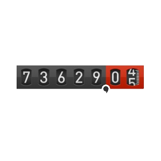

# ioBroker.operating-hours

## operating-hours adapter for ioBroker

counting the operationg hours of own created states.
To reset the counted operating hours just write one numeric state to 0.

## Changelog
<!--
	Placeholder for the next version (at the beginning of the line):
	### **WORK IN PROGRESS**
-->
### 1.0.5 (2023-11-02)
* (BenAhrdt) correction in jsonconfig schema

### 1.0.4 (2023-06-18)
* (BenAhrdt) insert state and oldState in message

### 1.0.3 (2023-06-17)
* (BenAhrdt) callback improoved for data and errormessage

### 1.0.2 (2023-06-16)
* (BenAhrdt) messagfunction added: now its possible to read the current operationhour out by sendTo

### 1.0.1 (2023-04-26)
* (BenAhrdt) unkrain language added

### 1.0.0 (2023-04-05)
* (BenAhrdt) dependencies updated for version 1.0.0

### 0.0.19 (2022-10-18) adding average on time
* (BenAhrdt) average on time indicates a string this formular: operatingHour/activationCounter

### 0.0.18 (2022-10-03) adding some states
* (BenAhrdt) adding days states, additional string and json state

### 0.0.17 (2022-09-29) count the activation
* (BenAhrdt) activation counter implemented to count the enable flags

### 0.0.16 (2022-09-26) automatic reset timestamp improoved
* (BenAhrdt) all states with the same resetCronjob became the same timestamp

### 0.0.15 (2022-09-26) automatic reset implemented
* (BenAhrdt) add config to declare automatic reset for every state

### 0.0.14 (2022-08-26) refreshrate implemented
* (BenAhrdt) add refreshrate into config

### 0.0.13 (2022-08-25) admin dependencies improoved
* (BenAhrdt) set admin dependencies to >= 6.2.17

### 0.0.12 (2022-08-24) regex implemented
* (BenAhrdt) regex for "." on last character implemented

### 0.0.11 (2022-08-23) bugfix in id creation
* (BenAhrdt) bugfix: id can not end with "." anymore

### 0.0.10 (2022-08-18) bugfix require
* (BenAhrdt) deleting a require bugfix

### 0.0.9 (2022-08-18) checking last state (bugfix)
* (BenAhrdt) bugfix in checking last state

### 0.0.8 (2022-08-18) disable counting improoved
* (BenAhrdt) double disable counting is not possible anymore

### 0.0.7 (2022-08-18) Dependencie changed
* (BenAhrdt) implements ids for Other data states (with folders)
* (BenAhrdt) the stringlength of the hours will be assigned by itself
* (BenAhrdt) structuring sourcecode

### 0.0.6 (2022-08-17) this is a test 
* (BenAhrdt) release with plugins

### 0.0.5 (2022-08-17)
* (BenAhrdt) release with plugins

### 0.0.4 (2022-08-17)
* (BenAhrdt) try to get no error at release

### 0.0.3 (2022-08-17)
* (BenAhrdt) new Version with other release script

### 0.0.2 (2022-08-17)
* (BenAhrdt) initial release

## License
MIT License

Copyright (c) 2023 BenAhrdt <bsahrdt@gmail.com>

Permission is hereby granted, free of charge, to any person obtaining a copy
of this software and associated documentation files (the "Software"), to deal
in the Software without restriction, including without limitation the rights
to use, copy, modify, merge, publish, distribute, sublicense, and/or sell
copies of the Software, and to permit persons to whom the Software is
furnished to do so, subject to the following conditions:

The above copyright notice and this permission notice shall be included in all
copies or substantial portions of the Software.

THE SOFTWARE IS PROVIDED "AS IS", WITHOUT WARRANTY OF ANY KIND, EXPRESS OR
IMPLIED, INCLUDING BUT NOT LIMITED TO THE WARRANTIES OF MERCHANTABILITY,
FITNESS FOR A PARTICULAR PURPOSE AND NONINFRINGEMENT. IN NO EVENT SHALL THE
AUTHORS OR COPYRIGHT HOLDERS BE LIABLE FOR ANY CLAIM, DAMAGES OR OTHER
LIABILITY, WHETHER IN AN ACTION OF CONTRACT, TORT OR OTHERWISE, ARISING FROM,
OUT OF OR IN CONNECTION WITH THE SOFTWARE OR THE USE OR OTHER DEALINGS IN THE
SOFTWARE.