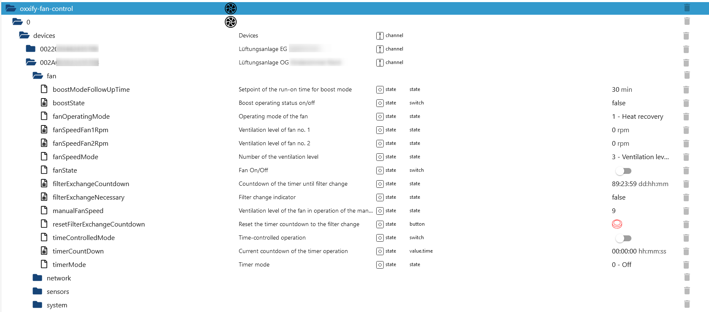
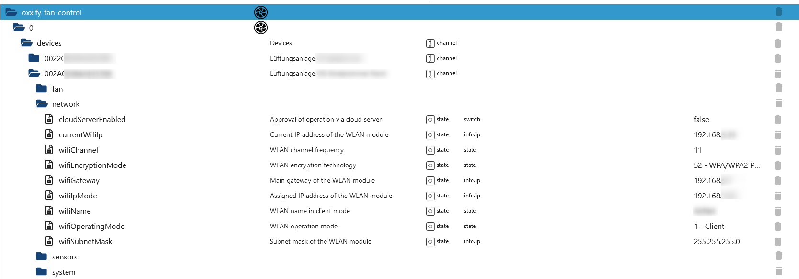
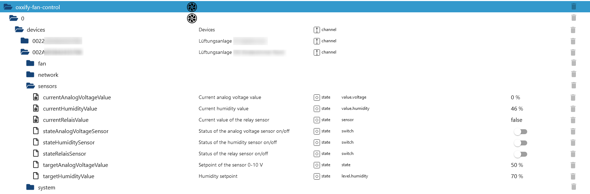
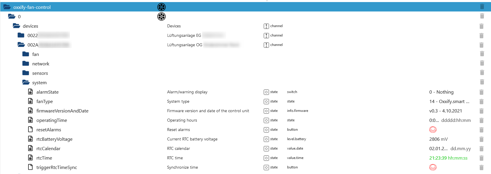

# ioBroker.oxxify-fan-control

**Tests:** 

## oxxify-fan-control adapter for ioBroker

Integrate your Oxxify fans into your Smart Home. All the provided ioBroker data points are based on the communication protocol described [here](./doc/BDA_Anschluss_SmartHome_RV_V2.pdf). As other manufacturers are using the same protocol (e.g. Blauberg vents), it is pretty likely, that they will work as well.

## Working devices

- Oxxify smart 50 (tested from my side)
- Any other Oxxify device with WiFi
- Blauberg Vents (should be, not yet tested)

### Object tree desciption

The object tree contains the folder named "devices", which creates an entry for each configured fan. The channels below are created with the unique fan id, which is provided by the manufacturer. In the column _name_ the entry from the configuration is used, to distinguish better between the fans. Below each fan four channels are created to group the data provided per fan. They are explained as follows:

#### Fan data

This channel contains any fan related data like timers, fan speed, on/off state and information regarding the filter cleaning/exchange interval. The fan operating modes contains the numerical value from the communication protocol as well as a speaking string state. The values can be written by the number only (e.g. a 1 for the heating recovery). Same applys for the timer mode and the fan speed mode, which accepts 1, 2, 3 and 255 for manual speed setting. The fan speed for fan 2 is not available at my devices (Oxxify pro 50) and stays either at 0 rpm in off state or 1500 in any run state. The other value changes accoring to the speed.

#### Network data

The network data is currently read-only, writing/changing of values here is not yet implemented and can be done with the app of the manufacturer. Same applys for the cloud server control state.

#### Sensors data

The data entrys for the sensors are implemented as defined in the protocol. The analog voltage vale is in % as defined in the protocol. I have nothing connected to the analog and relais sensor, so I can not really test what happens, if you activate them.

#### System data

This channel contains system data about the hardware and firmware as well as runtime, RTC battery voltage and date/time. Here alarms can be reset and also the RTC time can be set based on the configured NTP server. From my experience it can sometimes happen, that after an RTC time sync the new (right) values are not visible immediately and it takes until the next data polling.

## ToDos

- Implementing more tests
- Improve documentation
- Implement missing data points (like time schedule, writing of network data & cloud control)

<!--
    Placeholder for the next version (at the beginning of the line):
    ### **WORK IN PROGRESS**
-->

## Changelog

### **WORK IN PROGRESS**

- Some dependency work
- Code documentation extended

### 0.0.6 (2025-04-17)

- Vulnerable dependency updated

### 0.0.5 (2025-03-21)

- Added automatic write retry mechanism for writing values within the fan, as writing with UDP is not very reliable in connection with poor network conditions
- Adapter checker issues fixed

### 0.0.4 (2025-01-31)

- Updated ESLint to 9.x.x
- Fixed copyright issue from adapter checker
- Replaced deletion of all objects with deletion of missing devices from config only
- Avoided illegal characters from user input for fan id within code
- Changed state subscription to all states below the devices folder
- Added restart logic of UDP server in case of an error
- Added adapter terminiation if multiple udp server errors occured
- Replaced cyclic checking of the send quene with a timeout approach instead of interval
- Missing intermediate objects created
- Roles updated according to the read/write definitions
- Polling interval limited in JSON config and code
- ioBroker unit in object tree for RTC date & time removed

### 0.0.3 (2025-01-11)

- Added states for objects with high byte 0x03 with reading and writing
- Recreate device objects on adapter restart
- Simplified methods for writing fan data based on subscribed states
- Added a first unit test for the parsing of numbers.

### 0.0.2 (2025-01-06)

- (N-b-dy) initial release

## License

Copyright (c) 2025 N-b-dy <daten4me@gmx.de>

                    GNU GENERAL PUBLIC LICENSE
                       Version 3, 29 June 2007

### Disclaimer of Warranty.

THERE IS NO WARRANTY FOR THE PROGRAM, TO THE EXTENT PERMITTED BY
APPLICABLE LAW. EXCEPT WHEN OTHERWISE STATED IN WRITING THE COPYRIGHT
HOLDERS AND/OR OTHER PARTIES PROVIDE THE PROGRAM "AS IS" WITHOUT WARRANTY
OF ANY KIND, EITHER EXPRESSED OR IMPLIED, INCLUDING, BUT NOT LIMITED TO,
THE IMPLIED WARRANTIES OF MERCHANTABILITY AND FITNESS FOR A PARTICULAR
PURPOSE. THE ENTIRE RISK AS TO THE QUALITY AND PERFORMANCE OF THE PROGRAM
IS WITH YOU. SHOULD THE PROGRAM PROVE DEFECTIVE, YOU ASSUME THE COST OF
ALL NECESSARY SERVICING, REPAIR OR CORRECTION.

### Limitation of Liability.

IN NO EVENT UNLESS REQUIRED BY APPLICABLE LAW OR AGREED TO IN WRITING
WILL ANY COPYRIGHT HOLDER, OR ANY OTHER PARTY WHO MODIFIES AND/OR CONVEYS
THE PROGRAM AS PERMITTED ABOVE, BE LIABLE TO YOU FOR DAMAGES, INCLUDING ANY
GENERAL, SPECIAL, INCIDENTAL OR CONSEQUENTIAL DAMAGES ARISING OUT OF THE
USE OR INABILITY TO USE THE PROGRAM (INCLUDING BUT NOT LIMITED TO LOSS OF
DATA OR DATA BEING RENDERED INACCURATE OR LOSSES SUSTAINED BY YOU OR THIRD
PARTIES OR A FAILURE OF THE PROGRAM TO OPERATE WITH ANY OTHER PROGRAMS),
EVEN IF SUCH HOLDER OR OTHER PARTY HAS BEEN ADVISED OF THE POSSIBILITY OF
SUCH DAMAGES.
