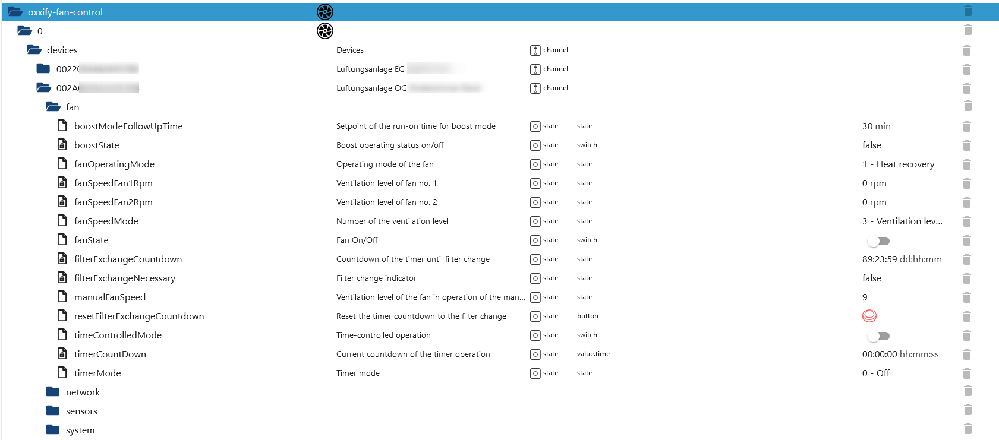
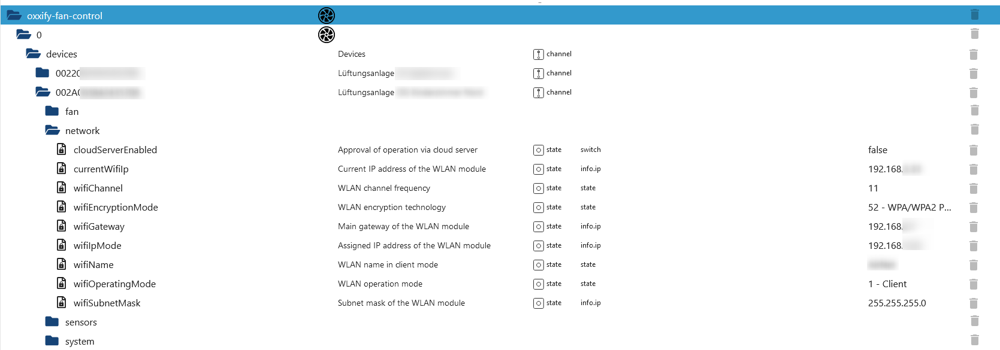
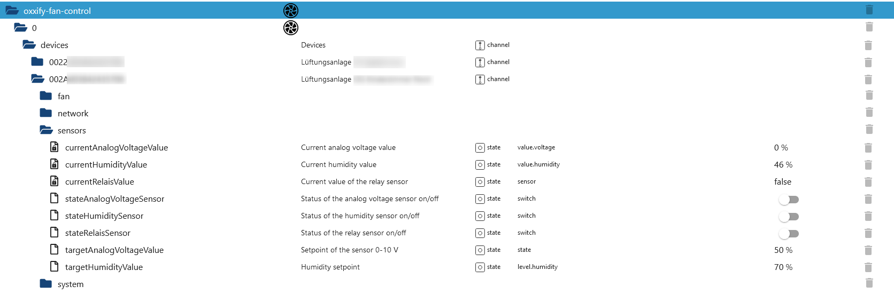
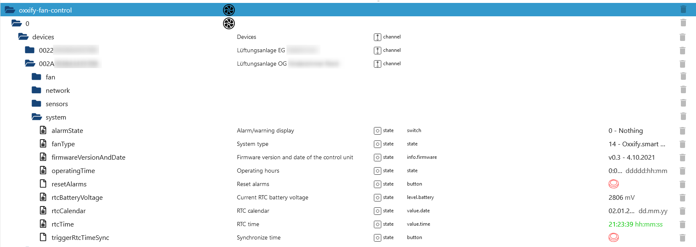

# ioBroker.oxxify-fan-control

**Tests:** 

## oxxify-fan-control adapter for ioBroker

Integrate your Oxxify fans into your Smart Home. All the provided ioBroker data points are based on the communication protocol described [here](./doc/BDA_Anschluss_SmartHome_RV_V2.pdf). As other m[...]

## Working devices

- Oxxify smart 50 (tested from my side)
- Any other Oxxify device with WiFi
- Blauberg Vents and others with same protocol (the following ones are working)
    - Blauberg D180 S21
    - Vento Expert A50-1 S10 W V.2

### Object tree desciption

The object tree contains the folder named "devices", which creates an entry for each configured fan. The channels below are created with the unique fan id, which is provided by the manufacturer. I[...]

#### Fan data

This channel contains any fan related data like timers, fan speed, on/off state and information regarding the filter cleaning/exchange interval. The fan operating modes contains the numerical valu[...]

#### Network data

The network data is currently read-only, writing/changing of values here is not yet implemented and can be done with the app of the manufacturer. Same applys for the cloud server control state.

#### Sensors data

The data entrys for the sensors are implemented as defined in the protocol. The analog voltage vale is in % as defined in the protocol. I have nothing connected to the analog and relais sensor, so[...]

#### System data

This channel contains system data about the hardware and firmware as well as runtime, RTC battery voltage and date/time. Here alarms can be reset and also the RTC time can be set based on the conf[...]

## ToDos

- Implementing more tests
- Implement missing data points (like time schedule, writing of network data & cloud control)

<!--
    Placeholder for the next version (at the beginning of the line):
    ### **WORK IN PROGRESS**
-->

## Changelog
### 0.0.17 (2026-08-25)

- Security vulnerabilities fixed
- Dependencies updated
- Adapter checker stuff fixed (https://github.com/N-b-dy/ioBroker.oxxify-fan-control/issues/158)

### 0.0.16 (2026-05-18)

- Security vulnerabilities fixed (#143)
- Dependencies updated

### 0.0.15 (2026-05-05)

- Security vulnerabilities fixed (#141)

### 0.0.14 (2026-05-05)

- Added missing JSDoc comments
- (copilot) Adapter requires node.js >= 22 now
- Warning [W5039] fixed

### 0.0.13 (2026-04-08)

- Auto PRs merged
- Fixing other deployment issues...

For older changelog entries see [CHANGELOG_OLD.md](./CHANGELOG_OLD.md)

## License

Copyright (c) 2025-2026 N-b-dy <daten4me@gmx.de>

                    GNU GENERAL PUBLIC LICENSE
                       Version 3, 29 June 2007

### Disclaimer of Warranty.

THERE IS NO WARRANTY FOR THE PROGRAM, TO THE EXTENT PERMITTED BY
APPLICABLE LAW. EXCEPT WHEN OTHERWISE STATED IN WRITING THE COPYRIGHT
HOLDERS AND/OR OTHER PARTIES PROVIDE THE PROGRAM "AS IS" WITHOUT WARRANTY
OF ANY KIND, EITHER EXPRESSED OR IMPLIED, INCLUDING, BUT NOT LIMITED TO,
THE IMPLIED WARRANTIES OF MERCHANTABILITY AND FITNESS FOR A PARTICULAR
PURPOSE. THE ENTIRE RISK AS TO THE QUALITY AND PERFORMANCE OF THE PROGRAM
IS WITH YOU. SHOULD THE PROGRAM PROVE DEFECTIVE, YOU ASSUME THE COST OF
ALL NECESSARY SERVICING, REPAIR OR CORRECTION.

### Limitation of Liability.

IN NO EVENT UNLESS REQUIRED BY APPLICABLE LAW OR AGREED TO IN WRITING
WILL ANY COPYRIGHT HOLDER, OR ANY OTHER PARTY WHO MODIFIES AND/OR CONVEYS
THE PROGRAM AS PERMITTED ABOVE, BE LIABLE TO YOU FOR DAMAGES, INCLUDING ANY
GENERAL, SPECIAL, INCIDENTAL OR CONSEQUENTIAL DAMAGES ARISING OUT OF THE
USE OR INABILITY TO USE THE PROGRAM (INCLUDING BUT NOT LIMITED TO LOSS OF
DATA OR DATA BEING RENDERED INACCURATE OR LOSSES SUSTAINED BY YOU OR THIRD
PARTIES OR A FAILURE OF THE PROGRAM TO OPERATE WITH ANY OTHER PROGRAMS),
EVEN IF SUCH HOLDER OR OTHER PARTY HAS BEEN ADVISED OF THE POSSIBILITY OF
SUCH DAMAGES.
