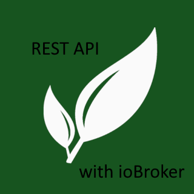
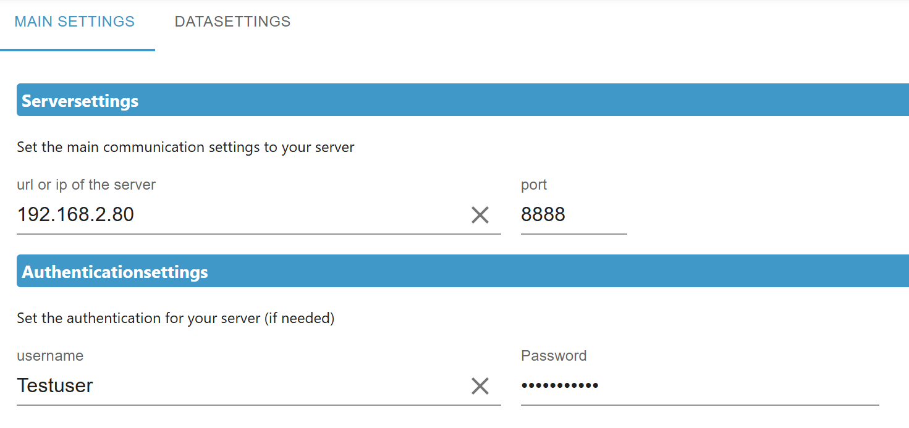
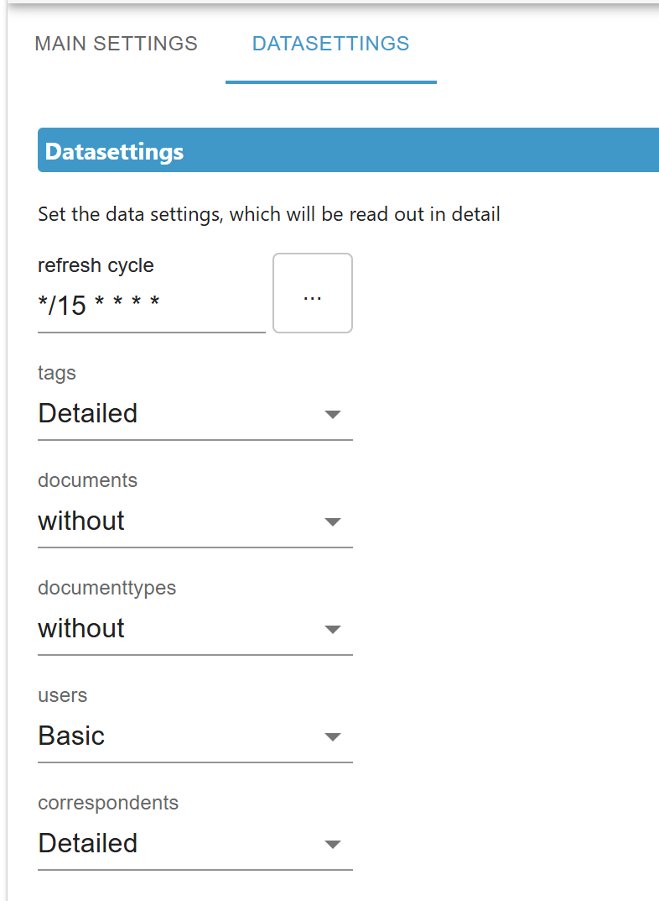

# ioBroker.paperless-ngx

* Official Papaerless-ngx website: https://docs.paperless-ngx.com/

## paperless-ngx adapter for ioBroker
paperless-ngx API to get information of running instances from paperless-ngx.
For instance, you can read the tags, documents, document-types, user or correspondents of the paperless instance.

set the following data to login to the instance:

select the refresh cycle and the type of reading data: (without, basic oder detailed)

## Changelog
<!--
	Placeholder for the next version (at the beginning of the line):
	### **WORK IN PROGRESS**
-->
### 1.0.2 (2026-08-05)
- (BenAhrdt) Prevent adapter startup failure when no Paperless server is configured

### 1.0.1 (2026-08-05)
- (copilot) Adapter requires node.js >= 22 now
- (BenAhrdt) Add HTTPS and reverse proxy URL support while keeping existing HTTP configurations compatible

### 1.0.0 (2026-04-03)
* (BenAhrdt) change axios to fetch

### 0.5.1 (2026-02-28)
* (BenAhrdt) update dependencies

### 0.5.0 (2025-10-19)
* (BenAhrdt) update Authentication NPM
* (BenAhrdt) update test to resolve conflicts
* (BenAhrdt) update testing 5.1.1
* (BenAhrdt) update dependencie core
* (BenAhrdt) update dependencie to node >= 20
* (BenAhrdt) update testing to 24.x

[Older changelogs can be found there](CHANGELOG_OLD.md)

## DISCLAIMER
This project is not officially affiliated with Paperless-ngx,
i.e. they do not maintain this project.

## License
MIT License

Copyright (c) 2025-2026 BenAhrdt <bsahrdt@gmail.com>

Permission is hereby granted, free of charge, to any person obtaining a copy
of this software and associated documentation files (the "Software"), to deal
in the Software without restriction, including without limitation the rights
to use, copy, modify, merge, publish, distribute, sublicense, and/or sell
copies of the Software, and to permit persons to whom the Software is
furnished to do so, subject to the following conditions:

The above copyright notice and this permission notice shall be included in all
copies or substantial portions of the Software.

THE SOFTWARE IS PROVIDED "AS IS", WITHOUT WARRANTY OF ANY KIND, EXPRESS OR
IMPLIED, INCLUDING BUT NOT LIMITED TO THE WARRANTIES OF MERCHANTABILITY,
FITNESS FOR A PARTICULAR PURPOSE AND NONINFRINGEMENT. IN NO EVENT SHALL THE
AUTHORS OR COPYRIGHT HOLDERS BE LIABLE FOR ANY CLAIM, DAMAGES OR OTHER
LIABILITY, WHETHER IN AN ACTION OF CONTRACT, TORT OR OTHERWISE, ARISING FROM,
OUT OF OR IN CONNECTION WITH THE SOFTWARE OR THE USE OR OTHER DEALINGS IN THE
SOFTWARE.
