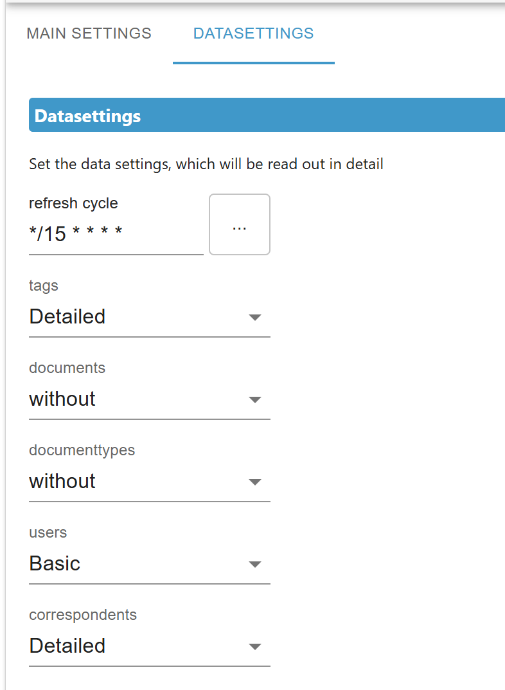

# ioBroker.paperless-ngx

* Official Papaerless-ngx website: https://docs.paperless-ngx.com/

## paperless-ngx adapter for ioBroker
paperless-ngx API to get information of running instances from paperless-ngx.
For instance, you can read the tags, documents, document-types, user or correspondents of the paperless instance.

set the following data to login to the instance:

select the refresh cycle and the type of reading data: (without, basic oder detailed)

## Changelog
<!--
	Placeholder for the next version (at the beginning of the line):
	### **WORK IN PROGRESS**
-->
### 0.4.4 (2025-04-10)
* (BenAhrdt) add timeout to config

### 0.4.3 (2025-04-10)
* (BenAhrdt) added more debug logging

### 0.4.2 (2025-04-10)
* (BenAhrdt) logging in case of no connection improoved

### 0.4.1 (2025-03-03)
* (BenAhrdt) Search logic for and / or improoved

### 0.4.0 (2025-03-03)
* (BenAhrdt) Implement Token

### 0.3.0 (2025-02-22)
* (BenAhrdt) update admin and js-controller depencies

### 0.2.1 (2024-12-20)
* (BenAhrdt) replace forbidden chars with "_" and add timeout 3000ms to axios

### 0.2.0 (2024-12-05)
* (BenAhrdt) update eslint

### 0.1.4 (2024-11-25)
* (BenAhrdt) add responsive tags for xs, s, l .... to json config

### 0.1.3 (2024-11-23)
* (BenAhrdt) implemt tag and blocked tag search / insert comments

### 0.1.2 (2024-10-25)
* catching config of wrong API Adress

### 0.1.1 (2024-10-24)
* implents correspondents

### 0.1.0 (2024-10-11)
* First implementation of searching in documents with specific tags

### 0.0.15 (2024-08-10)
* (BenAhrdt) changes for check and service bot

### 0.0.14 (2024-08-09)
* (BenAhrdt) add keyword ioBroker to package.json

### 0.0.13 (2024-08-08)
* (BenAhrdt) added current step

### 0.0.12 (2024-08-08)
* (BenAhrdt) Implekents "all" to some folders

### 0.0.11 (2024-08-08)
* (BenAhrdt) remove the "" from links

### 0.0.10 (2024-08-07)
* (BenAhrdt) Added common.name to results

### 0.0.9 (2024-08-07)
* (BenAhrdt) implements search in documents (additional to global search)

### 0.0.8 (2024-08-06)
* (BenAhrdt) implements new icons and additionObjectinformations

### 0.0.7 (2024-08-05)
* (BenAhrdt) change structure for indexing documents / tags etc.

### 0.0.6 (2024-08-05)
* (BenAhrdt) new structure for results. number assigned, because foreign named dokuments are maby not allowed

### 0.0.5 (2024-08-04)
* (BenAhrdt) first query function implemented

### 0.0.4 (2024-08-03)
* (BenAhrdt) readoutlevel for dataconnection

### 0.0.3 (2024-08-02)
* (BenAhrdt) bugfixes for set states wrigth

### 0.0.2 (2024-08-02)
* (BenAhrdt) initial release

## License
MIT License

Copyright (c) 2025 BenAhrdt <bsahrdt@gmail.com>

Permission is hereby granted, free of charge, to any person obtaining a copy
of this software and associated documentation files (the "Software"), to deal
in the Software without restriction, including without limitation the rights
to use, copy, modify, merge, publish, distribute, sublicense, and/or sell
copies of the Software, and to permit persons to whom the Software is
furnished to do so, subject to the following conditions:

The above copyright notice and this permission notice shall be included in all
copies or substantial portions of the Software.

THE SOFTWARE IS PROVIDED "AS IS", WITHOUT WARRANTY OF ANY KIND, EXPRESS OR
IMPLIED, INCLUDING BUT NOT LIMITED TO THE WARRANTIES OF MERCHANTABILITY,
FITNESS FOR A PARTICULAR PURPOSE AND NONINFRINGEMENT. IN NO EVENT SHALL THE
AUTHORS OR COPYRIGHT HOLDERS BE LIABLE FOR ANY CLAIM, DAMAGES OR OTHER
LIABILITY, WHETHER IN AN ACTION OF CONTRACT, TORT OR OTHERWISE, ARISING FROM,
OUT OF OR IN CONNECTION WITH THE SOFTWARE OR THE USE OR OTHER DEALINGS IN THE
SOFTWARE.

## DISCLAIMER
This project is not officially affiliated with Paperless-ngx,
i.e. they do not maintain this project.