# ioBroker.playstation

[Back to the README](/README.md)

# Summary

- [Instance Settings](#instance-settings)
    - [Settings TAB Device](#instance-settings-tab--create-device)
    - [Settings TAB Token](#instance-settings-tab--create-token)
- [Login](#login)
    - [Step 1 > Login PSN](#login-psn-playsatation-network)
    - [Step 2 > Login Local](#login-playstation-device)
- [Objects](#objects)
    - [Overview Objects](#overview-all-objects)
    - [Profile](#overview-objects-profile)
    - [Device](#overview-objects-device)
    - [Remote Local](#objects-remote)
    - [Remote PSN Profile](#objects-remote_profile)
    - [Remote PSN Trophies](#objects-remote_trophies)
    - [Remote PSN Groups](#objects-remote_groups)
    - [Remote PSN Stars](#objects-remote_stars)
    - [Remote PSN Store](#objects-remote_store)
- [Example](#example-arrayjson)
- [Status restrictions as JSON](#status-json)

# Instance Settings

### Instance Settings TAB > Create Device

[Summary](#summary)

- `Active` Activate/deactivate local control
- `Name` Name of the device
- `IP` The fixed IP of the device
- `Interval` Interval in seconds (5/3600) to query the status
- `Icon` Icon for the object device as a base64 image
- `Credential` Will be set automatically with the login data for playactor-iobroker
- `Which PS4/5 to pair?` Select the IP of the device to be paired
- `Playstation availability check` The Playstation is searched for. A pop-up with OK or an error message follows
- `Starts UDP server` Start the UDP server to receive the access data for the PS4 Second Screen APP
- `Pincode` Enter the pin code from the device
- `Pincode submit` Send the pin code

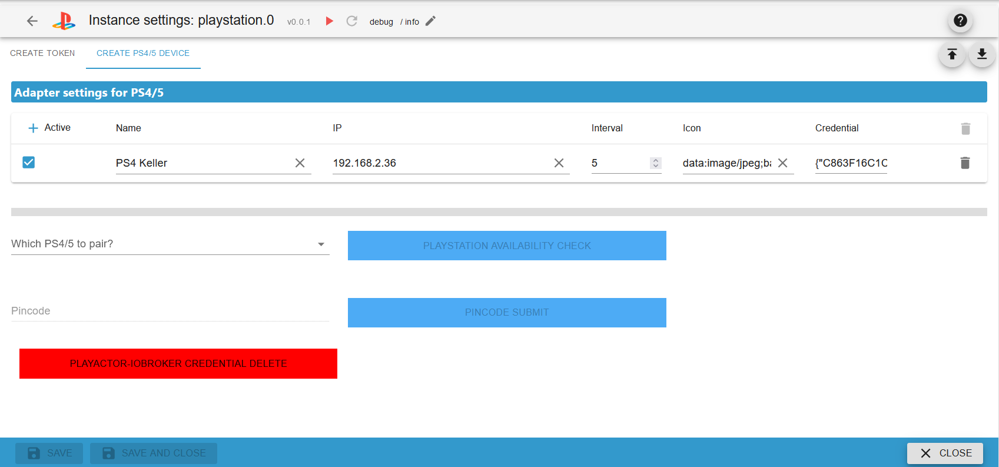

### Instance Settings TAB > Create Token

[Summary](#summary)

- `1. Please login to PSN here` Click and log in
- `2. Link to NPSSO (must be renewed every 2 months)` After logging in, click this link and copy the NPSSO cookie
- `NPSSO cookie` Paste NPSSO cookie here
- `Delete session data` If you have problems logging in, delete the current session
- `Language` The language from the PSN account
- `Activate Playstation Stars` Create remote control objects for Playstation Stars (Must be activated in the PS profile)

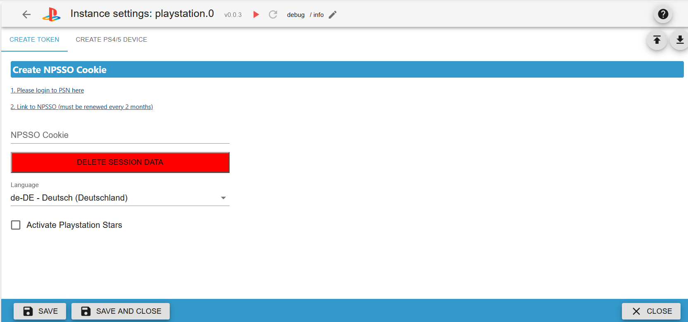

# Login

### Login PSN (Playsatation Network)

[Summary](#summary)

1. Click on the link and log in to Playstation Network
2. Now click on this link and copy the NPSSO</br>
   </br>
3. Insert this cookie into `NPSSO-Cookie` and save the instance settings. This cookie should only be valid for 2 months.</br>
   </br>
   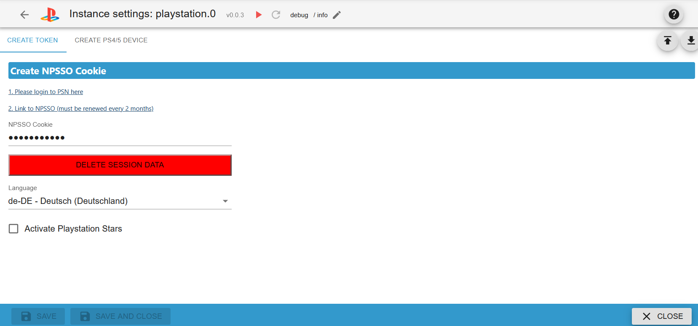

### Login Playstation Device

[Summary](#summary)

[First perform step 1](#login-psn-playsatation-network)</br>
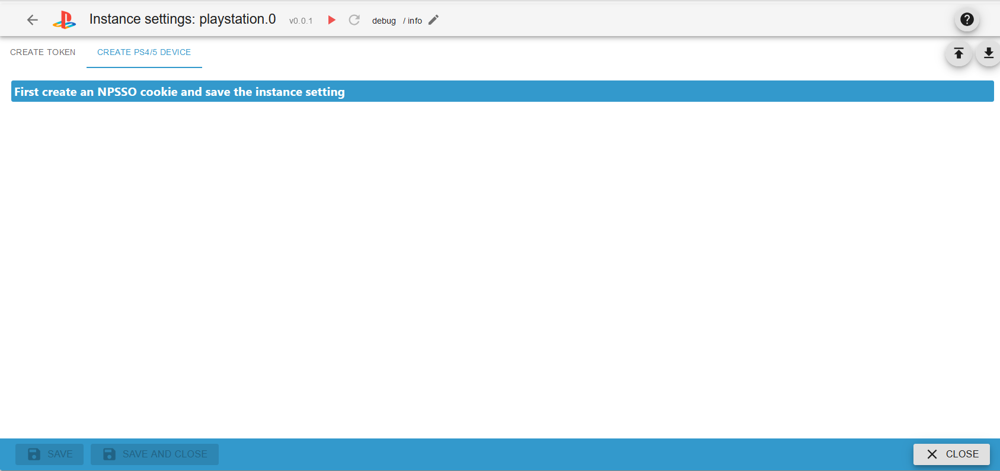

1. (Router) Assign a fixed IP to the Playstation (please use Google)
2. (PS) Turn on the Playstation and select the profile</br>
   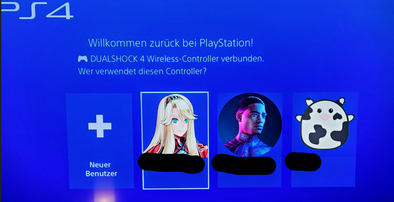</br>
3. (PS) Open settings</br>
   </br>
4. (PS) Mobile App Connection Settings</br>
   </br>
5. (ioBroker) Open instance setting of the playstation adapter</br>
   </br>
6. (ioBroker) Create a device and enter the IP of the Playstation under "IP"
7. (ioBroker) Select the IP in `Which PS4/5 to pair?`</br>
   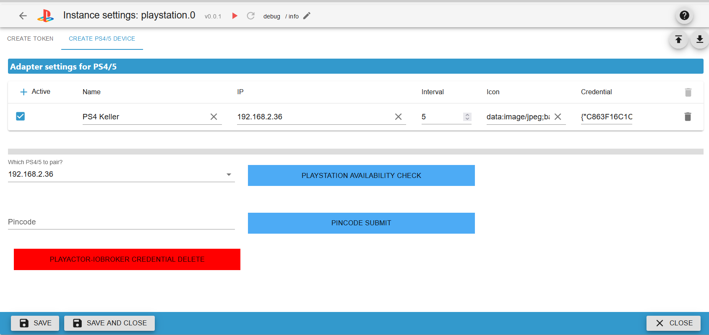</br>
8. (ioBroker) Press Button `Playstation availability check`. A message and a popup with ok or an error message will appear</br>
   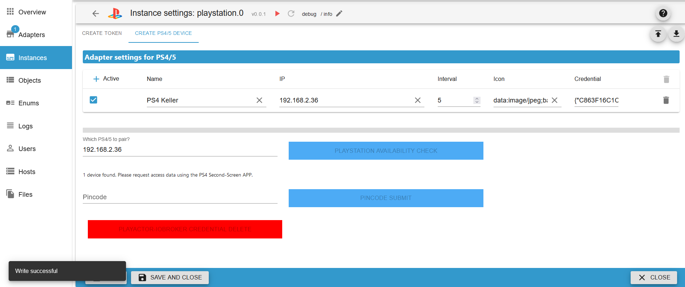</br>
9. (PS) Press Add Device (a PIN appears)</br>
   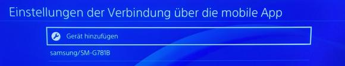</br>
   </br>
10. (ioBroker) Enter the PIN in `Pincode`
11. (ioBroker) Press Button `Pincode submit`. A popup with ok or an error message appears</br>
    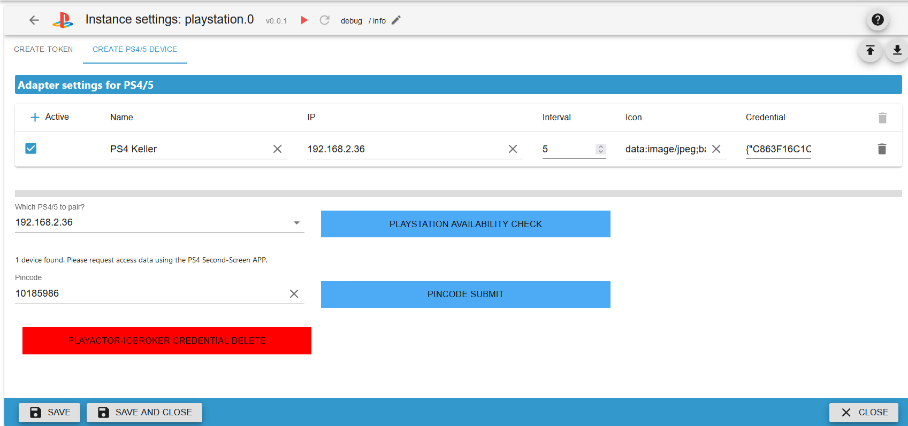</br>
12. (PS) PIN should now no longer be visible and the name playactor-iob is visible</br>
    </br>
13. (ioBroker) Save instance settings
14. (ioBroker) If an error message appears, please repeat the process from point 9

# Objects

### Objects remote

[Summary](#summary)

To use keys you must first press the ps key. The keys do not work in games!

- `playstation.0.192_168_2_36.remote.back` back key
- `playstation.0.192_168_2_36.remote.down` down key
- `playstation.0.192_168_2_36.remote.enter` enter key
- `playstation.0.192_168_2_36.remote.left` left key
- `playstation.0.192_168_2_36.remote.option` option key
- `playstation.0.192_168_2_36.remote.osk` send on-screen keyboard
- `playstation.0.192_168_2_36.remote.ownCommand` own commands (back down etc) or multiple with delay (back:200 down:200)
- `playstation.0.192_168_2_36.remote.ps` PS key to activate remote control of the other keys
- `playstation.0.192_168_2_36.remote.right` Right key
- `playstation.0.192_168_2_36.remote.standby` Put devices into standby
- `playstation.0.192_168_2_36.remote.startGame` Start game (e.g. Fortnite) Case sensitive
- `playstation.0.192_168_2_36.remote.up` Up key
- `playstation.0.192_168_2_36.remote.wakeup` Wake up devices

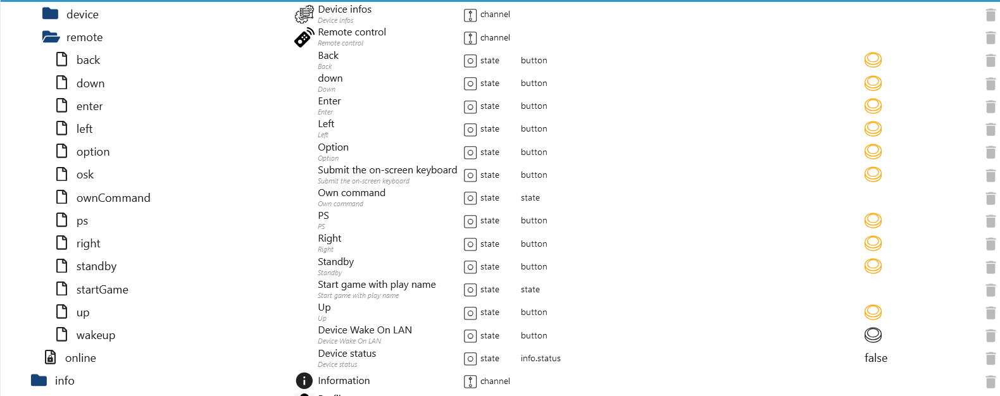

### Objects remote_profile

[Summary](#summary)

Account-ID: User number
Online-ID: Nickname

| Object                                                              | Description                                                                                                                                                        | Example                                                                              |
| ------------------------------------------------------------------- | ------------------------------------------------------------------------------------------------------------------------------------------------------------------ | ------------------------------------------------------------------------------------ |
| playstation.0.profile_remote_profile.account_id                     | Display information of a user with the account ID (Result in state result)                                                                                         | [Example](#request-with-accountid-playstation0profile_remote_profileaccount_id)      |
| playstation.0.profile_remote_profile.blocked_with_name              | Blocked users with name as array JSON (account-id and online-id)                                                                                                   | Result unknown                                                                       |
| playstation.0.profile_remote_profile.blocked_without_name           | Blocked users as array JSON (account-id and online-id)                                                                                                             | Result unknown                                                                       |
| playstation.0.profile_remote_profile.friends_with_name              | List of friends as array JSON (account-id and online-id)                                                                                                           | [Example](#request-playstation0profile_remote_profilefriends_with_name)              |
| playstation.0.profile_remote_profile.friends_with_name_status       | List of friends with status infos as array JSON (account-id and online-id)                                                                                         | [Example](#request-playstation0profile_remote_profilefriends_with_name_status)       |
| playstation.0.profile_remote_profile.friends_without_name           | List of friends as array (account-id)                                                                                                                              | [Example](#request-playstation0profile_remote_profilefriends_without_name)           |
| playstation.0.profile_remote_profile.gameList                       | Game list of a user with the account-ID as JSON                                                                                                                    | [Example](#request-playstation0profile_remote_profilegamelist)                       |
| playstation.0.profile_remote_profile.gameTitle                      | Game info with the title ID as JSON                                                                                                                                | [Example](#request-playstation0profile_remote_profilegametitle)                      |
| playstation.0.profile_remote_profile.limit                          | Limit for inviting friends.                                                                                                                                        |                                                                                      |
| playstation.0.profile_remote_profile.offset                         | Offset for loading members and info                                                                                                                                |                                                                                      |
| playstation.0.profile_remote_profile.online_id                      | Output information about a user with the online ID (result in state result)                                                                                        | [Example](#request-with-online-id-playstation0profile_remote_profileonline_id)       |
| playstation.0.profile_remote_profile.online_with_name               | Notify me when available subscription list as array JSON (account id and online id)                                                                                | Result unknown                                                                       |
| playstation.0.profile_remote_profile.online_without_name            | Notify me when available subscription list as array (account id)                                                                                                   | Result unknown                                                                       |
| playstation.0.profile_remote_profile.presencesUser                  | Query the status of a user with the account ID (if the user has set PRIVATE)                                                                                       | [Example](#request-playstation0profile_remote_profilepresencesuser)                  |
| playstation.0.profile_remote_profile.received_requests_accept       | Friend request accept (with account-id)                                                                                                                            |                                                                                      |
| playstation.0.profile_remote_profile.received_requests_reject       | Friend request reject or friend delete (with account-id)                                                                                                           |                                                                                      |
| playstation.0.profile_remote_profile.received_requests_with_name    | Friend requests with online ID as JSON                                                                                                                             | [Example](#request-playstation0profile_remote_profilereceived_requests_with_name)    |
| playstation.0.profile_remote_profile.received_requests_without_name | Friend requests without online ID as JSON                                                                                                                          | [Example](#request-playstation0profile_remote_profilereceived_requests_without_name) |
| playstation.0.profile_remote.result                                 | Result of all requests                                                                                                                                             |                                                                                      |
| playstation.0.profile_remote_profile.search_game                    | Search game. Maximum 15 games as JSON. For further displays then use the selection from the state `playstation.0.profile_remote_profile.search_result_pagination`  | [Example](#request-playstation0profile_remote_profilesearch_game)                    |
| playstation.0.profile_remote_profile.search_result                  | Result of all search requests                                                                                                                                      |                                                                                      |
| playstation.0.profile_remote_profile.search_result_pagination       | Show another 15 games/users                                                                                                                                        |                                                                                      |
| playstation.0.profile_remote_profile.search_user                    | Search users. Maximum 15 users as JSON. For further displays then use the selection from the state `playstation.0.profile_remote_profile.search_result_pagination` | [Example](#request-playstation0profile_remote_profilesearch_user)                    |
| playstation.0.profile_remote_profile.shareProfile                   | Share profile with a friend (Account ID). A link to a QRcode is created.                                                                                           |                                                                                      |
| playstation.0.profile_remote_profile.storeWishlist                  | Wishlist                                                                                                                                                           | [Example](#request-playstation0profile_remote_profilestorewishlist)                  |
| playstation.0.profile_remote_profile.total                          | Total of the current query                                                                                                                                         |                                                                                      |
| playstation.0.profile_remote_profile.update_profile                 | Update your profile (automatically only updates every hour)                                                                                                        |                                                                                      |

### Example limit and offset

Load friends list (there are 59 friends - limit max. 800)

- limit 20 // 20 friends will be invited
- offset 0 // Starts at 0
- Result: Friends 1-20 are loaded

- limit 20 // 20 friends will be invited
- offset 20 // Starts at 21
- Result: Friends 21-30 are loaded

- limit 20 // 20 friends will be invited
- offset 50 // Starts at 51
- Result: Friends 51-59 are loaded

- limit 20 // 20 friends will be invited
- offset 59 // Starts at 59
- Result: The list is then empty

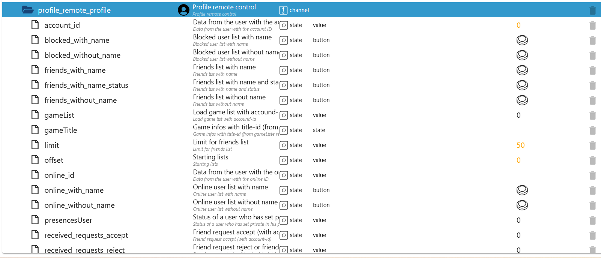</br>
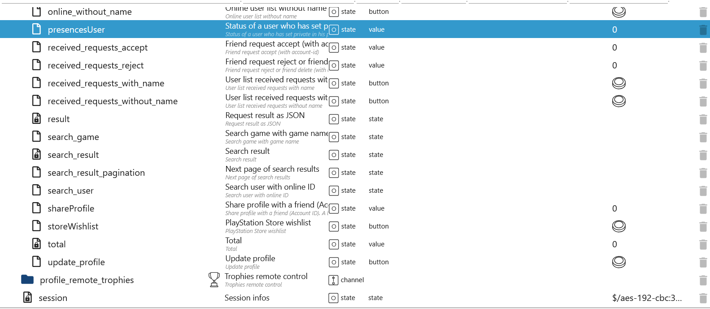

### Objects remote_trophies

[Summary](#summary)

Account-ID: Nummer des Benutzer
Online-ID: Nickname

| Object                                                                       | Description                                                                                | Example                                                                                       |
| ---------------------------------------------------------------------------- | ------------------------------------------------------------------------------------------ | --------------------------------------------------------------------------------------------- |
| playstation.0.profile_remote_trophies.trophies_earned_for_title              | Trophies earned for the title with account-ID                                              | [Example](#request-playstation0profile_remote_trophiestrophies_earned_for_title)              |
| playstation.0.profile_remote_trophies.trophies_for_title                     | Trophies for titles with npCommunication-id                                                | [Example](#request-playstation0profile_remote_trophiestrophies_for_title)                     |
| playstation.0.profile_remote_trophies.trophies_game_help_available_for_title | Available game help from trophies with npCommunication-id                                  | [Example](#request-playstation0profile_remote_trophiestrophies_game_help_available_for_title) |
| playstation.0.profile_remote_trophies.trophies_game_help_for_title           | Available game help from title with npCommunication-id, trophyId, udsObjectId and helpType | [Example](#request-playstation0profile_remote_trophiestrophies_game_help_for_title)           |
| playstation.0.profile_remote_trophies.trophy_all                             | Trophies from a user with the online ID as an array JSON                                   | [Example](#request-playstation0profile_remote_trophiestrophy_all)                             |
| playstation.0.profile_remote_trophies.trophy_title                           | Trophy title with account ID                                                               | [Example](#request-playstation0profile_remote_trophiestrophy_title)                           |
| playstation.0.profile_remote_trophies.trophy_title_group                     | Trophies title group with npCommunication id and platform                                  | [Example](#request-playstation0profile_remote_trophiestrophy_title_group)                     |
| playstation.0.profile_remote_trophies.trophy_title_group_user                | Trophies Title User group with account ID, npCommunication-id and platform                 | [Example](#request-playstation0profile_remote_trophiestrophy_title_group_user)                |

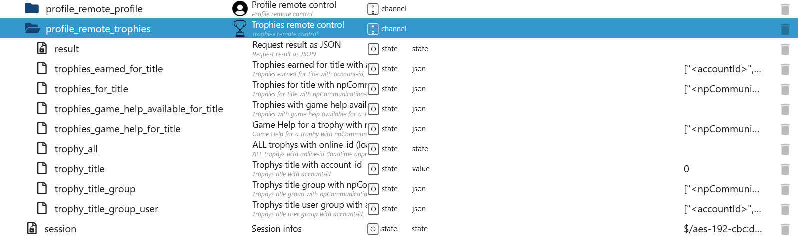

### Objects remote_groups

[Summary](#summary)

Account-ID: Nummer des Benutzer
Online-ID: Nickname

| Object                                                      | Description                                                                                                | Example                                                                      |
| ----------------------------------------------------------- | ---------------------------------------------------------------------------------------------------------- | ---------------------------------------------------------------------------- |
| playstation.0.profile_remote_groups.createGroup             | Create a group with members (members' account ID as an array)                                              | [Example](#request-playstation0profile_remote_groupscreategroup)             |
| playstation.0.profile_remote_groups.favorite                | Loading the Favorites/No Favorites groups (all)                                                            |                                                                              |
| playstation.0.profile_remote_groups.fields                  | Which fields should be loaded                                                                              |                                                                              |
| playstation.0.profile_remote_groups.groupSettings           | Setting the group (a group must be selected under `selectGroup` and 3 members required)                    | Result unknown                                                               |
| playstation.0.profile_remote_groups.inviteMembers           | Add members in a group (members' account ID as an array - a group must be selected under `selectGroup`)    | Result unknown                                                               |
| playstation.0.profile_remote_groups.kickMember              | Remove a member from a group using Account ID (A group must be selected under `selectGroup`)               | Result unknown                                                               |
| playstation.0.profile_remote_groups.leaveGroup              | Leaving a group (A group must be selected under `selectGroup`)                                             | Result unknown                                                               |
| playstation.0.profile_remote_groups.limit                   | Limit for groups or messages that should be loaded (see example under profile)                             |                                                                              |
| playstation.0.profile_remote_groups.loadFileData            | Load attachments from messages (raw data)                                                                  | [Example](#request-playstation0profile_remote_groupsloadfiledata)            |
| playstation.0.profile_remote_groups.loadGroups              | Load groups                                                                                                | [Example](#request-playstation0profile_remote_groupsloadgroups)              |
| playstation.0.profile_remote_groups.loadGroups_with_message | Load groups with messages (see example under profile)                                                      | [Example](#request-playstation0profile_remote_groupsloadgroups_with_message) |
| playstation.0.profile_remote_groups.offset                  | Group loading offset                                                                                       |                                                                              |
| playstation.0.profile_remote_groups.result                  | Load result of groups or groups with messages as JSON                                                      |                                                                              |
| playstation.0.profile_remote_groups.selectGroup             | Group ID from result groups or load groups with messages. When you select a group, the messages are loaded | [Example](#request-playstation0profile_remote_groupsselectgroup)             |
| playstation.0.profile_remote_groups.sendGroupMessage        | Send message to a selected group (A group must be selected under `selectGroup`)                            | [Example](#request-playstation0profile_remote_groupssendgroupmessage)        |
| playstation.0.profile_remote_groups.total                   | Number of all possible groups or messages (important for limit and offset)                                 |                                                                              |

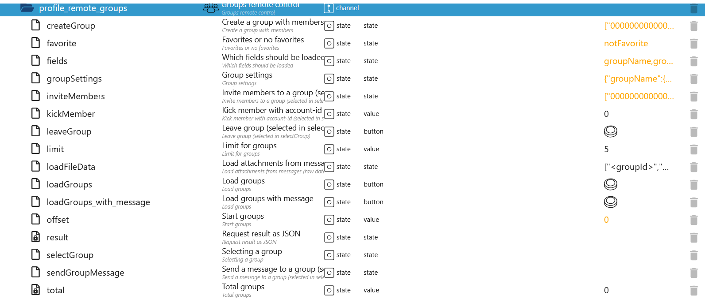

### Objects remote_stars

[Summary](#summary)

campaign-ID: From `profile_remote_stars.campaigns`
collectible-ID: From `profile_remote_stars.campaigns`
reward-ID: From `profile_remote_stars.rewards`

| Object                                                      | Description                                | Example |
| ----------------------------------------------------------- | ------------------------------------------ | ------- |
| playstation.0.profile_remote_stars.campaigns                | Campaigns which are available              |         |
| playstation.0.profile_remote_stars.campaigns_detail         | Details of a specific campaign             |         |
| playstation.0.profile_remote_stars.collectible_detail       | Details of a specific collectible          |         |
| playstation.0.profile_remote_stars.display_cases            | Available display cases (or scenes)        |         |
| playstation.0.profile_remote_stars.result                   | Result of all queries                      |         |
| playstation.0.profile_remote_stars.rewards                  | Rewards for exchange for points earned     |         |
| playstation.0.profile_remote_stars.rewards_detail           | Details of a specific                      |         |
| playstation.0.profile_remote_stars.rewards_tiers            | Reward tiers that exist within the service |         |
| playstation.0.profile_remote_stars.user_display_case        | Collectibles display case                  |         |
| playstation.0.profile_remote_stars.user_earned_collectibles | Collectibles that a user has earned        |         |
| playstation.0.profile_remote_stars.user_history             | A summary of the reward points             |         |
| playstation.0.profile_remote_stars.user_summary             | A summary of a users PlayStation Stars     |         |


### Objects remote_store

[Summary](#summary)

conncept-ID: From `profile_remote_store.products`
product-ID: From `profile_remote_store.products`
title-ID (npTitleId): From `profile_remote_store.products`

| Object                                                    | Description                                         | Example                                                              |
| --------------------------------------------------------- | --------------------------------------------------- | -------------------------------------------------------------------- |
| playstation.0.profile_remote_store.addons_with_titleId    | Addons with title-id                                |                                                                      |
| playstation.0.profile_remote_store.concept_with_conceptId | Conncept with conncept-id                           |                                                                      |
| playstation.0.profile_remote_store.concept_with_productId | Conncept with product-id                            |                                                                      |
| playstation.0.profile_remote_store.featuresRetrieve       | PSPlus subscriptions                                |                                                                      |
| playstation.0.profile_remote_store.param                  | Parameter                                           | [Example](#request-playstation0profile_remote_storefeaturesretrieve) |
| playstation.0.profile_remote_store.pricing_with_conceptId | Pricing with conncept-id                            |                                                                      |
| playstation.0.profile_remote_store.product_with_productId | Product with product-id                             |                                                                      |
| playstation.0.profile_remote_store.products               | All products (param and selectCategory is required) |                                                                      |
| playstation.0.profile_remote_store.rating_with_conceptId  | Rating with conncept-id                             |                                                                      |
| playstation.0.profile_remote_store.rating_with_productId  | Rating with product-id                              |                                                                      |
| playstation.0.profile_remote_store.result                 | Result of all queries                               |                                                                      |
| playstation.0.profile_remote_store.selectCategory         | Parameters for all products                         |                                                                      |
| playstation.0.profile_remote_store.total                  | Number of pages of all products                     |                                                                      |


### Overview all objects

[Summary](#summary)

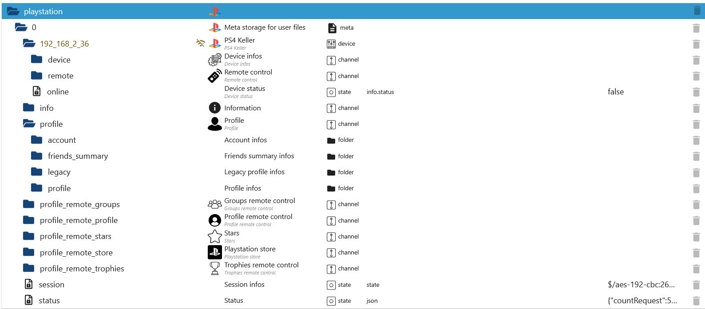

### Overview objects profile

[Summary](#summary)

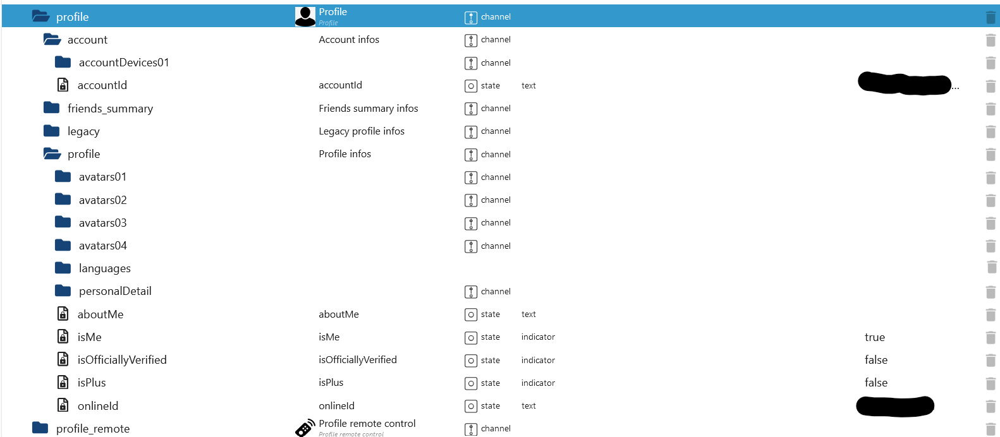

### Overview objects device

[Summary](#summary)

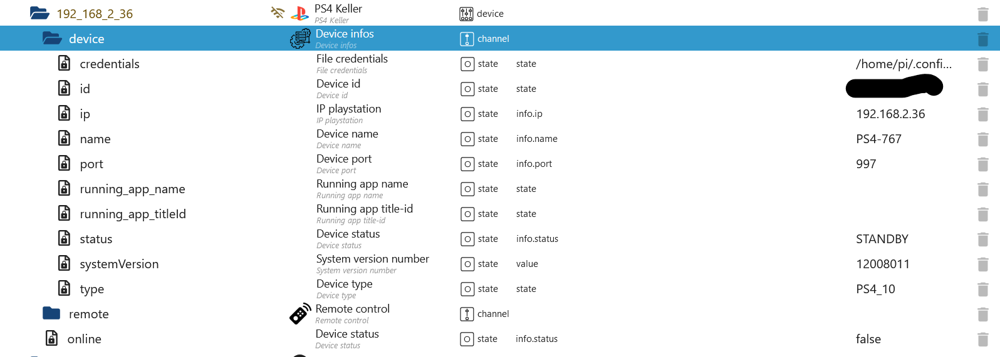

# Status JSON

[Summary](#summary)

```json
{
    "countRequest": 5, // Counter queries for the last 15 minutes
    "maxRequest": 600, // Max. requests per 15 minutes
    "periode": 900000, // 15 minutes timestamp
    "timestamp": 1739475826546, // Start 15 minute counter as timestamp
    "timeISO": "2025-02-13T19:43:46.546Z", // Start 15 minute counter as ISO
    "request": "https://us-prof.np.community.playstation.net/userProfile/v1/users/Luna2008Lara/profile2", // Last GET/POST/PUT Request
    "lastRequest": "2025-02-13T19:43:47.501Z", // Last request as ISO
    "npssoExired": 0, // NPSSO Token Expiry Date - Currently unknown
    "npssoNew": 0, // Start NPSSO token creation. This should only be valid for a few months and must be renewed manually
    "error": "NoError", // Last error message
    "lastError": "2025-02-10T18:51:32.930Z" // Date of last error message as ISO
}
```

# Example Array/JSON

[Summary](#summary)

### Request with AccountID `playstation.0.profile_remote_profile.account_id`

[Summary](#summary)</br>
[Remote PSN Profile](#objects-remote_profile)

```json
{
    "onlineId": "Nickname",
    "personalDetail": {
        "firstName": "Name",
        "lastName": "Lastname"
    },
    "aboutMe": "",
    "avatars": [
        {
            "size": "s",
            "url": "http://static-resource.np.community.playstation.net/avatar_s/3RD/.png"
        },
        {
            "size": "xl",
            "url": "http://static-resource.np.community.playstation.net/avatar_xl/3RD/.png"
        },
        {
            "size": "l",
            "url": "http://static-resource.np.community.playstation.net/avatar/3RD/.png"
        },
        {
            "size": "m",
            "url": "http://static-resource.np.community.playstation.net/avatar_m/3RD/.png"
        }
    ],
    "languages": ["de-DE"],
    "isPlus": false,
    "isOfficiallyVerified": false,
    "isMe": true
}
```

### Request with Online-ID `playstation.0.profile_remote_profile.online_id`

[Summary](#summary)</br>
[Remote PSN Profile](#objects-remote_profile)

```json
{
    "profile": {
        "onlineId": "Nickname",
        "accountId": "111111111111111111",
        "npId": "THVuYTIwMDhdgfhfzhQRghzdmRl",
        "avatarUrls": [
            {
                "size": "l",
                "avatarUrl": "http://static-resource.np.community.playstation.net/avatar/3RD/.png"
            }
        ],
        "plus": 0,
        "aboutMe": "",
        "languagesUsed": ["de"],
        "trophySummary": {
            "level": 37,
            "progress": 75,
            "earnedTrophies": {
                "platinum": 0,
                "gold": 8,
                "silver": 15,
                "bronze": 69
            }
        },
        "isOfficiallyVerified": false,
        "personalDetail": {
            "firstName": "Name",
            "lastName": "Name"
        },
        "personalDetailSharing": "no",
        "personalDetailSharingRequestMessageFlag": false,
        "primaryOnlineStatus": "offline",
        "presences": [
            {
                "onlineStatus": "offline",
                "hasBroadcastData": false,
                "lastOnlineDate": "2025-01-11T00:30:22Z"
            }
        ],
        "friendRelation": "no",
        "requestMessageFlag": false,
        "blocking": false,
        "following": false,
        "consoleAvailability": {
            "availabilityStatus": "offline"
        }
    }
}
```

### Request `playstation.0.profile_remote_groups.loadFileData`

[Zusammenfassung](#zusammenfassung)</br>
[Remote PSN Gruppen](#objekte-remote_groups)

- Messages

```JSON
{
	"messageUid": "1#3981xxx8575",
	"messageType": 1011,
	"alternativeMessageType": 1,
	"body": "",
	"createdTimestamp": "1555180703000",
	"sender": {
		"accountId": "1126100000346479",
		"onlineId": "username"
	},
	"messageDetail": {
		"voiceMessageDetail": {
			"resourceId": "3210FxxxBD2F.5B0B4xxx55913_message_3981xxx8575_1555180703978",
			"playbackTime": 6
		}
	}
}
```

```JSON
{
    "MessageType": {
        "3": "Image",
        "210": "Video",
        "1011": "Audio",
    }
}
```

```JSON
["<groupId>", "<resourceId>", "<messageType>", "<saveInMeta>"]</br>
["~0FA0BD0F264CBD2F.5B0B4EA11A655913", "3210FxxxBD2F.5B0B4xxx55913_message_3981xxx8575_1555180703978", 1011, true] // true = Save in meta object (playstation.0)
```

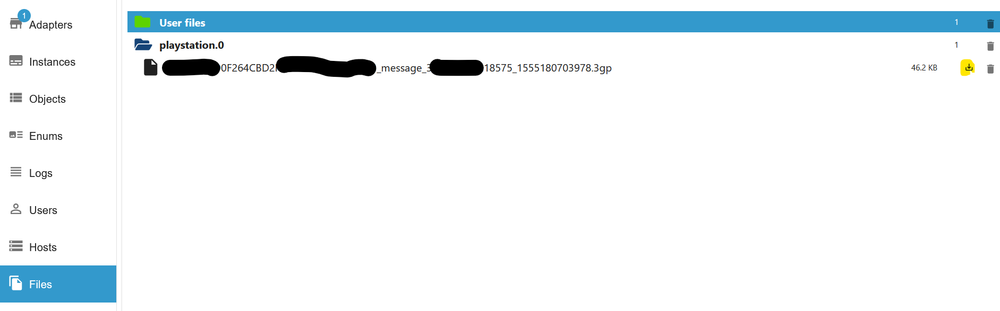

### Request `playstation.0.profile_remote_groups.loadGroups`

[Summary](#summary)</br>
[Remote PSN Groups](#objects-remote_groups)

```json
{
    "groups": [
        {
            "groupId": "~0FA0xxxxxBD2F.5B0B4EA11A655913",
            "groupType": 0,
            "modifiedTimestamp": "1719100599882",
            "groupName": {
                "value": "",
                "status": 0
            },
            "groupIcon": {
                "status": 0
            },
            "joinedTimestamp": "1555154736000",
            "isFavorite": false,
            "existsNewArrival": false,
            "mainThread": {
                "threadId": "~0FA0xxxxxBD2F.5B0B4EA11A655913",
                "modifiedTimestamp": "1719100599882",
                "latestMessage": {
                    "messageUid": "1#44xxxxxx69930",
                    "messageType": 1,
                    "alternativeMessageType": 1,
                    "body": "G",
                    "createdTimestamp": "1719100599882",
                    "sender": {
                        "accountId": "112610000046479",
                        "onlineId": "Nickname"
                    }
                },
                "existsUnreadMessage": false
            },
            "members": [
                {
                    "accountId": "1719100599882",
                    "onlineId": "Nickname"
                },
                {
                    "accountId": "6560400000010131",
                    "onlineId": "Nickname"
                }
            ]
        },
        {
            "groupId": "e38d154e00000e1491b1bd82bb9c1aba4857-539",
            "groupType": 1,
            "modifiedTimestamp": "1703481177046",
            "groupName": {
                "value": "Discord.gg/x22 | modz.link",
                "status": 1,
                "modifier": {
                    "accountId": "7199080000864",
                    "onlineId": "mZN0000005wQ"
                },
                "modifiedTimestamp": "1644041589000"
            },
            "groupIcon": {
                "status": 0
            },
            "joinedTimestamp": "1644041585000",
            "isFavorite": false,
            "existsNewArrival": false,
            "mainThread": {
                "threadId": "e38d154e00000e1491b1bd82bb9c1aba4857-539",
                "modifiedTimestamp": "1703481177046",
                "latestMessage": {
                    "messageUid": "1#43000903",
                    "messageType": 1,
                    "alternativeMessageType": 1,
                    "body": "FELIZ Navidad PT",
                    "createdTimestamp": "1703481177046",
                    "sender": {
                        "accountId": "6560xxxxx451978",
                        "onlineId": "Nickname"
                    }
                },
                "existsUnreadMessage": true
            },
            "members": [
                {
                    "accountId": "656000010821014",
                    "onlineId": "Nickname"
                },
                {
                    "accountId": "65600000451978",
                    "onlineId": "Nickname"
                }
            ]
        },
        {
            "groupId": "a36f70000de9ed6dee629d33dcb4601ae379f-71",
            "groupType": 1,
            "modifiedTimestamp": "1702588783522",
            "groupName": {
                "value": "Free PSN Gift Cards",
                "status": 1,
                "modifier": {
                    "accountId": "595000005350695",
                    "onlineId": "Nickname"
                },
                "modifiedTimestamp": "1547344802000"
            },
            "groupIcon": {
                "status": 0
            },
            "joinedTimestamp": "1547344802000",
            "isFavorite": false,
            "existsNewArrival": false,
            "mainThread": {
                "threadId": "a36f70000de9ed6dee629d33dcb4601ae379f-71",
                "modifiedTimestamp": "1702588783522",
                "latestMessage": {
                    "messageUid": "1#435000008581820",
                    "messageType": 2002,
                    "alternativeMessageType": 2001,
                    "body": "xx.",
                    "createdTimestamp": "1702588783522",
                    "sender": {
                        "accountId": "8551000233923",
                        "onlineId": "Nickname"
                    }
                },
                "existsUnreadMessage": false
            },
            "members": [
                {
                    "accountId": "159500035000520",
                    "onlineId": "Nickname"
                },
                {
                    "accountId": "283600005100992",
                    "onlineId": "Nickname"
                }
            ]
        }
    ],
    "previousOffset": 0,
    "nextOffset": 5,
    "totalGroupCount": 59
}
```

### Request `playstation.0.profile_remote_groups.loadGroups_with_message`

[Summary](#summary)</br>
[Remote PSN Groups](#objects-remote_groups)

```json
{
    "groups": [
        {
            "groupId": "~0FA0xxxxxBD2F.5B0B4EA11A655913",
            "groupType": 0,
            "modifiedTimestamp": "1719100599882",
            "groupName": {
                "value": "",
                "status": 0
            },
            "groupIcon": {
                "status": 0
            },
            "joinedTimestamp": "1555154736000",
            "isFavorite": false,
            "existsNewArrival": false,
            "mainThread": {
                "threadId": "~0FA0xxxxxBD2F.5B0B4EA11A655913",
                "modifiedTimestamp": "1719100599882",
                "latestMessage": {
                    "messageUid": "1#44xxxxxx69930",
                    "messageType": 1,
                    "alternativeMessageType": 1,
                    "body": "G",
                    "createdTimestamp": "1719100599882",
                    "sender": {
                        "accountId": "112610000046479",
                        "onlineId": "Nickname"
                    }
                },
                "existsUnreadMessage": false
            },
            "members": [
                {
                    "accountId": "1719100599882",
                    "onlineId": "Nickname"
                },
                {
                    "accountId": "6560400000010131",
                    "onlineId": "Nickname"
                }
            ]
        },
        {
            "groupId": "e38d154e00000e1491b1bd82bb9c1aba4857-539",
            "groupType": 1,
            "modifiedTimestamp": "1703481177046",
            "groupName": {
                "value": "Discord.gg/x22 | modz.link",
                "status": 1,
                "modifier": {
                    "accountId": "7199080000864",
                    "onlineId": "mZN0000005wQ"
                },
                "modifiedTimestamp": "1644041589000"
            },
            "groupIcon": {
                "status": 0
            },
            "joinedTimestamp": "1644041585000",
            "isFavorite": false,
            "existsNewArrival": false,
            "mainThread": {
                "threadId": "e38d154e00000e1491b1bd82bb9c1aba4857-539",
                "modifiedTimestamp": "1703481177046",
                "latestMessage": {
                    "messageUid": "1#43000903",
                    "messageType": 1,
                    "alternativeMessageType": 1,
                    "body": "FELIZ Navidad PT",
                    "createdTimestamp": "1703481177046",
                    "sender": {
                        "accountId": "6560xxxxx451978",
                        "onlineId": "Nickname"
                    }
                },
                "existsUnreadMessage": true
            },
            "members": [
                {
                    "accountId": "656000010821014",
                    "onlineId": "Nickname"
                },
                {
                    "accountId": "65600000451978",
                    "onlineId": "Nickname"
                }
            ]
        },
        {
            "groupId": "a36f70000de9ed6dee629d33dcb4601ae379f-71",
            "groupType": 1,
            "modifiedTimestamp": "1702588783522",
            "groupName": {
                "value": "Free PSN Gift Cards",
                "status": 1,
                "modifier": {
                    "accountId": "595000005350695",
                    "onlineId": "Nickname"
                },
                "modifiedTimestamp": "1547344802000"
            },
            "groupIcon": {
                "status": 0
            },
            "joinedTimestamp": "1547344802000",
            "isFavorite": false,
            "existsNewArrival": false,
            "mainThread": {
                "threadId": "a36f70000de9ed6dee629d33dcb4601ae379f-71",
                "modifiedTimestamp": "1702588783522",
                "latestMessage": {
                    "messageUid": "1#435000008581820",
                    "messageType": 2002,
                    "alternativeMessageType": 2001,
                    "body": "xx.",
                    "createdTimestamp": "1702588783522",
                    "sender": {
                        "accountId": "8551000233923",
                        "onlineId": "Nickname"
                    }
                },
                "existsUnreadMessage": false
            },
            "members": [
                {
                    "accountId": "159500035000520",
                    "onlineId": "Nickname"
                },
                {
                    "accountId": "283600005100992",
                    "onlineId": "Nickname"
                }
            ]
        }
    ],
    "previousOffset": 0,
    "nextOffset": 5,
    "totalGroupCount": 59,
    "message": {
        "messages": [
            {
                "messageUid": "1#440089753569930",
                "messageType": 1,
                "alternativeMessageType": 1,
                "body": "G",
                "createdTimestamp": "1719100599882",
                "sender": {
                    "accountId": "1126107779607346479",
                    "onlineId": "user"
                }
            },
            {
                "messageUid": "1#398100000018575",
                "messageType": 1011,
                "alternativeMessageType": 1,
                "body": "",
                "createdTimestamp": "1555180703000",
                "sender": {
                    "accountId": "112600000346479",
                    "onlineId": "user"
                },
                "messageDetail": {
                    "voiceMessageDetail": {
                        "resourceId": "3210FA0BD0F264CBD2F.00000_message_398126260218575_1555180703978",
                        "playbackTime": 6
                    }
                }
            },
            {
                "messageUid": "1#39000001974",
                "messageType": 1011,
                "alternativeMessageType": 1,
                "body": "",
                "createdTimestamp": "1555180620000",
                "sender": {
                    "accountId": "11260000346479",
                    "onlineId": "user"
                },
                "messageDetail": {
                    "voiceMessageDetail": {
                        "resourceId": "3210FA0BD0F264CBD2F.0000_message_398126238901974_1555180620710",
                        "playbackTime": 3
                    }
                }
            },
            {
                "messageUid": "1#39810000456442",
                "messageType": 1,
                "alternativeMessageType": 1,
                "body": "Bin in party",
                "createdTimestamp": "1555180611000",
                "sender": {
                    "accountId": "6560400010131",
                    "onlineId": "user"
                }
            }
        ],
        "previous": "1#398119612670854",
        "next": "1#440089753569930",
        "reachedEndOfPage": true,
        "messageCount": 16
    }
}
```

### Request `playstation.0.profile_remote_groups.sendGroupMessage`

[Zusammenfassung](#zusammenfassung)</br>
[Remote PSN Gruppen](#objekte-remote_groups)

```json
{
    "messageUid": "1#445148311714496",
    "createdTimestamp": "1738860592634"
}
```

### Request `playstation.0.profile_remote_groups.createGroup`

[Zusammenfassung](#zusammenfassung)</br>
[Remote PSN Gruppen](#objekte-remote_groups)

```json
{
    "groupId": "~335xxxxx.5B0B4EA11A655913",
    "mainThread": {
        "threadId": "~3357B7xxxxx.5B0B4EA11A655913"
    },
    "hasAllAccountInvited": true
}
```

### Request `playstation.0.profile_remote_groups.selectGroup`

[Summary](#summary)</br>
[Remote PSN Groups](#objects-remote_groups)

```json
{
    "messages": [
        {
            "messageUid": "1#440089753569930",
            "messageType": 1,
            "alternativeMessageType": 1,
            "body": "G",
            "createdTimestamp": "1719100599882",
            "sender": {
                "accountId": "1126107779607346479",
                "onlineId": "user"
            }
        },
        {
            "messageUid": "1#398100000018575",
            "messageType": 1011,
            "alternativeMessageType": 1,
            "body": "",
            "createdTimestamp": "1555180703000",
            "sender": {
                "accountId": "112600000346479",
                "onlineId": "user"
            },
            "messageDetail": {
                "voiceMessageDetail": {
                    "resourceId": "3210FA0BD0F264CBD2F.00000_message_398126260218575_1555180703978",
                    "playbackTime": 6
                }
            }
        },
        {
            "messageUid": "1#39000001974",
            "messageType": 1011,
            "alternativeMessageType": 1,
            "body": "",
            "createdTimestamp": "1555180620000",
            "sender": {
                "accountId": "11260000346479",
                "onlineId": "user"
            },
            "messageDetail": {
                "voiceMessageDetail": {
                    "resourceId": "3210FA0BD0F264CBD2F.0000_message_398126238901974_1555180620710",
                    "playbackTime": 3
                }
            }
        },
        {
            "messageUid": "1#39810000456442",
            "messageType": 1,
            "alternativeMessageType": 1,
            "body": "Bin in party",
            "createdTimestamp": "1555180611000",
            "sender": {
                "accountId": "6560400010131",
                "onlineId": "user"
            }
        }
    ],
    "previous": "1#398119612670854",
    "next": "1#440089753569930",
    "reachedEndOfPage": true,
    "messageCount": 16
}
```

### Request `playstation.0.profile_remote_profile.received_requests_with_name`

[Summary](#summary)</br>
[Remote PSN Profile](#objects-remote_profile)

```json
[
    {
        "accountId": "00000000000000000000",
        "onlineId": "Nickname",
        "relation": "requested",
        "personalDetailSharing": "none",
        "acceptSharingPersonalDetailFlag": false,
        "requestedDate": "2024-08-08T17:49:09.702Z"
    },
    {
        "accountId": "00000000000000000000",
        "onlineId": "Nickname",
        "relation": "requested",
        "personalDetailSharing": "requested",
        "personalDetail": {
            "firstName": "Peter",
            "middleName": "Pan",
            "lastName": "Pan"
        },
        "acceptSharingPersonalDetailFlag": true,
        "requestedDate": "2023-12-28T17:06:33.882Z"
    }
]
```

### Request `playstation.0.profile_remote_profile.presencesUser`

[Summary](#summary)</br>
[Remote PSN Groups](#objects-remote_groups)

```json
{
    "basicPresence": {
        "availability": "unavailable",
        "lastAvailableDate": "2025-01-31T05:55:36.666Z",
        "primaryPlatformInfo": {
            "onlineStatus": "offline",
            "platform": "PS5",
            "lastOnlineDate": "2025-01-31T05:55:36.666Z"
        }
    }
}
```

### Request `playstation.0.profile_remote_profile.received_requests_without_name`

[Summary](#summary)</br>
[Remote PSN Profile](#objects-remote_profile)

```json
[
    {
        "accountId": "00000000000000000000",
        "relation": "requested",
        "personalDetailSharing": "none",
        "acceptSharingPersonalDetailFlag": false,
        "requestedDate": "2024-08-08T17:49:09.702Z"
    },
    {
        "accountId": "00000000000000000000",
        "relation": "requested",
        "personalDetailSharing": "requested",
        "personalDetail": {
            "firstName": "Peter",
            "middleName": "Pan",
            "lastName": "Pan"
        },
        "acceptSharingPersonalDetailFlag": true,
        "requestedDate": "2023-12-28T17:06:33.882Z"
    }
]
```

### Request `playstation.0.profile_remote_profile.friends_without_name`

[Summary](#summary)</br>
[Remote PSN Profile](#objects-remote_profile)

```json
["xxxx4105713269xxxx"]
```

### Request `playstation.0.profile_remote_profile.search_game`

[Summary](#summary)</br>
[Remote PSN Profile](#objects-remote_profile)

```json
{
  "data": {
    "universalContextSearch": {
      "__typename": "UniversalContextSearchResponse",
      "queryFrequency": {
        "__typename": "QueryFrequency",
        "filterDebounceMs": 1000,
        "searchDebounceMs": 500
      },
      "results": [
        {
          "__typename": "UniversalDomainSearchResponse",
          "domain": "MobileGames",
          "domainTitle": "Full Games",
          "next": "CA8abQo6YWIzYjAzZDctZTZjZi00YjU3LWI2MzEtYzVjY2Y4MGYyMDIwLThOVG1SeWRKLTItMTcyNDY5NTIwMBIvc2VhcmNoLXJlbGV2YW5jeS1jb25jZXB0LWdhbWUtbWwtbW9kZWwtYmxhY2tleWUiHnNlYXJjaC5ub19leHBlcmltZW50Lm5vbi4wLm5vbioELTk0NA",
          "searchResults": [
            {
              "__typename": "SearchResultItem",
              "highlight": {
                "__typename": "ItemHighlight",
                "name": [
                  "",
                  "BATMAN",
                  ": ARKHAM KNIGHT"
                ]
              },
              "id": "200472",
              "result": {
                "__typename": "Concept",
                "defaultProduct": {
                  "__typename": "Product",
                  "id": "UP1018-CUSA00133_00-BATMANARKHAMKNHT",
                  "invariantName": "Batman: Arkham Knight",
                  "itemType": "CONCEPTPRODUCT",
                  "localizedStoreDisplayClassification": "Full Game",
                }
              }
            }
          ]
            <#-- truncated --#>
          "totalResultCount": 83,
          "zeroState": false
        }
      ]
    }
  }
}
```

### Request `playstation.0.profile_remote_profile.search_user`

[Summary](#summary)</br>
[Remote PSN Profile](#objects-remote_profile)

Search: username

```json
{
  "data": {
    "universalContextSearch": {
      "__typename": "UniversalContextSearchResponse",
      "queryFrequency": {
        "__typename": "QueryFrequency",
        "filterDebounceMs": 1000,
        "searchDebounceMs": 500
      },
      "results": [
        {
          "__typename": "UniversalDomainSearchResponse",
          "domain": "SocialAllAccounts",
          "domainTitle": "Players",
          "next": "eyJTTyI6MTV9",
          "searchResults": [
            {
              "__typename": "SearchResultItem",
              "highlight": {
                "__typename": "PlayerHighlight",
                "firstName": null,
                "lastName": null,
                "middleName": null,
                "onlineId": [
                  "",
                  "Username"
                ],
                "verifiedUserName": null
              },
              "id": "ABCxyz==",
              "result": {
                "__typename": "Player",
                "accountId": "0000000000000000000",
                "avatarUrl": "http://psn-rsc.prod.dl.playstation.net/psn-rsc/avatar/UT0016/CUSA06833_00-AV00000000000001_72E7CFC37BB24D706E60_l.png",
                "displayName": "Username",
                "displayNameHighlighted": [],
                "firstName": null,
                "id": "ABCxyz==",
                "isPsPlus": false,
                "itemType": "SOCIAL",
                "lastName": null,
                "middleName": null,
                "onlineId": "Username",
                "onlineIdHighlighted": [
                  "",
                  "Username"
                ],
                "profilePicUrl": null,
                "relationshipState": null
              },
              "resultOriginFlag": null
            },
          ]
            <#-- truncated --#>
          "totalResultCount": 128,
          "zeroState": false
        }
      ]
    }
  }
}
```

### Request `playstation.0.profile_remote_profile.storeWishlist`

[Summary](#summary)</br>
[Remote PSN Profile](#objects-remote_profile)

```json
{
    "storeWishlist": []
}
```

### Request `playstation.0.profile_remote_profile.friends_with_name`

[Summary](#summary)</br>
[Remote PSN Profile](#objects-remote_profile)

```json
[
    {
        "account_id": "xxxx4105713269xxxx",
        "online_id": "-xX_NICKNAME_Xx-"
    }
]
```

### Request `playstation.0.profile_remote_profile.friends_with_name_status`

[Summary](#summary)</br>
[Remote PSN Profile](#objects-remote_profile)

```json
[
    {
        "account_id": "000000000000000000",
        "online_id": "USERNAME",
        "primaryOnlineStatus": "offline",
        "onlineStatus": "offline",
        "lastOnlineDate": "2023-05-13T13:03:26Z",
        "gameTitle": "",
        "availabilityStatus": "offline",
        "avatarUrl": "http://psn-rsc.prod.dl.playstation.net/psn-rsc/avatar/EP9000/CUSA00000_00-AV00000xxxx.png",
        "friendRelation": "friend"
    },
    {
        "account_id": "000000000000000000",
        "online_id": "USERNAME",
        "primaryOnlineStatus": "online",
        "onlineStatus": "online",
        "lastOnlineDate": "2025-01-20T16:44:16.215Z",
        "gameTitle": "Grand Theft Auto V",
        "availabilityStatus": "online",
        "avatarUrl": "http://psn-rsc.prod.dl.playstation.net/psn-rsc/avatar/EP9000/CUSA00000_00-AV00000xxxx.png",
        "friendRelation": "friend"
    }
]
```

### Request `playstation.0.profile_remote_trophies.trophy_title_group_user`

[Summary](#summary)</br>
[Remote PSN Trophies](#objects-remote_trophies)

Paltform: PS5, PS4, PS3, PSVita

```json
["<accountId>", "<npCommunicationId>", "<platform>"]

["01234567890123456", "NPWR13511_00", "PS4"]
```

```json
{
    "trophySetVersion": "01.04",
    "hiddenFlag": false,
    "progress": 12,
    "earnedTrophies": {
        "bronze": 9,
        "silver": 0,
        "gold": 0,
        "platinum": 0
    },
    "lastUpdatedDateTime": "2020-06-28T15:17:30Z",
    "trophyGroups": [
        {
            "trophyGroupId": "default",
            "progress": 12,
            "earnedTrophies": {
                "bronze": 9,
                "silver": 0,
                "gold": 0,
                "platinum": 0
            },
            "lastUpdatedDateTime": "2020-06-28T15:17:27Z"
        }
    ]
}
```

### Request `playstation.0.profile_remote_trophies.trophy_title_group`

[Summary](#summary)</br>
[Remote PSN Trophies](#objects-remote_trophies)

Paltform: PS5, PS4, PS3, PSVita

```json
["<npCommunicationId>", "<platform>"]

["NPWR13511_00", "PS4"]
```

```json
{
    "npServiceName": "trophy",
    "npCommunicationId": "NPWR13412_00",
    "trophySetVersion": "01.04",
    "trophyTitleName": "Fortnite",
    "trophyTitleDetail": "Trophies for Fortnite",
    "trophyTitleIconUrl": "https://image.api.playstation.com/trophy/np/NPWR13111_00_00F44396xxxxxxx.PNG",
    "trophyTitlePlatform": "PS4",
    "definedTrophies": {
        "bronze": 32,
        "silver": 10,
        "gold": 3,
        "platinum": 1
    },
    "trophyGroups": [
        {
            "trophyGroupId": "default",
            "trophyGroupName": "Fortnite",
            "trophyGroupDetail": "Trophies for Fortnite",
            "trophyGroupIconUrl": "https://image.api.playstation.com/trophy/np/NPWR13111_00_xxxxx.PNG",
            "definedTrophies": {
                "bronze": 32,
                "silver": 10,
                "gold": 3,
                "platinum": 1
            }
        }
    ]
}
```

### Request `playstation.0.profile_remote_trophies.trophies_game_help_for_title`

[Summary](#summary)</br>
[Remote PSN Trophies](#objects-remote_trophies)

```json
{
    "data": {
        "tipsRetrieve": {
            "__typename": "Tips",
            "hasAccess": true,
            "trophies": [
                {
                    "__typename": "TrophyTip",
                    "groups": [
                        {
                            "__typename": "TipGroup",
                            "groupId": null,
                            "groupName": null,
                            "tipContents": [
                                {
                                    "__typename": "TipContent",
                                    "description": "The gatcha prize you seek is inside a silver ball, but which one? You just have to keep playing to find out. ",
                                    "displayName": "Since 1995",
                                    "mediaId": "psn534f6d378d6841939cd709202c46a220",
                                    "mediaType": "VIDEO",
                                    "mediaUrl": "https://gms-ght.playstation-cloud.com/2/417ff4e103ec31d38e559f87ff12e53e131e1d2c/psn534f6d378d6841939cd709202c46a220/private/video/master_playlist.m3u8?token=redacted",
                                    "tipId": "NPWR20188_00__GATCHA_SECRET_H1"
                                }
                            ]
                        }
                    ],
                    "id": "NPWR20188_00::18",
                    "totalGroupCount": 1,
                    "trophyId": "18"
                }
            ]
        }
    }
}
```

### Request `playstation.0.profile_remote_trophies.trophies_game_help_available_for_title`

[Summary](#summary)</br>
[Remote PSN Trophies](#objects-remote_trophies)

```json
{
    "data": {
        "hintAvailabilityRetrieve": {
            "__typename": "HintAvailability",
            "trophies": [
                {
                    "__typename": "TrophyInfoWithHintAvailable",
                    "helpType": "HINT",
                    "id": "NPWR20188_00::18",
                    "trophyId": "18",
                    "udsObjectId": "GATCHA_SECRET"
                },
                {
                    "__typename": "TrophyInfoWithHintAvailable",
                    "helpType": "HINT",
                    "id": "NPWR20188_00::21",
                    "trophyId": "21",
                    "udsObjectId": "PLAZA_SEND_BOT_FLYING"
                },
                {
                    "__typename": "TrophyInfoWithHintAvailable",
                    "helpType": "HINT",
                    "id": "NPWR20188_00::22",
                    "trophyId": "22",
                    "udsObjectId": "PLAZA_WALK_AROUND_BOT"
                },
                {
                    "__typename": "TrophyInfoWithHintAvailable",
                    "helpType": "HINT",
                    "id": "NPWR20188_00::23",
                    "trophyId": "23",
                    "udsObjectId": "LABO_PUNCH_AND_SPIN_PS2LOGO"
                },
                {
                    "__typename": "TrophyInfoWithHintAvailable",
                    "helpType": "HINT",
                    "id": "NPWR20188_00::25",
                    "trophyId": "25",
                    "udsObjectId": "LABO_LOOK_INTO_PSVR"
                },
                {
                    "__typename": "TrophyInfoWithHintAvailable",
                    "helpType": "HINT",
                    "id": "NPWR20188_00::26",
                    "trophyId": "26",
                    "udsObjectId": "LABO_RIDE_AIM_CONTROLLER"
                },
                {
                    "__typename": "TrophyInfoWithHintAvailable",
                    "helpType": "HINT",
                    "id": "NPWR20188_00::27",
                    "trophyId": "27",
                    "udsObjectId": "LABO_WALK_HOME_ICON"
                },
                {
                    "__typename": "TrophyInfoWithHintAvailable",
                    "helpType": "HINT",
                    "id": "NPWR20188_00::28",
                    "trophyId": "28",
                    "udsObjectId": "LABO_OPEN_PS1"
                },
                {
                    "__typename": "TrophyInfoWithHintAvailable",
                    "helpType": "HINT",
                    "id": "NPWR20188_00::29",
                    "trophyId": "29",
                    "udsObjectId": "COOLING_JUGGLE_BALL_WITH_FROG"
                },
                {
                    "__typename": "TrophyInfoWithHintAvailable",
                    "helpType": "HINT",
                    "id": "NPWR20188_00::30",
                    "trophyId": "30",
                    "udsObjectId": "COOLING_DIVED_FROM_DIVING_BOARD"
                },
                {
                    "__typename": "TrophyInfoWithHintAvailable",
                    "helpType": "HINT",
                    "id": "NPWR20188_00::31",
                    "trophyId": "31",
                    "udsObjectId": "COOLING_JUMP_IN_FOUNTAIN"
                },
                {
                    "__typename": "TrophyInfoWithHintAvailable",
                    "helpType": "HINT",
                    "id": "NPWR20188_00::32",
                    "trophyId": "32",
                    "udsObjectId": "COOLING_JUMP_ATTACK"
                },
                {
                    "__typename": "TrophyInfoWithHintAvailable",
                    "helpType": "HINT",
                    "id": "NPWR20188_00::33",
                    "trophyId": "33",
                    "udsObjectId": "MEMORY_AWAY_FROM_RAIN"
                },
                {
                    "__typename": "TrophyInfoWithHintAvailable",
                    "helpType": "HINT",
                    "id": "NPWR20188_00::34",
                    "trophyId": "34",
                    "udsObjectId": "MEMORY_HIT_FLYING_CAN"
                },
                {
                    "__typename": "TrophyInfoWithHintAvailable",
                    "helpType": "HINT",
                    "id": "NPWR20188_00::35",
                    "trophyId": "35",
                    "udsObjectId": "MEMORY_GOT_STRIKE"
                },
                {
                    "__typename": "TrophyInfoWithHintAvailable",
                    "helpType": "HINT",
                    "id": "NPWR20188_00::36",
                    "trophyId": "36",
                    "udsObjectId": "GPU_DEFLECT_SPTR_BLT_WITH_ARROW"
                },
                {
                    "__typename": "TrophyInfoWithHintAvailable",
                    "helpType": "HINT",
                    "id": "NPWR20188_00::37",
                    "trophyId": "37",
                    "udsObjectId": "GPU_MADE_HUGE_SNOWBALL"
                },
                {
                    "__typename": "TrophyInfoWithHintAvailable",
                    "helpType": "HINT",
                    "id": "NPWR20188_00::38",
                    "trophyId": "38",
                    "udsObjectId": "GPU_CATCH_THE_CLIFF_AFTER_FALL"
                },
                {
                    "__typename": "TrophyInfoWithHintAvailable",
                    "helpType": "HINT",
                    "id": "NPWR20188_00::39",
                    "trophyId": "39",
                    "udsObjectId": "GPU_HIT_RABBIT_WITH_ARROW"
                },
                {
                    "__typename": "TrophyInfoWithHintAvailable",
                    "helpType": "HINT",
                    "id": "NPWR20188_00::40",
                    "trophyId": "40",
                    "udsObjectId": "SSD_SPIN_WHILE_SHOOT_MACHINE_GUN"
                },
                {
                    "__typename": "TrophyInfoWithHintAvailable",
                    "helpType": "HINT",
                    "id": "NPWR20188_00::42",
                    "trophyId": "42",
                    "udsObjectId": "LABO_PUNCH_COMPANY_LOGO"
                },
                {
                    "__typename": "TrophyInfoWithHintAvailable",
                    "helpType": "HINT",
                    "id": "NPWR20188_00::45",
                    "trophyId": "45",
                    "udsObjectId": "DAY1__GRAVITY_DAZE"
                }
            ]
        }
    }
}
```

### Request `playstation.0.profile_remote_trophies.trophy_title`

[Summary](#summary)</br>
[Remote PSN Trophies](#objects-remote_trophies)

```json
{
    "trophyTitles": [
        {
            "npServiceName": "trophy",
            "npCommunicationId": "NPWR13511_00", // npCommunicationId
            "trophySetVersion": "01.00",
            "trophyTitleName": "Nidhogg 2",
            "trophyTitleDetail": "Trophies for Nidhogg 2",
            "trophyTitleIconUrl": "https://image.api.playstation.com/trophy/np/NPWR13511_00_00FFFxxxxx.PNG",
            "trophyTitlePlatform": "PS4",
            "hasTrophyGroups": false,
            "trophyGroupCount": 1,
            "definedTrophies": {
                "bronze": 7,
                "silver": 6,
                "gold": 0,
                "platinum": 0
            },
            "progress": 5,
            "earnedTrophies": {
                "bronze": 1,
                "silver": 0,
                "gold": 0,
                "platinum": 0
            },
            "hiddenFlag": false,
            "lastUpdatedDateTime": "2022-08-17T17:19:07Z"
        }
    ],
    "nextOffset": 100,
    "totalItemCount": 127
}
```

### Request `playstation.0.profile_remote_trophies.trophy_all`

[Summary](#summary)</br>
[Remote PSN Trophies](#objects-remote_trophies)

```json
[
    {
        "gameName": "Nidhogg 2",
        "platform": "PS4",
        "trophyTypeCounts": {
            "bronze": 7,
            "silver": 6,
            "gold": 0,
            "platinum": 0
        },
        "earnedCounts": {
            "bronze": 1,
            "silver": 0,
            "gold": 0,
            "platinum": 0
        },
        "trophyList": [
            {
                "isEarned": false,
                "earnedOn": "unearned",
                "type": "silver",
                "rarity": "Common",
                "earnedRate": 51.3,
                "trophyName": "Bloodlust",
                "groupId": "default"
            },
            {
                "isEarned": false,
                "earnedOn": "unearned",
                "type": "bronze",
                "rarity": "Common",
                "earnedRate": 51.7,
                "trophyName": "Comeback Kid",
                "groupId": "default"
            },
            {
                "isEarned": false,
                "earnedOn": "unearned",
                "type": "silver",
                "rarity": "Very Rare",
                "earnedRate": 9.9,
                "trophyName": "Flesh and Blood",
                "groupId": "default"
            },
            {
                "isEarned": false,
                "earnedOn": "unearned",
                "type": "silver",
                "rarity": "Very Rare",
                "earnedRate": 6.1,
                "trophyName": "Domination",
                "groupId": "default"
            },
            {
                "isEarned": false,
                "earnedOn": "unearned",
                "type": "silver",
                "rarity": "Ultra Rare",
                "earnedRate": 0.1,
                "trophyName": "Hogglike",
                "groupId": "default"
            },
            {
                "isEarned": false,
                "earnedOn": "unearned",
                "type": "bronze",
                "rarity": "Ultra Rare",
                "earnedRate": 3.2,
                "trophyName": "Slow Played",
                "groupId": "default"
            },
            {
                "isEarned": false,
                "earnedOn": "unearned",
                "type": "bronze",
                "rarity": "Very Rare",
                "earnedRate": 14.7,
                "trophyName": "Trapped in Donkeyspace",
                "groupId": "default"
            },
            {
                "isEarned": false,
                "earnedOn": "unearned",
                "type": "silver",
                "rarity": "Ultra Rare",
                "earnedRate": 0.9,
                "trophyName": "Algorithms",
                "groupId": "default"
            },
            {
                "isEarned": false,
                "earnedOn": "unearned",
                "type": "bronze",
                "rarity": "Ultra Rare",
                "earnedRate": 0.8,
                "trophyName": "Old School",
                "groupId": "default"
            },
            {
                "isEarned": false,
                "earnedOn": "unearned",
                "type": "bronze",
                "rarity": "Rare",
                "earnedRate": 40.6,
                "trophyName": "Memories",
                "groupId": "default"
            },
            {
                "isEarned": true,
                "earnedOn": "2022-08-17T17:19:04Z",
                "type": "bronze",
                "rarity": "Common",
                "earnedRate": 83.7,
                "trophyName": "Self Sacrifice",
                "groupId": "default"
            },
            {
                "isEarned": false,
                "earnedOn": "unearned",
                "type": "bronze",
                "rarity": "Ultra Rare",
                "earnedRate": 1,
                "trophyName": "GTD",
                "groupId": "default"
            },
            {
                "isEarned": false,
                "earnedOn": "unearned",
                "type": "silver",
                "rarity": "Ultra Rare",
                "earnedRate": 0.1,
                "trophyName": "Valkyrie",
                "groupId": "default"
            }
        ]
    }
]
```

### Request `playstation.0.profile_remote_trophies.trophies_for_title`

[Summary](#summary)</br>
[Remote PSN Trophies](#objects-remote_trophies)

Bekannte groupid: VeryRare, UltraRare, Rare, Common, all</br>
Bekannte paltform: PS5, PS4, PS3, PSVita

```json
["<npCommunicationId>", "<groupId>", "<platform>"]

["NPWR13511_00", "all", "PS4"]
```

```json
{
    "trophySetVersion": "01.04",
    "hasTrophyGroups": false,
    "trophies": [
        {
            "trophyId": 0,
            "trophyHidden": false,
            "trophyType": "platinum",
            "trophyName": "Hero of the Storm",
            "trophyDetail": "Earn all other Fortnite trophies to collect this trophy",
            "trophyIconUrl": "https://image.api.playstation.com/trophy/np/NPWR13111_00_00Fxxxx.PNG",
            "trophyGroupId": "default"
        }
    ],
    "totalItemCount": 46
}
```

### Request `playstation.0.profile_remote_trophies.trophies_earned_for_title`

[Summary](#summary)</br>
[Remote PSN Trophies](#objects-remote_trophies)

Bekannte groupid: VeryRare, UltraRare, Rare, Common, all</br>
Bekannte paltform: PS5, PS4, PS3, PSVita

```json
["<accountId>", "<npCommunicationId>", "<groupId>", "<platform>"]

["0123456789", "NPWR13511_00", "all", "PS4"]
```

```json
{
    "trophySetVersion": "01.04",
    "hasTrophyGroups": false,
    "lastUpdatedDateTime": "2020-06-28T15:17:30Z",
    "trophies": [
        {
            "trophyId": 0,
            "trophyHidden": false,
            "earned": false,
            "trophyType": "platinum",
            "trophyRare": 0,
            "trophyEarnedRate": "0.1"
        }
    ],
    "totalItemCount": 46
}
```

### Request `playstation.0.profile_remote_profile.gameList`

[Summary](#summary)</br>
[Remote PSN Profile](#objects-remote_profile)

```json
{
    "titles": [
        {
            "titleId": "CUSA07669_00", // title-id
            "name": "Fortnite",
            "localizedName": "Fortnite",
            "imageUrl": "https://image.api.playstation.com/vulcan/ap/rnd/202412/2017/2bb1f425090006f8c5c3c3cab094809ccce8fa6f2531a8d6.png",
            "localizedImageUrl": "https://image.api.playstation.com/vulcan/ap/rnd/202412/2017/2bb1f425090006f8c5c3c3cab094809ccce8fa6f2531a8d6.png",
            "category": "ps4_game",
            "service": "none_purchased",
            "playCount": 421,
            "concept": {
                "id": 228748,
                "titleIds": [
                    "PPSA01923_00", // title-id
                    "CUSA14351_00", // title-id
                    "PPSA01922_00", // title-id
                    "CUSA07022_00", // title-id
                    "CUSA07669_00", // title-id
                    "CUSA17471_00" // title-id
                ],
                "name": "Fortnite",
                "media": {
                    "audios": [],
                    "videos": [],
                    "images": [
                        {
                            "url": "https://image.api.playstation.com/vulcan/ap/rnd/202412/2018/f1178b86ec7a160d53a8226c98f0cfdef57c3314375e0608.jpg",
                            "format": "UNKNOWN",
                            "type": "BACKGROUND_LAYER_ART"
                        },
                        {
                            "url": "https://image.api.playstation.com/vulcan/ap/rnd/202412/2017/b0ff7200df4e0da75eeb8a1d25897f5933c9da42e138d356.jpg",
                            "format": "UNKNOWN",
                            "type": "FOUR_BY_THREE_BANNER"
                        },
                        {
                            "url": "https://image.api.playstation.com/vulcan/ap/rnd/202412/2017/f455931bc78a248240cedaaf0dfdbdd0f5b78a92d6a24a10.jpg",
                            "format": "UNKNOWN",
                            "type": "GAMEHUB_COVER_ART"
                        },
                        {
                            "url": "https://image.api.playstation.com/vulcan/ap/rnd/202412/2018/a9074e77f33fc6e2130c4aa3495463b806fcca15bdbcef5d.png",
                            "format": "UNKNOWN",
                            "type": "HERO_CHARACTER"
                        },
                        {
                            "url": "https://image.api.playstation.com/vulcan/ap/rnd/202311/2801/1f75cdb78298222e0822afe62305e1889e137bb61bcf4409.png",
                            "format": "UNKNOWN",
                            "type": "LOGO"
                        },
                        {
                            "url": "https://image.api.playstation.com/vulcan/ap/rnd/202412/2017/1c71e79131e33c9662739b378f4729cd22c64087a842612d.jpg",
                            "format": "UNKNOWN",
                            "type": "PORTRAIT_BANNER"
                        },
                        {
                            "url": "https://image.api.playstation.com/vulcan/ap/rnd/202412/2017/1e0268a07a45394bb37237252ee774e40833a63e2ab34179.jpg",
                            "format": "UNKNOWN",
                            "type": "SCREENSHOT"
                        },
                        {
                            "url": "https://image.api.playstation.com/vulcan/ap/rnd/202412/2017/19acc843fc64e9f4dc942267beb50fdea7588de96aaf4502.jpg",
                            "format": "UNKNOWN",
                            "type": "SCREENSHOT"
                        },
                        {
                            "url": "https://image.api.playstation.com/vulcan/ap/rnd/202412/1117/47e75b10615f1a1b84119a92bf9894d0a6825f0851ce704f.jpg",
                            "format": "UNKNOWN",
                            "type": "SCREENSHOT"
                        },
                        {
                            "url": "https://image.api.playstation.com/vulcan/ap/rnd/202412/2017/ee543a7a838dd0d848b48bbb3687a10665f536ba307ee592.jpg",
                            "format": "UNKNOWN",
                            "type": "SCREENSHOT"
                        },
                        {
                            "url": "https://image.api.playstation.com/vulcan/ap/rnd/202411/2922/4e9abc99205ed83c3ebf320f6a4ff9f45e5fe612b7301134.jpg",
                            "format": "UNKNOWN",
                            "type": "SCREENSHOT"
                        },
                        {
                            "url": "https://image.api.playstation.com/vulcan/ap/rnd/202410/3013/e263b2b313e4a7c2f8e15254bf0b8587f406a1470e2b6cf9.jpg",
                            "format": "UNKNOWN",
                            "type": "SCREENSHOT"
                        },
                        {
                            "url": "https://image.api.playstation.com/vulcan/ap/rnd/202410/3013/b81746f16582e6b80c941f558b5ed15dbf8955fc5adce907.jpg",
                            "format": "UNKNOWN",
                            "type": "SCREENSHOT"
                        },
                        {
                            "url": "https://image.api.playstation.com/vulcan/ap/rnd/202412/2017/2bb1f425090006f8c5c3c3cab094809ccce8fa6f2531a8d6.png",
                            "format": "UNKNOWN",
                            "type": "MASTER"
                        }
                    ]
                },
                "genres": ["ACTION", "ADVENTURE"],
                "localizedName": {
                    "defaultLanguage": "en-US",
                    "metadata": {
                        "fi-FI": "Fortnite",
                        "uk-UA": "Fortnite",
                        "de-DE": "Fortnite",
                        "en-US": "Fortnite",
                        "ko-KR": "Fortnite",
                        "pt-BR": "Fortnite",
                        "es-ES": "Fortnite",
                        "ar-AE": "Fortnite",
                        "no-NO": "Fortnite",
                        "fr-CA": "Fortnite",
                        "it-IT": "Fortnite",
                        "pl-PL": "Fortnite",
                        "ru-RU": "Fortnite",
                        "nl-NL": "Fortnite",
                        "pt-PT": "Fortnite",
                        "sv-SE": "Fortnite",
                        "da-DK": "Fortnite",
                        "tr-TR": "Fortnite",
                        "fr-FR": "Fortnite",
                        "en-GB": "Fortnite",
                        "es-419": "Fortnite",
                        "ja-JP": "Fortnite"
                    }
                },
                "country": "DE",
                "language": "de"
            },
            "media": {
                "audios": [],
                "videos": [],
                "images": [
                    {
                        "url": "https://image.api.playstation.com/vulcan/ap/rnd/202412/2018/f1178b86ec7a160d53a8226c98f0cfdef57c3314375e0608.jpg",
                        "format": "UNKNOWN",
                        "type": "BACKGROUND_LAYER_ART"
                    },
                    {
                        "url": "https://image.api.playstation.com/vulcan/ap/rnd/202412/2017/b0ff7200df4e0da75eeb8a1d25897f5933c9da42e138d356.jpg",
                        "format": "UNKNOWN",
                        "type": "FOUR_BY_THREE_BANNER"
                    },
                    {
                        "url": "https://image.api.playstation.com/vulcan/ap/rnd/202412/2017/f455931bc78a248240cedaaf0dfdbdd0f5b78a92d6a24a10.jpg",
                        "format": "UNKNOWN",
                        "type": "GAMEHUB_COVER_ART"
                    },
                    {
                        "url": "https://image.api.playstation.com/vulcan/ap/rnd/202412/2018/a9074e77f33fc6e2130c4aa3495463b806fcca15bdbcef5d.png",
                        "format": "UNKNOWN",
                        "type": "HERO_CHARACTER"
                    },
                    {
                        "url": "https://image.api.playstation.com/vulcan/ap/rnd/202311/2801/1f75cdb78298222e0822afe62305e1889e137bb61bcf4409.png",
                        "format": "UNKNOWN",
                        "type": "LOGO"
                    },
                    {
                        "url": "https://image.api.playstation.com/vulcan/ap/rnd/202412/2017/1c71e79131e33c9662739b378f4729cd22c64087a842612d.jpg",
                        "format": "UNKNOWN",
                        "type": "PORTRAIT_BANNER"
                    },
                    {
                        "url": "https://image.api.playstation.com/vulcan/ap/rnd/202412/2017/1e0268a07a45394bb37237252ee774e40833a63e2ab34179.jpg",
                        "format": "UNKNOWN",
                        "type": "SCREENSHOT"
                    },
                    {
                        "url": "https://image.api.playstation.com/vulcan/ap/rnd/202412/2017/19acc843fc64e9f4dc942267beb50fdea7588de96aaf4502.jpg",
                        "format": "UNKNOWN",
                        "type": "SCREENSHOT"
                    },
                    {
                        "url": "https://image.api.playstation.com/vulcan/ap/rnd/202412/1117/47e75b10615f1a1b84119a92bf9894d0a6825f0851ce704f.jpg",
                        "format": "UNKNOWN",
                        "type": "SCREENSHOT"
                    },
                    {
                        "url": "https://image.api.playstation.com/vulcan/ap/rnd/202412/2017/ee543a7a838dd0d848b48bbb3687a10665f536ba307ee592.jpg",
                        "format": "UNKNOWN",
                        "type": "SCREENSHOT"
                    },
                    {
                        "url": "https://image.api.playstation.com/vulcan/ap/rnd/202411/2922/4e9abc99205ed83c3ebf320f6a4ff9f45e5fe612b7301134.jpg",
                        "format": "UNKNOWN",
                        "type": "SCREENSHOT"
                    },
                    {
                        "url": "https://image.api.playstation.com/vulcan/ap/rnd/202410/3013/e263b2b313e4a7c2f8e15254bf0b8587f406a1470e2b6cf9.jpg",
                        "format": "UNKNOWN",
                        "type": "SCREENSHOT"
                    },
                    {
                        "url": "https://image.api.playstation.com/vulcan/ap/rnd/202410/3013/b81746f16582e6b80c941f558b5ed15dbf8955fc5adce907.jpg",
                        "format": "UNKNOWN",
                        "type": "SCREENSHOT"
                    },
                    {
                        "url": "https://image.api.playstation.com/vulcan/ap/rnd/202412/2017/2bb1f425090006f8c5c3c3cab094809ccce8fa6f2531a8d6.png",
                        "format": "UNKNOWN",
                        "type": "MASTER"
                    }
                ]
            },
            "firstPlayedDateTime": "2017-10-18T16:11:01.810000Z",
            "lastPlayedDateTime": "2022-06-04T20:38:59.690000Z",
            "playDuration": "PT276H1M8S"
        }
    ],
    "nextOffset": 10,
    "previousOffset": 0,
    "totalItemCount": 154
}
```

### Request `playstation.0.profile_remote_profile.gameTitle`

[Summary](#summary)</br>
[Remote PSN Profile](#objects-remote_profile)

```json
[
    {
        "id": 228748,
        "nameEn": "Fortnite",
        "media": {},
        "descriptions": [
            {
                "type": "COMPATIBILITY_NOTICE",
                "desc": "In-game purchases optional<br/>Online play required<br/>Vibration function and trigger effect required (DualSense wireless controller)<br/>99 network players<br/>PS5 Pro Enhanced<br/>PS4 Pro Enhanced<br/>DUALSHOCK4 vibration"
            }
        ],
        "categorizedProducts": [],
        "titleIds": ["PPSA01923_00", "CUSA14351_00", "PPSA01922_00", "CUSA07022_00", "CUSA07669_00", "CUSA17471_00"],
        "country": "",
        "language": "",
        "type": "GAME",
        "localizedName": {
            "defaultLanguage": "en-US",
            "metadata": {
                "fi-FI": "Fortnite",
                "uk-UA": "Fortnite",
                "de-DE": "Fortnite",
                "en-US": "Fortnite",
                "ko-KR": "Fortnite",
                "pt-BR": "Fortnite",
                "es-ES": "Fortnite",
                "ar-AE": "Fortnite",
                "no-NO": "Fortnite",
                "fr-CA": "Fortnite",
                "it-IT": "Fortnite",
                "pl-PL": "Fortnite",
                "ru-RU": "Fortnite",
                "nl-NL": "Fortnite",
                "pt-PT": "Fortnite",
                "sv-SE": "Fortnite",
                "da-DK": "Fortnite",
                "tr-TR": "Fortnite",
                "fr-FR": "Fortnite",
                "en-GB": "Fortnite",
                "es-419": "Fortnite",
                "ja-JP": "Fortnite"
            }
        },
        "localizedSearchAndSortName": {
            "defaultLanguage": "en-US",
            "metadata": {
                "ko-KR": "Fortnite",
                "ja-JP": "Fortnite"
            }
        },
        "localizedDescriptions": {
            "defaultLanguage": "en-US",
            "metadata": {
                "fi-FI": [
                    {
                        "desc": "Pelaa Fortnitea omalla tavallasi. <br/><br/>Yrit selvit viimeiseksi eloonjneeksi Battle Royalessa, Zero Buildissa, Reloadissa ja Fortnite OG:ss, tutustu LEGO Fortnite -kokemuksiin, kiid maaliin Rocket Racingissa tai esiinny keikalla Fortnite Festivalissa. Voit pelata kavereidesi kanssa tuhansilla ilmaisilla, sisllnluojien tekemill saarilla. Tarjolla on death runeja, tycooneja, kilpa-ajoja, zombiselviytymist ja paljon muuta! Voit mys liitty sisllnluojien yhteisn ja rakentaa oman saaresi Unreal Editor for Fortnitella (UEFN) tai Fortnite Creativen tykaluilla.<br/><br/>Jokaisella Fortniten saarella on oma ikluokituksensa, joten lydt aina itsellesi ja kavereillesi sopivan. Kaiken tmn lydt Fortnitesta!",
                        "type": "LONG"
                    },
                    {
                        "desc": " 2024 Epic Games, Inc. Kaikki oikeudet pidtetn. Epic, Epic Games, Epic Games -tunnus, Unreal, Unreal Engine, UE5, Unreal Engine -tunnus, Fortnite, Fortnite-tunnus, Fortnite Festival ja Rocket Racing ovat Epic Games, Inc:n tavaramerkkej tai rekisterityj tavaramerkkej Yhdysvalloissa ja muualla. Rocket League  2024 Psyonix LLC. LEGO ja LEGO-tunnus ovat LEGO Groupin tavaramerkkej.  2024 LEGO Group. Kaikki muut tavaramerkit ovat omistajiensa omaisuutta.",
                        "type": "LEGAL"
                    }
                ],
                "uk-UA": [
                    {
                        "desc": "  Fortnite -. <br/><br/>  ,  ,  Battle Royale, Zero Build, Reload  Fortnite OG,   LEGO Fortnite,     Rocket Racing      Fortnite Festival.            Deathrun, Tycoon, Racing, Zombie Survival  !           Unreal Editor for Fortnite (UEFN)   Fortnite Creative.<br/><br/>   Fortnite    ,       ,      .     Fortnite!",
                        "type": "LONG"
                    },
                    {
                        "desc": "2024 Epic Games, Inc.   . Epic, Epic Games,  Epic Games, Unreal, Unreal Engine, UE5,  Unreal Engine, Fortnite,  Fortnite, Fortnite Festival  Rocket Racing        Epic Games, Inc.      . Rocket League 2024 Psyonix LLC. LEGO   LEGO    LEGO Group. 2024 LEGO Group.         .",
                        "type": "LEGAL"
                    }
                ],
                "de-DE": [
                    {
                        "desc": "Spiele Fortnite auf deine Weise. <br/><br/>berlebe bis zuletzt in Battle Royale, Null Bauen, Reload und Fortnite OG, erkunde LEGO Fortnite-Erlebnisse, rase in Rocket Racing bis zur Ziellinie oder gib in Fortnite Festival ein Konzert. Spiele Tausende kostenlose, von Creators erstellte Inseln mit Freunden, darunter Deathruns, Tycoon-Spiele, Rennspiele, Zombie-Survival-Spiele und mehr! Werde Teil der Creator-Community und erstelle deine eigene Insel mit Unreal Editor fr Fortnite (UEFN) oder den Werkzeugen des Fortnite-Kreativmodus.<br/><br/>Jede Fortnite-Insel verfgt ber eine eigene Alterseinstufung, sodass du genau die finden kannst, die zu dir und deinen Freunden passt. All das erwartet dich in Fortnite!",
                        "type": "LONG"
                    },
                    {
                        "desc": "2024 Epic Games, Inc. Alle Rechte vorbehalten. Epic, Epic Games, das Logo von Epic Games, Unreal, Unreal Engine, UE5, das Logo von Unreal Engine, Fortnite, das Logo von Fortnite, Fortnite Festival und Rocket Racing sind Handelsmarken oder eingetragene Handelsmarken von Epic Games, Inc. in den USA wie anderenorts. Rocket League 2024 Psyonix LLC. LEGO und das Logo von LEGO sind Handelsmarken von The LEGO Group. 2024 The LEGO Group. Alle anderen Handelsmarken sind Eigentum ihrer jeweiligen Rechteinhaber.",
                        "type": "LEGAL"
                    }
                ],
                "en-US": [
                    {
                        "desc": "Play Fortnite your way. <br/><br/>Be the last player standing in Battle Royale, Zero Build, Reload, and Fortnite OG, explore LEGO Fortnite experiences, blast to the finish with Rocket Racing or headline a concert with Fortnite Festival. Play thousands of free creator made islands with friends including deathruns, tycoons, racing, zombie survival and more! Join the creator community and build your own island with Unreal Editor for Fortnite (UEFN) or Fortnite Creative tools.<br/><br/>Each Fortnite island has an individual age rating so you can find the one that's right for you and your friends. Find it all in Fortnite!",
                        "type": "LONG"
                    },
                    {
                        "desc": "2024 Epic Games, Inc. All rights reserved. Epic, Epic Games, the Epic Games logo, Unreal, Unreal Engine, UE5, the Unreal Engine logo, Fortnite, the Fortnite logo, Fortnite Festival, and Rocket Racing are trademarks or registered trademarks of Epic Games, Inc. in the USA and elsewhere. Rocket League 2024 Psyonix LLC. LEGO and the LEGO logo are trademarks of the LEGO Group. 2024 The LEGO Group. All other trademarks are the property of their respective owners.",
                        "type": "LEGAL"
                    }
                ],
                "ko-KR": [
                    {
                        "desc": "   . <br/><br/>,  , ,  OG   ,    ,      ,     . , , ,            !      (UEFN)      .<br/><br/>     ,         .   !",
                        "type": "LONG"
                    },
                    {
                        "desc": "2024 Epic Games, Inc. All rights reserved. Epic, Epic Games, Epic Games , Unreal, Unreal Engine, UE5, Unreal Engine , Fortnite, Fortnite , Fortnite Festival, Rocket Racing     Epic Games, Inc.    . Rocket League 2024 Psyonix LLC. LEGO and the LEGO logo are trademarks of the LEGO Group. 2024 The LEGO Group.       .",
                        "type": "LEGAL"
                    }
                ],
                "pt-BR": [
                    {
                        "desc": "Jogue Fortnite do seu jeito. <br/><br/>Seja a ltima pessoa de p no Battle Royale, na Trocao, no Reload e no Fortnite: Raiz. Explore e sobreviva em experincias LEGO Fortnite, chegue voando  linha de chegada no Rocket Racing ou arranque aplausos num show no Fortnite Festival. Jogue de graa milhares de Ilhas feitas por outras pessoas, incluindo jogos no estilo corrida mortal, magnata, sobrevivncia zumbi e mais! Junte-se  comunidade de criao e construa sua prpria Ilha com o Unreal Editor para Fortnite (UEFN) ou as Ferramentas do Modo Criativo do Fortnite.<br/><br/>Cada Ilha do Fortnite recebe uma classificao etria, basta achar a Ilha ideal para voc e suas amizades. Tudo isso no Fortnite!",
                        "type": "LONG"
                    },
                    {
                        "desc": "2024 Epic Games, Inc. Todos os direitos reservados. Epic, Epic Games, o logotipo da Epic Games, Unreal, Unreal Engine, UE5, o logotipo do Unreal Engine, Fortnite, o logotipo do Fortnite, Fortnite Festival e o Rocket Racing so marcas comerciais ou registradas da Epic Games, Inc. nos Estados Unidos da Amrica e em outros lugares. Rocket League 2024 Psyonix LLC. LEGO e o logotipo do LEGO so marcas comerciais do LEGO Group. 2024 O LEGO Group. Todas as outras marcas comerciais pertencem aos seus respectivos proprietrios.",
                        "type": "LEGAL"
                    }
                ],
                "es-ES": [
                    {
                        "desc": "Juega a Fortnite a tu manera. <br/><br/>Consigue ser el ltimo jugador en pie en Battle Royale, Cero construccin, Recarga y Fortnite: Orgenes; explora las experiencias de LEGO Fortnite; corre hasta la lnea de meta con Rocket Racing o encabeza un concierto con Fortnite Festival. Juega a miles de islas de creadores gratuitas, como deathruns, juegos de gestin, carreras, supervivencia zombi y mucho ms. nete a la comunidad de creadores y construye tu propia isla con Unreal Editor para Fortnite (UEFN) o las herramientas del modo Creativo de Fortnite.<br/><br/>Cada isla de Fortnite tiene una clasificacin por edad individual para que encuentres la ms adecuada para ti y tus amigos. Tienes todo un mundo de posibilidades en Fortnite!",
                        "type": "LONG"
                    },
                    {
                        "desc": "2024 Epic Games, Inc. Todos los derechos reservados. Epic, Epic Games, el logotipo de Epic Games, Unreal, Unreal Engine, UE5, el logotipo de Unreal Engine, Fortnite, el logotipo de Fortnite, Fortnite Festival y Rocket Racing son marcas comerciales o marcas registradas de Epic Games, Inc. tanto en Estados Unidos de Amrica como en el resto del mundo. Rocket League 2024 Psyonix LLC. LEGO y el logo de LEGO son marcas comerciales de The LEGO Group. 2024 The LEGO Group. El resto de marcas comerciales pertenecen a sus respectivos propietarios.",
                        "type": "LEGAL"
                    }
                ],
                "ar-AE": [
                    {
                        "desc": " Fortnite . <br/><br/>            Fortnite    LEGO Fortnite       Rocket Racing      Fortnite Festival.             deathruns       !        Unreal Editor Fortnite (UEFN)    Fortnite .<br/><br/>     Fortnite            .     Fortnite!",
                        "type": "LONG"
                    },
                    {
                        "desc": "2024 Epic Games, Inc.   . Epic Epic Games  Epic Games Unreal Unreal Engine UE5  Unreal Engine Fortnite  Fortnite Fortnite Festival Rocket Racing          Epic Games, Inc.       . Rocket League 2024 Psyonix LLC.  LEGO  LEGO     LEGO Group 2024 The LEGO Group.       .",
                        "type": "LEGAL"
                    }
                ],
                "no-NO": [
                    {
                        "desc": "Spill Fortnite p din mte. <br/><br/>Vr den siste gjenvrende spilleren i Battle Royale, Zero Build, Reload og Fortnite OG, utforsk LEGO Fortnite-opplevelser, fyk rett i ml med Rocket Racing eller spill en konsert i Fortnite Festival. Spill tusenvis av spillerlagde yer med venner, inkludert hinderlyper, manageropplevelser, racing, zombieoverlevelse og mye mer! Bli en del av fellesskapet og lag din egen y med Unreal Editor for Fortnite (UEFN) eller verktyene i Fortnite Creative.<br/><br/>Hver eneste y i Fortnite har en individuell aldersmerking, snn at du kan finne den som passer for deg og vennene dine. Alt finner du i Fortnite!",
                        "type": "LONG"
                    },
                    {
                        "desc": "2024 Epic Games, Inc. Alle rettigheter forbeholdt. Epic, Epic Games, Epic Games-logoen, Unreal, Unreal Engine, UE5, Unreal Engine-logoen, Fortnite, Fortnite-logoen, Fortnite Festival og Rocket Racing er varemerker eller registrerte varemerker tilhrende Epic Games, Inc. i USA og andre steder. Rocket League 2024 Psyonix LLC. LEGO og LEGO-logoen er varemerker tilhrende The LEGO Group. 2024 The LEGO Group. Alle andre varemerker tilhrer sine respektive eiere.",
                        "type": "LEGAL"
                    }
                ],
                "fr-CA": [
                    {
                        "desc": "Jouez  Fortnite  votre faon.<br/><br/>Soyez le dernier survivant dans Battle Royale, Zro construction, Recharge et Fortnite OG, explorez les expriences LEGO Fortnite, foncez vers l'arrive dans Rocket Racing ou organisez votre concert dans Fortnite Festival. Dcouvrez avec vos amis des milliers d'les conues par des crateurs dans une multitude de genres : deathrun, gestion, course, survie et plus encore ! Rejoignez la communaut de crateurs et crez votre propre le avec l'Unreal Editor pour Fortnite (UEFN) ou les outils du mode Cratif. Fortnite, c'est tout a  la fois !<br/><br/>Chaque le de Fortnite dispose de sa propre classification d'ge permettant  vous et vos amis de trouver le jeu qui vous correspond le mieux.",
                        "type": "LONG"
                    },
                    {
                        "desc": " 2024 Epic Games, Inc. Tous droits rservs. Epic, Epic Games, le logo Epic Games, Unreal, Unreal Engine, UE5, le logo Unreal Engine, Fortnite, le logo Fortnite, Fortnite Festival et Rocket Racing sont des marques ou des marques dposes d'Epic Games, Inc. aux tats-Unis d'Amrique et ailleurs. Rocket League 2024 Psyonix LLC. LEGO and the LEGO logo are trademarks of the LEGO Group. 2024 The LEGO Group. Toutes les autres marques appartiennent  leurs propritaires respectifs.",
                        "type": "LEGAL"
                    }
                ],
                "it-IT": [
                    {
                        "desc": "Gioca a Fortnite a modo tuo. <br/><br/>Sopravvivi fino alla fine nelle modalit Battaglia reale, Zero costruzioni, Rientro e Fortnite OG, esplora le esperienze di LEGO Fortnite, taglia il traguardo con Rocket Racing o suona in concerto con Fortnite Festival. Gioca migliaia di isole create dai giocatori insieme ai tuoi amici, con giochi deathrun, strategici, corse, sopravvivenza zombi e altro! Unisciti alla community dei creatori e crea la tua isola con Unreal Editor per Fortnite (UEFN) o con gli strumenti della modalit Creativa.<br/><br/>Ciascuna isola di Fortnite ha una sua classificazione per et, consentendoti cos di trovare quelle pi adatte per te. Trova tutto su Fortnite!",
                        "type": "LONG"
                    },
                    {
                        "desc": " 2024 Epic Games, Inc. Tutti i diritti riservati. Epic, Epic Games, il logo Epic Games, Unreal, Unreal Engine, UE5, il logo Unreal Engine, Fortnite, il logo Fortnite, Fortnite Festival e Rocket Racing sono marchi o marchi registrati di Epic Games, Inc. negli Stati Uniti e in altri paesi. Rocket League 2024 Psyonix LLC. LEGO e il logo LEGO sono marchi di LEGO Group. 2024 The LEGO Group. Tutti gli altri marchi appartengono ai rispettivi proprietari.",
                        "type": "LEGAL"
                    }
                ],
                "pl-PL": [
                    {
                        "desc": "Graj w Fortnite po swojemu. <br/><br/>Przetrwaj do koca w Battle Royale, Zero Budowania, Reaktywacji i Fortnite OG, odkrywaj przygody w LEGO Fortnite, pd do mety w Rocket Racing lub graj koncerty w Fortnite Festival. Razem ze znajomymi wyprbuj tysice darmowych wysp stworzonych przez innych graczy, w tym skillruny, tycoony, wycigi, survivale z zombie i nie tylko! Docz do spoecznoci twrcw i stwrz wasn wysp przy uyciu Unreal Editora dla Fortnite (UEFN) lub narzdzi trybu kreatywnego Fortnite.<br/><br/>Kada wyspa Fortnite ma indywidualnie przypisan klasyfikacj wiekow, dziki czemu znajdziesz tak, ktra bdzie w sam raz dla ciebie i znajomych. Znajd to wszystko w Fortnite!",
                        "type": "LONG"
                    },
                    {
                        "desc": "2024 Epic Games, Inc. Wszelkie prawa zastrzeone. Epic, Epic Games, logo Epic Games, Unreal, Unreal Engine, UE5, logo Unreal Engine, Fortnite, logo Fortnite, Fortnite Festival oraz Rocket Racing to znaki towarowe lub zastrzeone znaki towarowe Epic Games, Inc. w Stanach Zjednoczonych i innych krajach. Rocket League 2024 Psyonix LLC. LEGO and the LEGO logo are trademarks of the LEGO Group. 2024 The LEGO Group. Wszystkie pozostae znaki towarowe i nazwy handlowe nale do ich prawnych wacicieli.",
                        "type": "LEGAL"
                    }
                ],
                "ru-RU": [
                    {
                        "desc": "  Fortnite ,   .<br/><br/>     ,  ,   Fortnite:  ,     LEGO Fortnite,     Rocket Racing   -  Fortnite Festival.          :    ,  , ,        !           Unreal Editor  Fortnite (UEFN)    Fortnite.<br/><br/>   Fortnite    ,       ,      .      Fortnite!",
                        "type": "LONG"
                    },
                    {
                        "desc": " Epic Games, Inc., 2024.   . Epic, Epic Games,  Epic Games, Unreal, Unreal Engine, UE5,  Unreal Engine, Fortnite,  Fortnite, Fortnite Festival  Rocket Racing        Epic Games, Inc.      . Rocket League  Psyonix LLC, 2024. LEGO   LEGO    LEGO Group.  The LEGO Group, 2024.        .",
                        "type": "LEGAL"
                    }
                ],
                "nl-NL": [
                    {
                        "desc": "Speel Fortnite op jouw manier. <br/><br/>Wees de laatste speler in Battle Royale, Zero Build, Reload en Fortnite OG, verken LEGO Fortnite-ervaringen, scheur naar de finish met Rocket Racing of treed op als de hoofdact in een concert in Fortnite Festival. Speel duizenden gratis door creators gemaakte eilanden met vrienden en vriendinnen, waaronder deathruns, tycoons, racen, zombie-overleving en meer! Sluit je aan bij de creatorcommunity en bouw je eigen eiland met Unreal Editor voor Fortnite (UEFN) of Fortnite Creative-tools.<br/><br/>Elk Fortnite-eiland heeft een individuele leeftijdsclassificatie, zodat je er altijd eentje kunt vinden dat bij jou en je vriend(inn)en past. Je vindt het allemaal in Fortnite!",
                        "type": "LONG"
                    },
                    {
                        "desc": " 2024 Epic Games, Inc. Alle rechten voorbehouden. Epic, Epic Games, het Epic Games-logo, Unreal, Unreal Engine, UE5, het Unreal Engine-logo, Fortnite, het Fortnite-logo, Fortnite Festival en Rocket Racing zijn handelsmerken of gedeponeerde handelsmerken van Epic Games, Inc. in de VS en elders. Rocket League 2024 Psyonix LLC. LEGO en het LEGO-logo zijn handelsmerken van The LEGO Group. 2024 The LEGO Group. Alle andere handelsmerken zijn het eigendom van hun respectievelijke eigenaars.",
                        "type": "LEGAL"
                    }
                ],
                "pt-PT": [
                    {
                        "desc": "Jogue Fortnite do seu jeito. <br/><br/>Seja a ltima pessoa de p no Battle Royale, na Trocao, no Reload e no Fortnite: Raiz. Explore e sobreviva em experincias LEGO Fortnite, chegue voando  linha de chegada no Rocket Racing ou arranque aplausos num show no Fortnite Festival. Jogue de graa milhares de Ilhas feitas por outras pessoas, incluindo jogos no estilo corrida mortal, magnata, sobrevivncia zumbi e mais! Junte-se  comunidade de criao e construa sua prpria Ilha com o Unreal Editor para Fortnite (UEFN) ou as Ferramentas do Modo Criativo do Fortnite.<br/><br/>Cada Ilha do Fortnite recebe uma classificao etria, basta achar a Ilha ideal para voc e suas amizades. Tudo isso no Fortnite!",
                        "type": "LONG"
                    },
                    {
                        "desc": "2024 Epic Games, Inc. Todos os direitos reservados. Epic, Epic Games, o logotipo da Epic Games, Unreal, Unreal Engine, UE5, o logotipo do Unreal Engine, Fortnite, o logotipo do Fortnite, Fortnite Festival e o Rocket Racing so marcas comerciais ou registradas da Epic Games, Inc. nos Estados Unidos da Amrica e em outros lugares. Rocket League 2024 Psyonix LLC. LEGO e o logotipo do LEGO so marcas comerciais do LEGO Group. 2024 O LEGO Group. Todas as outras marcas comerciais pertencem aos seus respectivos proprietrios.",
                        "type": "LEGAL"
                    }
                ],
                "sv-SE": [
                    {
                        "desc": "Spela Fortnite p ditt stt.<br/><br/>Var den sista spelaren kvar i Battle Royale, Zero Build, Reload eller Fortnite OG, utforska LEGO Fortnite-upplevelser, tvla till mllinjen med Rocket Racing eller hll konsert i Fortnite Festival. Spela tusentals spelarskapade ar med dina kompisar, dribland ddskamper, magnatspel, racingspel, zombieverlevnad och mer drtill! Bli en av skaparna och bygg en egen  med Unreal Editor for Fortnite (UEFN) eller Fortnite Creative-verktygen.<br/><br/>Varje Fortnite- har en egen ldersmrkning s att du kan hitta en som passar dig och dina vnner. Hitta allt i Fortnite!",
                        "type": "LONG"
                    },
                    {
                        "desc": "2024 Epic Games, Inc. Med ensamrtt. Epic, Epic Games, Epic Games-logotypen, Unreal, Unreal Engine, UE5, Unreal Engine-logotypen, Fortnite, Fortnite-logotypen, Fortnite Festival och Rocket Racing r varumrken eller registrerade varumrken som tillhr Epic Games, Inc. i USA och p andra platser. Rocket League 2024 Psyonix LLC. LEGO och LEGO-logotypen r varumrken som tillhr LEGO Group. 2024 The LEGO Group. Alla andra varumrken r egendom som tillhr respektive gare.",
                        "type": "LEGAL"
                    }
                ],
                "da-DK": [
                    {
                        "desc": "Spil Fortnite p din mde. <br/><br/>Vr den sidste overlevende spiller i Battle Royale, Zero Build, Reload og Fortnite OG, udforsk LEGO Fortnite-oplevelser, drn mod mllinjen i Rocket Racing, eller spil en koncert med Fortnite Festival. Spil tusindvis af gratis spillerskabte er med venner, inklusive deathruns, tycoons, racerlb, zombie-overlevelse og meget mere! Bliv en del af skaberfllesskabet, og byg din egen  med Unreal Editor til Fortnite (UEFN) eller Fortnite Creative-vrktjer.<br/><br/>Hver Fortnite- har sin egen individuelle aldersvurdering, s du kan finde det spil, der passer bedst til dig og dine venner. Find det hele i Fortnite!",
                        "type": "LONG"
                    },
                    {
                        "desc": "2024 Epic Games, Inc. Alle rettigheder forbeholdes. Epic, Epic Games, Epic Games-logoet, Unreal, Unreal Engine, UE5, Unreal Engine-logoet, Fortnite, Fortnite-logoet, Fortnite Festival og Rocket Racing er varemrker eller registrerede varemrker tilhrende Epic Games, Inc. i USA og andre steder. Rocket League 2024 Psyonix LLC. LEGO og LEGO-logoet er varemrker, der tilhrer LEGO Group. 2024 The LEGO Group. Alle andre varemrker tilhrer deres respektive ejere.",
                        "type": "LEGAL"
                    }
                ],
                "tr-TR": [
                    {
                        "desc": "Fortnite' istediin gibi oyna. <br/><br/>Battle Royale, Sfr na ve Yeniden ve Fortnite Mazi'de hayatta kalan son oyuncu ol, LEGO Fortnite deneyimlerinde kefe k, Rocket Racing'de biti izgisi iin yar veya Fortnite Festival'de kendi konserini ver. Arkadalarnla birlikte lm kousu, tycoon, yar, zombili hayatta kalma ve ok daha fazla tr ieren binlerce cretsiz ierik reticisi eseri adada oyna! erik reticisi topluluuna katl ve Fortnite in Unreal Editor (UEFN) veya Fortnite Kreatif aralaryla kendi adan olutur.<br/><br/>Her bir Fortnite adasnn ayr ya derecelendirmesi vardr. Bylece hem kendin hem de arkadalarn iin en uygun oyunlar bulabilirsin. Hepsi Fortnite'ta!",
                        "type": "LONG"
                    },
                    {
                        "desc": "2024 Epic Games, Inc. Tm haklar sakldr. Epic, Epic Games, Epic Games logosu, Unreal, Unreal Engine, UE5, Unreal Engine logosu, Fortnite, Fortnite logosu, Fortnite Festival ve Rocket Racing, Amerika Birleik Devletleri'nde ve baka yerlerde Epic Games, Inc.'in ticari markalar veya tescilli ticari markalardr. Rocket League 2024 Psyonix LLC. LEGO ve LEGO logosu, LEGO Group'un ticari markalardr. 2024 The LEGO Group. Tm dier ticari markalar ilgili sahiplerine aittir.",
                        "type": "LEGAL"
                    }
                ],
                "fr-FR": [
                    {
                        "desc": "Jouez  Fortnite  votre faon.<br/><br/>Soyez le dernier survivant dans Battle Royale, Zro construction, Recharge et Fortnite OG, explorez les expriences LEGO Fortnite, foncez vers l'arrive dans Rocket Racing ou organisez votre concert dans Fortnite Festival. Dcouvrez avec vos amis des milliers d'les conues par des crateurs dans une multitude de genres : deathrun, gestion, course, survie et plus encore ! Rejoignez la communaut de crateurs et crez votre propre le avec l'Unreal Editor pour Fortnite (UEFN) ou les outils du mode Cratif. Fortnite, c'est tout a  la fois !<br/><br/>Chaque le de Fortnite dispose de sa propre classification d'ge permettant  vous et vos amis de trouver le jeu qui vous correspond le mieux.",
                        "type": "LONG"
                    },
                    {
                        "desc": " 2024 Epic Games, Inc. Tous droits rservs. Epic, Epic Games, le logo Epic Games, Unreal, Unreal Engine, UE5, le logo Unreal Engine, Fortnite, le logo Fortnite, Fortnite Festival et Rocket Racing sont des marques ou des marques dposes d'Epic Games, Inc. aux tats-Unis d'Amrique et ailleurs. Rocket League 2024 Psyonix LLC. LEGO and the LEGO logo are trademarks of the LEGO Group. 2024 The LEGO Group. Toutes les autres marques appartiennent  leurs propritaires respectifs.",
                        "type": "LEGAL"
                    }
                ],
                "en-GB": [
                    {
                        "desc": "Play Fortnite your way. <br/><br/>Be the last player standing in Battle Royale, Zero Build, Reload, and Fortnite OG, explore LEGO Fortnite experiences, blast to the finish with Rocket Racing or headline a concert with Fortnite Festival. Play thousands of free creator made islands with friends including deathruns, tycoons, racing, zombie survival and more! Join the creator community and build your own island with Unreal Editor for Fortnite (UEFN) or Fortnite Creative tools.<br/><br/>Each Fortnite island has an individual age rating so you can find the one that's right for you and your friends. Find it all in Fortnite!",
                        "type": "LONG"
                    },
                    {
                        "desc": "2024 Epic Games, Inc. All rights reserved. Epic, Epic Games, the Epic Games logo, Unreal, Unreal Engine, UE5, the Unreal Engine logo, Fortnite, the Fortnite logo, Fortnite Festival, and Rocket Racing are trademarks or registered trademarks of Epic Games, Inc. in the USA and elsewhere. Rocket League 2024 Psyonix LLC. LEGO and the LEGO logo are trademarks of the LEGO Group. 2024 The LEGO Group. All other trademarks are the property of their respective owners.",
                        "type": "LEGAL"
                    }
                ],
                "es-419": [
                    {
                        "desc": "Juega Fortnite a tu manera.<br/><br/>S la ltima persona en pie en Batalla campal, Cero construccin, Fortnite: Recarga y Fortnite: Orgenes; explora las experiencias de LEGO Fortnite; deja atrs a tus rivales en Rocket Racing o s la estrella de Fortnite Festival. Juega gratis miles de islas de creadores con tus amigos, como carreras mortales, juegos de gestin, carreras, supervivencia zombi y mucho ms! nete a la comunidad de creadores y crea tu propia isla con Unreal Editor para Fortnite (UEFN) o el modo Creativo de Fortnite.<br/><br/>Cada isla de Fortnite tiene una clasificacin de edad individual para que puedas encontrar la ms adecuada para ti y tus amigos. Encuntralo todo en Fortnite!",
                        "type": "LONG"
                    },
                    {
                        "desc": " 2024 Epic Games, Inc. Todos los derechos reservados. Epic, Epic Games, el logotipo de Epic Games, Unreal, Unreal Engine, UE5, el logotipo de Unreal Engine, Fortnite, el logotipo de Fortnite, Fortnite Festival y Rocket Racing son marcas comerciales o marcas registradas de Epic Games, Inc. tanto en Estados Unidos de Amrica como en el resto del mundo. Rocket League 2024 Psyonix LLC. LEGO and the LEGO logo are trademarks of the LEGO Group.  2024 The LEGO Group. El resto de las marcas comerciales pertenecen a sus respectivos propietarios.",
                        "type": "LEGAL"
                    }
                ],
                "ja-JP": [
                    {
                        "desc": "<br/><br/> ORIGIN Rocket RacingFortnite FestivalUnreal Editor for Fortnite(UEFN) ",
                        "type": "LONG"
                    },
                    {
                        "desc": "2024 Epic Games, Inc. EpicEpic GamesEpic GamesUnrealUnreal EngineUE5Unreal EngineFortnite/Fortnite/Fortnite FestivalRocket RacingEpic Games, Inc./Rocket League 2024 Psyonix LLC. LEGO and the LEGO logo are trademarks of the LEGO Group. 2024 The LEGO Group. ",
                        "type": "LEGAL"
                    }
                ]
            }
        },
        "localizedPublisherNames": {
            "defaultLanguage": "en-US",
            "metadata": {
                "fi-FI": {
                    "EP1464": "EPIC GAMES",
                    "UP1477": "EPIC GAMES"
                },
                "uk-UA": {
                    "EP1464": "Epic Games Inc.",
                    "UP1477": "Epic Games"
                },
                "de-DE": {
                    "EP1464": "EPIC GAMES",
                    "UP1477": "EPIC GAMES"
                },
                "en-US": {
                    "EP1464": "Epic Games Inc.",
                    "UP1477": "Epic Games"
                },
                "ko-KR": {
                    "EP1464": "EPIC GAMES",
                    "UP1477": "EPIC GAMES"
                },
                "pt-BR": {
                    "EP1464": "EPIC GAMES",
                    "UP1477": "EPIC GAMES"
                },
                "es-ES": {
                    "EP1464": "EPIC GAMES",
                    "UP1477": "EPIC GAMES"
                },
                "ar-AE": {
                    "EP1464": "EPIC GAMES",
                    "UP1477": "EPIC GAMES"
                },
                "no-NO": {
                    "EP1464": "EPIC GAMES",
                    "UP1477": "EPIC GAMES"
                },
                "fr-CA": {
                    "EP1464": "EPIC GAMES",
                    "UP1477": "EPIC GAMES"
                },
                "it-IT": {
                    "EP1464": "EPIC GAMES",
                    "UP1477": "EPIC GAMES"
                },
                "pl-PL": {
                    "EP1464": "EPIC GAMES",
                    "UP1477": "EPIC GAMES"
                },
                "ru-RU": {
                    "EP1464": "EPIC GAMES",
                    "UP1477": "EPIC GAMES"
                },
                "zh-Hans": {
                    "EP1464": "EPIC GAMES",
                    "UP1477": "EPIC GAMES"
                },
                "nl-NL": {
                    "EP1464": "EPIC GAMES",
                    "UP1477": "EPIC GAMES"
                },
                "pt-PT": {
                    "EP1464": "EPIC GAMES",
                    "UP1477": "EPIC GAMES"
                },
                "zh-Hant": {
                    "EP1464": "EPIC GAMES",
                    "UP1477": "EPIC GAMES"
                },
                "sv-SE": {
                    "EP1464": "EPIC GAMES",
                    "UP1477": "EPIC GAMES"
                },
                "da-DK": {
                    "EP1464": "EPIC GAMES",
                    "UP1477": "EPIC GAMES"
                },
                "tr-TR": {
                    "EP1464": "EPIC GAMES",
                    "UP1477": "EPIC GAMES"
                },
                "fr-FR": {
                    "EP1464": "EPIC GAMES",
                    "UP1477": "EPIC GAMES"
                },
                "en-GB": {
                    "EP1464": "Epic Games Inc.",
                    "UP1477": "Epic Games"
                },
                "es-419": {
                    "EP1464": "EPIC GAMES",
                    "UP1477": "EPIC GAMES"
                },
                "ja-JP": {
                    "EP1464": "EPIC GAMES",
                    "UP1477": "EPIC GAMES"
                }
            }
        },
        "localizedServiceProviderId": {
            "metadata": {
                "DE": "EP1464",
                "PT": "EP1464",
                "HN": "UP1477",
                "DK": "EP1464",
                "LU": "EP1464",
                "PY": "UP1477",
                "HR": "EP1464",
                "UA": "EP1464",
                "HU": "EP1464",
                "QA": "EP1464",
                "ID": "UP1477",
                "IE": "EP1464",
                "EC": "UP1477",
                "US": "UP1477",
                "IL": "EP1464",
                "AE": "EP1464",
                "UY": "UP1477",
                "IN": "EP1464",
                "MT": "EP1464",
                "ZA": "EP1464",
                "IS": "EP1464",
                "IT": "EP1464",
                "MX": "UP1477",
                "MY": "UP1477",
                "ES": "EP1464",
                "AR": "UP1477",
                "AT": "EP1464",
                "AU": "EP1464",
                "NI": "UP1477",
                "RO": "EP1464",
                "NL": "EP1464",
                "NO": "EP1464",
                "BE": "EP1464",
                "FI": "EP1464",
                "RU": "EP1464",
                "BG": "EP1464",
                "BH": "EP1464",
                "JP": "UP1477",
                "FR": "EP1464",
                "NZ": "EP1464",
                "BO": "UP1477",
                "SA": "EP1464",
                "BR": "UP1477",
                "SE": "EP1464",
                "SG": "UP1477",
                "SI": "EP1464",
                "SK": "EP1464",
                "GB": "EP1464",
                "CA": "UP1477",
                "OM": "EP1464",
                "SV": "UP1477",
                "CH": "EP1464",
                "KR": "UP1477",
                "CL": "UP1477",
                "GR": "EP1464",
                "CO": "UP1477",
                "KW": "EP1464",
                "GT": "UP1477",
                "CR": "UP1477",
                "PA": "UP1477",
                "TH": "UP1477",
                "PE": "UP1477",
                "CY": "EP1464",
                "LB": "EP1464",
                "CZ": "EP1464",
                "PL": "EP1464",
                "TR": "EP1464"
            }
        },
        "genres": ["ACTION", "ADVENTURE"],
        "localizedGenres": [
            {
                "value": "Action",
                "type": "ACTION"
            },
            {
                "value": "Adventure",
                "type": "ADVENTURE"
            }
        ],
        "subGenres": ["THIRD_PERSON_SHOOTER", "EPIC"],
        "localizedSubGenres": [
            {
                "value": "Third Person Shooter",
                "type": "THIRD_PERSON_SHOOTER"
            },
            {
                "value": "Epic",
                "type": "EPIC"
            }
        ],
        "localizedMinimumAge": {
            "metadata": {
                "DE": 0,
                "PT": 0,
                "HN": 0,
                "DK": 0,
                "LU": 0,
                "PY": 0,
                "HR": 0,
                "UA": 0,
                "HU": 0,
                "QA": 0,
                "ID": 0,
                "IE": 0,
                "EC": 0,
                "US": 0,
                "IL": 0,
                "AE": 0,
                "UY": 0,
                "IN": 0,
                "MT": 0,
                "ZA": 0,
                "IS": 0,
                "IT": 0,
                "MX": 0,
                "MY": 0,
                "ES": 0,
                "AR": 0,
                "AT": 0,
                "AU": 0,
                "NI": 0,
                "RO": 0,
                "NL": 0,
                "NO": 0,
                "BE": 0,
                "FI": 0,
                "RU": 0,
                "BG": 0,
                "BH": 0,
                "JP": 15,
                "FR": 0,
                "NZ": 0,
                "BO": 0,
                "SA": 0,
                "BR": 0,
                "SE": 0,
                "SG": 0,
                "SI": 0,
                "SK": 0,
                "GB": 0,
                "CA": 0,
                "OM": 0,
                "SV": 0,
                "CH": 0,
                "KR": 12,
                "CL": 0,
                "GR": 0,
                "CO": 0,
                "KW": 0,
                "GT": 0,
                "CR": 0,
                "PA": 0,
                "TH": 0,
                "PE": 0,
                "CY": 0,
                "LB": 0,
                "CZ": 0,
                "PL": 0,
                "TR": 0
            }
        },
        "localizedReleaseDate": {
            "metadata": {
                "DE": {
                    "date": "2017-07-20T00:00:00Z",
                    "type": "DAY_MONTH_YEAR"
                },
                "PT": {
                    "date": "2017-07-20T00:00:00Z",
                    "type": "DAY_MONTH_YEAR"
                },
                "HN": {
                    "date": "2017-07-20T00:00:00Z",
                    "type": "DAY_MONTH_YEAR"
                },
                "DK": {
                    "date": "2017-07-20T00:00:00Z",
                    "type": "DAY_MONTH_YEAR"
                },
                "LU": {
                    "date": "2017-07-20T00:00:00Z",
                    "type": "DAY_MONTH_YEAR"
                },
                "PY": {
                    "date": "2017-07-20T00:00:00Z",
                    "type": "DAY_MONTH_YEAR"
                },
                "HR": {
                    "date": "2017-07-20T00:00:00Z",
                    "type": "DAY_MONTH_YEAR"
                },
                "UA": {
                    "date": "2017-07-20T00:00:00Z",
                    "type": "DAY_MONTH_YEAR"
                },
                "HU": {
                    "date": "2017-07-20T00:00:00Z",
                    "type": "DAY_MONTH_YEAR"
                },
                "QA": {
                    "date": "2017-07-20T00:00:00Z",
                    "type": "DAY_MONTH_YEAR"
                },
                "ID": {
                    "date": "2018-07-12T00:00:00Z",
                    "type": "DAY_MONTH_YEAR"
                },
                "IE": {
                    "date": "2017-07-20T00:00:00Z",
                    "type": "DAY_MONTH_YEAR"
                },
                "EC": {
                    "date": "2017-07-20T00:00:00Z",
                    "type": "DAY_MONTH_YEAR"
                },
                "US": {
                    "date": "2017-07-20T00:00:00Z",
                    "type": "DAY_MONTH_YEAR"
                },
                "IL": {
                    "date": "2017-07-20T00:00:00Z",
                    "type": "DAY_MONTH_YEAR"
                },
                "AE": {
                    "date": "2017-07-20T00:00:00Z",
                    "type": "DAY_MONTH_YEAR"
                },
                "UY": {
                    "date": "2017-07-20T00:00:00Z",
                    "type": "DAY_MONTH_YEAR"
                },
                "IN": {
                    "date": "2017-07-20T00:00:00Z",
                    "type": "DAY_MONTH_YEAR"
                },
                "MT": {
                    "date": "2017-07-20T00:00:00Z",
                    "type": "DAY_MONTH_YEAR"
                },
                "ZA": {
                    "date": "2017-07-20T00:00:00Z",
                    "type": "DAY_MONTH_YEAR"
                },
                "IS": {
                    "date": "2017-07-20T00:00:00Z",
                    "type": "DAY_MONTH_YEAR"
                },
                "IT": {
                    "date": "2017-07-20T00:00:00Z",
                    "type": "DAY_MONTH_YEAR"
                },
                "MX": {
                    "date": "2017-07-20T00:00:00Z",
                    "type": "DAY_MONTH_YEAR"
                },
                "MY": {
                    "date": "2018-07-12T00:00:00Z",
                    "type": "DAY_MONTH_YEAR"
                },
                "ES": {
                    "date": "2017-07-20T00:00:00Z",
                    "type": "DAY_MONTH_YEAR"
                },
                "AR": {
                    "date": "2017-07-20T00:00:00Z",
                    "type": "DAY_MONTH_YEAR"
                },
                "AT": {
                    "date": "2017-07-20T00:00:00Z",
                    "type": "DAY_MONTH_YEAR"
                },
                "AU": {
                    "date": "2017-07-20T00:00:00Z",
                    "type": "DAY_MONTH_YEAR"
                },
                "NI": {
                    "date": "2017-07-20T00:00:00Z",
                    "type": "DAY_MONTH_YEAR"
                },
                "RO": {
                    "date": "2017-07-20T00:00:00Z",
                    "type": "DAY_MONTH_YEAR"
                },
                "NL": {
                    "date": "2017-07-20T00:00:00Z",
                    "type": "DAY_MONTH_YEAR"
                },
                "NO": {
                    "date": "2017-07-20T00:00:00Z",
                    "type": "DAY_MONTH_YEAR"
                },
                "BE": {
                    "date": "2017-07-20T00:00:00Z",
                    "type": "DAY_MONTH_YEAR"
                },
                "FI": {
                    "date": "2017-07-20T00:00:00Z",
                    "type": "DAY_MONTH_YEAR"
                },
                "RU": {
                    "date": "2017-07-20T00:00:00Z",
                    "type": "DAY_MONTH_YEAR"
                },
                "BG": {
                    "date": "2017-07-20T00:00:00Z",
                    "type": "DAY_MONTH_YEAR"
                },
                "BH": {
                    "date": "2017-07-20T00:00:00Z",
                    "type": "DAY_MONTH_YEAR"
                },
                "JP": {
                    "date": "2018-03-08T00:00:00Z",
                    "type": "DAY_MONTH_YEAR"
                },
                "FR": {
                    "date": "2017-07-20T00:00:00Z",
                    "type": "DAY_MONTH_YEAR"
                },
                "NZ": {
                    "date": "2017-07-20T00:00:00Z",
                    "type": "DAY_MONTH_YEAR"
                },
                "BO": {
                    "date": "2017-07-20T00:00:00Z",
                    "type": "DAY_MONTH_YEAR"
                },
                "SA": {
                    "date": "2017-07-20T00:00:00Z",
                    "type": "DAY_MONTH_YEAR"
                },
                "BR": {
                    "date": "2017-07-20T00:00:00Z",
                    "type": "DAY_MONTH_YEAR"
                },
                "SE": {
                    "date": "2017-07-20T00:00:00Z",
                    "type": "DAY_MONTH_YEAR"
                },
                "SG": {
                    "date": "2018-07-12T00:00:00Z",
                    "type": "DAY_MONTH_YEAR"
                },
                "SI": {
                    "date": "2017-07-20T00:00:00Z",
                    "type": "DAY_MONTH_YEAR"
                },
                "SK": {
                    "date": "2017-07-20T00:00:00Z",
                    "type": "DAY_MONTH_YEAR"
                },
                "GB": {
                    "date": "2017-07-20T00:00:00Z",
                    "type": "DAY_MONTH_YEAR"
                },
                "CA": {
                    "date": "2017-07-20T00:00:00Z",
                    "type": "DAY_MONTH_YEAR"
                },
                "OM": {
                    "date": "2017-07-20T00:00:00Z",
                    "type": "DAY_MONTH_YEAR"
                },
                "SV": {
                    "date": "2017-07-20T00:00:00Z",
                    "type": "DAY_MONTH_YEAR"
                },
                "CH": {
                    "date": "2017-07-20T00:00:00Z",
                    "type": "DAY_MONTH_YEAR"
                },
                "KR": {
                    "date": "2018-08-09T00:00:00Z",
                    "type": "DAY_MONTH_YEAR"
                },
                "CL": {
                    "date": "2017-07-20T00:00:00Z",
                    "type": "DAY_MONTH_YEAR"
                },
                "GR": {
                    "date": "2017-07-20T00:00:00Z",
                    "type": "DAY_MONTH_YEAR"
                },
                "CO": {
                    "date": "2017-07-20T00:00:00Z",
                    "type": "DAY_MONTH_YEAR"
                },
                "KW": {
                    "date": "2017-07-20T00:00:00Z",
                    "type": "DAY_MONTH_YEAR"
                },
                "GT": {
                    "date": "2017-07-20T00:00:00Z",
                    "type": "DAY_MONTH_YEAR"
                },
                "CR": {
                    "date": "2017-07-20T00:00:00Z",
                    "type": "DAY_MONTH_YEAR"
                },
                "PA": {
                    "date": "2017-07-20T00:00:00Z",
                    "type": "DAY_MONTH_YEAR"
                },
                "TH": {
                    "date": "2018-07-12T00:00:00Z",
                    "type": "DAY_MONTH_YEAR"
                },
                "PE": {
                    "date": "2017-07-20T00:00:00Z",
                    "type": "DAY_MONTH_YEAR"
                },
                "CY": {
                    "date": "2017-07-20T00:00:00Z",
                    "type": "DAY_MONTH_YEAR"
                },
                "LB": {
                    "date": "2017-07-20T00:00:00Z",
                    "type": "DAY_MONTH_YEAR"
                },
                "CZ": {
                    "date": "2017-07-20T00:00:00Z",
                    "type": "DAY_MONTH_YEAR"
                },
                "PL": {
                    "date": "2017-07-20T00:00:00Z",
                    "type": "DAY_MONTH_YEAR"
                },
                "TR": {
                    "date": "2017-07-20T00:00:00Z",
                    "type": "DAY_MONTH_YEAR"
                }
            }
        },
        "isRecommendableOnStore": true,
        "isSearchableOnStore": true,
        "storeFronts": ["WEB_STORE", "PS5", "PS4"],
        "supportedStoreFronts": ["WEB_STORE", "PS5", "PS4"],
        "compatibilityNotices": [
            {
                "type": "NO_OF_NETWORK_PLAYERS",
                "value": 99
            },
            {
                "type": "DUALSHOCK4_VIBRATION",
                "value": true,
                "targetPlatforms": ["PS4"]
            },
            {
                "type": "PS4_ENHANCED",
                "value": true,
                "targetPlatforms": ["PS4"]
            },
            {
                "type": "PS5_VIBRATION",
                "value": "REQUIRED",
                "targetPlatforms": ["PS5"]
            },
            {
                "type": "PS5_TRIGGER_EFFECT",
                "value": "REQUIRED",
                "targetPlatforms": ["PS5"]
            },
            {
                "type": "ONLINE_PLAY_MODE",
                "value": "REQUIRED"
            },
            {
                "type": "IN_GAME_PURCHASES",
                "value": "OPTIONAL"
            },
            {
                "type": "GRAPHICS_ENHANCED",
                "value": true,
                "targetPlatforms": ["PS5"]
            }
        ],
        "localizedMedia": {
            "defaultLanguage": "en-US",
            "metadata": {
                "fi-FI": {
                    "videos": [],
                    "images": [
                        {
                            "url": "https://image.api.playstation.com/vulcan/ap/rnd/202412/2018/f1178b86ec7a160d53a8226c98f0cfdef57c3314375e0608.jpg",
                            "type": "BACKGROUND_LAYER_ART"
                        },
                        {
                            "url": "https://image.api.playstation.com/vulcan/ap/rnd/202412/2017/b0ff7200df4e0da75eeb8a1d25897f5933c9da42e138d356.jpg",
                            "type": "FOUR_BY_THREE_BANNER"
                        },
                        {
                            "url": "https://image.api.playstation.com/vulcan/ap/rnd/202412/2017/f455931bc78a248240cedaaf0dfdbdd0f5b78a92d6a24a10.jpg",
                            "type": "GAMEHUB_COVER_ART"
                        },
                        {
                            "url": "https://image.api.playstation.com/vulcan/ap/rnd/202412/2018/a9074e77f33fc6e2130c4aa3495463b806fcca15bdbcef5d.png",
                            "type": "HERO_CHARACTER"
                        },
                        {
                            "url": "https://image.api.playstation.com/vulcan/ap/rnd/202311/2801/1f75cdb78298222e0822afe62305e1889e137bb61bcf4409.png",
                            "type": "LOGO"
                        },
                        {
                            "url": "https://image.api.playstation.com/vulcan/ap/rnd/202412/2017/1c71e79131e33c9662739b378f4729cd22c64087a842612d.jpg",
                            "type": "PORTRAIT_BANNER"
                        },
                        {
                            "url": "https://image.api.playstation.com/vulcan/ap/rnd/202501/1410/e81674bffe03b0a008059604783f43c0eb98072fc04fc9d6.jpg",
                            "type": "SCREENSHOT"
                        },
                        {
                            "url": "https://image.api.playstation.com/vulcan/ap/rnd/202412/2017/1e0268a07a45394bb37237252ee774e40833a63e2ab34179.jpg",
                            "type": "SCREENSHOT"
                        },
                        {
                            "url": "https://image.api.playstation.com/vulcan/ap/rnd/202412/1117/9045568beeb04f4fa1285ccab3191d296c0bb0522e68b040.jpg",
                            "type": "SCREENSHOT"
                        },
                        {
                            "url": "https://image.api.playstation.com/vulcan/ap/rnd/202412/1117/47e75b10615f1a1b84119a92bf9894d0a6825f0851ce704f.jpg",
                            "type": "SCREENSHOT"
                        },
                        {
                            "url": "https://image.api.playstation.com/vulcan/ap/rnd/202412/1117/1cb96005c64d32a94e04a74eb9579c136878f8f567fd67fb.jpg",
                            "type": "SCREENSHOT"
                        },
                        {
                            "url": "https://image.api.playstation.com/vulcan/ap/rnd/202411/2922/4e9abc99205ed83c3ebf320f6a4ff9f45e5fe612b7301134.jpg",
                            "type": "SCREENSHOT"
                        },
                        {
                            "url": "https://image.api.playstation.com/vulcan/ap/rnd/202410/3013/b81746f16582e6b80c941f558b5ed15dbf8955fc5adce907.jpg",
                            "type": "SCREENSHOT"
                        },
                        {
                            "url": "https://image.api.playstation.com/vulcan/ap/rnd/202412/2017/2bb1f425090006f8c5c3c3cab094809ccce8fa6f2531a8d6.png",
                            "type": "MASTER"
                        }
                    ]
                },
                "uk-UA": {
                    "videos": [],
                    "images": [
                        {
                            "url": "https://image.api.playstation.com/vulcan/ap/rnd/202412/2018/f1178b86ec7a160d53a8226c98f0cfdef57c3314375e0608.jpg",
                            "type": "BACKGROUND_LAYER_ART"
                        },
                        {
                            "url": "https://image.api.playstation.com/vulcan/ap/rnd/202412/2017/b0ff7200df4e0da75eeb8a1d25897f5933c9da42e138d356.jpg",
                            "type": "FOUR_BY_THREE_BANNER"
                        },
                        {
                            "url": "https://image.api.playstation.com/vulcan/ap/rnd/202412/2017/f455931bc78a248240cedaaf0dfdbdd0f5b78a92d6a24a10.jpg",
                            "type": "GAMEHUB_COVER_ART"
                        },
                        {
                            "url": "https://image.api.playstation.com/vulcan/ap/rnd/202412/2018/a9074e77f33fc6e2130c4aa3495463b806fcca15bdbcef5d.png",
                            "type": "HERO_CHARACTER"
                        },
                        {
                            "url": "https://image.api.playstation.com/vulcan/ap/rnd/202311/2801/1f75cdb78298222e0822afe62305e1889e137bb61bcf4409.png",
                            "type": "LOGO"
                        },
                        {
                            "url": "https://image.api.playstation.com/vulcan/ap/rnd/202412/2017/1c71e79131e33c9662739b378f4729cd22c64087a842612d.jpg",
                            "type": "PORTRAIT_BANNER"
                        },
                        {
                            "url": "https://image.api.playstation.com/vulcan/ap/rnd/202501/1410/e81674bffe03b0a008059604783f43c0eb98072fc04fc9d6.jpg",
                            "type": "SCREENSHOT"
                        },
                        {
                            "url": "https://image.api.playstation.com/vulcan/ap/rnd/202412/2017/1e0268a07a45394bb37237252ee774e40833a63e2ab34179.jpg",
                            "type": "SCREENSHOT"
                        },
                        {
                            "url": "https://image.api.playstation.com/vulcan/ap/rnd/202412/1117/9045568beeb04f4fa1285ccab3191d296c0bb0522e68b040.jpg",
                            "type": "SCREENSHOT"
                        },
                        {
                            "url": "https://image.api.playstation.com/vulcan/ap/rnd/202412/1117/47e75b10615f1a1b84119a92bf9894d0a6825f0851ce704f.jpg",
                            "type": "SCREENSHOT"
                        },
                        {
                            "url": "https://image.api.playstation.com/vulcan/ap/rnd/202412/1117/1cb96005c64d32a94e04a74eb9579c136878f8f567fd67fb.jpg",
                            "type": "SCREENSHOT"
                        },
                        {
                            "url": "https://image.api.playstation.com/vulcan/ap/rnd/202411/2922/4e9abc99205ed83c3ebf320f6a4ff9f45e5fe612b7301134.jpg",
                            "type": "SCREENSHOT"
                        },
                        {
                            "url": "https://image.api.playstation.com/vulcan/ap/rnd/202410/3013/b81746f16582e6b80c941f558b5ed15dbf8955fc5adce907.jpg",
                            "type": "SCREENSHOT"
                        },
                        {
                            "url": "https://image.api.playstation.com/vulcan/ap/rnd/202412/2017/2bb1f425090006f8c5c3c3cab094809ccce8fa6f2531a8d6.png",
                            "type": "MASTER"
                        }
                    ]
                },
                "de-DE": {
                    "videos": [],
                    "images": [
                        {
                            "url": "https://image.api.playstation.com/vulcan/ap/rnd/202412/2018/f1178b86ec7a160d53a8226c98f0cfdef57c3314375e0608.jpg",
                            "type": "BACKGROUND_LAYER_ART"
                        },
                        {
                            "url": "https://image.api.playstation.com/vulcan/ap/rnd/202412/2017/b0ff7200df4e0da75eeb8a1d25897f5933c9da42e138d356.jpg",
                            "type": "FOUR_BY_THREE_BANNER"
                        },
                        {
                            "url": "https://image.api.playstation.com/vulcan/ap/rnd/202412/2017/f455931bc78a248240cedaaf0dfdbdd0f5b78a92d6a24a10.jpg",
                            "type": "GAMEHUB_COVER_ART"
                        },
                        {
                            "url": "https://image.api.playstation.com/vulcan/ap/rnd/202412/2018/a9074e77f33fc6e2130c4aa3495463b806fcca15bdbcef5d.png",
                            "type": "HERO_CHARACTER"
                        },
                        {
                            "url": "https://image.api.playstation.com/vulcan/ap/rnd/202311/2801/1f75cdb78298222e0822afe62305e1889e137bb61bcf4409.png",
                            "type": "LOGO"
                        },
                        {
                            "url": "https://image.api.playstation.com/vulcan/ap/rnd/202412/2017/1c71e79131e33c9662739b378f4729cd22c64087a842612d.jpg",
                            "type": "PORTRAIT_BANNER"
                        },
                        {
                            "url": "https://image.api.playstation.com/vulcan/ap/rnd/202501/1410/e81674bffe03b0a008059604783f43c0eb98072fc04fc9d6.jpg",
                            "type": "SCREENSHOT"
                        },
                        {
                            "url": "https://image.api.playstation.com/vulcan/ap/rnd/202412/2017/1e0268a07a45394bb37237252ee774e40833a63e2ab34179.jpg",
                            "type": "SCREENSHOT"
                        },
                        {
                            "url": "https://image.api.playstation.com/vulcan/ap/rnd/202412/2017/19acc843fc64e9f4dc942267beb50fdea7588de96aaf4502.jpg",
                            "type": "SCREENSHOT"
                        },
                        {
                            "url": "https://image.api.playstation.com/vulcan/ap/rnd/202412/1117/47e75b10615f1a1b84119a92bf9894d0a6825f0851ce704f.jpg",
                            "type": "SCREENSHOT"
                        },
                        {
                            "url": "https://image.api.playstation.com/vulcan/ap/rnd/202412/2017/ee543a7a838dd0d848b48bbb3687a10665f536ba307ee592.jpg",
                            "type": "SCREENSHOT"
                        },
                        {
                            "url": "https://image.api.playstation.com/vulcan/ap/rnd/202411/2922/4e9abc99205ed83c3ebf320f6a4ff9f45e5fe612b7301134.jpg",
                            "type": "SCREENSHOT"
                        },
                        {
                            "url": "https://image.api.playstation.com/vulcan/ap/rnd/202410/3013/b81746f16582e6b80c941f558b5ed15dbf8955fc5adce907.jpg",
                            "type": "SCREENSHOT"
                        },
                        {
                            "url": "https://image.api.playstation.com/vulcan/ap/rnd/202412/2017/2bb1f425090006f8c5c3c3cab094809ccce8fa6f2531a8d6.png",
                            "type": "MASTER"
                        }
                    ]
                },
                "en-US": {
                    "videos": [],
                    "images": [
                        {
                            "url": "https://image.api.playstation.com/vulcan/ap/rnd/202412/2018/f1178b86ec7a160d53a8226c98f0cfdef57c3314375e0608.jpg",
                            "type": "BACKGROUND_LAYER_ART"
                        },
                        {
                            "url": "https://image.api.playstation.com/vulcan/ap/rnd/202412/2017/b0ff7200df4e0da75eeb8a1d25897f5933c9da42e138d356.jpg",
                            "type": "FOUR_BY_THREE_BANNER"
                        },
                        {
                            "url": "https://image.api.playstation.com/vulcan/ap/rnd/202412/2017/f455931bc78a248240cedaaf0dfdbdd0f5b78a92d6a24a10.jpg",
                            "type": "GAMEHUB_COVER_ART"
                        },
                        {
                            "url": "https://image.api.playstation.com/vulcan/ap/rnd/202412/2018/a9074e77f33fc6e2130c4aa3495463b806fcca15bdbcef5d.png",
                            "type": "HERO_CHARACTER"
                        },
                        {
                            "url": "https://image.api.playstation.com/vulcan/ap/rnd/202311/2801/1f75cdb78298222e0822afe62305e1889e137bb61bcf4409.png",
                            "type": "LOGO"
                        },
                        {
                            "url": "https://image.api.playstation.com/vulcan/ap/rnd/202412/2017/1c71e79131e33c9662739b378f4729cd22c64087a842612d.jpg",
                            "type": "PORTRAIT_BANNER"
                        },
                        {
                            "url": "https://image.api.playstation.com/vulcan/ap/rnd/202501/1410/e81674bffe03b0a008059604783f43c0eb98072fc04fc9d6.jpg",
                            "type": "SCREENSHOT"
                        },
                        {
                            "url": "https://image.api.playstation.com/vulcan/ap/rnd/202412/2017/1e0268a07a45394bb37237252ee774e40833a63e2ab34179.jpg",
                            "type": "SCREENSHOT"
                        },
                        {
                            "url": "https://image.api.playstation.com/vulcan/ap/rnd/202412/1117/9045568beeb04f4fa1285ccab3191d296c0bb0522e68b040.jpg",
                            "type": "SCREENSHOT"
                        },
                        {
                            "url": "https://image.api.playstation.com/vulcan/ap/rnd/202412/1117/47e75b10615f1a1b84119a92bf9894d0a6825f0851ce704f.jpg",
                            "type": "SCREENSHOT"
                        },
                        {
                            "url": "https://image.api.playstation.com/vulcan/ap/rnd/202412/1117/1cb96005c64d32a94e04a74eb9579c136878f8f567fd67fb.jpg",
                            "type": "SCREENSHOT"
                        },
                        {
                            "url": "https://image.api.playstation.com/vulcan/ap/rnd/202411/2922/4e9abc99205ed83c3ebf320f6a4ff9f45e5fe612b7301134.jpg",
                            "type": "SCREENSHOT"
                        },
                        {
                            "url": "https://image.api.playstation.com/vulcan/ap/rnd/202410/3013/b81746f16582e6b80c941f558b5ed15dbf8955fc5adce907.jpg",
                            "type": "SCREENSHOT"
                        },
                        {
                            "url": "https://image.api.playstation.com/vulcan/ap/rnd/202412/2017/2bb1f425090006f8c5c3c3cab094809ccce8fa6f2531a8d6.png",
                            "type": "MASTER"
                        }
                    ]
                },
                "ko-KR": {
                    "videos": [],
                    "images": [
                        {
                            "url": "https://image.api.playstation.com/vulcan/ap/rnd/202412/2018/f1178b86ec7a160d53a8226c98f0cfdef57c3314375e0608.jpg",
                            "type": "BACKGROUND_LAYER_ART"
                        },
                        {
                            "url": "https://image.api.playstation.com/vulcan/ap/rnd/202412/2017/b0ff7200df4e0da75eeb8a1d25897f5933c9da42e138d356.jpg",
                            "type": "FOUR_BY_THREE_BANNER"
                        },
                        {
                            "url": "https://image.api.playstation.com/vulcan/ap/rnd/202412/2017/f455931bc78a248240cedaaf0dfdbdd0f5b78a92d6a24a10.jpg",
                            "type": "GAMEHUB_COVER_ART"
                        },
                        {
                            "url": "https://image.api.playstation.com/vulcan/ap/rnd/202412/2018/a9074e77f33fc6e2130c4aa3495463b806fcca15bdbcef5d.png",
                            "type": "HERO_CHARACTER"
                        },
                        {
                            "url": "https://image.api.playstation.com/vulcan/ap/rnd/202311/2801/1f75cdb78298222e0822afe62305e1889e137bb61bcf4409.png",
                            "type": "LOGO"
                        },
                        {
                            "url": "https://image.api.playstation.com/vulcan/ap/rnd/202412/2017/1c71e79131e33c9662739b378f4729cd22c64087a842612d.jpg",
                            "type": "PORTRAIT_BANNER"
                        },
                        {
                            "url": "https://image.api.playstation.com/vulcan/ap/rnd/202501/1410/e81674bffe03b0a008059604783f43c0eb98072fc04fc9d6.jpg",
                            "type": "SCREENSHOT"
                        },
                        {
                            "url": "https://image.api.playstation.com/vulcan/ap/rnd/202412/2017/1e0268a07a45394bb37237252ee774e40833a63e2ab34179.jpg",
                            "type": "SCREENSHOT"
                        },
                        {
                            "url": "https://image.api.playstation.com/vulcan/ap/rnd/202412/2017/7705f411bb201450ceb5c024069ff6a39218d981e056b89f.jpg",
                            "type": "SCREENSHOT"
                        },
                        {
                            "url": "https://image.api.playstation.com/vulcan/ap/rnd/202412/1117/47e75b10615f1a1b84119a92bf9894d0a6825f0851ce704f.jpg",
                            "type": "SCREENSHOT"
                        },
                        {
                            "url": "https://image.api.playstation.com/vulcan/ap/rnd/202412/2017/e6c332c63cb873c46a30a6700e599a5b087f3dc18d286658.jpg",
                            "type": "SCREENSHOT"
                        },
                        {
                            "url": "https://image.api.playstation.com/vulcan/ap/rnd/202411/2922/4e9abc99205ed83c3ebf320f6a4ff9f45e5fe612b7301134.jpg",
                            "type": "SCREENSHOT"
                        },
                        {
                            "url": "https://image.api.playstation.com/vulcan/ap/rnd/202410/3013/b81746f16582e6b80c941f558b5ed15dbf8955fc5adce907.jpg",
                            "type": "SCREENSHOT"
                        },
                        {
                            "url": "https://image.api.playstation.com/vulcan/ap/rnd/202412/2017/2bb1f425090006f8c5c3c3cab094809ccce8fa6f2531a8d6.png",
                            "type": "MASTER"
                        }
                    ]
                },
                "pt-BR": {
                    "videos": [],
                    "images": [
                        {
                            "url": "https://image.api.playstation.com/vulcan/ap/rnd/202412/2018/f1178b86ec7a160d53a8226c98f0cfdef57c3314375e0608.jpg",
                            "type": "BACKGROUND_LAYER_ART"
                        },
                        {
                            "url": "https://image.api.playstation.com/vulcan/ap/rnd/202412/2017/b0ff7200df4e0da75eeb8a1d25897f5933c9da42e138d356.jpg",
                            "type": "FOUR_BY_THREE_BANNER"
                        },
                        {
                            "url": "https://image.api.playstation.com/vulcan/ap/rnd/202412/2017/f455931bc78a248240cedaaf0dfdbdd0f5b78a92d6a24a10.jpg",
                            "type": "GAMEHUB_COVER_ART"
                        },
                        {
                            "url": "https://image.api.playstation.com/vulcan/ap/rnd/202412/2018/a9074e77f33fc6e2130c4aa3495463b806fcca15bdbcef5d.png",
                            "type": "HERO_CHARACTER"
                        },
                        {
                            "url": "https://image.api.playstation.com/vulcan/ap/rnd/202311/2801/1f75cdb78298222e0822afe62305e1889e137bb61bcf4409.png",
                            "type": "LOGO"
                        },
                        {
                            "url": "https://image.api.playstation.com/vulcan/ap/rnd/202412/2017/1c71e79131e33c9662739b378f4729cd22c64087a842612d.jpg",
                            "type": "PORTRAIT_BANNER"
                        },
                        {
                            "url": "https://image.api.playstation.com/vulcan/ap/rnd/202501/1410/e81674bffe03b0a008059604783f43c0eb98072fc04fc9d6.jpg",
                            "type": "SCREENSHOT"
                        },
                        {
                            "url": "https://image.api.playstation.com/vulcan/ap/rnd/202412/2017/1e0268a07a45394bb37237252ee774e40833a63e2ab34179.jpg",
                            "type": "SCREENSHOT"
                        },
                        {
                            "url": "https://image.api.playstation.com/vulcan/ap/rnd/202412/2017/e25186fed50a7e715babe36657fc5e55ab2ffbc8b47574ff.jpg",
                            "type": "SCREENSHOT"
                        },
                        {
                            "url": "https://image.api.playstation.com/vulcan/ap/rnd/202412/1117/47e75b10615f1a1b84119a92bf9894d0a6825f0851ce704f.jpg",
                            "type": "SCREENSHOT"
                        },
                        {
                            "url": "https://image.api.playstation.com/vulcan/ap/rnd/202412/2017/2eafabe12ddbe54e6a3df521c4c1b04277e7ab9564244b97.jpg",
                            "type": "SCREENSHOT"
                        },
                        {
                            "url": "https://image.api.playstation.com/vulcan/ap/rnd/202411/2922/4e9abc99205ed83c3ebf320f6a4ff9f45e5fe612b7301134.jpg",
                            "type": "SCREENSHOT"
                        },
                        {
                            "url": "https://image.api.playstation.com/vulcan/ap/rnd/202410/3013/b81746f16582e6b80c941f558b5ed15dbf8955fc5adce907.jpg",
                            "type": "SCREENSHOT"
                        },
                        {
                            "url": "https://image.api.playstation.com/vulcan/ap/rnd/202412/2017/2bb1f425090006f8c5c3c3cab094809ccce8fa6f2531a8d6.png",
                            "type": "MASTER"
                        }
                    ]
                },
                "es-ES": {
                    "videos": [],
                    "images": [
                        {
                            "url": "https://image.api.playstation.com/vulcan/ap/rnd/202412/2018/f1178b86ec7a160d53a8226c98f0cfdef57c3314375e0608.jpg",
                            "type": "BACKGROUND_LAYER_ART"
                        },
                        {
                            "url": "https://image.api.playstation.com/vulcan/ap/rnd/202412/2017/b0ff7200df4e0da75eeb8a1d25897f5933c9da42e138d356.jpg",
                            "type": "FOUR_BY_THREE_BANNER"
                        },
                        {
                            "url": "https://image.api.playstation.com/vulcan/ap/rnd/202412/2017/f455931bc78a248240cedaaf0dfdbdd0f5b78a92d6a24a10.jpg",
                            "type": "GAMEHUB_COVER_ART"
                        },
                        {
                            "url": "https://image.api.playstation.com/vulcan/ap/rnd/202412/2018/a9074e77f33fc6e2130c4aa3495463b806fcca15bdbcef5d.png",
                            "type": "HERO_CHARACTER"
                        },
                        {
                            "url": "https://image.api.playstation.com/vulcan/ap/rnd/202311/2801/1f75cdb78298222e0822afe62305e1889e137bb61bcf4409.png",
                            "type": "LOGO"
                        },
                        {
                            "url": "https://image.api.playstation.com/vulcan/ap/rnd/202412/2017/1c71e79131e33c9662739b378f4729cd22c64087a842612d.jpg",
                            "type": "PORTRAIT_BANNER"
                        },
                        {
                            "url": "https://image.api.playstation.com/vulcan/ap/rnd/202501/1410/e81674bffe03b0a008059604783f43c0eb98072fc04fc9d6.jpg",
                            "type": "SCREENSHOT"
                        },
                        {
                            "url": "https://image.api.playstation.com/vulcan/ap/rnd/202412/2017/1e0268a07a45394bb37237252ee774e40833a63e2ab34179.jpg",
                            "type": "SCREENSHOT"
                        },
                        {
                            "url": "https://image.api.playstation.com/vulcan/ap/rnd/202412/2017/f889995dff094b07e79e25ad68978385fc72eea2f0ded256.jpg",
                            "type": "SCREENSHOT"
                        },
                        {
                            "url": "https://image.api.playstation.com/vulcan/ap/rnd/202412/1117/47e75b10615f1a1b84119a92bf9894d0a6825f0851ce704f.jpg",
                            "type": "SCREENSHOT"
                        },
                        {
                            "url": "https://image.api.playstation.com/vulcan/ap/rnd/202412/2017/788a5b486608fd7d460b88912373f13f284dbf3b2040d0b5.jpg",
                            "type": "SCREENSHOT"
                        },
                        {
                            "url": "https://image.api.playstation.com/vulcan/ap/rnd/202411/2922/4e9abc99205ed83c3ebf320f6a4ff9f45e5fe612b7301134.jpg",
                            "type": "SCREENSHOT"
                        },
                        {
                            "url": "https://image.api.playstation.com/vulcan/ap/rnd/202410/3013/b81746f16582e6b80c941f558b5ed15dbf8955fc5adce907.jpg",
                            "type": "SCREENSHOT"
                        },
                        {
                            "url": "https://image.api.playstation.com/vulcan/ap/rnd/202412/2017/2bb1f425090006f8c5c3c3cab094809ccce8fa6f2531a8d6.png",
                            "type": "MASTER"
                        }
                    ]
                },
                "ar-AE": {
                    "videos": [],
                    "images": [
                        {
                            "url": "https://image.api.playstation.com/vulcan/ap/rnd/202412/2018/f1178b86ec7a160d53a8226c98f0cfdef57c3314375e0608.jpg",
                            "type": "BACKGROUND_LAYER_ART"
                        },
                        {
                            "url": "https://image.api.playstation.com/vulcan/ap/rnd/202412/2017/b0ff7200df4e0da75eeb8a1d25897f5933c9da42e138d356.jpg",
                            "type": "FOUR_BY_THREE_BANNER"
                        },
                        {
                            "url": "https://image.api.playstation.com/vulcan/ap/rnd/202412/2017/f455931bc78a248240cedaaf0dfdbdd0f5b78a92d6a24a10.jpg",
                            "type": "GAMEHUB_COVER_ART"
                        },
                        {
                            "url": "https://image.api.playstation.com/vulcan/ap/rnd/202412/2018/a9074e77f33fc6e2130c4aa3495463b806fcca15bdbcef5d.png",
                            "type": "HERO_CHARACTER"
                        },
                        {
                            "url": "https://image.api.playstation.com/vulcan/ap/rnd/202311/2801/1f75cdb78298222e0822afe62305e1889e137bb61bcf4409.png",
                            "type": "LOGO"
                        },
                        {
                            "url": "https://image.api.playstation.com/vulcan/ap/rnd/202412/2017/1c71e79131e33c9662739b378f4729cd22c64087a842612d.jpg",
                            "type": "PORTRAIT_BANNER"
                        },
                        {
                            "url": "https://image.api.playstation.com/vulcan/ap/rnd/202501/1410/e81674bffe03b0a008059604783f43c0eb98072fc04fc9d6.jpg",
                            "type": "SCREENSHOT"
                        },
                        {
                            "url": "https://image.api.playstation.com/vulcan/ap/rnd/202412/2017/1e0268a07a45394bb37237252ee774e40833a63e2ab34179.jpg",
                            "type": "SCREENSHOT"
                        },
                        {
                            "url": "https://image.api.playstation.com/vulcan/ap/rnd/202412/2017/cd0c212328a5acffe8d1e51e5a6c591bc5122ccc71726181.jpg",
                            "type": "SCREENSHOT"
                        },
                        {
                            "url": "https://image.api.playstation.com/vulcan/ap/rnd/202412/1117/47e75b10615f1a1b84119a92bf9894d0a6825f0851ce704f.jpg",
                            "type": "SCREENSHOT"
                        },
                        {
                            "url": "https://image.api.playstation.com/vulcan/ap/rnd/202412/2017/10d3bb27d39bc67544256ae3e87bcc26b1d7332f6b4781d4.jpg",
                            "type": "SCREENSHOT"
                        },
                        {
                            "url": "https://image.api.playstation.com/vulcan/ap/rnd/202411/2922/4e9abc99205ed83c3ebf320f6a4ff9f45e5fe612b7301134.jpg",
                            "type": "SCREENSHOT"
                        },
                        {
                            "url": "https://image.api.playstation.com/vulcan/ap/rnd/202410/3013/b81746f16582e6b80c941f558b5ed15dbf8955fc5adce907.jpg",
                            "type": "SCREENSHOT"
                        },
                        {
                            "url": "https://image.api.playstation.com/vulcan/ap/rnd/202412/2017/2bb1f425090006f8c5c3c3cab094809ccce8fa6f2531a8d6.png",
                            "type": "MASTER"
                        }
                    ]
                },
                "no-NO": {
                    "videos": [],
                    "images": [
                        {
                            "url": "https://image.api.playstation.com/vulcan/ap/rnd/202412/2018/f1178b86ec7a160d53a8226c98f0cfdef57c3314375e0608.jpg",
                            "type": "BACKGROUND_LAYER_ART"
                        },
                        {
                            "url": "https://image.api.playstation.com/vulcan/ap/rnd/202412/2017/b0ff7200df4e0da75eeb8a1d25897f5933c9da42e138d356.jpg",
                            "type": "FOUR_BY_THREE_BANNER"
                        },
                        {
                            "url": "https://image.api.playstation.com/vulcan/ap/rnd/202412/2017/f455931bc78a248240cedaaf0dfdbdd0f5b78a92d6a24a10.jpg",
                            "type": "GAMEHUB_COVER_ART"
                        },
                        {
                            "url": "https://image.api.playstation.com/vulcan/ap/rnd/202412/2018/a9074e77f33fc6e2130c4aa3495463b806fcca15bdbcef5d.png",
                            "type": "HERO_CHARACTER"
                        },
                        {
                            "url": "https://image.api.playstation.com/vulcan/ap/rnd/202311/2801/1f75cdb78298222e0822afe62305e1889e137bb61bcf4409.png",
                            "type": "LOGO"
                        },
                        {
                            "url": "https://image.api.playstation.com/vulcan/ap/rnd/202412/2017/1c71e79131e33c9662739b378f4729cd22c64087a842612d.jpg",
                            "type": "PORTRAIT_BANNER"
                        },
                        {
                            "url": "https://image.api.playstation.com/vulcan/ap/rnd/202501/1410/e81674bffe03b0a008059604783f43c0eb98072fc04fc9d6.jpg",
                            "type": "SCREENSHOT"
                        },
                        {
                            "url": "https://image.api.playstation.com/vulcan/ap/rnd/202412/2020/e1b843ce03493e8021dec23d6d768e1d373b954a4d6a8b36.jpg",
                            "type": "SCREENSHOT"
                        },
                        {
                            "url": "https://image.api.playstation.com/vulcan/ap/rnd/202412/2017/1e0268a07a45394bb37237252ee774e40833a63e2ab34179.jpg",
                            "type": "SCREENSHOT"
                        },
                        {
                            "url": "https://image.api.playstation.com/vulcan/ap/rnd/202412/1117/9045568beeb04f4fa1285ccab3191d296c0bb0522e68b040.jpg",
                            "type": "SCREENSHOT"
                        },
                        {
                            "url": "https://image.api.playstation.com/vulcan/ap/rnd/202412/1117/47e75b10615f1a1b84119a92bf9894d0a6825f0851ce704f.jpg",
                            "type": "SCREENSHOT"
                        },
                        {
                            "url": "https://image.api.playstation.com/vulcan/ap/rnd/202412/1117/1cb96005c64d32a94e04a74eb9579c136878f8f567fd67fb.jpg",
                            "type": "SCREENSHOT"
                        },
                        {
                            "url": "https://image.api.playstation.com/vulcan/ap/rnd/202411/2922/4e9abc99205ed83c3ebf320f6a4ff9f45e5fe612b7301134.jpg",
                            "type": "SCREENSHOT"
                        },
                        {
                            "url": "https://image.api.playstation.com/vulcan/ap/rnd/202410/3013/b81746f16582e6b80c941f558b5ed15dbf8955fc5adce907.jpg",
                            "type": "SCREENSHOT"
                        },
                        {
                            "url": "https://image.api.playstation.com/vulcan/ap/rnd/202412/2017/2bb1f425090006f8c5c3c3cab094809ccce8fa6f2531a8d6.png",
                            "type": "MASTER"
                        }
                    ]
                },
                "fr-CA": {
                    "videos": [],
                    "images": [
                        {
                            "url": "https://image.api.playstation.com/vulcan/ap/rnd/202412/2018/f1178b86ec7a160d53a8226c98f0cfdef57c3314375e0608.jpg",
                            "type": "BACKGROUND_LAYER_ART"
                        },
                        {
                            "url": "https://image.api.playstation.com/vulcan/ap/rnd/202412/2017/b0ff7200df4e0da75eeb8a1d25897f5933c9da42e138d356.jpg",
                            "type": "FOUR_BY_THREE_BANNER"
                        },
                        {
                            "url": "https://image.api.playstation.com/vulcan/ap/rnd/202412/2017/f455931bc78a248240cedaaf0dfdbdd0f5b78a92d6a24a10.jpg",
                            "type": "GAMEHUB_COVER_ART"
                        },
                        {
                            "url": "https://image.api.playstation.com/vulcan/ap/rnd/202412/2018/a9074e77f33fc6e2130c4aa3495463b806fcca15bdbcef5d.png",
                            "type": "HERO_CHARACTER"
                        },
                        {
                            "url": "https://image.api.playstation.com/vulcan/ap/rnd/202311/2801/1f75cdb78298222e0822afe62305e1889e137bb61bcf4409.png",
                            "type": "LOGO"
                        },
                        {
                            "url": "https://image.api.playstation.com/vulcan/ap/rnd/202412/2017/1c71e79131e33c9662739b378f4729cd22c64087a842612d.jpg",
                            "type": "PORTRAIT_BANNER"
                        },
                        {
                            "url": "https://image.api.playstation.com/vulcan/ap/rnd/202501/1410/e81674bffe03b0a008059604783f43c0eb98072fc04fc9d6.jpg",
                            "type": "SCREENSHOT"
                        },
                        {
                            "url": "https://image.api.playstation.com/vulcan/ap/rnd/202412/2017/1e0268a07a45394bb37237252ee774e40833a63e2ab34179.jpg",
                            "type": "SCREENSHOT"
                        },
                        {
                            "url": "https://image.api.playstation.com/vulcan/ap/rnd/202412/2017/84b759191356a6da0dcb77690c04fda68b42f7bedee62a7e.jpg",
                            "type": "SCREENSHOT"
                        },
                        {
                            "url": "https://image.api.playstation.com/vulcan/ap/rnd/202412/1117/47e75b10615f1a1b84119a92bf9894d0a6825f0851ce704f.jpg",
                            "type": "SCREENSHOT"
                        },
                        {
                            "url": "https://image.api.playstation.com/vulcan/ap/rnd/202412/2017/c51b446bdf56dd069dc629839f49fe2356e3762e7dbd83c2.jpg",
                            "type": "SCREENSHOT"
                        },
                        {
                            "url": "https://image.api.playstation.com/vulcan/ap/rnd/202411/2922/4e9abc99205ed83c3ebf320f6a4ff9f45e5fe612b7301134.jpg",
                            "type": "SCREENSHOT"
                        },
                        {
                            "url": "https://image.api.playstation.com/vulcan/ap/rnd/202410/3013/b81746f16582e6b80c941f558b5ed15dbf8955fc5adce907.jpg",
                            "type": "SCREENSHOT"
                        },
                        {
                            "url": "https://image.api.playstation.com/vulcan/ap/rnd/202412/2017/2bb1f425090006f8c5c3c3cab094809ccce8fa6f2531a8d6.png",
                            "type": "MASTER"
                        }
                    ]
                },
                "it-IT": {
                    "videos": [],
                    "images": [
                        {
                            "url": "https://image.api.playstation.com/vulcan/ap/rnd/202412/2018/f1178b86ec7a160d53a8226c98f0cfdef57c3314375e0608.jpg",
                            "type": "BACKGROUND_LAYER_ART"
                        },
                        {
                            "url": "https://image.api.playstation.com/vulcan/ap/rnd/202412/2017/b0ff7200df4e0da75eeb8a1d25897f5933c9da42e138d356.jpg",
                            "type": "FOUR_BY_THREE_BANNER"
                        },
                        {
                            "url": "https://image.api.playstation.com/vulcan/ap/rnd/202412/2017/f455931bc78a248240cedaaf0dfdbdd0f5b78a92d6a24a10.jpg",
                            "type": "GAMEHUB_COVER_ART"
                        },
                        {
                            "url": "https://image.api.playstation.com/vulcan/ap/rnd/202412/2018/a9074e77f33fc6e2130c4aa3495463b806fcca15bdbcef5d.png",
                            "type": "HERO_CHARACTER"
                        },
                        {
                            "url": "https://image.api.playstation.com/vulcan/ap/rnd/202311/2801/1f75cdb78298222e0822afe62305e1889e137bb61bcf4409.png",
                            "type": "LOGO"
                        },
                        {
                            "url": "https://image.api.playstation.com/vulcan/ap/rnd/202412/2017/1c71e79131e33c9662739b378f4729cd22c64087a842612d.jpg",
                            "type": "PORTRAIT_BANNER"
                        },
                        {
                            "url": "https://image.api.playstation.com/vulcan/ap/rnd/202501/1410/e81674bffe03b0a008059604783f43c0eb98072fc04fc9d6.jpg",
                            "type": "SCREENSHOT"
                        },
                        {
                            "url": "https://image.api.playstation.com/vulcan/ap/rnd/202412/2017/1e0268a07a45394bb37237252ee774e40833a63e2ab34179.jpg",
                            "type": "SCREENSHOT"
                        },
                        {
                            "url": "https://image.api.playstation.com/vulcan/ap/rnd/202412/2017/36c6b02bce5e9a910f9e887acde21e781ad8ae9501727c1e.jpg",
                            "type": "SCREENSHOT"
                        },
                        {
                            "url": "https://image.api.playstation.com/vulcan/ap/rnd/202412/1117/47e75b10615f1a1b84119a92bf9894d0a6825f0851ce704f.jpg",
                            "type": "SCREENSHOT"
                        },
                        {
                            "url": "https://image.api.playstation.com/vulcan/ap/rnd/202412/2017/9573052b3f2467c726761b6b746473c65cb698d26a82dbe5.jpg",
                            "type": "SCREENSHOT"
                        },
                        {
                            "url": "https://image.api.playstation.com/vulcan/ap/rnd/202411/2922/4e9abc99205ed83c3ebf320f6a4ff9f45e5fe612b7301134.jpg",
                            "type": "SCREENSHOT"
                        },
                        {
                            "url": "https://image.api.playstation.com/vulcan/ap/rnd/202410/3013/b81746f16582e6b80c941f558b5ed15dbf8955fc5adce907.jpg",
                            "type": "SCREENSHOT"
                        },
                        {
                            "url": "https://image.api.playstation.com/vulcan/ap/rnd/202412/2017/2bb1f425090006f8c5c3c3cab094809ccce8fa6f2531a8d6.png",
                            "type": "MASTER"
                        }
                    ]
                },
                "pl-PL": {
                    "videos": [],
                    "images": [
                        {
                            "url": "https://image.api.playstation.com/vulcan/ap/rnd/202412/2018/f1178b86ec7a160d53a8226c98f0cfdef57c3314375e0608.jpg",
                            "type": "BACKGROUND_LAYER_ART"
                        },
                        {
                            "url": "https://image.api.playstation.com/vulcan/ap/rnd/202412/2017/b0ff7200df4e0da75eeb8a1d25897f5933c9da42e138d356.jpg",
                            "type": "FOUR_BY_THREE_BANNER"
                        },
                        {
                            "url": "https://image.api.playstation.com/vulcan/ap/rnd/202412/2017/f455931bc78a248240cedaaf0dfdbdd0f5b78a92d6a24a10.jpg",
                            "type": "GAMEHUB_COVER_ART"
                        },
                        {
                            "url": "https://image.api.playstation.com/vulcan/ap/rnd/202412/2018/a9074e77f33fc6e2130c4aa3495463b806fcca15bdbcef5d.png",
                            "type": "HERO_CHARACTER"
                        },
                        {
                            "url": "https://image.api.playstation.com/vulcan/ap/rnd/202311/2801/1f75cdb78298222e0822afe62305e1889e137bb61bcf4409.png",
                            "type": "LOGO"
                        },
                        {
                            "url": "https://image.api.playstation.com/vulcan/ap/rnd/202412/2017/1c71e79131e33c9662739b378f4729cd22c64087a842612d.jpg",
                            "type": "PORTRAIT_BANNER"
                        },
                        {
                            "url": "https://image.api.playstation.com/vulcan/ap/rnd/202501/1410/e81674bffe03b0a008059604783f43c0eb98072fc04fc9d6.jpg",
                            "type": "SCREENSHOT"
                        },
                        {
                            "url": "https://image.api.playstation.com/vulcan/ap/rnd/202412/2017/1e0268a07a45394bb37237252ee774e40833a63e2ab34179.jpg",
                            "type": "SCREENSHOT"
                        },
                        {
                            "url": "https://image.api.playstation.com/vulcan/ap/rnd/202412/2017/e06d7d0bb4757ae83f5fd95c0ab5ddbb833381ba99613d4d.jpg",
                            "type": "SCREENSHOT"
                        },
                        {
                            "url": "https://image.api.playstation.com/vulcan/ap/rnd/202412/1117/47e75b10615f1a1b84119a92bf9894d0a6825f0851ce704f.jpg",
                            "type": "SCREENSHOT"
                        },
                        {
                            "url": "https://image.api.playstation.com/vulcan/ap/rnd/202412/2017/ae94c4d06f4ca09ff017c835f74f3daf3c8f06b206663699.jpg",
                            "type": "SCREENSHOT"
                        },
                        {
                            "url": "https://image.api.playstation.com/vulcan/ap/rnd/202411/2922/4e9abc99205ed83c3ebf320f6a4ff9f45e5fe612b7301134.jpg",
                            "type": "SCREENSHOT"
                        },
                        {
                            "url": "https://image.api.playstation.com/vulcan/ap/rnd/202410/3013/b81746f16582e6b80c941f558b5ed15dbf8955fc5adce907.jpg",
                            "type": "SCREENSHOT"
                        },
                        {
                            "url": "https://image.api.playstation.com/vulcan/ap/rnd/202412/2017/2bb1f425090006f8c5c3c3cab094809ccce8fa6f2531a8d6.png",
                            "type": "MASTER"
                        }
                    ]
                },
                "ru-RU": {
                    "videos": [],
                    "images": [
                        {
                            "url": "https://image.api.playstation.com/vulcan/ap/rnd/202412/2018/f1178b86ec7a160d53a8226c98f0cfdef57c3314375e0608.jpg",
                            "type": "BACKGROUND_LAYER_ART"
                        },
                        {
                            "url": "https://image.api.playstation.com/vulcan/ap/rnd/202412/2017/b0ff7200df4e0da75eeb8a1d25897f5933c9da42e138d356.jpg",
                            "type": "FOUR_BY_THREE_BANNER"
                        },
                        {
                            "url": "https://image.api.playstation.com/vulcan/ap/rnd/202412/2017/f455931bc78a248240cedaaf0dfdbdd0f5b78a92d6a24a10.jpg",
                            "type": "GAMEHUB_COVER_ART"
                        },
                        {
                            "url": "https://image.api.playstation.com/vulcan/ap/rnd/202412/2018/a9074e77f33fc6e2130c4aa3495463b806fcca15bdbcef5d.png",
                            "type": "HERO_CHARACTER"
                        },
                        {
                            "url": "https://image.api.playstation.com/vulcan/ap/rnd/202311/2801/1f75cdb78298222e0822afe62305e1889e137bb61bcf4409.png",
                            "type": "LOGO"
                        },
                        {
                            "url": "https://image.api.playstation.com/vulcan/ap/rnd/202412/2017/1c71e79131e33c9662739b378f4729cd22c64087a842612d.jpg",
                            "type": "PORTRAIT_BANNER"
                        },
                        {
                            "url": "https://image.api.playstation.com/vulcan/ap/rnd/202501/1410/e81674bffe03b0a008059604783f43c0eb98072fc04fc9d6.jpg",
                            "type": "SCREENSHOT"
                        },
                        {
                            "url": "https://image.api.playstation.com/vulcan/ap/rnd/202412/2017/1e0268a07a45394bb37237252ee774e40833a63e2ab34179.jpg",
                            "type": "SCREENSHOT"
                        },
                        {
                            "url": "https://image.api.playstation.com/vulcan/ap/rnd/202412/2017/282db2277d6f5c8e654e0d984b90fe97249b4ca740be6547.jpg",
                            "type": "SCREENSHOT"
                        },
                        {
                            "url": "https://image.api.playstation.com/vulcan/ap/rnd/202412/1117/47e75b10615f1a1b84119a92bf9894d0a6825f0851ce704f.jpg",
                            "type": "SCREENSHOT"
                        },
                        {
                            "url": "https://image.api.playstation.com/vulcan/ap/rnd/202412/2017/1b87b0a7d2608ddf93a5b6e7cd3bd7fc5ad3117821049d7a.jpg",
                            "type": "SCREENSHOT"
                        },
                        {
                            "url": "https://image.api.playstation.com/vulcan/ap/rnd/202411/2922/4e9abc99205ed83c3ebf320f6a4ff9f45e5fe612b7301134.jpg",
                            "type": "SCREENSHOT"
                        },
                        {
                            "url": "https://image.api.playstation.com/vulcan/ap/rnd/202410/3013/b81746f16582e6b80c941f558b5ed15dbf8955fc5adce907.jpg",
                            "type": "SCREENSHOT"
                        },
                        {
                            "url": "https://image.api.playstation.com/vulcan/ap/rnd/202412/2017/2bb1f425090006f8c5c3c3cab094809ccce8fa6f2531a8d6.png",
                            "type": "MASTER"
                        }
                    ]
                },
                "nl-NL": {
                    "videos": [],
                    "images": [
                        {
                            "url": "https://image.api.playstation.com/vulcan/ap/rnd/202412/2018/f1178b86ec7a160d53a8226c98f0cfdef57c3314375e0608.jpg",
                            "type": "BACKGROUND_LAYER_ART"
                        },
                        {
                            "url": "https://image.api.playstation.com/vulcan/ap/rnd/202412/2017/b0ff7200df4e0da75eeb8a1d25897f5933c9da42e138d356.jpg",
                            "type": "FOUR_BY_THREE_BANNER"
                        },
                        {
                            "url": "https://image.api.playstation.com/vulcan/ap/rnd/202412/2017/f455931bc78a248240cedaaf0dfdbdd0f5b78a92d6a24a10.jpg",
                            "type": "GAMEHUB_COVER_ART"
                        },
                        {
                            "url": "https://image.api.playstation.com/vulcan/ap/rnd/202412/2018/a9074e77f33fc6e2130c4aa3495463b806fcca15bdbcef5d.png",
                            "type": "HERO_CHARACTER"
                        },
                        {
                            "url": "https://image.api.playstation.com/vulcan/ap/rnd/202311/2801/1f75cdb78298222e0822afe62305e1889e137bb61bcf4409.png",
                            "type": "LOGO"
                        },
                        {
                            "url": "https://image.api.playstation.com/vulcan/ap/rnd/202412/2017/1c71e79131e33c9662739b378f4729cd22c64087a842612d.jpg",
                            "type": "PORTRAIT_BANNER"
                        },
                        {
                            "url": "https://image.api.playstation.com/vulcan/ap/rnd/202501/1410/e81674bffe03b0a008059604783f43c0eb98072fc04fc9d6.jpg",
                            "type": "SCREENSHOT"
                        },
                        {
                            "url": "https://image.api.playstation.com/vulcan/ap/rnd/202412/2017/1e0268a07a45394bb37237252ee774e40833a63e2ab34179.jpg",
                            "type": "SCREENSHOT"
                        },
                        {
                            "url": "https://image.api.playstation.com/vulcan/ap/rnd/202412/1117/9045568beeb04f4fa1285ccab3191d296c0bb0522e68b040.jpg",
                            "type": "SCREENSHOT"
                        },
                        {
                            "url": "https://image.api.playstation.com/vulcan/ap/rnd/202412/1117/47e75b10615f1a1b84119a92bf9894d0a6825f0851ce704f.jpg",
                            "type": "SCREENSHOT"
                        },
                        {
                            "url": "https://image.api.playstation.com/vulcan/ap/rnd/202412/1117/1cb96005c64d32a94e04a74eb9579c136878f8f567fd67fb.jpg",
                            "type": "SCREENSHOT"
                        },
                        {
                            "url": "https://image.api.playstation.com/vulcan/ap/rnd/202411/2922/4e9abc99205ed83c3ebf320f6a4ff9f45e5fe612b7301134.jpg",
                            "type": "SCREENSHOT"
                        },
                        {
                            "url": "https://image.api.playstation.com/vulcan/ap/rnd/202410/3013/b81746f16582e6b80c941f558b5ed15dbf8955fc5adce907.jpg",
                            "type": "SCREENSHOT"
                        },
                        {
                            "url": "https://image.api.playstation.com/vulcan/ap/rnd/202412/2017/2bb1f425090006f8c5c3c3cab094809ccce8fa6f2531a8d6.png",
                            "type": "MASTER"
                        }
                    ]
                },
                "pt-PT": {
                    "videos": [],
                    "images": [
                        {
                            "url": "https://image.api.playstation.com/vulcan/ap/rnd/202412/2018/f1178b86ec7a160d53a8226c98f0cfdef57c3314375e0608.jpg",
                            "type": "BACKGROUND_LAYER_ART"
                        },
                        {
                            "url": "https://image.api.playstation.com/vulcan/ap/rnd/202412/2017/b0ff7200df4e0da75eeb8a1d25897f5933c9da42e138d356.jpg",
                            "type": "FOUR_BY_THREE_BANNER"
                        },
                        {
                            "url": "https://image.api.playstation.com/vulcan/ap/rnd/202412/2017/f455931bc78a248240cedaaf0dfdbdd0f5b78a92d6a24a10.jpg",
                            "type": "GAMEHUB_COVER_ART"
                        },
                        {
                            "url": "https://image.api.playstation.com/vulcan/ap/rnd/202412/2018/a9074e77f33fc6e2130c4aa3495463b806fcca15bdbcef5d.png",
                            "type": "HERO_CHARACTER"
                        },
                        {
                            "url": "https://image.api.playstation.com/vulcan/ap/rnd/202311/2801/1f75cdb78298222e0822afe62305e1889e137bb61bcf4409.png",
                            "type": "LOGO"
                        },
                        {
                            "url": "https://image.api.playstation.com/vulcan/ap/rnd/202412/2017/1c71e79131e33c9662739b378f4729cd22c64087a842612d.jpg",
                            "type": "PORTRAIT_BANNER"
                        },
                        {
                            "url": "https://image.api.playstation.com/vulcan/ap/rnd/202501/1410/e81674bffe03b0a008059604783f43c0eb98072fc04fc9d6.jpg",
                            "type": "SCREENSHOT"
                        },
                        {
                            "url": "https://image.api.playstation.com/vulcan/ap/rnd/202412/2017/1e0268a07a45394bb37237252ee774e40833a63e2ab34179.jpg",
                            "type": "SCREENSHOT"
                        },
                        {
                            "url": "https://image.api.playstation.com/vulcan/ap/rnd/202412/2017/e25186fed50a7e715babe36657fc5e55ab2ffbc8b47574ff.jpg",
                            "type": "SCREENSHOT"
                        },
                        {
                            "url": "https://image.api.playstation.com/vulcan/ap/rnd/202412/1117/47e75b10615f1a1b84119a92bf9894d0a6825f0851ce704f.jpg",
                            "type": "SCREENSHOT"
                        },
                        {
                            "url": "https://image.api.playstation.com/vulcan/ap/rnd/202412/2017/2eafabe12ddbe54e6a3df521c4c1b04277e7ab9564244b97.jpg",
                            "type": "SCREENSHOT"
                        },
                        {
                            "url": "https://image.api.playstation.com/vulcan/ap/rnd/202411/2922/4e9abc99205ed83c3ebf320f6a4ff9f45e5fe612b7301134.jpg",
                            "type": "SCREENSHOT"
                        },
                        {
                            "url": "https://image.api.playstation.com/vulcan/ap/rnd/202410/3013/b81746f16582e6b80c941f558b5ed15dbf8955fc5adce907.jpg",
                            "type": "SCREENSHOT"
                        },
                        {
                            "url": "https://image.api.playstation.com/vulcan/ap/rnd/202412/2017/2bb1f425090006f8c5c3c3cab094809ccce8fa6f2531a8d6.png",
                            "type": "MASTER"
                        }
                    ]
                },
                "sv-SE": {
                    "videos": [],
                    "images": [
                        {
                            "url": "https://image.api.playstation.com/vulcan/ap/rnd/202412/2018/f1178b86ec7a160d53a8226c98f0cfdef57c3314375e0608.jpg",
                            "type": "BACKGROUND_LAYER_ART"
                        },
                        {
                            "url": "https://image.api.playstation.com/vulcan/ap/rnd/202412/2017/b0ff7200df4e0da75eeb8a1d25897f5933c9da42e138d356.jpg",
                            "type": "FOUR_BY_THREE_BANNER"
                        },
                        {
                            "url": "https://image.api.playstation.com/vulcan/ap/rnd/202412/2017/f455931bc78a248240cedaaf0dfdbdd0f5b78a92d6a24a10.jpg",
                            "type": "GAMEHUB_COVER_ART"
                        },
                        {
                            "url": "https://image.api.playstation.com/vulcan/ap/rnd/202412/2018/a9074e77f33fc6e2130c4aa3495463b806fcca15bdbcef5d.png",
                            "type": "HERO_CHARACTER"
                        },
                        {
                            "url": "https://image.api.playstation.com/vulcan/ap/rnd/202311/2801/1f75cdb78298222e0822afe62305e1889e137bb61bcf4409.png",
                            "type": "LOGO"
                        },
                        {
                            "url": "https://image.api.playstation.com/vulcan/ap/rnd/202412/2017/1c71e79131e33c9662739b378f4729cd22c64087a842612d.jpg",
                            "type": "PORTRAIT_BANNER"
                        },
                        {
                            "url": "https://image.api.playstation.com/vulcan/ap/rnd/202501/1410/e81674bffe03b0a008059604783f43c0eb98072fc04fc9d6.jpg",
                            "type": "SCREENSHOT"
                        },
                        {
                            "url": "https://image.api.playstation.com/vulcan/ap/rnd/202412/2017/1e0268a07a45394bb37237252ee774e40833a63e2ab34179.jpg",
                            "type": "SCREENSHOT"
                        },
                        {
                            "url": "https://image.api.playstation.com/vulcan/ap/rnd/202412/1117/9045568beeb04f4fa1285ccab3191d296c0bb0522e68b040.jpg",
                            "type": "SCREENSHOT"
                        },
                        {
                            "url": "https://image.api.playstation.com/vulcan/ap/rnd/202412/1117/47e75b10615f1a1b84119a92bf9894d0a6825f0851ce704f.jpg",
                            "type": "SCREENSHOT"
                        },
                        {
                            "url": "https://image.api.playstation.com/vulcan/ap/rnd/202412/1117/1cb96005c64d32a94e04a74eb9579c136878f8f567fd67fb.jpg",
                            "type": "SCREENSHOT"
                        },
                        {
                            "url": "https://image.api.playstation.com/vulcan/ap/rnd/202411/2922/4e9abc99205ed83c3ebf320f6a4ff9f45e5fe612b7301134.jpg",
                            "type": "SCREENSHOT"
                        },
                        {
                            "url": "https://image.api.playstation.com/vulcan/ap/rnd/202410/3013/b81746f16582e6b80c941f558b5ed15dbf8955fc5adce907.jpg",
                            "type": "SCREENSHOT"
                        },
                        {
                            "url": "https://image.api.playstation.com/vulcan/ap/rnd/202412/2017/2bb1f425090006f8c5c3c3cab094809ccce8fa6f2531a8d6.png",
                            "type": "MASTER"
                        }
                    ]
                },
                "da-DK": {
                    "videos": [],
                    "images": [
                        {
                            "url": "https://image.api.playstation.com/vulcan/ap/rnd/202412/2018/f1178b86ec7a160d53a8226c98f0cfdef57c3314375e0608.jpg",
                            "type": "BACKGROUND_LAYER_ART"
                        },
                        {
                            "url": "https://image.api.playstation.com/vulcan/ap/rnd/202412/2017/b0ff7200df4e0da75eeb8a1d25897f5933c9da42e138d356.jpg",
                            "type": "FOUR_BY_THREE_BANNER"
                        },
                        {
                            "url": "https://image.api.playstation.com/vulcan/ap/rnd/202412/2017/f455931bc78a248240cedaaf0dfdbdd0f5b78a92d6a24a10.jpg",
                            "type": "GAMEHUB_COVER_ART"
                        },
                        {
                            "url": "https://image.api.playstation.com/vulcan/ap/rnd/202412/2018/a9074e77f33fc6e2130c4aa3495463b806fcca15bdbcef5d.png",
                            "type": "HERO_CHARACTER"
                        },
                        {
                            "url": "https://image.api.playstation.com/vulcan/ap/rnd/202311/2801/1f75cdb78298222e0822afe62305e1889e137bb61bcf4409.png",
                            "type": "LOGO"
                        },
                        {
                            "url": "https://image.api.playstation.com/vulcan/ap/rnd/202412/2017/1c71e79131e33c9662739b378f4729cd22c64087a842612d.jpg",
                            "type": "PORTRAIT_BANNER"
                        },
                        {
                            "url": "https://image.api.playstation.com/vulcan/ap/rnd/202501/1410/e81674bffe03b0a008059604783f43c0eb98072fc04fc9d6.jpg",
                            "type": "SCREENSHOT"
                        },
                        {
                            "url": "https://image.api.playstation.com/vulcan/ap/rnd/202412/2017/1e0268a07a45394bb37237252ee774e40833a63e2ab34179.jpg",
                            "type": "SCREENSHOT"
                        },
                        {
                            "url": "https://image.api.playstation.com/vulcan/ap/rnd/202412/1117/9045568beeb04f4fa1285ccab3191d296c0bb0522e68b040.jpg",
                            "type": "SCREENSHOT"
                        },
                        {
                            "url": "https://image.api.playstation.com/vulcan/ap/rnd/202412/1117/47e75b10615f1a1b84119a92bf9894d0a6825f0851ce704f.jpg",
                            "type": "SCREENSHOT"
                        },
                        {
                            "url": "https://image.api.playstation.com/vulcan/ap/rnd/202412/1117/1cb96005c64d32a94e04a74eb9579c136878f8f567fd67fb.jpg",
                            "type": "SCREENSHOT"
                        },
                        {
                            "url": "https://image.api.playstation.com/vulcan/ap/rnd/202411/2922/4e9abc99205ed83c3ebf320f6a4ff9f45e5fe612b7301134.jpg",
                            "type": "SCREENSHOT"
                        },
                        {
                            "url": "https://image.api.playstation.com/vulcan/ap/rnd/202410/3013/b81746f16582e6b80c941f558b5ed15dbf8955fc5adce907.jpg",
                            "type": "SCREENSHOT"
                        },
                        {
                            "url": "https://image.api.playstation.com/vulcan/ap/rnd/202412/2017/2bb1f425090006f8c5c3c3cab094809ccce8fa6f2531a8d6.png",
                            "type": "MASTER"
                        }
                    ]
                },
                "tr-TR": {
                    "videos": [],
                    "images": [
                        {
                            "url": "https://image.api.playstation.com/vulcan/ap/rnd/202412/2018/f1178b86ec7a160d53a8226c98f0cfdef57c3314375e0608.jpg",
                            "type": "BACKGROUND_LAYER_ART"
                        },
                        {
                            "url": "https://image.api.playstation.com/vulcan/ap/rnd/202412/2017/b0ff7200df4e0da75eeb8a1d25897f5933c9da42e138d356.jpg",
                            "type": "FOUR_BY_THREE_BANNER"
                        },
                        {
                            "url": "https://image.api.playstation.com/vulcan/ap/rnd/202412/2017/f455931bc78a248240cedaaf0dfdbdd0f5b78a92d6a24a10.jpg",
                            "type": "GAMEHUB_COVER_ART"
                        },
                        {
                            "url": "https://image.api.playstation.com/vulcan/ap/rnd/202412/2018/a9074e77f33fc6e2130c4aa3495463b806fcca15bdbcef5d.png",
                            "type": "HERO_CHARACTER"
                        },
                        {
                            "url": "https://image.api.playstation.com/vulcan/ap/rnd/202311/2801/1f75cdb78298222e0822afe62305e1889e137bb61bcf4409.png",
                            "type": "LOGO"
                        },
                        {
                            "url": "https://image.api.playstation.com/vulcan/ap/rnd/202412/2017/1c71e79131e33c9662739b378f4729cd22c64087a842612d.jpg",
                            "type": "PORTRAIT_BANNER"
                        },
                        {
                            "url": "https://image.api.playstation.com/vulcan/ap/rnd/202501/1410/e81674bffe03b0a008059604783f43c0eb98072fc04fc9d6.jpg",
                            "type": "SCREENSHOT"
                        },
                        {
                            "url": "https://image.api.playstation.com/vulcan/ap/rnd/202412/2017/1e0268a07a45394bb37237252ee774e40833a63e2ab34179.jpg",
                            "type": "SCREENSHOT"
                        },
                        {
                            "url": "https://image.api.playstation.com/vulcan/ap/rnd/202412/2017/e25b73dcb1437573dc50b9b114304071fe119a2844dcc90d.jpg",
                            "type": "SCREENSHOT"
                        },
                        {
                            "url": "https://image.api.playstation.com/vulcan/ap/rnd/202412/1117/47e75b10615f1a1b84119a92bf9894d0a6825f0851ce704f.jpg",
                            "type": "SCREENSHOT"
                        },
                        {
                            "url": "https://image.api.playstation.com/vulcan/ap/rnd/202412/2017/b5e08d61f9d0cd4515503c793daf7c00117b3c29dd211271.jpg",
                            "type": "SCREENSHOT"
                        },
                        {
                            "url": "https://image.api.playstation.com/vulcan/ap/rnd/202411/2922/4e9abc99205ed83c3ebf320f6a4ff9f45e5fe612b7301134.jpg",
                            "type": "SCREENSHOT"
                        },
                        {
                            "url": "https://image.api.playstation.com/vulcan/ap/rnd/202410/3013/b81746f16582e6b80c941f558b5ed15dbf8955fc5adce907.jpg",
                            "type": "SCREENSHOT"
                        },
                        {
                            "url": "https://image.api.playstation.com/vulcan/ap/rnd/202412/2017/2bb1f425090006f8c5c3c3cab094809ccce8fa6f2531a8d6.png",
                            "type": "MASTER"
                        }
                    ]
                },
                "fr-FR": {
                    "videos": [],
                    "images": [
                        {
                            "url": "https://image.api.playstation.com/vulcan/ap/rnd/202412/2018/f1178b86ec7a160d53a8226c98f0cfdef57c3314375e0608.jpg",
                            "type": "BACKGROUND_LAYER_ART"
                        },
                        {
                            "url": "https://image.api.playstation.com/vulcan/ap/rnd/202412/2017/b0ff7200df4e0da75eeb8a1d25897f5933c9da42e138d356.jpg",
                            "type": "FOUR_BY_THREE_BANNER"
                        },
                        {
                            "url": "https://image.api.playstation.com/vulcan/ap/rnd/202412/2017/f455931bc78a248240cedaaf0dfdbdd0f5b78a92d6a24a10.jpg",
                            "type": "GAMEHUB_COVER_ART"
                        },
                        {
                            "url": "https://image.api.playstation.com/vulcan/ap/rnd/202412/2018/a9074e77f33fc6e2130c4aa3495463b806fcca15bdbcef5d.png",
                            "type": "HERO_CHARACTER"
                        },
                        {
                            "url": "https://image.api.playstation.com/vulcan/ap/rnd/202311/2801/1f75cdb78298222e0822afe62305e1889e137bb61bcf4409.png",
                            "type": "LOGO"
                        },
                        {
                            "url": "https://image.api.playstation.com/vulcan/ap/rnd/202412/2017/1c71e79131e33c9662739b378f4729cd22c64087a842612d.jpg",
                            "type": "PORTRAIT_BANNER"
                        },
                        {
                            "url": "https://image.api.playstation.com/vulcan/ap/rnd/202501/1410/e81674bffe03b0a008059604783f43c0eb98072fc04fc9d6.jpg",
                            "type": "SCREENSHOT"
                        },
                        {
                            "url": "https://image.api.playstation.com/vulcan/ap/rnd/202412/2017/1e0268a07a45394bb37237252ee774e40833a63e2ab34179.jpg",
                            "type": "SCREENSHOT"
                        },
                        {
                            "url": "https://image.api.playstation.com/vulcan/ap/rnd/202412/2017/84b759191356a6da0dcb77690c04fda68b42f7bedee62a7e.jpg",
                            "type": "SCREENSHOT"
                        },
                        {
                            "url": "https://image.api.playstation.com/vulcan/ap/rnd/202412/1117/47e75b10615f1a1b84119a92bf9894d0a6825f0851ce704f.jpg",
                            "type": "SCREENSHOT"
                        },
                        {
                            "url": "https://image.api.playstation.com/vulcan/ap/rnd/202412/2017/c51b446bdf56dd069dc629839f49fe2356e3762e7dbd83c2.jpg",
                            "type": "SCREENSHOT"
                        },
                        {
                            "url": "https://image.api.playstation.com/vulcan/ap/rnd/202411/2922/4e9abc99205ed83c3ebf320f6a4ff9f45e5fe612b7301134.jpg",
                            "type": "SCREENSHOT"
                        },
                        {
                            "url": "https://image.api.playstation.com/vulcan/ap/rnd/202410/3013/b81746f16582e6b80c941f558b5ed15dbf8955fc5adce907.jpg",
                            "type": "SCREENSHOT"
                        },
                        {
                            "url": "https://image.api.playstation.com/vulcan/ap/rnd/202412/2017/2bb1f425090006f8c5c3c3cab094809ccce8fa6f2531a8d6.png",
                            "type": "MASTER"
                        }
                    ]
                },
                "en-GB": {
                    "videos": [],
                    "images": [
                        {
                            "url": "https://image.api.playstation.com/vulcan/ap/rnd/202412/2018/f1178b86ec7a160d53a8226c98f0cfdef57c3314375e0608.jpg",
                            "type": "BACKGROUND_LAYER_ART"
                        },
                        {
                            "url": "https://image.api.playstation.com/vulcan/ap/rnd/202412/2017/b0ff7200df4e0da75eeb8a1d25897f5933c9da42e138d356.jpg",
                            "type": "FOUR_BY_THREE_BANNER"
                        },
                        {
                            "url": "https://image.api.playstation.com/vulcan/ap/rnd/202412/2017/f455931bc78a248240cedaaf0dfdbdd0f5b78a92d6a24a10.jpg",
                            "type": "GAMEHUB_COVER_ART"
                        },
                        {
                            "url": "https://image.api.playstation.com/vulcan/ap/rnd/202412/2018/a9074e77f33fc6e2130c4aa3495463b806fcca15bdbcef5d.png",
                            "type": "HERO_CHARACTER"
                        },
                        {
                            "url": "https://image.api.playstation.com/vulcan/ap/rnd/202311/2801/1f75cdb78298222e0822afe62305e1889e137bb61bcf4409.png",
                            "type": "LOGO"
                        },
                        {
                            "url": "https://image.api.playstation.com/vulcan/ap/rnd/202412/2017/1c71e79131e33c9662739b378f4729cd22c64087a842612d.jpg",
                            "type": "PORTRAIT_BANNER"
                        },
                        {
                            "url": "https://image.api.playstation.com/vulcan/ap/rnd/202501/1410/e81674bffe03b0a008059604783f43c0eb98072fc04fc9d6.jpg",
                            "type": "SCREENSHOT"
                        },
                        {
                            "url": "https://image.api.playstation.com/vulcan/ap/rnd/202412/2017/1e0268a07a45394bb37237252ee774e40833a63e2ab34179.jpg",
                            "type": "SCREENSHOT"
                        },
                        {
                            "url": "https://image.api.playstation.com/vulcan/ap/rnd/202412/1117/9045568beeb04f4fa1285ccab3191d296c0bb0522e68b040.jpg",
                            "type": "SCREENSHOT"
                        },
                        {
                            "url": "https://image.api.playstation.com/vulcan/ap/rnd/202412/1117/47e75b10615f1a1b84119a92bf9894d0a6825f0851ce704f.jpg",
                            "type": "SCREENSHOT"
                        },
                        {
                            "url": "https://image.api.playstation.com/vulcan/ap/rnd/202412/1117/1cb96005c64d32a94e04a74eb9579c136878f8f567fd67fb.jpg",
                            "type": "SCREENSHOT"
                        },
                        {
                            "url": "https://image.api.playstation.com/vulcan/ap/rnd/202411/2922/4e9abc99205ed83c3ebf320f6a4ff9f45e5fe612b7301134.jpg",
                            "type": "SCREENSHOT"
                        },
                        {
                            "url": "https://image.api.playstation.com/vulcan/ap/rnd/202410/3013/b81746f16582e6b80c941f558b5ed15dbf8955fc5adce907.jpg",
                            "type": "SCREENSHOT"
                        },
                        {
                            "url": "https://image.api.playstation.com/vulcan/ap/rnd/202412/2017/2bb1f425090006f8c5c3c3cab094809ccce8fa6f2531a8d6.png",
                            "type": "MASTER"
                        }
                    ]
                },
                "es-419": {
                    "videos": [],
                    "images": [
                        {
                            "url": "https://image.api.playstation.com/vulcan/ap/rnd/202412/2018/f1178b86ec7a160d53a8226c98f0cfdef57c3314375e0608.jpg",
                            "type": "BACKGROUND_LAYER_ART"
                        },
                        {
                            "url": "https://image.api.playstation.com/vulcan/ap/rnd/202412/2017/b0ff7200df4e0da75eeb8a1d25897f5933c9da42e138d356.jpg",
                            "type": "FOUR_BY_THREE_BANNER"
                        },
                        {
                            "url": "https://image.api.playstation.com/vulcan/ap/rnd/202412/2017/f455931bc78a248240cedaaf0dfdbdd0f5b78a92d6a24a10.jpg",
                            "type": "GAMEHUB_COVER_ART"
                        },
                        {
                            "url": "https://image.api.playstation.com/vulcan/ap/rnd/202412/2018/a9074e77f33fc6e2130c4aa3495463b806fcca15bdbcef5d.png",
                            "type": "HERO_CHARACTER"
                        },
                        {
                            "url": "https://image.api.playstation.com/vulcan/ap/rnd/202311/2801/1f75cdb78298222e0822afe62305e1889e137bb61bcf4409.png",
                            "type": "LOGO"
                        },
                        {
                            "url": "https://image.api.playstation.com/vulcan/ap/rnd/202412/2017/1c71e79131e33c9662739b378f4729cd22c64087a842612d.jpg",
                            "type": "PORTRAIT_BANNER"
                        },
                        {
                            "url": "https://image.api.playstation.com/vulcan/ap/rnd/202501/1410/e81674bffe03b0a008059604783f43c0eb98072fc04fc9d6.jpg",
                            "type": "SCREENSHOT"
                        },
                        {
                            "url": "https://image.api.playstation.com/vulcan/ap/rnd/202412/2017/1e0268a07a45394bb37237252ee774e40833a63e2ab34179.jpg",
                            "type": "SCREENSHOT"
                        },
                        {
                            "url": "https://image.api.playstation.com/vulcan/ap/rnd/202412/2017/ee157e2b3292ebe1c8563984145916138c2a95daef5c6c03.jpg",
                            "type": "SCREENSHOT"
                        },
                        {
                            "url": "https://image.api.playstation.com/vulcan/ap/rnd/202412/1117/47e75b10615f1a1b84119a92bf9894d0a6825f0851ce704f.jpg",
                            "type": "SCREENSHOT"
                        },
                        {
                            "url": "https://image.api.playstation.com/vulcan/ap/rnd/202412/2017/cca754545ad5c80ec8a5bcd0fc242cf1ce56501e79f99266.jpg",
                            "type": "SCREENSHOT"
                        },
                        {
                            "url": "https://image.api.playstation.com/vulcan/ap/rnd/202411/2922/4e9abc99205ed83c3ebf320f6a4ff9f45e5fe612b7301134.jpg",
                            "type": "SCREENSHOT"
                        },
                        {
                            "url": "https://image.api.playstation.com/vulcan/ap/rnd/202410/3013/b81746f16582e6b80c941f558b5ed15dbf8955fc5adce907.jpg",
                            "type": "SCREENSHOT"
                        },
                        {
                            "url": "https://image.api.playstation.com/vulcan/ap/rnd/202412/2017/2bb1f425090006f8c5c3c3cab094809ccce8fa6f2531a8d6.png",
                            "type": "MASTER"
                        }
                    ]
                },
                "ja-JP": {
                    "videos": [],
                    "images": [
                        {
                            "url": "https://image.api.playstation.com/vulcan/ap/rnd/202412/2018/f1178b86ec7a160d53a8226c98f0cfdef57c3314375e0608.jpg",
                            "type": "BACKGROUND_LAYER_ART"
                        },
                        {
                            "url": "https://image.api.playstation.com/vulcan/ap/rnd/202412/2017/b0ff7200df4e0da75eeb8a1d25897f5933c9da42e138d356.jpg",
                            "type": "FOUR_BY_THREE_BANNER"
                        },
                        {
                            "url": "https://image.api.playstation.com/vulcan/ap/rnd/202412/2017/f455931bc78a248240cedaaf0dfdbdd0f5b78a92d6a24a10.jpg",
                            "type": "GAMEHUB_COVER_ART"
                        },
                        {
                            "url": "https://image.api.playstation.com/vulcan/ap/rnd/202412/2018/a9074e77f33fc6e2130c4aa3495463b806fcca15bdbcef5d.png",
                            "type": "HERO_CHARACTER"
                        },
                        {
                            "url": "https://image.api.playstation.com/vulcan/ap/rnd/202311/2801/1f75cdb78298222e0822afe62305e1889e137bb61bcf4409.png",
                            "type": "LOGO"
                        },
                        {
                            "url": "https://image.api.playstation.com/vulcan/ap/rnd/202412/2017/1c71e79131e33c9662739b378f4729cd22c64087a842612d.jpg",
                            "type": "PORTRAIT_BANNER"
                        },
                        {
                            "url": "https://image.api.playstation.com/vulcan/ap/rnd/202501/1410/e81674bffe03b0a008059604783f43c0eb98072fc04fc9d6.jpg",
                            "type": "SCREENSHOT"
                        },
                        {
                            "url": "https://image.api.playstation.com/vulcan/ap/rnd/202412/2017/1e0268a07a45394bb37237252ee774e40833a63e2ab34179.jpg",
                            "type": "SCREENSHOT"
                        },
                        {
                            "url": "https://image.api.playstation.com/vulcan/ap/rnd/202412/2017/420683df4dcdf1b919403a06d6cee876c0c1222a720fc91e.jpg",
                            "type": "SCREENSHOT"
                        },
                        {
                            "url": "https://image.api.playstation.com/vulcan/ap/rnd/202412/1117/47e75b10615f1a1b84119a92bf9894d0a6825f0851ce704f.jpg",
                            "type": "SCREENSHOT"
                        },
                        {
                            "url": "https://image.api.playstation.com/vulcan/ap/rnd/202412/2017/4fd300fdd6a3935b840ce51242b7c5accd959c8aca2243ec.jpg",
                            "type": "SCREENSHOT"
                        },
                        {
                            "url": "https://image.api.playstation.com/vulcan/ap/rnd/202411/2922/4e9abc99205ed83c3ebf320f6a4ff9f45e5fe612b7301134.jpg",
                            "type": "SCREENSHOT"
                        },
                        {
                            "url": "https://image.api.playstation.com/vulcan/ap/rnd/202410/3013/b81746f16582e6b80c941f558b5ed15dbf8955fc5adce907.jpg",
                            "type": "SCREENSHOT"
                        },
                        {
                            "url": "https://image.api.playstation.com/vulcan/ap/rnd/202412/2017/2bb1f425090006f8c5c3c3cab094809ccce8fa6f2531a8d6.png",
                            "type": "MASTER"
                        }
                    ]
                }
            }
        },
        "revisionIds": {
            "all": 1736849632251,
            "self": 1736849632251
        },
        "starRating": {
            "total": "7318024",
            "score": "4.32",
            "count": [
                {
                    "score": 1,
                    "count": 705703
                },
                {
                    "score": 2,
                    "count": 85551
                },
                {
                    "score": 3,
                    "count": 604393
                },
                {
                    "score": 4,
                    "count": 711518
                },
                {
                    "score": 5,
                    "count": 5210859
                }
            ]
        }
    }
]
```

[Summary](#summary)

## Changelog

<!--
    Placeholder for the next version (at the beginning of the line):
    ### **WORK IN PROGRESS**
-->

### **WORK IN PROGRESS**

- (Lucky-ESA) Added Playstation Stars
- (Lucky-ESA) Added Playstation Store
- (Lucky-ESA) Fixed create folder

### 0.0.3 (2025-02-14)

- (Lucky-ESA) Fixed bug when creating a group
- (Lucky-ESA) Friendship request accept added
- (Lucky-ESA) Friendship request reject added
- (Lucky-ESA) Added loading voice data from a message
- (Lucky-ESA) Added status restrictions as JSON
- (Lucky-ESA) Added meta object for attachments from message

### 0.0.2 (2025-02-05)

- (Lucky-ESA) Added groups and messages
- (Lucky-ESA) Added: Share Profile
- (Lucky-ESA) Load attachments from messages (raw data)

### 0.0.1 (2025-01-23)

- (Lucky-ESA) initial release

## License

MIT License

Copyright (c) 2025 Lucky-ESA <github@luckyskills.de>

Permission is hereby granted, free of charge, to any person obtaining a copy
of this software and associated documentation files (the "Software"), to deal
in the Software without restriction, including without limitation the rights
to use, copy, modify, merge, publish, distribute, sublicense, and/or sell
copies of the Software, and to permit persons to whom the Software is
furnished to do so, subject to the following conditions:

The above copyright notice and this permission notice shall be included in all
copies or substantial portions of the Software.

THE SOFTWARE IS PROVIDED "AS IS", WITHOUT WARRANTY OF ANY KIND, EXPRESS OR
IMPLIED, INCLUDING BUT NOT LIMITED TO THE WARRANTIES OF MERCHANTABILITY,
FITNESS FOR A PARTICULAR PURPOSE AND NONINFRINGEMENT. IN NO EVENT SHALL THE
AUTHORS OR COPYRIGHT HOLDERS BE LIABLE FOR ANY CLAIM, DAMAGES OR OTHER
LIABILITY, WHETHER IN AN ACTION OF CONTRACT, TORT OR OTHERWISE, ARISING FROM,
OUT OF OR IN CONNECTION WITH THE SOFTWARE OR THE USE OR OTHER DEALINGS IN THE
SOFTWARE.