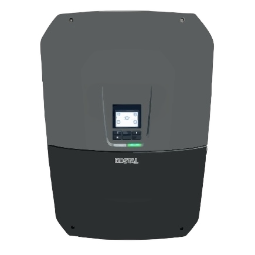
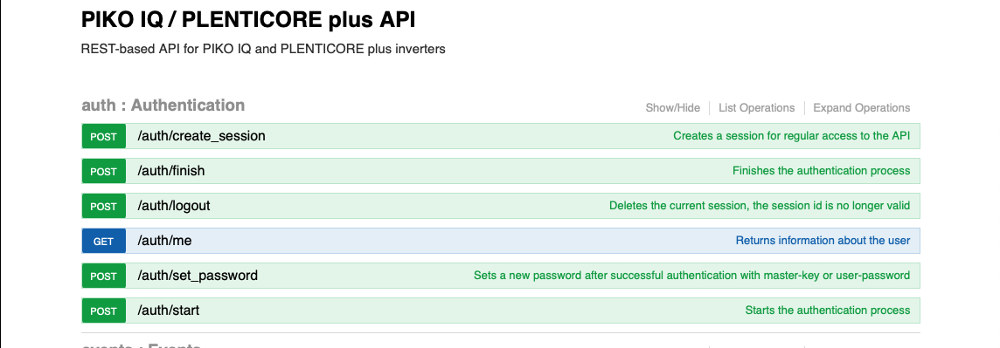

    

# ioBroker.plenticore-g3

**Tests:** 

## plenticore-g3 adapter for ioBroker

Adapter to communicate with a KOSTAL Plenticore (various models, see section below) via REST API. This API is much more powerful than modbus. It gives access to approximately 200 read-only data points referred to as 'processdata' and about 250 writable settings. This API is documented on this URL: 

http://\<plenticore host>/api/v1

    
    

This adapter uses 'Process Data' and 'Settings' of the REST API. Because no user needs all the data available, the adapter has only a very small number of preset processdata and settings but gives the user the option to select additional data points from a list of all availabe process data and settings, respectively.

    

You can also add your own descriptions to optional data points that will show up as descriptions in iobroker's object tree. In most cases the purpose of a data point can be derived by its name. For example 'devices:local/HomeBat_P' represents the power home uses from the battery.

### Naming

Native objects are comprised of a module ID and a data ID, for example 'scb:statistic:EnergyFlow/Statistic:Yield:Day'. The part before the slash is the module ID. In this case 'scb:statistic:EnergyFlow'. In iobroker's object tree a folder structure will be created for the modules ID:
  scb   &emsp; statistics   &emsp; &emsp;  EnergyFlow  

Colons in the data ID are replaced by an underscore:
  'Statistic:Yield:Day' will become 'Statistic_Yield_Day'

## Supported / tested Plenticore models

Despite what the name of the adapter may suggest (that only G3 models are supported), other models are supported too. The API seems to be equal, only the available datapoints may differ. Below is a list of models that were successfully tested by users.
- Plenticore G3
- Plenticore plus 10 (G1) - FW Version 01.30.12092
- Plenticore BI 10/26 (G2) - FW Version 02.15.19562

## Changelog
### 1.0.0 (2026-05-12)
- (copilot) Adapter requires node.js >= 22 now
- update dependencies
- reduce number of retries on init

### 0.5.3 (2026-04-02)
- update dependencies
- fix notification, only send notification about firmware updates every 14 days

### 0.5.2 (2026-01-04)
- fix skipping optionals that have become preselected
- fix not showing settings for battery when present
- update dependencies

### 0.5.1 (2025-11-20)
- bump some packages
- split react bundle
- fix unhandled exception when polling inverter state
- fix missing description of preselected values (former optionals)

### 0.5.0 (2025-10-29)
- make API-Call timeout configurable
- update translations

[Older changelogs can be found there](CHANGELOG_OLD.md)## License
MIT License

Copyright (c) 2025-2026 fernetmenta <fernetmenta@online.de>

Permission is hereby granted, free of charge, to any person obtaining a copy
of this software and associated documentation files (the "Software"), to deal
in the Software without restriction, including without limitation the rights
to use, copy, modify, merge, publish, distribute, sublicense, and/or sell
copies of the Software, and to permit persons to whom the Software is
furnished to do so, subject to the following conditions:

The above copyright notice and this permission notice shall be included in all
copies or substantial portions of the Software.

THE SOFTWARE IS PROVIDED "AS IS", WITHOUT WARRANTY OF ANY KIND, EXPRESS OR
IMPLIED, INCLUDING BUT NOT LIMITED TO THE WARRANTIES OF MERCHANTABILITY,
FITNESS FOR A PARTICULAR PURPOSE AND NONINFRINGEMENT. IN NO EVENT SHALL THE
AUTHORS OR COPYRIGHT HOLDERS BE LIABLE FOR ANY CLAIM, DAMAGES OR OTHER
LIABILITY, WHETHER IN AN ACTION OF CONTRACT, TORT OR OTHERWISE, ARISING FROM,
OUT OF OR IN CONNECTION WITH THE SOFTWARE OR THE USE OR OTHER DEALINGS IN THE
SOFTWARE.