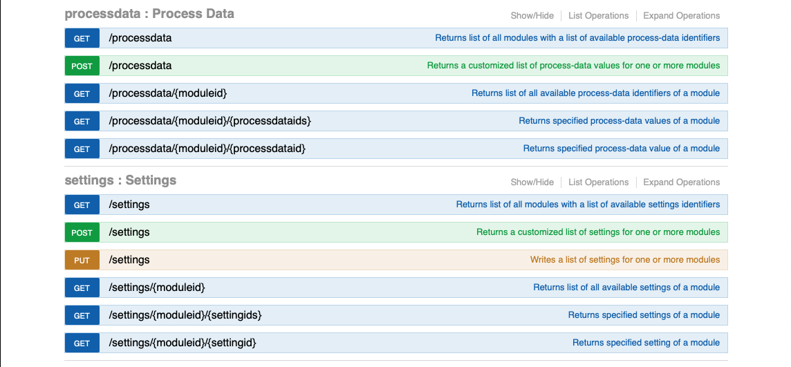

    

# ioBroker.plenticore-g3

**Tests:** 

## plenticore-g3 adapter for ioBroker

Adapter to communicate with a KOSTAL Plenticore plus via REST API. This API ist much more powerful than modbus. It gives access to approximately 200 read-only data points referred to as 'processdata' and about 250 writable settings. This API is documented on this URL: 

http://\<plenticore host>/api/v1

    
    

This adapter uses 'Process Data' and 'Settings' of the REST API. Because no user needs all the data available, the adapter has only a very small number of preset processdata and settings but gives the user the option to select additional data points from a list of all availabe process data and settings, respectively.

    

You can also add your own descriptions to optional data points that will show up as descriptions in iobroker's object tree. In most cases the purpose of a data point can be derived by its name. For example 'devices:local/HomeBat_P' represents the power home uses from the battery.

### Naming

Native objects are comprised of a module ID and a data ID, for example 'scb:statistic:EnergyFlow/Statistic:Yield:Day'. The part before the slash is the module ID. In this case 'scb:statistic:EnergyFlow'. In iobroker's object tree a folder structure will be created for the modules ID:
  scb   &emsp; statistics   &emsp; &emsp;  EnergyFlow  

Colons in the data ID are replaced by an underscore:
  'Statistic:Yield:Day' will become 'Statistic_Yield_Day'

## Changelog
### 0.1.1 (2025-04-07)

- fix object hierarchy
- fix missing translations, adjust translations based on system language
- fix state roles

### 0.1.0 (2025-03-29)

- add notification on available updates
- make sure init completes without errors

### 0.0.8 (2025-03-28)

- fix writing of settings after 0.0.7
- fix crash after failed API requests

### 0.0.7 (2025-03-26)

- replace ':' by '_' in object IDs
- delete unused objects and channels

### 0.0.6 (2025-03-14)

-   fix repo url in package.json

### 0.0.5 (2025-03-14)

-   avoid potential issues: js-controller >= 7.0.6

### 0.0.4 (2025-03-14) 0.0.4

-   prepare for iobroker repo

### 0.0.4-beta.1 (2025-03-14) beta 1 with translations

-   update translations

### 0.0.4-beta.0 (2025-03-13) beta 1

-   exclude react from test:js
-   terminate on authentication issue (fix)
-   add read and write for settings

### 0.0.3-alpha.1 (2025-03-10)

-   eslint
-   remove node 18.x from github workflow

### 0.0.3-alpha.0 (2025-03-10)

-   Did some changes
-   Did some more changes

### v0.0.1 (2025-03-10)

Initial release

## License
MIT License

Copyright (c) 2025 fernetmenta <fernetmenta@online.de>

Permission is hereby granted, free of charge, to any person obtaining a copy
of this software and associated documentation files (the "Software"), to deal
in the Software without restriction, including without limitation the rights
to use, copy, modify, merge, publish, distribute, sublicense, and/or sell
copies of the Software, and to permit persons to whom the Software is
furnished to do so, subject to the following conditions:

The above copyright notice and this permission notice shall be included in all
copies or substantial portions of the Software.

THE SOFTWARE IS PROVIDED "AS IS", WITHOUT WARRANTY OF ANY KIND, EXPRESS OR
IMPLIED, INCLUDING BUT NOT LIMITED TO THE WARRANTIES OF MERCHANTABILITY,
FITNESS FOR A PARTICULAR PURPOSE AND NONINFRINGEMENT. IN NO EVENT SHALL THE
AUTHORS OR COPYRIGHT HOLDERS BE LIABLE FOR ANY CLAIM, DAMAGES OR OTHER
LIABILITY, WHETHER IN AN ACTION OF CONTRACT, TORT OR OTHERWISE, ARISING FROM,
OUT OF OR IN CONNECTION WITH THE SOFTWARE OR THE USE OR OTHER DEALINGS IN THE
SOFTWARE.