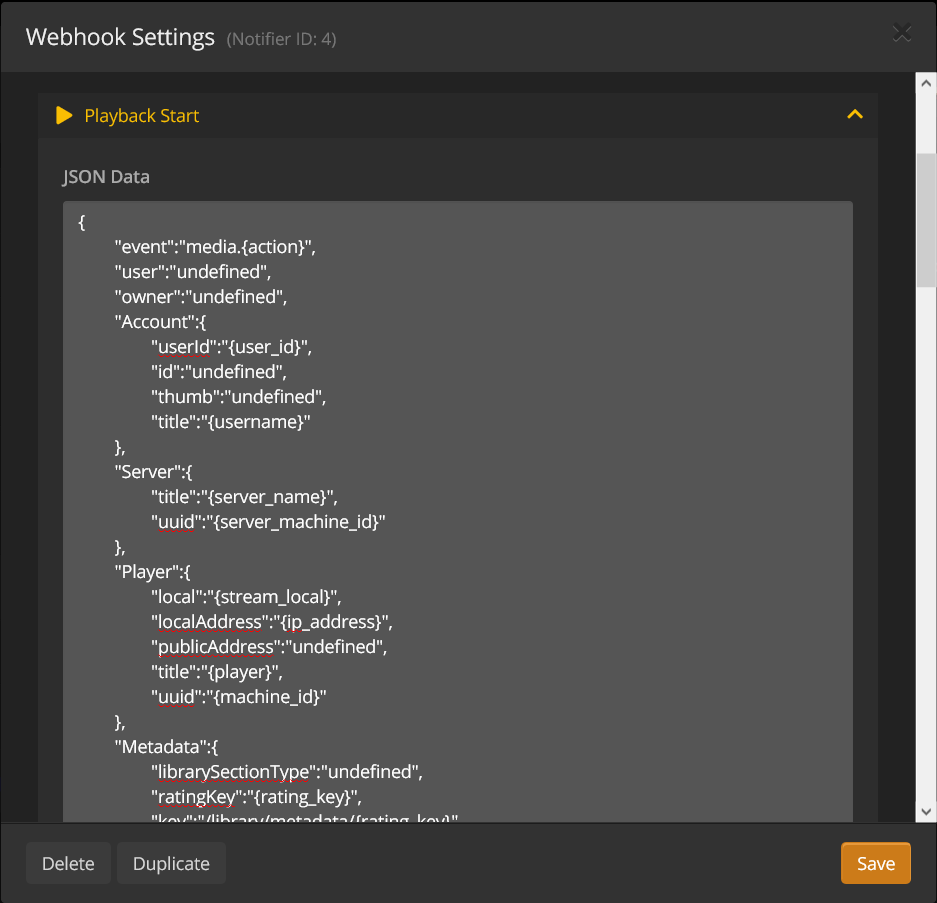

## Notification configuration
__Note:__ The JSON data is highly customizable and can be changed to any data you wish, see [the list of available parameters](#list-of-available-parameters) for the full list of possibilities.
The JSON data specified in the notifications (see below) will be send to ioBroker and put into states.

### Playback Start / Stop / Pause / Resume
__Note:__ As stated above the JSON data is highly customizable and can be changed to any data you wish. __Please be aware__, that the notification types for ```Playback Start```, ```Stop```, ```Resume``` and ```Pause``` __require at least__ ```{"Player": {"title": "{player}", "uuid": "{machine_id}"}``` (to identify the Player) in order to work correctly.

You may copy the following example into Tautulli to have a full detailed payload retrieved.


```
{
	"event":"media.{action}",
	"user":"undefined",
	"owner":"undefined",
	"Account":{
		"userId":"{user_id}",
		"id":"undefined",
		"thumb":"undefined",
		"title":"{username}"
	},
	"Server":{
		"title":"{server_name}",
		"uuid":"{server_machine_id}"
	},
	"Player":{
		"local":"{stream_local}",
		"localAddress":"{ip_address}",
		"publicAddress":"undefined",
		"title":"{player}",
		"uuid":"{machine_id}"
	},
	"Metadata":{
		"librarySectionType":"{media_type}",
		"ratingKey":"{rating_key}",
		"parentRatingKey":"{parent_rating_key}",
		"grandparentRatingKey":"{grandparent_rating_key}",
		"key":"/library/metadata/{rating_key}",
		"guid":"com.plexapp.agents.imdb://{imdb_id}?lang=en",
		"librarySectionTitle":"{library_name}",
		"librarySectionID":"{section_id}",
		"librarySectionKey":"/library/sections/{section_id}",
		"studio":"{studio}",
		"type":"{media_type}",
		"title":"{title}",
		"grandparentTitle":"<show>{show_name}</show><artist>{artist_name}</artist>",
		"parentTitle":"<show>{show_name}</show><artist>{artist_name}</artist>",
		"titleSort":"undefined",
		"contentRating":"{content_rating}",
		"summary":"{summary}",
		"rating":"{rating}",
	  	"viewOffset":"undefined",
		"lastViewedAt":"{last_viewed_date}",
		"year":"{year}",
		"tagline":"{tagline}",
		"thumb":"<movie>{thumb}</movie><show>{grandparent_thumb}</show><season>{grandparent_thumb}</season><episode>{grandparent_thumb}</episode><artist>{grandparent_thumb}</artist><album>{grandparent_thumb}</album><track>{grandparent_thumb}</track>",
		"parentThumb":"{parent_thumb}",
		"grandparentThumb":"{grandparent_thumb}",
		"posterThumb":"{poster_thumb}",
		"art":"undefined",
		"duration":"{duration}",
		"originallyAvailableAt":"{release_date}",
		"addedAt":"{added_date}",
		"updatedAt":"{updated_date}",
		"chapterSource":"undefined",
		"primaryExtraKey":"undefined",
		"ratingImage":"imdb://image.rating",
		"Genre":"{genres}",
		"Director":"{directors}",
		"Writer":"{writers}",
		"Country":"undefined",
		"Producer":"undefined",
		"Collection":"{collections}",
		"Role":"{actors}",
		"Similar":"undefined",
		"video": {
			"container": "{container}",
			"bitrate": "{bitrate}",
			"aspect_ratio": "{aspect_ratio}",
			"video_codec": "{video_codec}",
			"video_codec_level": "{video_codec_level}",
			"video_bitrate": "{video_bitrate}",
			"video_bit_depth": "{video_bit_depth}",
			"video_framerate": "{video_framerate}",
			"video_ref_frames": "{video_ref_frames}",
			"video_resolution": "{video_resolution}",
			"video_height": "{video_height}",
			"video_width": "{video_width}",
			"video_language": "{video_language}",
			"video_language_code": "{video_language_code}"
		},
		"audio": {
			"audio_bitrate": "{audio_bitrate}",
			"audio_bitrate_mode": "{audio_bitrate_mode}",
			"audio_codec": "{audio_codec}",
			"audio_channels": "{audio_channels}",
			"audio_channel_layout": "{audio_channel_layout}",
			"audio_sample_rate": "{audio_sample_rate}",
			"audio_language": "{audio_language}",
			"audio_language_code": "{audio_language_code}"
		},
		"subtitles": {
			"subtitle_codec": "{subtitle_codec}",
			"subtitle_container": "{subtitle_container}",
			"subtitle_format": "{subtitle_format}",
			"subtitle_forced": "{subtitle_forced}",
			"subtitle_location": "{subtitle_location}",
			"subtitle_language": "{subtitle_language}",
			"subtitle_language_code": "{subtitle_language_code}"
		},
		"file": {
			"path": "{file}",
			"name": "{filename}",
			"size": "{file_size}"
		},
		"transcoding": {
			"transcode_decision": "{transcode_decision}",
			"video_decision": "{video_decision}",
			"audio_decision": "{audio_decision}",
			"subtitle_decision": "{subtitle_decision}",
			"transcode_container": "{transcode_container}",
			"transcode_video_codec": "{transcode_video_codec}",
			"transcode_video_width": "{transcode_video_width}",
			"transcode_video_height": "{transcode_video_height}",
			"transcode_audio_codec": "{transcode_audio_codec}",
			"transcode_audio_channels": "{transcode_audio_channels}",
			"transcode_hw_requested": "{transcode_hw_requested}",
			"transcode_hw_decoding": "{transcode_hw_decoding}",
			"transcode_hw_decode": "{transcode_hw_decode}",
			"transcode_hw_decode_title": "{transcode_hw_decode_title}",
			"transcode_hw_encoding": "{transcode_hw_encoding}",
			"transcode_hw_encode": "{transcode_hw_encode}",
			"transcode_hw_encode_title": "{transcode_hw_encode_title}"
		},
		"stream": {
			"user": {
				"streams": "{streams}",
				"user_streams": "{user_streams}",
				"name": "{user}",
				"user": "{username}",
				"email": "{user_email}"
			},
			"player": {
				"device": "{device}",
				"platform": "{platform}",
				"product": "{product}",
				"player": "{player}",
				"ip_address": "{ip_address}"
			},
			"quality_profile": "{quality_profile}",
			"optimized_version": "{optimized_version}",
			"optimized_version_profile": "{optimized_version_profile}",
			"synced_version": "{synced_version}",
			"live": "{live}",
			"stream_local": "{stream_local}",
			"stream_location": "{stream_location}",
			"stream_bandwidth": "{stream_bandwidth}",
			"stream_container": "{stream_container}",
			"stream_bitrate": "{stream_bitrate}",
			"stream_aspect_ratio": "{stream_aspect_ratio}",
			"stream_duration": "{stream_duration}",
			"stream_time": "{stream_time}",
			"remaining_duration": "{remaining_duration}",
			"remaining_time": "{remaining_time}",
			"progress_duration": "{progress_duration}",
			"progress_time": "{progress_time}",
			"progress_percent": "{progress_percent}",
			"stream_video": {
				"stream_video_codec": "{stream_video_codec}",
				"stream_video_codec_level": "{stream_video_codec_level}",
				"stream_video_bitrate": "{stream_video_bitrate}",
				"stream_video_bit_depth": "{stream_video_bit_depth}",
				"stream_video_framerate": "{stream_video_framerate}",
				"stream_video_ref_frames": "{stream_video_ref_frames}",
				"stream_video_resolution": "{stream_video_resolution}",
				"stream_video_height": "{stream_video_height}",
				"stream_video_width": "{stream_video_width}",
				"stream_video_language": "{stream_video_language}",
				"stream_video_language_code": "{stream_video_language_code}"
			},
			"stream_audio": {
				"stream_audio_bitrate": "{stream_audio_bitrate}",
				"stream_audio_bitrate_mode": "{stream_audio_bitrate_mode}",
				"stream_audio_codec": "{stream_audio_codec}",
				"stream_audio_channels": "{stream_audio_channels}",
				"stream_audio_channel_layout": "{stream_audio_channel_layout}",
				"stream_audio_sample_rate": "{stream_audio_sample_rate}",
				"stream_audio_language": "{stream_audio_language}",
				"stream_audio_language_code": "{stream_audio_language_code}"
			},
			"stream_subtitle": {
				"stream_subtitle_codec": "{stream_subtitle_codec}",
				"stream_subtitle_container": "{stream_subtitle_container}",
				"stream_subtitle_format": "{stream_subtitle_format}",
				"stream_subtitle_forced": "{stream_subtitle_forced}",
				"stream_subtitle_language": "{stream_subtitle_language}",
				"stream_subtitle_language_code": "{stream_subtitle_language_code}",
				"stream_subtitle_location": "{stream_subtitle_location}"
			}
		}
	}
}
```

### Transcode Decision Change
This notification is __not__ recommended to use.
```
{
	"event":"{action}"
}
```

### Watched
```
{
	"event":"media.scrobble",
	"Metadata":{
		"title":"{title}",
		"librarySectionTitle":"{library_name}"
	}
}
```

### Buffer Warning
This notification is __not__ recommended to use.
```
{
	"event":"{action}"
}
```

### User Concurrent Streams
```
{
	"event":"{action}"
}
```

### User New Device
```
{
	"event":"device.new"
}
```

### Recently Added
```
{
	"event":"library.new",
	"Metadata":{
		"title":"{title}",
		"librarySectionTitle":"{library_name}"
	}
}
```

### Plex Server Down
```
{
	"event":"{action}"
}
```

### Plex Server Back Up
```
{
	"event":"admin.database.backup"
}
```

### Plex Remote Access Down
```
{
	"event":"{action}"
}
```

### Plex Remote Access Back Up
```
{
	"event":"{action}"
}
```

### Plex Update Available
```
{
	"event":"{action}",
	"update_version":"{update_version}",
	"update_url":"{update_url}",
	"update_release_date":"{update_release_date}",
	"update_channel":"{update_channel}",
	"update_platform":"{update_platform}",
	"update_distro":"{update_distro}",
	"update_distro_build":"{update_distro_build}",
	"update_requirements":"{update_requirements}",
	"update_extra_info":"{update_extra_info}",
	"update_changelog_added":"{update_changelog_added}",
	"update_changelog_fixed":"{update_changelog_fixed}"
}
```

### Tautulli Update Available
```
{
	"event":"{action}",
	"tautulli_update_version":"{tautulli_update_version}",
	"tautulli_update_release_url":"{tautulli_update_release_url}",
	"tautulli_update_changelog":"{tautulli_update_changelog}"
}
```

## List of available parameters
### Global

| Parameter | Description |
| --------- | ----------- |
| {tautulli_version} | The current version of Tautulli. |
| {tautulli_remote} | The current git remote of Tautulli. |
| {tautulli_branch} | The current git branch of Tautulli. |
| {tautulli_commit} | The current git commit hash of Tautulli. |
| {server_name} | The name of your Plex Server. |
| {server_ip} | The connection IP address for your Plex Server. |
| {server_port} | The connection port for your Plex Server. |
| {server_url} | The connection URL for your Plex Server. |
| {server_platform} | The platform of your Plex Server. |
| {server_version} | The current version of your Plex Server. |
| {server_machine_id} | The unique identifier for your Plex Server. |
| {action} | The action that triggered the notification. |
| {current_year} | The year when the notfication is triggered. |
| {current_month} | The month when the notfication is triggered. (1 to 12) |
| {current_day} | The day when the notfication is triggered. (1 to 31) |
| {current_hour} | The hour when the notfication is triggered. (0 to 23) |
| {current_minute} | The minute when the notfication is triggered. (0 to 59) |
| {current_second} | The second when the notfication is triggered. (0 to 59) |
| {current_weekday} | The ISO weekday when the notfication is triggered. (1 (Mon) to 7 (Sun)) |
| {current_week} | The ISO week number when the notfication is triggered. (1 to 52) |
| {datestamp} | The date (in date format) when the notification is triggered. |
| {timestamp} | The time (in time format) when the notification is triggered. |
| {unixtime} | The unix timestamp when the notification is triggered. |
| {utctime} | The UTC timestamp in ISO format when the notification is triggered. |

### Stream Details

| Parameter | Description |
| --------- | ----------- |
| {streams} | The number of concurrent streams. |
| {user_streams} | The number of concurrent streams by the person streaming. |
| {user} | The friendly name of the person streaming. |
| {username} | The username of the person streaming. |
| {user_email} | The email address of the person streaming. |
| {device} | The type of client device being used for playback. |
| {platform} | The type of client platform being used for playback. |
| {product} | The type of client product being used for playback. |
| {player} | The name of the player being used for playback. |
| {ip_address} | The IP address of the device being used for playback. |
| {stream_duration} | The duration (in minutes) for the stream. |
| {stream_time} | The duration (in time format) of the stream. |
| {remaining_duration} | The remaining duration (in minutes) of the stream. |
| {remaining_time} | The remaining duration (in time format) of the stream. |
| {progress_duration} | The last reported offset (in minutes) of the stream. |
| {progress_time} | The last reported offset (in time format) of the stream. |
| {progress_percent} | The last reported progress percent of the stream. |
| {transcode_decision} | The transcode decisions of the stream. |
| {video_decision} | The video transcode decisions of the stream. |
| {audio_decision} | The audio transcode decisions of the stream. |
| {subtitle_decision} | The subtitle transcode decisions of the stream. |
| {quality_profile} | The Plex quality profile of the stream. (e.g. Original, 4 Mbps 720p, etc.) |
| {optimized_version} | If the stream is an optimized version. (0 or 1) |
| {optimized_version_profile} | The optimized version profile of the stream. |
| {synced_version} | If the stream is an synced version. (0 or 1) |
| {live} | If the stream is live TV. (0 or 1) |
| {stream_local} | If the stream is local. (0 or 1) |
| {stream_location} | The network location of the stream. (lan or wan) |
| {stream_bandwidth} | The required bandwidth (in kbps) of the stream. (not the used bandwidth) |
| {stream_container} | The media container of the stream. |
| {stream_bitrate} | The bitrate (in kbps) of the stream. |
| {stream_aspect_ratio} | The aspect ratio of the stream. |
| {stream_video_codec} | The video codec of the stream. |
| {stream_video_codec_level} | The video codec level of the stream. |
| {stream_video_bitrate} | The video bitrate (in kbps) of the stream. |
| {stream_video_bit_depth} | The video bit depth of the stream. |
| {stream_video_framerate} | The video framerate of the stream. |
| {stream_video_ref_frames} | The video reference frames of the stream. |
| {stream_video_resolution} | The video resolution of the stream. |
| {stream_video_height} | The video height of the stream. |
| {stream_video_width} | The video width of the stream. |
| {stream_video_language} | The video language of the stream. |
| {stream_video_language_code} | The video language code of the stream. |
| {stream_audio_bitrate} | The audio bitrate of the stream. |
| {stream_audio_bitrate_mode} | The audio bitrate mode of the stream. (cbr or vbr) |
| {stream_audio_codec} | The audio codec of the stream. |
| {stream_audio_channels} | The audio channels of the stream. |
| {stream_audio_channel_layout} | The audio channel layout of the stream. |
| {stream_audio_sample_rate} | The audio sample rate (in Hz) of the stream. |
| {stream_audio_language} | The audio language of the stream. |
| {stream_audio_language_code} | The audio language code of the stream. |
| {stream_subtitle_codec} | The subtitle codec of the stream. |
| {stream_subtitle_container} | The subtitle container of the stream. |
| {stream_subtitle_format} | The subtitle format of the stream. |
| {stream_subtitle_forced} | If the subtitles are forced. (0 or 1) |
| {stream_subtitle_language} | The subtitle language of the stream. |
| {stream_subtitle_language_code} | The subtitle language code of the stream. |
| {stream_subtitle_location} | The subtitle location of the stream. |
| {transcode_container} | The media container of the transcoded stream. |
| {transcode_video_codec} | The video codec of the transcoded stream. |
| {transcode_video_width} | The video width of the transcoded stream. |
| {transcode_video_height} | The video height of the transcoded stream. |
| {transcode_audio_codec} | The audio codec of the transcoded stream. |
| {transcode_audio_channels} | The audio channels of the transcoded stream. |
| {transcode_hw_requested} | If hardware decoding/encoding was requested. (0 or 1) |
| {transcode_hw_decoding} | If hardware decoding is used. (0 or 1) |
| {transcode_hw_decode} | The hardware decoding codec. |
| {transcode_hw_decode_title} | The hardware decoding codec title. |
| {transcode_hw_encoding} | If hardware encoding is used. (0 or 1) |
| {transcode_hw_encode} | The hardware encoding codec. |
| {transcode_hw_encode_title} | The hardware encoding codec title. |
| {session_key} | The unique identifier for the session. |
| {transcode_key} | The unique identifier for the transcode session. |
| {session_id} | The unique identifier for the stream. |
| {user_id} | The unique identifier for the user. |
| {machine_id} | The unique identifier for the player. |

### Source Metadata Details

| Parameter | Description |
| --------- | ----------- |
| {media_type} | The type of media. (movie, show, season, episode, artist, album, track, clip) |
| {title} | The full title of the item. |
| {library_name} | The library name of the item. |
| {show_name} | The title of the TV series. |
| {episode_name} | The title of the episode. |
| {artist_name} | The name of the artist. |
| {album_name} | The title of the album. |
| {track_name} | The title of the track. |
| {track_artist} | The name of the artist of the track. |
| {season_num} | The season number. (e.g. 1, or 1-3) |
| {season_num00} | The two digit season number. (e.g. 01, or 01-03) |
| {episode_num} | The episode number. (e.g. 6, or 6-10) |
| {episode_num00} | The two digit episode number. (e.g. 06, or 06-10) |
| {track_num} | The track number. (e.g. 4, or 4-10) |
| {track_num00} | The two digit track number. (e.g. 04, or 04-10) |
| {season_count} | The number of seasons. |
| {episode_count} | The number of episodes. |
| {album_count} | The number of albums. |
| {track_count} | The number of tracks. |
| {year} | The release year for the item. |
| {release_date} | The release date (in date format) for the item. |
| {air_date} | The air date (in date format) for the item. |
| {added_date} | The date (in date format) the item was added to Plex. |
| {updated_date} | The date (in date format) the item was updated on Plex. |
| {last_viewed_date} | The date (in date format) the item was last viewed on Plex. |
| {studio} | The studio for the item. |
| {content_rating} | The content rating for the item. (e.g. TV-MA, TV-PG, etc.) |
| {directors} | A list of directors for the item. |
| {writers} | A list of writers for the item. |
| {actors} | A list of actors for the item. |
| {genres} | A list of genres for the item. |
| {labels} | A list of labels for the item. |
| {collections} | A list of collections for the item. |
| {summary} | A short plot summary for the item. |
| {tagline} | A tagline for the media item. |
| {rating} | The rating (out of 10) for the item. |
| {critic_rating} | The critic rating (%) for the item. (Ratings source must be Rotten Tomatoes for the Plex Movie agent) |
| {audience_rating} | The audience rating (%) for the item. (Ratings source must be Rotten Tomatoes for the Plex Movie agent) |
| {duration} | The duration (in minutes) for the item. |
| {poster_url} | A URL for the movie, TV show, or album poster. |
| {plex_url} | The Plex URL to your server for the item. |
| {imdb_id} | The IMDB ID for the movie. (e.g. tt2488496) |
| {imdb_url} | The IMDB URL for the movie. |
| {thetvdb_id} | The TVDB ID for the TV show. (e.g. 121361) |
| {thetvdb_url} | The TVDB URL for the TV show. |
| {themoviedb_id} | The TMDb ID for the movie or TV show. (e.g. 15260) |
| {themoviedb_url} | The TMDb URL for the movie or TV show. |
| {tvmaze_id} | The TVmaze ID for the TV show. (e.g. 290) |
| {tvmaze_url} | The TVmaze URL for the TV show. |
| {lastfm_url} | The Last.fm URL for the album. |
| {trakt_url} | The trakt.tv URL for the movie or TV show. |
| {container} | The media container of the original media. |
| {bitrate} | The bitrate of the original media. |
| {aspect_ratio} | The aspect ratio of the original media. |
| {video_codec} | The video codec of the original media. |
| {video_codec_level} | The video codec level of the original media. |
| {video_bitrate} | The video bitrate of the original media. |
| {video_bit_depth} | The video bit depth of the original media. |
| {video_framerate} | The video framerate of the original media. |
| {video_ref_frames} | The video reference frames of the original media. |
| {video_resolution} | The video resolution of the original media. |
| {video_height} | The video height of the original media. |
| {video_width} | The video width of the original media. |
| {video_language} | The video language of the original media. |
| {video_language_code} | The video language code of the original media. |
| {audio_bitrate} | The audio bitrate of the original media. |
| {audio_bitrate_mode} | The audio bitrate mode of the original media. (cbr or vbr) |
| {audio_codec} | The audio codec of the original media. |
| {audio_channels} | The audio channels of the original media. |
| {audio_channel_layout} | The audio channel layout of the original media. |
| {audio_sample_rate} | The audio sample rate (in Hz) of the original media. |
| {audio_language} | The audio language of the original media. |
| {audio_language_code} | The audio language code of the original media. |
| {subtitle_codec} | The subtitle codec of the original media. |
| {subtitle_container} | The subtitle container of the original media. |
| {subtitle_format} | The subtitle format of the original media. |
| {subtitle_forced} | If the subtitles are forced. (0 or 1) |
| {subtitle_location} | The subtitle location of the original media. |
| {subtitle_language} | The subtitle language of the original media. |
| {subtitle_language_code} | The subtitle language code of the original media. |
| {file} | The file path to the item. |
| {filename} | The file name of the item. |
| {file_size} | The file size of the item. |
| {section_id} | The unique identifier for the library. |
| {rating_key} | The unique identifier for the movie, episode, or track. |
| {parent_rating_key} | The unique identifier for the season or album. |
| {grandparent_rating_key} | The unique identifier for the TV show or artist. |
| {thumb} | The Plex thumbnail for the movie or episode. |
| {parent_thumb} | The Plex thumbnail for the season or album. |
| {grandparent_thumb} | The Plex thumbnail for the TV show or artist. |
| {poster_thumb} | The Plex thumbnail for the poster image. |
| {poster_title} | The title for the poster image. |
| {indexes} | If the media has video preview thumbnails. (0 or 1) |

### Pex Update Available

| Parameter | Description |
| --------- | ----------- |
| {update_version} | The available update version for your Plex Server. |
| {update_url} | The download URL for the available update. |
| {update_release_date} | The release date of the available update. |
| {update_channel} | The update channel. (Public or Plex Pass) |
| {update_platform} | The platform of your Plex Server. |
| {update_distro} | The distro of your Plex Server. |
| {update_distro_build} | The distro build of your Plex Server. |
| {update_requirements} | The requirements for the available update. |
| {update_extra_info} | Any extra info for the available update. |
| {update_changelog_added} | The added changelog for the available update. |
| {update_changelog_fixed} | The fixed changelog for the available update. |

### Tautulli Update Available

| Parameter | Description |
| --------- | ----------- |
| {tautulli_update_version} | The available update version for Tautulli. |
| {tautulli_update_release_url} | The release page URL on GitHub. |
| {tautulli_update_tar} | The tar download URL for the available update. |
| {tautulli_update_zip} | The zip download URL for the available update. |
| {tautulli_update_commit} | The commit hash for the available update. |
| {tautulli_update_behind} | The number of commits behind for the available update. |
| {tautulli_update_changelog} | The changelog for the available update. |