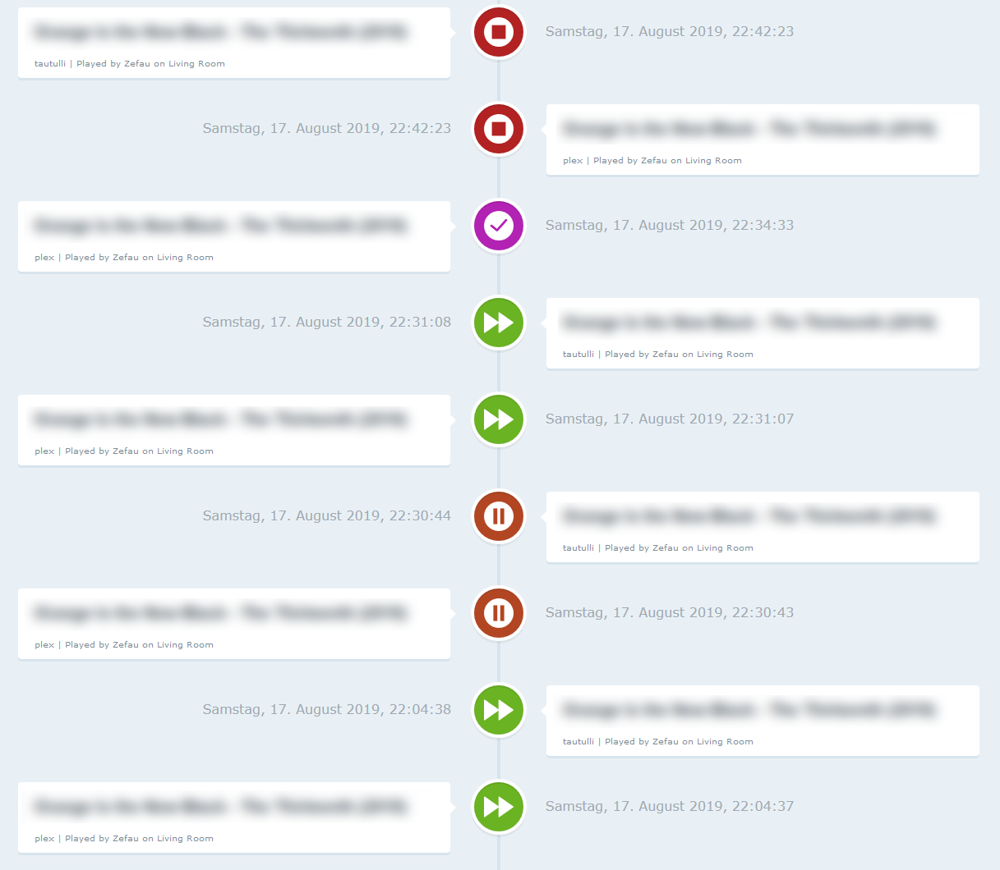
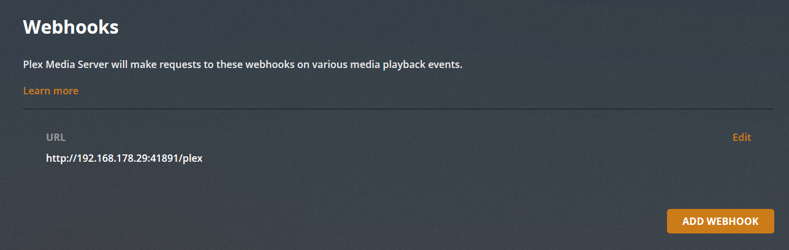
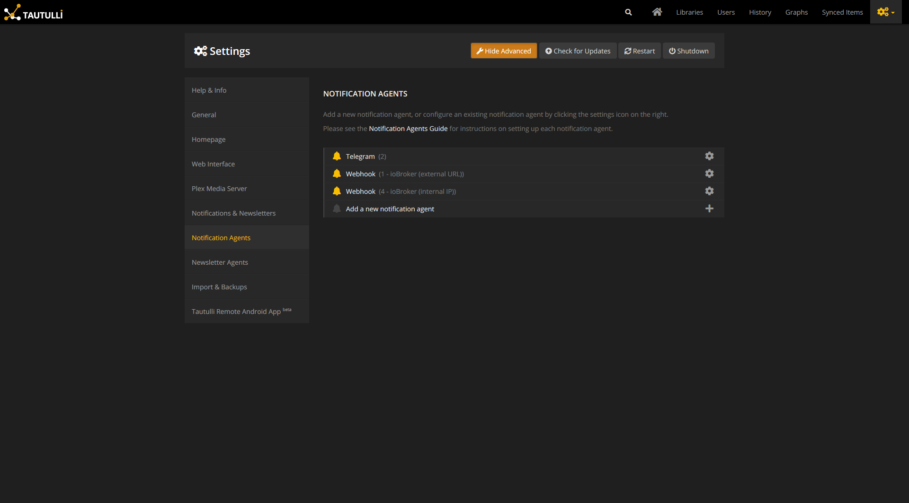
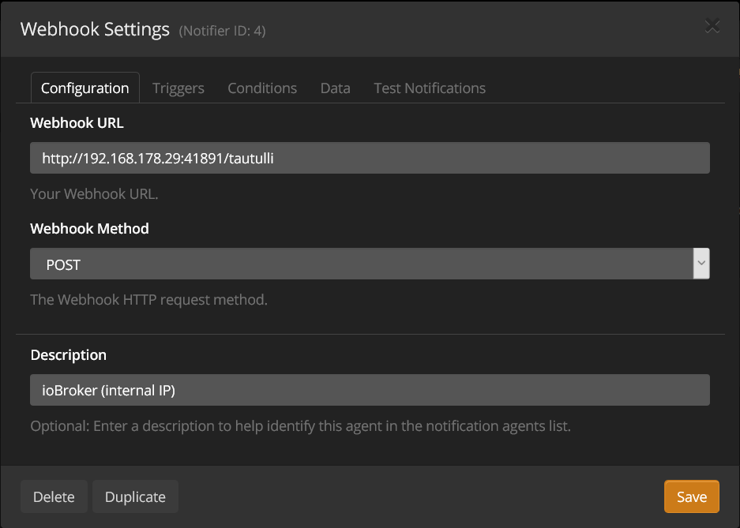
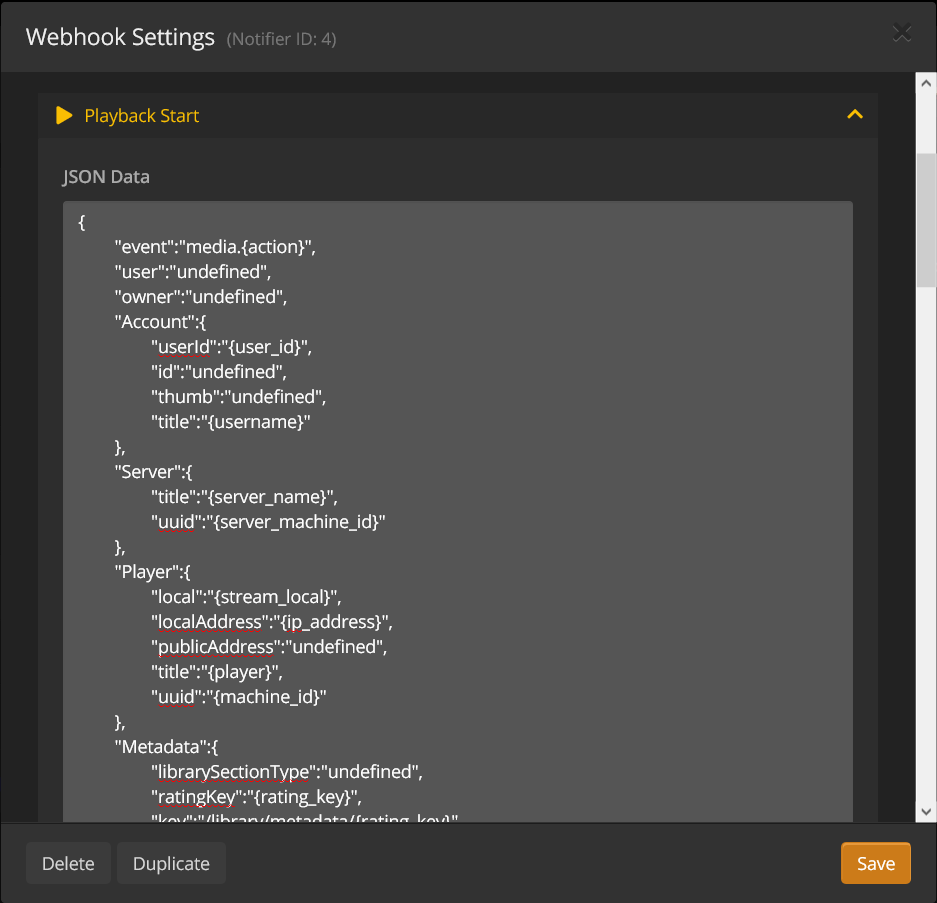
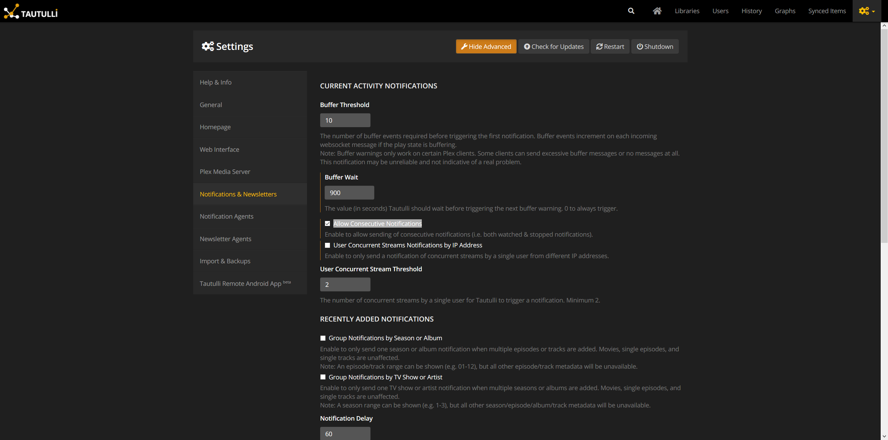
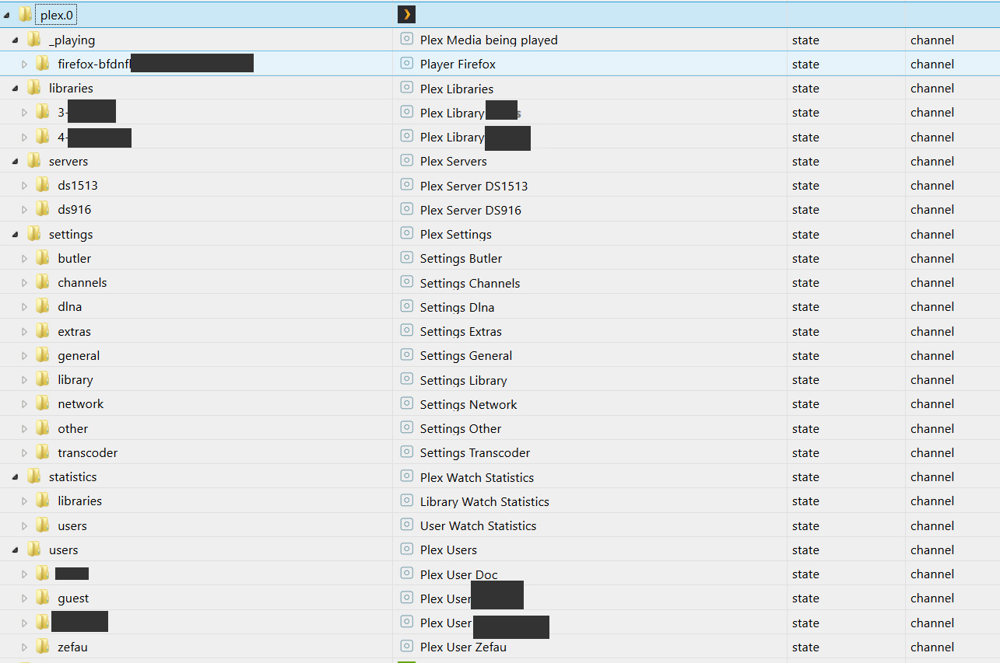

# ioBroker.plex
Integration of the Plex Media Server in ioBroker (with or without Plex Pass). Furthermore, Tautulli integration.


[](https://www.npmjs.com/package/iobroker.plex)
[](https://github.com/iobroker-community-adapters/ioBroker.plex/releases/latest)
[](https://www.npmjs.com/package/iobroker.plex)
[](https://weblate.iobroker.net/engage/adapters/?utm_source=widget)


**Table of contents**
1. [Features](#1-features)
2. [Setup instructions](#2-setup-instructions)
   1. [Basic setup](#21-basic-setup)
   2. [Advanced Setup](#22-advanced-setup-plex-pass-or-tautulli)
3. [Channels & States](#3-channels--states)
   1. [with Basic Setup](#31-with-basis-setup)
   2. [with Advanced Setup](#32-with-advanced-setup)
4. [Changelog](#changelog)
5. [Licence](#license)


## 1. Features
- Receive detailed media information about the current played media item (such as video bitrate, codec, subtitle information, audio; see [Advanced setup](https://github.com/iobroker-community-adapters/ioBroker.plex/blob/master/README-states.md#with-advanced-setup) for a full list)
- Receive `events` from Plex (via [Plex Webhook](https://support.plex.tv/articles/115002267687-webhooks/#toc-0) and [Plex Notifications](https://support.plex.tv/articles/push-notifications/#toc-0) using Plex Pass or via Tautulli, [__see setup!__](#22-advanced-setup-plex-pass-or-tautulli))
- Playback control for players
- Retrieve `servers`
- Retrieve `libraries`
- Retrieve all items within a library
- Retrieve `users` (only with Tautulli)
- Retrieve `statistics` (only with Tautulli)
- Retrieve `playlists`
- Retrieve `settings`
- Retrieve all data from controllable clients
- Web Interface that shows the recent events from Plex:
  


## 2. Setup instructions
### 2.1. Basic Setup
For the basic setup it is required to provide the IP address (and port) of your Plex installation. Furthermore, you have to retrieve a dedicated token for the adapter to retrieve data from Plex.

Once this is given, ioBroker.plex will retrieve all the basic data (incl. Servers, Libraries). See [Channels & States](#21-with-basis-setup) for the full list of basic data.

### 2.2. Advanced Setup (Plex Pass or Tautulli)
#### 2.2.1. Plex Pass
__Webhook__

If you are a Plex Pass user, you may [setup a webhook](https://support.plex.tv/articles/115002267687-webhooks/#toc-0) in the Plex Settings to retrieve the current event / action from your Plex Media Server (play, pause, resume, stop, viewed and rated).

Navigate to your Plex Media Server and go to ```Settings``` and ```Webhook```. Created a new webhook by clicking ```Add Webhook``` and enter your ioBroker IP adress with the custom port specified in the ioBroker.plex settings and trailing ```/plex``` path, e.g. ```http://192.168.178.29:41891/plex```:



__Events__

For information regarding the Plex Notifications, please [see the official documentation](https://support.plex.tv/articles/push-notifications/#toc-0). To turn on Notifications on your Plex Media Server, go to `Settings` > `Server` > `General` and then enable the `Push Notifications` preference.


#### 2.2.2.Tautulli
[Tautulli is a 3rd party application](https://tautulli.com/#about) that you can run alongside your Plex Media Server to monitor activity and track various statistics. Most importantly, these statistics include what has been watched, who watched it, when and where they watched it, and how it was watched. All statistics are presented in a nice and clean interface with many tables and graphs, which makes it easy to brag about your server to everyone else. Check out [Tautulli Preview](https://tautulli.com/#preview) and [install it on your preferred system](https://github.com/Tautulli/Tautulli-Wiki/wiki/Installation) if you are interested.

This adapter connects to the [Tautulli API](https://github.com/Tautulli/Tautulli/blob/master/API.md) and also receives webhook events from Tautulli.

##### 2.2.2.1. API
Once Tautulli is installed, open the _Settings_ page from Tautulli dashboard and navigate to _Web Interface_. Scroll down to the _API_ section and make sure ```Enable API``` is checked. Copy the ```API key``` and enter it in the ioBroker.plex settings. Furthermore, add the Tautulli IP address and port to allow API communication.

##### 2.2.2.2. Webhook
###### Overview
To setup a webook using Tautulli, following the instrucutions below and make sure you have completed all 4 steps:
1. Add Notification Agent
2. Configure Webhook in Notification Agent
3. Configure Triggers in Notification Agent
4. Configure Data in Notification Agent
5. Configure Notification options

###### Description
Once installed open the settings page from Tautulli dashboard and navigate to Notification Agents as seen below:



1. Click _Add a new notification agent_ and _Webhook_.
2. Enter your ioBroker IP adress with the custom port specified in the ioBroker.plex settings and trailing ```/tautulli``` path, e.g. ```http://192.168.178.29:41891/tautulli```:
   
   
   Furthermore, choose ```POST``` for the _Webhook Method_ and enter any description you like in _Description_.
   
3. Next, go to the _Triggers_ tab, select your desired (or simply all) notification agents. An enabled notification agent will trigger an event which will then be sent to ioBroker. __Make sure__ to provide the necessary data for each of the enabled notification agent in the next step!
4. Now, __most importantly__, fill in the respective data payload in the _Data_ tab according to the __[Notification configuration found here](README-tautulli.md#notification-configuration)__.
   Copy the notification configuration of the relevant notification agents from the previous step (e.g. ```Playback Start```, ```Playback Stop```, ```Playback Pause``` and ```Playback Resume```) in each of the text boxes as shown below for ```Playback Start```:
   
   

5. Finally, check the option `Allow Consecutive Notifications` to enable to allow sending of consecutive notifications (e.g. both watched & stopped notifications):

   


## 3. Channels & States
Having both the basic and advanced setup configured, the following channels will appear (libraries, servers and users are only examples of course). See further below for [full list of channels & states](#21-with-basis-setup).



### 3.1. With Basis Setup
After sucessful basic setup the channels according to the following table will be created. For a list of all states which will be created, please [see dedicated list of states](README-states.md#with-basis-setup).

| Channel / Folder | Description |
| ------- | ----------- |
| __libraries__ | Plex Libraries |
| __servers__ | Plex Servers |
| __settings__ | Plex Settings |

### 3.2. With Advanced Setup
After sucessful advanced setup the following channels will _additionally_ be created. For a list of all states which will be created, please [see dedicated list of states](README-states.md#with-advanced-setup).

| Channel / Folder | Description | Remark |
| ---------------- | ----------- | ------ |
| __\_playing__ | Plex Media being played | with Plex Pass or Tautulli |
| __statistics__ | Plex Watch Statistics | only with Tautulli |
| __users__ | Plex Users | only with Tautulli |

## Credits

This adapter would not have been possible without the great work of @Zefau (https://github.com/Zefau), who create and maintained it until 2021 .


## Changelog
<!--
    Placeholder for the next version (at the beginning of the line):
    ### **WORK IN PROGRESS**
-->
### 2.1.0 (2026-05-13)
- (ticaki) New: server management commands — library scan, force-refresh, empty trash, analyze streams (`libraries.{id}._commands.*`).
- (ticaki) New: global maintenance buttons — refresh all libraries, clean bundles, optimize database (`maintenance.*`).
- (ticaki) New: Butler task buttons — trigger any of Plex's scheduled background tasks on demand (`butler.*`).
- (ticaki) New: per-media commands when playback starts — mark watched/unwatched, rate, refresh metadata (`_playing.*._Commands.*`).
- (ticaki) New: Plex server settings are now writable — changes are sent to the server immediately (`settings.*`).
- (ticaki) Fix: library `_refresh` button was created as non-writable channel; now correctly a writable boolean button.

### 2.0.0 (2026-05-10)
- (ticaki) **Breaking:** Data points under `_playing.*` have been restructured — existing scripts and Vis widgets need to be updated.
- (ticaki) Data retrieval from Plex Media Server reworked; which fields are populated depends on the interface used (local / Plex.tv cloud).
- (ticaki) Adapter configuration fully migrated to the modern jsonConfig format.
- (ticaki) Built-in web interface redesigned: timeline of recent events, Now Playing display, and customizable layout.
- (ticaki) Player detection improved: Plexamp, Plex iOS/Android, PlexHTPC, and newer TV apps now reliably detected.
- (ticaki) Reconnect after connection errors accelerated: progressive backoff instead of fixed wait time.
- (ticaki) Fixed: Plex iOS, Android, and Web devices no longer generate "State has no existing object" log warnings after an upgrade.
- (ticaki) Fixed: deleting a device via adapter settings now correctly clears all internal state entries.
- (ticaki) New privacy option: media link states can store a placeholder instead of the real Plex token in plain text (configurable in adapter settings, enabled by default).
- (ticaki) Adapter rewritten in TypeScript. Requires Node.js >= 22.

### 1.1.5 (2024-12-11)
- (ticaki) State _playing.*.Metadata.viewOffset is created.
- (ticaki) Dependencies updated
- (mcm1957) Adapter requires nodejs >= 18 now

### 1.1.4 (2023-11-06)
- (ticaki) move logmessage into debug

### 1.1.3 (2023-10-05)
- (ticaki) fixed: bug in readable offset

## License
The MIT License (MIT)

Copyright (c) 2023-2026 iobroker-community-adapters  
Copyright (c) 2019-2020 Zefau <zefau@mailbox.org>  


Permission is hereby granted, free of charge, to any person obtaining a copy
of this software and associated documentation files (the "Software"), to deal
in the Software without restriction, including without limitation the rights
to use, copy, modify, merge, publish, distribute, sublicense, and/or sell
copies of the Software, and to permit persons to whom the Software is
furnished to do so, subject to the following conditions:

The above copyright notice and this permission notice shall be included in
all copies or substantial portions of the Software.

THE SOFTWARE IS PROVIDED "AS IS", WITHOUT WARRANTY OF ANY KIND, EXPRESS OR
IMPLIED, INCLUDING BUT NOT LIMITED TO THE WARRANTIES OF MERCHANTABILITY,
FITNESS FOR A PARTICULAR PURPOSE AND NONINFRINGEMENT. IN NO EVENT SHALL THE
AUTHORS OR COPYRIGHT HOLDERS BE LIABLE FOR ANY CLAIM, DAMAGES OR OTHER
LIABILITY, WHETHER IN AN ACTION OF CONTRACT, TORT OR OTHERWISE, ARISING FROM,
OUT OF OR IN CONNECTION WITH THE SOFTWARE OR THE USE OR OTHER DEALINGS IN
THE SOFTWARE.
