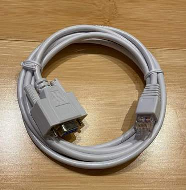
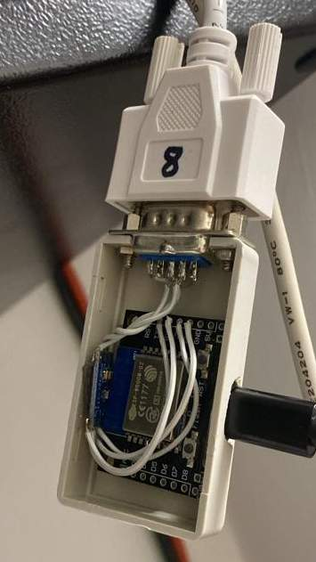
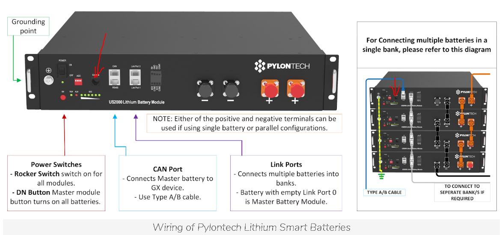

# ioBroker.pylontech

[](https://www.npmjs.com/package/iobroker.pylontech)
[](https://www.npmjs.com/package/iobroker.pylontech)


[](https://nodei.co/npm/iobroker.pylontech/)

**Tests:** 

## pylontech and pytes adapter for ioBroker

Query the cell voltages and the status of pylontech or pytes batteries via the console. I'm not affiliated.

**Please note that everything you build or connect is always your responsibility. The developer of this adapter assumes no liability for any damage!**

## how it works

This adapter is used to determine the health status and functions of a Pylontech or Pytes array, which can consist of one or up to fifteen batteries.
This adapter is not used to control the battery. This is the part of a charging and power unit or an inverter.
The batteries have a console connection that provides a RS232 or V24 interface. This adapter is connected to it via a serial interface.
The first battery provides all the data and asks the others via the uplink.
Attention, it is not possible to connect a Raspberry or ESP directly. The RS232 interfaces do not have a TTL level and are not designed for 3 volts or 5 volts. A level converter is required for connection. You will find construction instructions below.

## What is needed for connection?

A cable and a serial converter are required for connection.
A serial connection requires three lines rxd, txd and ground.

Rxd and Txd must be crossed. so that what one sends (Txd) can be received (Rxd) by the other. Ground is needed so that a voltage can be built up and an electrical current can be started.

### The serial connection cable for Pylontech

Pylontech has changed the RJ plugs on the batteries over time.
In the beginning there were was a RJ11 plugs like on the telephone. Now it is an RJ45 like on the network connection.
The following drawings show a standard nine pin D-SUB female connector on the cable.
This cable can be easily connected via the USB port with a RS232 to USB adapter or to an RS232 to LAN or WIFI converter.
Only the first battery in the array provides all information. You only need a cable and a serial port

You can assemble such a cable yourself with a [configurable plug](https://www.amazon.de/gp/product/B0C8JFWNR7). This is available with an RJ45 connector and a female D-SUB9 plug. You simply connect a patch cable to it. **But be careful to insulate the remaining cables well so that they do not touch each other. Not all batteries have the remaining pins unused.**
In principle, you can also connect an RJ11 cable to such an adapter. But I find it very wobbly and always think it doesn't make good contact.


Or ready-made cables contact in the [forum](https://forum.iobroker.net/topic/68707).



#### RJ45

| RJ45 | signal | DSUB | signal |
| ---- | ------ | ---- | ------ |
| 3    | TxD    | 2    | RxD    |
| 6    | RxD    | 3    | TxD    |
| 8    | Ground | 5    | Ground |


#### RJ11 / RJ12

The RJ11 and RJ12 connectors are the same size. The RJ11 has only four contacts, the RJ12 has six contacts. The contacts of the RJ11 are in the middle of the plug, which is why they are counted differently. Physically the contacts are in the same place.

| RJ11   | RJ12   | signal | DSUB | signal |
| ------ | ------ | ------ | ---- | ------ |
| 1 or 4 | 2 or 5 | Ground | 5    | Ground |
| 3      | 4      | TxD    | 2    | RxD    |
| 2      | 3      | RxD    | 3    | TxD    |


### The serial connection cable for Pytes

#### RJ45

| RJ45 | signal | DSUB | signal |
| ---- | ------ | ---- | ------ |
| 3    | TxD    | 2    | RxD    |
| 4    | Ground | 5    | Ground |
| 6    | RxD    | 3    | TxD    |

### There are RJ45 console cables with USB port for Cisco routers. These do not have a compatible occupancy. However, with a little experience the RJ45 plug can be replaced.

### Please note that due to the relatively high transfer rate for RS232 connections of 115200 baud, the cable cannot be particularly long.

| max. baud   | max. length |
| ----------- | ----------- |
| 2400        | 900m        |
| 4800        | 300m        |
| 9600        | 152m        |
| 19.200      | 15m         |
| 57.600      | 5m          |
| **115.200** | **2m**      |

If there is no USB port nearby, you can build a serial to WiFi adapter with an ESP.

These adapters speak a kind of Telnet and essentially extend the serial interface through the WiFi. Here it is important to install a driver module for the serial interface. E.g. the MAX3232. Please pay attention to the voltages but most of them are 3V.

#### Raspi with MAX

Since the Raspberry also offers a TTL interface with 3V, you can also connect a MAX3232 here.


read more http://www.savagehomeautomation.com/projects/raspberry-pi-rs232-serial-interface-options-revisit.html

#### Find the port on Linux (Debian / Raspi)

Under Linux it is possible to set a link to the port on which the USB-serial converter is connected.
It is then possible to assign descriptive names to the devices.

```
$ ls -l /dev
crw-rw---- 1 root dialout 188,     0 29. Sep 21:32 ttyUSB0
lrwxrwxrwx 1 root root             7 29. Sep 21:32 ttyUSB_pylontech -> ttyUSB0
```

The serial number can be determined for this if the USB converter has it.

```
$ udevadm info -a /dev/ttyUSB0 | grep ATTRS{serial}
      ATTRS{serial}=="thisisit"
```

If there is no serial number here, you have lost. Please make sure to adapt the device ttyUSBx.

Create a new config file. Use the editor of your choice, VI is also possible.

```
sudo nano /etc/udev/rules.d/20_pylontech.rules
```

With the following content

```
# File: /etc/udev/rules.d/20_pylontech.rules
# FTDI USB <-> Serial
SUBSYSTEM=="tty", \
ATTRS{serial}=="thisisit", \
SYMLINK+="ttyUSB_pylontech"
```

Then you should restart the udev and disconnect and reconnect the device once.

```
sudo /etc/init.d/udev restart
```

#### Find the port on Linux second method

You can find a unique name for each device. It doesn't change with FTDI or something like that. This can also be entered into the adapter.

```
$ ls -l /dev/serial/by-id
lrwxrwxrwx 1 root root 13 10. Okt 11:37 usb-ftdi_usb_serial_converter_ftDZ0DGP-if00-port0 -> ../../ttyUSB0
```

so the device is `/dev/serial/by-id/usb-ftdi_usb_serial_converter_ftDZ0DGP-if00-port0`

### com over tcp

Instead of local connect:

```
+--------+   comport  +----------+
| DEVICE | ~~~~~~~~~~ | ioBroker |
+--------+            +----------+
```

Does this adapter also support network connect:

```
+--------+   comport  +--------+       network        +----------+
| DEVICE | ~~~~~~~~~~ | SERVER |========....==========| ioBroker |
+--------+            +--------+                      +----------+
```

#### ESP with MAX

There are several projects that connect ESP or ESP32 to Telnet. Please remember the MAX. If the MAX gets hot then either the signal level of 5V is too high because you got a 3.3V model or you have connected a 3.3V version to 5V operating voltage.



Here are some examples:

ESP-LINK: https://github.com/jeelabs/esp-link

ESP-Serial-Bridge: https://github.com/yuri-rage/ESP-Serial-Bridge

Serial Port Over WiFi: https://www.instructables.com/Serial-Port-Over-WiFi/

Tasmota Caused problems because blocks were not transferred in order and should therefore not be used at the moment: https://tasmota.github.io/docs/Serial-to-TCP-Bridge/

Only the following or self-compiled ones can be used as bin, otherwise the TCP server is not included:

- http://ota.tasmota.com/tasmota32/release/tasmota32-zbbrdgpro.bin
- http://ota.tasmota.com/tasmota/release/tasmota-zbbrdgpro.bin

The Gipos must be set beforehand. One each on TCP Rx and TCP Tx.

```
TCPBaudRate 115200
TCPStart 23
Rule1 ON System#Boot do TCPStart 23 endon
Rule1 1
```

It works because a transparent TCP server is provided on, for example, port 23. The port can be selected, simply exchange 23 for 9000, for example.
**And of course solder a MAX2323 between the Gipos and the RJ/DSUB plug!!!!**

#### Linux to Net

You can use ser2net to share the port of a PC or mini Raspi over the network.

```
sudo apt-get ser2net            #install
sudo vim /etc/ser2net.conf      #configure
ser2net                         #run service
```

The configuration line (for /etc/ser2net.conf) that corresponds to windows setup above

```
7000:telnet:0:/dev/ttyUSB0:115200 8DATABITS NONE 1STOPBIT remctl
```

RFC
Here are the settings of the above config. The device port is 7000.

- 7000 - port
- /dev/ttyUSB0 - name of serial port
- 115200 ... - baud rate etc (actually you can skip it because of remctl)
- remctl - means using remote port configuration as of RFC2217

More information can be found here: https://gist.github.com/DraTeots/e0c669608466470baa6c

#### Ready Hardware

There is ready-made hardware that can be connected via wifi and/or lan. As long as it uses a transparent TCP server it should work.

Example:

- Waveshare RS232/485 TO ETH (for EU)

## Anyway, you can also contact me in the ioBroker forum via PM if you need anything.

Another tip: there are cheap and expensive USB serial converters. Converters with CHxxx PLxxx and CPxxx in the name have no identifying features. If you connect two of them and then swap the ports or boot for the first time, you no longer know who is who. Therefore it is better to take the good ones with FTDI and serial number. There are also good serial converters without an FTDI chip that have a serial number.

### Tested hardware

I'm still at the beginning.
What was tested:

#### RS232 to ioBroker

| Communication hardware              | Type    | Is working | Comments                                                                                                                                                                                                                                                          |
| ----------------------------------- | ------- | ---------- | ----------------------------------------------------------------------------------------------------------------------------------------------------------------------------------------------------------------------------------------------------------------- |
| Serial to USB                       | local   | yes        | There is a large selection of chips for the adapters. Depending on the model, identification problems can occur if the adapters do not have a serial number and more than one is connected. Windows already assigns one COM port for each USB plug.               |
| LogiLink AU0034                     | local   | yes        |                                                                                                                                                                                                                                                                   |
| ESP-LINK                            | network | yes        | Assign the device an IP in the network. Check transmission speed 115200 8 N 1. Everything else left unchanged. Remember to use a converter like the MAX                                                                                                           |
| Tasmota                             | network | no         | With Tasmota on an ESP8266, blocks were not transferred in the correct order, resulting in incorrect objects and data. Tasmota is therefore not recommended.                                                                                                      |
| Waveshare RS232/485 TO ETH (for EU) | network | yes        | Assign the device an IP in the network. Check transmission speed 115200 8 N 1. Everything else left unchanged. Use the RS232 SUBD Port.                                                                                                                           |
| Waveshare RS232/485/422 TO POE ETH  | network | yes        | Assign the device an IP in the network. Check transmission speed 115200 8 N 1. Everything else left unchanged. Use the RS232 SUBD Port. The converter can be supplied with power via POE. If POE is available, you do not need a power supply near the batteries. |
| Elfin EW10A                         | network | yes        | Make sure that there is enough bandwidth and signal strength on your WiFi so that the connection is stable. Check transmission speed 115200 8 N 1.                                                                                                                |
| Elfin EW10A-0                       | network | yes        | Make sure that there is enough bandwidth and signal strength on your WiFi so that the connection is stable. Check transmission speed 115200 8 N 1.                                                                                                                |
| Elfin EE10-A                        | network | yes        | Assign the device an IP in the network. Check transmission speed 115200 8 N 1. Everything else left unchanged.                                                                                                                                                    |

#### Batteries

| Pylontech model  | Model | Firmware      | Is working | Comment                                                                                                                                                     |
| ---------------- | ----- | ------------- | ---------- | ----------------------------------------------------------------------------------------------------------------------------------------------------------- |
| US5000           | US    | V1.3 22-08-10 | fine       |                                                                                                                                                             |
| US2000C          | US    | V2.6 21-09-26 | fine       |                                                                                                                                                             |
| US2000C          | US    | V2.1          | fine       |                                                                                                                                                             |
| US2000C          | US    | V2.8          | fine       |                                                                                                                                                             |
| US2000 (US2KBPL) | US    | V2.8 21-04-29 | fine       | Temperatures only in one degree increments                                                                                                                  |
| Force H2         | Force | V1.5 21-06-18 | fine       | Attention: in some Force manuals only the RX and TX connections are listed in the connector description. The ground is on PIN 8 and must also be connected. |

| Pytes model    | Model | Firmware       | Is working | Comment                                                                                                                                                                            |
| -------------- | ----- | -------------- | ---------- | ---------------------------------------------------------------------------------------------------------------------------------------------------------------------------------- |
| E-BOX-4850P    | US    | V1.3 22-12-20  | fine       | Thanx to kletternaut for the test data                                                                                                                                             |
| E-BOX-48100V-D | US    | V1.10 23-10-13 | fine       | Adapter version >=0.0.9 . "Download the battery cells state of health" and "Download the battery statistics data" should be switched off. (soh -n- and stst -n- are not supported) |

If you use hardware, please write to me in the forum or in Github as an issue. We would be happy to continue this list.

ioBroker forum: https://forum.iobroker.net/topic/68707

### Connection

Only the first Accu in the array provides all information. If you connect this adapter to one of the following accus, it will no longer work because this accu cannot answer all requests.

Please note: **The RS485 and Canbus interfaces are not for this adapter. They speak a different language.**



At the Force there is also a terminal.


## Admin interface

The settings in the IoBroker admin interface:

### Connection

#### Connection via

You can choose between a local device, i.e. an interface connected locally to the computer, e.g. a USB converter, or a TCP-IP network server as an interface.

Options:

- Local device
- Network device

### Local device

The following fields are only displayed if Local device has been selected in Connection via.

#### Local device path

If "local device" was selected, the path or port must be set. NodeJs thinks in Linux, so path not found is also reported if the specified windows device is not found. The standard devices are searched for by the adapter and offered as a selection list, but this only works when the adapter is running because this requires communication with the instance. Only devices are offered, no alternative device identifiers and no unicnames, but these can be entered manually.
See the local interfaces section.

#### Transmission speed

The transmission speed can be set here. This is set to 115200 on newer models. For older models it is 1200. If no connection is established you can try whether the adapter runs at 1200. If this is the case, the speed can be set to 115200 using the status "pylontech. -n- . config.set_speed". The adapter speed must then be set back to 115200.

### network device

The following fields are only displayed if network device has been selected in Connection via.
No encrypted network connections can be established yet.

#### Network host

Enter the name of the com server here. No http or anything like that at the beginning of the name. IP addresses can be entered or names such as ESP-LINK.FRITZ.BOX. For DHCP devices, pay attention to the fact that the IP address can change.

#### Network port

In order to establish communication, the port under which the server provides communication must be specified. For ESP-Link, for example, it is 23.

#### Transmission speed

The speed must be set on the network device.

### Cycle time in minutes

The cycle time can be set here. Personally I think 5 minutes is enough to get an idea if the batteries are working well. Please note that the batteries should primarily communicate with the inverter and not the debugger.

### Model

Here you can select the model. You can currently choose between US and Force. You can't destroy anything. So feel free to test which setting your Pylontech is running on. There are also some listed at the top of the compatibility list. If it doesn't work, you can contact me via the ioBroker forum and we can see why the data cannot be read.

ioBroker forum: https://forum.iobroker.net/topic/68707

### Determine which data is read for the model US

If errors occur because the adapter requests data that the batteries do not provide, the request can be stopped here. The adapter was built on the basis of re-engineering, so I may have to make improvements.
If there are too many objects for you, you can also reduce the data here.

#### Download the battery cells data

The command “bat -n-” is only written to the console if this is set here.

#### Download the battery cells state of health

The command “soh -n-” is only written to the console if this is set here.

#### Download the battery information data

The command “info -n-” is always written to the console. Here you will find information about which serial number the individual batteries have. It is needed for the object tree. If this is switched off, the information will not be transmitted to the ioBroker.

#### Download the log data

The command “log” is only written to the console if this is set here.

#### Download the battery power data

The "pwr" command is always written to the console. The command “pwr -n-” is only written to the console if this is set here. Here you will find information about the positions of the individual batteries. It is needed for the object tree. If this is switched off, the information from the "pwr" command is not transferred to the ioBroker and the "pwr -n-" command is not issued.

#### Download the battery statistics data

The command “stat -n-” is only written to the console if this is set here.

#### Download the time information

The command “time” is only written to the console if this is set here.

### Determine which data is read for the model Force

If errors occur because the adapter requests data that the batteries do not provide, the request can be stopped here. The adapter was built on the basis of re-engineering, so I may have to make improvements.
If there are too many objects for you, you can also reduce the data here.

#### Download the battery cells data

The command “bat” is only written to the console if this is set here.

#### Download the battery cells state of health

The command “soh” is only written to the console if this is set here.

#### Download the battery information data

The command “info” is only written to the console if this is set here.

#### Download the log data

The command “log” is only written to the console if this is set here.

#### Download the battery power data

The command “pwr” is only written to the console if this is set here.

#### Download the battery statistics data

The command “stat” is only written to the console if this is set here.

#### Download the battery system information data

The command “sysinfo” is only written to the console if this is set here.

#### Download the unit data

The command unit” is only written to the console if this is set here.

#### Download the time information

The command “time” is only written to the console if this is set here.

## Values and operations for the model US

Almost all measurements are stored here in milli (one part in a thousand).

- millidegrees celsius
- milliamperes
- milliampere hours

Most of the values have to be divided by thousands to view.

### channel -SN-.battery-nn-

The information of the following commands is stored here

- command “soh -n-”
- command “bat -n-”

### channel -SN-.info

The information of the following command is stored here

- command “info -n-”

### channel -SN-.power

The information of the following commands is stored here

- command “pwr”
- command “pwr -n-”

### channel -SN-.statistic

The information of the following command is stored here

- command “stat -n-”

## Values and operations for the model Force

todo

### channel config

#### state set_speed

You can write the “set_speed” status to “true” without confirmation. On older models, a command is sent to the battery that corrects the speed. With newer models an error message comes back.
Ack is set to true when the command is written.

### channel info US

#### state connection

Is true if the adapter was able to establish communication

#### state -n-.connected

Set to true when the battery is found.

#### state -n-.barcode

Contains the barcode (serial number) to track which battery is installed at which point in the stack.

### channel log

The log channel contains 31 channels with the last 31 log information. The neuset is always in 31 and is then pushed down when there are new messages.

### channel time

#### state ds3231, rtc or time

The time read from the inverter is stored here. On the US3000 it is called RTC and on the old VS2000 it is called ds3231. If you write to the time, your time will be transferred to the battery and the battery time will be adjusted.

#### state set

If true without ack is written to set, the current time is sent to the Pylontech. When the command has been executed, the status is set to ack = true.

### channel info Force

#### state connection

Is true if the adapter was able to establish communication

### channel log

The log channel contains 31 channels with the last 31 log information. The neuset is always in 31 and is then pushed down when there are new messages.

### channel time

#### state ds3231, rtc or time

The time read from the inverter is stored here. On the US3000 it is called RTC and on the old VS2000 it is called ds3231. If you write to the time, your time will be transferred to the battery and the battery time will be adjusted.

#### state set

If true without ack is written to set, the current time is sent to the Pylontech. When the command has been executed, the status is set to ack = true.

# Changelog

<!--
  Placeholder for the next version (at the beginning of the line):
  ### **WORK IN PROGRESS**
-->

## **WORK IN PROGRESS**

- (PLCHome) Configure this adapter to use the release script.
- (PLCHome) Improved bat n for E-BOX-48100V-D on 100%.
- (PLCHome) Waiting time between commands of 20ms.
- (PLCHome) If the timeout occurs, send the last command again.
- (PLCHome) No further commands after a timeout.

## 0.0.8 (16.02.2024)

- (PLCHome) improved bat n for E-BOX-48100V-D

## 0.0.7 (01.11.2023)

- (PLCHome) issue "Cannot read properties of undefined (reading 'trim') at Parser" fixed, so E-BOX-4850P works now.

## 0.0.6 (09.10.2023)

- (PLCHome) The sent command was recognized from the response. Now the command is passed to the parser.

## 0.0.5 (05.10.2023)

- (PLCHome) Implemenmt the force H2. Thanx to radi for suppoting this project!

## 0.0.4 (04.10.2023)

- (PLCHome) Removed RFC2217.
- (PLCHome) Changed interval to this.interval.
- (PLCHome) Change the connection procedure to catch the exception.

## 0.0.3

- (PLCHome) initial release

# License

MIT License

Copyright (c) 2024 PLCHome

Permission is hereby granted, free of charge, to any person obtaining a copy
of this software and associated documentation files (the "Software"), to deal
in the Software without restriction, including without limitation the rights
to use, copy, modify, merge, publish, distribute, sublicense, and/or sell
copies of the Software, and to permit persons to whom the Software is
furnished to do so, subject to the following conditions:

The above copyright notice and this permission notice shall be included in all
copies or substantial portions of the Software.

THE SOFTWARE IS PROVIDED "AS IS", WITHOUT WARRANTY OF ANY KIND, EXPRESS OR
IMPLIED, INCLUDING BUT NOT LIMITED TO THE WARRANTIES OF MERCHANTABILITY,
FITNESS FOR A PARTICULAR PURPOSE AND NONINFRINGEMENT. IN NO EVENT SHALL THE
AUTHORS OR COPYRIGHT HOLDERS BE LIABLE FOR ANY CLAIM, DAMAGES OR OTHER
LIABILITY, WHETHER IN AN ACTION OF CONTRACT, TORT OR OTHERWISE, ARISING FROM,
OUT OF OR IN CONNECTION WITH THE SOFTWARE OR THE USE OR OTHER DEALINGS IN THE
SOFTWARE.
