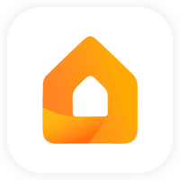

# ioBroker.refoss

Integrate Refoss devices into ioBroker.
You can find more and detailed information about the device here: [Refoss](https://www.amazon.de/dp/B0D3PY4RVZ)

## Prerequisites

- The device needs to be connected to the local network first. There are two ways to connect devices to the local network:
    - Using the Refoss app (download and install the Refoss app on Google Play) to connect devices to the local network.
    - Using the Web page to connect devices to the local network.
        - The computer/mobile phone is connected to the device factory Wi-Fi.
        - In the browser, access the address 10.10.10.1, then select the local Wi-Fi needed for device configuration.
- The integration will occupy port: 9989.

## Supported device models

| Model                             | Version   |
| --------------------------------- | --------- |
| Refoss Smart Energy Monitor, EM06 | >= v2.3.8 |

## Changelog
### 1.2.4 (2025-09-22)

- (zhoulinyue) Fix issues of npm test
### 1.2.3 (2025-09-19)

- (zhoulinyue) Compatible with node v24; delete the unnecessary code
### 1.2.2 (2025-09-18)

- (zhoulinyue) Compatible with node v24; solve the error of npm test
### 1.2.1 (2025-09-04)

- (zhoulinyue) Formatting the code

### 1.2.0 (2025-09-03)

- (zhoulinyue) Add support for EM16P devices

### 1.1.4 (2025-08-21)

- (zhoulinyue) Fix the official issue mentioned in iobroker official PR

### 1.1.3 (2025-08-08)

- (zhoulinyue) Enhance the compatibility of EM06P devices

### 1.1.2 (2025-08-08)

- (zhoulinyue) Fix the problem that the value of factor, mConsume, mConsumeRe is 0 but returns 0

### 1.1.1 (2025-08-07)

- (zhoulinyue) Enhance the compatibility of EM06P devices

### 1.1.0 (2025-05-13)

- (zhoulinyue) Monitor battery level, if the network is online, trigger data update again

### 1.0.0 (2025-05-13)

- (zhoulinyue) Modify the channel display order

### 0.1.11 (2025-04-23)

- (zhaochuanling) revise the feedback content

### 0.1.7 (2025-02-07)

- (zhaochuanling) revise the feedback content

### 0.1.5 (2024-12-24)

- (zhaochuanling) fix detected errors

### 0.1.3 (2024-12-12)

- (zhaochuanling) first review

### 0.0.1 (2024-11-28)

- (zhaochuanling) first release

## License

MIT License

Copyright (c) 2025 zhaochuanling zhaochuanling8@gmail.com,
Bluefox dogafox@gmail.com and
Refoss support@refoss.net

Permission is hereby granted, free of charge, to any person obtaining a copy
of this software and associated documentation files (the "Software"), to deal
in the Software without restriction, including without limitation the rights
to use, copy, modify, merge, publish, distribute, sublicense, and/or sell
copies of the Software, and to permit persons to whom the Software is
furnished to do so, subject to the following conditions:

The above copyright notice and this permission notice shall be included in all
copies or substantial portions of the Software.

THE SOFTWARE IS PROVIDED "AS IS", WITHOUT WARRANTY OF ANY KIND, EXPRESS OR
IMPLIED, INCLUDING BUT NOT LIMITED TO THE WARRANTIES OF MERCHANTABILITY,
FITNESS FOR A PARTICULAR PURPOSE AND NONINFRINGEMENT. IN NO EVENT SHALL THE
AUTHORS OR COPYRIGHT HOLDERS BE LIABLE FOR ANY CLAIM, DAMAGES OR OTHER
LIABILITY, WHETHER IN AN ACTION OF CONTRACT, TORT OR OTHERWISE, ARISING FROM,
OUT OF OR IN CONNECTION WITH THE SOFTWARE OR THE USE OR OTHER DEALINGS IN THE
SOFTWARE.
