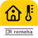

# ioBroker.remeha-home

This adapter uses the service `Sentry.io` to automatically report exceptions and code errors and new device schemas to me as the developer. More details see below!

---

## Support adapter development

**If you like ioBroker.remeha-home, please consider making a donation:**

---

## Remeha Home adapter for ioBroker

---

## Description

The ioBroker.remeha-home adapter enables the integration and control of Remeha heating systems via the [Remeha Home platform](https://www.remeha.de/produkte/speicher-und-zubehoer/regelungen/home-app). The adapter continuously connects to the Remeha Home API and retrieves current data to make it available in the ioBroker system. This allows the heating system to be optimally monitored and controlled.

## Functions

* Data retrieval: Continuous retrieval of heating data such as room temperature, outdoor temperature, heating status and more.
* Control zone mode: Activation and deactivation of heating zones (e.g. for different rooms or floors).
* Set target temperature: Setting the desired room temperature for different zones.
* Switch fireplace mode: Activation of fireplace mode to adjust the heating for external heat sources such as a fireplace.

## Adapter configuration

The configuration of the adapter is very simple.
Only the user name (e-mail address) and password of the Remeha Home account are required.

You must enter these in the configuration of the adapter.

---

## Changelog
<!-- ### **WORK IN PROGRESS** -->
### 1.0.5 (2025-04-15)
* (simatec) Dependencies updated
* (simatec) Fix Post Update
* (simatec) Adapter delay added

### 1.0.4 (2025-03-07)
* (simatec) Fix Post Update

### 1.0.3 (2025-03-07)
* (simatec) Fix Post Update

### 1.0.2 (2025-03-06)
* (simatec) Code Fix
* (simatec) eslint Fix

### 1.0.1 (2025-03-04)
* (simatec) Code clean
* (simatec) Dependencies updated

### 1.0.0 (2025-03-02)
* (simatec) Fix Update Settings
* (simatec) Rewrite in Typescript

### 0.2.8 (2025-02-22)
* (simatec) Dependencies updated
* (simatec) small Fix

### 0.2.7 (2025-01-09)
* (simatec) Fix Update Intervall

### 0.2.6 (2025-01-09)
* (simatec) eslint-config fix
* (simatec) Dependencies updated
* (simatec) Update License

### 0.2.5 (2024-11-27)
* (simatec) Dependencies updated
* (simatec) Fix jsonConfig
* (simatec) Issue Action added
* (simatec) eslint-config added

### 0.2.4 (2024-09-28)
* (simatec) Fix request error
* (simatec) Dependencies updated

### 0.2.3 (2024-09-26)
* (simatec) Fix jsonConfig
* (simatec) Fix for Admin 7.1.5

### 0.2.2 (2024-09-19)
* (simatec) small State Fix

### 0.2.1 (2024-09-18)
* (simatec) States Fix
* (simatec) Readme Fix
* (simatec) Test & Release Fix

### 0.2.0 (2024-09-16)
* (simatec) Translation Fix
* (simatec) Code cleaning
* (simatec) Ready for Betatest

### 0.1.3 (2024-09-12)
* (simatec) Fix Zonemode
* (simatec) Translation added

### 0.1.2 (2024-09-11)
* (simatec) Fix Zonemode

### 0.1.1 (2024-09-10)
* (simatec) Fix Release Script

### 0.1.0 (2024-09-10)
* (simatec) First Beta

### 0.0.1 (2024-09-09)
* (simatec) First Commit
---

## License

MIT License

Copyright (c) 2024 - 2025 simatec

Permission is hereby granted, free of charge, to any person obtaining a copy
of this software and associated documentation files (the "Software"), to deal
in the Software without restriction, including without limitation the rights
to use, copy, modify, merge, publish, distribute, sublicense, and/or sell
copies of the Software, and to permit persons to whom the Software is
furnished to do so, subject to the following conditions:

The above copyright notice and this permission notice shall be included in all
copies or substantial portions of the Software.

THE SOFTWARE IS PROVIDED "AS IS", WITHOUT WARRANTY OF ANY KIND, EXPRESS OR
IMPLIED, INCLUDING BUT NOT LIMITED TO THE WARRANTIES OF MERCHANTABILITY,
FITNESS FOR A PARTICULAR PURPOSE AND NONINFRINGEMENT. IN NO EVENT SHALL THE
AUTHORS OR COPYRIGHT HOLDERS BE LIABLE FOR ANY CLAIM, DAMAGES OR OTHER
LIABILITY, WHETHER IN AN ACTION OF CONTRACT, TORT OR OTHERWISE, ARISING FROM,
OUT OF OR IN CONNECTION WITH THE SOFTWARE OR THE USE OR OTHER DEALINGS IN THE
SOFTWARE.
