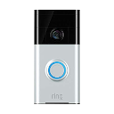

# Ring Adapter

  [](https://www.npmjs.com/package/iobroker.ring)
[](https://www.npmjs.com/package/iobroker.ring)

[](https://nodei.co/npm/iobroker.ring/)

The Ring adapter works with Ring devices like the Ring Video Doorbell and Ring Cam and shows if someone rings the
doorbell or if motion is detected.
The Ring Video Doorbell or Cam sends a videostream if a motion or doorbell is detected.

## Install & Configuration

After installing the Adapter, you have to enter your Token.
Ring now requires the use of Two-Factor Authentication (2fa) for all accounts.
For getting the token, please do following on your shell.

```shell
npx -p ring-client-api ring-auth-cli
```

or

```bash
## Unix 
cd /opt/iobroker/node_modules/iobroker.ring/
npm i ring-client-api

cd /opt/iobroker/node_modules/iobroker.ring/node_modules/ring-client-api
node ring-auth-cli
```

You can use special variables for your livestream and snapshot path and filename. These variables will be replaced with
a counter, timestamp, ring id or kind of ring.

* `%d`: Unix timestamp. Example: `test_%d -> test_1588331430061`
* `%g`: Formatted dated YYYYMMDD. Example: `test_%g -> test_20240614`
* `%t`: Formatted time HHiiss. Example: `test_%t -> test_235901`
* `%i`: ID of your ring device: Example: `test_%i -> test_234567890`
* `%n`: Counter since ring instance start. Example: `test_%n -> test_1`
* `%k`: Kind of your ring device: Example: `test_%k -> test_doorbell`

### FAQ

#### I don't receive events, snapshots and videos on motion or detected person

Congrats, it's very likely that your current token was put on a blacklist by ring, denying you the push notification you
would need.
The best way to resolve this is to remove any previous browsers/adapter tokens on the ring website and generate a new
token for the adapter.

In order for this adapter to properly react on events, Ring must send the push notification to the
used [Ring Api Client](https://github.com/dgreif/ring) for this adapter to react on it. The logic in this adapter was
checked multiple times and works for plenty of users, so if you experience issues regarding missing events, it's
unlikely
the fault of this adapter.

### V5 Breaking Changes

1. Some datapoints got renamed to be more consistent (e.g. `livestream_request` got reduced to `request` as it already
   is in channel `livestream`).
2. You can now configure whether you want to react on events (with recording, snapshot, ...) or not.
3. Binary states got removed.

### V3 Rewrite Breaking Changes

1. The Device Names got extended by their description (e.g., from `Device 1234567`
   to `Device 1234567 ("Floodlight Garden")`)
2. Snapshot/Livestream Data is now in a respective channel, containing the other data points.
3. The snapshot/livestream object got changed from type meta to state with type file.
4. Events (Motion, Ding, etc.) are now in the respective channel.
5. Due to `ring-api` dropping the support for node before `v16.x` this adapter needs `node v16.x` or `node v18.x`
6. Active refreshes are reduced to once every 2 hours, as we are listening/reacting to events.

### SIP (before Version 3.x)

You can use the SIP Information for a SIP Video Conference with your SIP client.
The adapter will not provide all ring devices because the used API does not include all ring devices.

You can use, for example, the Blink SIP client on [http://icanblink.com/](http://icanblink.com/).
To get video working go into Blink's Preferences and under "Accounts", switch the tab to "Media" and deselect "Encrypt
audio and video" under "RTP Options".
Be careful, the SIP information expires after a few seconds!
Hopefully I will be able to support a video stream soon.
Unfortunately, [ring.com](https://ring.com) does not have an official API that support this feature.
If you press the `livestream request` button you get new SIP Information for building up a SIP Video Call session.
If you are using the [ring.com](https://ring.com) cloud, you find under history a http link to your last motion /
doorbell recorded video.

## Installation

Install this adapter using ioBroker repositories.

>[!NOTE]
> This adapter does not support installation from GitHub.

## Changelog

<!--
	Placeholder for the next version (at the beginning of the line):
	### **WORK IN PROGRESS**
-->
### 7.0.1 (2026-09-04)
- (mcm1957) **BREAKING:** enhanced security (added encryption) requires that you enter the access refreshtoken one more time 
- (bluefox) The admin tab was rewritten in React (`src-tab/`), replacing the materialize page - doorbell cameras are listed now, they were silently skipped before
- (bluefox) The tab no longer assumes the web adapter runs on port 8082; it derives host, port and protocol from the URL states
- (bluefox) The adapter was refactored: TypeScript 6, @iobroker/eslint-config, gulp removed
- (bluefox) **BREAKING:** `build/` is no longer committed and `common.nogit` is set - the adapter can only be installed from npm, no longer directly from GitHub
- (bluefox) `ring-client-api` is ESM only and is loaded dynamically now, which fixes `ERR_REQUIRE_ESM` on Node.js 22.0 - 22.11
- (bluefox) All backend timers are managed by js-controller now and are stopped when the instance unloads
- (bluefox) Scheduled jobs (daily sun calculation, auto save) are cancelled on unload and no longer collide between instances
- (bluefox) Fixed: the health state was never refreshed after switching a camera light
- (bluefox) Fixed: a failing livestream target preparation still deleted the target file and never reported the error to the caller
- (bluefox) Fixed: several `async` methods returned before the work they started was finished
- (bluefox) Removed the unused config values `email`, `password`, `pollsec`, `sentry_enable`, `timeout` and `twofaceauth`; `renew_registration` has a default now
- (bluefox) Removed the leftover `admin/index_m.html` - the configuration dialog has been JsonConfig for a while
- (Speedbreaker12) #993 Add doorbell_sunray (Battery Video Doorbell 2K) as doorbell
- (Speedbreaker12) #993 #854 Add stickup_cam_mini_ptz_v1 (Pan-Tilt Indoor Cam) as stickup cam
- (Speedbreaker12) #993 Unsupported device logging no longer dumps the whole device object (could expose the Ring refresh token in the log)
- (GermanBluefox) Devices previously created below `unknown_<id>` are recreated below `doorbell_<id>` / `stickup_<id>`; the old objects stay behind and have to be deleted manually
- (copilot) Adapter requires node.js >= 22 now
- (copilot) Adapter requires admin >= 7.7.22 now
- (copilot) Adapter requires js-controller >= 6.0.11 now
- (copilot) Adapter requires admin >= 7.6.17 now

* (copilot) **CI/CD**: Updated ioBroker Copilot Instructions template from v0.4.0 to v0.4.2

### 6.4.0 (2025-06-27)

* (theimo1221) #820 Support Node-JS 22

### 6.3.0 (2024-11-08)

* (theimo1221) #768 Add df_doorbell_clownfish
* (theimo1221) #738 Add stickup_cam_medusa
* (theimo1221) #685 Add cocoa_doorbell_v3

### 6.2.4 (2024-10-31)

* (simatec) Settings for responsive Design
* (theimo1221) Update some developer packages

### 6.2.3 (2024-10-31)

* (theimo1221) Fix License-Info object in io-package.json
* (theimo1221) Update iobroker test package
* (theimo1221) Update some test packages regarding mocha


[Older changelogs can be found there](CHANGELOG_OLD.md)

## License

MIT License


Copyright (c) 2026 iobroker-community-adapters <iobroker-community-adapters@gmx.de>  
Copyright (c) 2018-2025 Thorsten <thorsten@stueben.de> / <https://github.com/schmupu>

Permission is hereby granted, free of charge, to any person obtaining a copy
of this software and associated documentation files (the "Software"), to deal
in the Software without restriction, including without limitation the rights
to use, copy, modify, merge, publish, distribute, sublicense, and/or sell
copies of the Software, and to permit persons to whom the Software is
furnished to do so, subject to the following conditions:

The above copyright notice and this permission notice shall be included in all
copies or substantial portions of the Software.

THE SOFTWARE IS PROVIDED "AS IS", WITHOUT WARRANTY OF ANY KIND, EXPRESS OR
IMPLIED, INCLUDING BUT NOT LIMITED TO THE WARRANTIES OF MERCHANTABILITY,
FITNESS FOR A PARTICULAR PURPOSE AND NONINFRINGEMENT. IN NO EVENT SHALL THE
AUTHORS OR COPYRIGHT HOLDERS BE LIABLE FOR ANY CLAIM, DAMAGES OR OTHER
LIABILITY, WHETHER IN AN ACTION OF CONTRACT, TORT OR OTHERWISE, ARISING FROM,
OUT OF OR IN CONNECTION WITH THE SOFTWARE OR THE USE OR OTHER DEALINGS IN THE
SOFTWARE.
