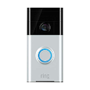

# Ring Adapter

[](https://travis-ci.org/iobroker-community-adapters/ioBroker.ring)
[](https://ci.appveyor.com/project/schmupu/ioBroker-ring/)
  [](https://www.npmjs.com/package/iobroker.ring)
[](https://www.npmjs.com/package/iobroker.ring)

[](https://nodei.co/npm/iobroker.ring/)

Requires Admin v4 and `node 16.x`.

The Ring adapter works with Ring devices like the Ring Video Doorbell and Ring Cam and shows if someone rings the
doorbell or if motion is detected. The Ring Video Doorbell or Cam sends a videostream if a motion or doorbell ist
detected.

## Install & Configuration

After installing the Adapter you have to enter your Email and Password of your [ring.com](https://ring.com) Account and
a Token. Ring now requires the use of Two-Factor Auth (2fa) for all accounts. For getting the token please do following
on your shell.

```
npx -p ring-client-api ring-auth-cli
```

or

```
# Unix 
cd /opt/iobroker/node_modules/iobroker.ring/
npm i ring-client-api

cd /opt/iobroker/node_modules/iobroker.ring/node_modules/ring-client-api
node ring-auth-cli
```

You can use special variables for your livestream and snapshot path and filename. These variables will be replaced with
a counter, timestamp, ring id or kind of ring.

* `%d`: Unix timestamp. Example: `test_%d -> test_1588331430061`
* `%i`: ID of your ring device: Example: `test_%i -> test_234567890`
* `%n`: Counter since ring instance start. Example: `test_%n -> test_1`
* `%k`: Kind of your ring device: Example: `test_%k -> test_doorbell`

### FAQ

#### I don't recieve events, snapshots and videos on motion or detected person

Congrats it's very likely that your current token was put on a blacklist by ring, denying you the push notification
you´d need.
Best way to resolve this is to remove any previous browsers/adapter tokens on the ring website and generating a new
token for the adapter.

In order for this adapter to properly react on events Ring must send the push notification to the
used [Ring Api Client](https://github.com/dgreif/ring) for this adapter to react on it. The logic in this adapter was
checked multiple times and works for plenty users, so if you experience issues regarding missing events it's unlikely
the fault of this adapter.

### V3 Rewrite Breaking Changes

1. The Device Names got extended by their description (e.g. from `Device 1234567`
   to `Device 1234567 ("Floodlight Garden")`)
2. Snapshot/Livestream Data is now in a respective channel, containing the other data points.
3. The snapshot/livestream object got changed from type meta to state with type file.
4. Events (Motion, Ding, etc.) are now in a respective channel.
5. Due to `ring-api` dropping the support for node before `v16.x` this adapter needs `node v16.x` or `node v18.x`
6. Active refreshes are reduced to once every 2 hours, as we are listening/reacting on events.

### SIP (before Version 3.x)

You can use the SIP Information for a SIP Video Conference with your SIP client.
The adapter will not provide all ring devices because the used API does not include all ring devices.

You can use for example the Blink SIP client on [http://icanblink.com/](http://icanblink.com/). To get video working go
into Blink's Preferences and under "Accounts", switch the tab to "Media" and deselect "Encrypt audio and video" under "
RTP Options". Be careful the SIP information expire after a few seconds!
Hopefully I will be able to support a video stream soon. Unfortunately [ring.com](https://ring.com) does not have an
official API that support this feature.
If you press the `livestream request` button you get new SIP Information for building up a SIP Video Call session.
If you are using the [ring.com](https://ring.com) cloud you find under history a http link to your last motion /
doorbell recorded video.

### Scripts in `package.json`

Several npm scripts are predefined for your convenience. You can run them using `npm run <scriptname>`
| Script name | Description |
|-------------|-------------|
| `build:ts` | Compile the TypeScript sources. |
| `watch:ts` | Compile the TypeScript sources and watch for changes. |
| `watch` | Shortcut for `npm run watch:ts` |
| `test:ts` | Executes the tests you defined in `*.test.ts` files. |
| `test:package` | Ensures your `package.json` and `io-package.json` are valid. |
| `test:unit` | Tests the adapter startup with unit tests (fast, but might require module mocks to work). |
| `test:integration` | Tests the adapter startup with an actual instance of ioBroker. |
| `test` | Performs a minimal test run on package files and your tests. |
| `check` | Performs a type-check on your code (without compiling anything). |
| `coverage` | Generates code coverage using your test files. |
| `lint` | Runs `ESLint` to check your code for formatting errors and potential bugs. |
| `release` | Creates a new release,
see [`@alcalzone/release-script`](https://github.com/AlCalzone/release-script#usage) for more details. |

### Writing tests

When done right, testing code is invaluable, because it gives you the
confidence to change your code while knowing exactly if and when
something breaks. A good read on the topic of test-driven development
is https://hackernoon.com/introduction-to-test-driven-development-tdd-61a13bc92d92.
Although writing tests before the code might seem strange at first, but it has very
clear upsides.

The template provides you with basic tests for the adapter startup and package files.
It is recommended that you add your own tests into the mix.

## Changelog

<!--
	Placeholder for the next version (at the beginning of the line):
	### **WORK IN PROGRESS**
-->
### 3.2.5 (2023-01-28)

* (theimo1221) Update Packages

### 3.2.4 (2022-12-15)

* (theimo1221) #385 Fix for Unlock Request on intercoms

### 3.2.3 (2022-12-15)

* (theimo1221) Update Packages
* (theimo1221) #385 Experimental Ring Intercom support

### 3.2.2 (2022-12-02)

* (theimo1221) #373 Fix event receiving for iobroker instances without unique hostname

### 3.2.1 (2022-12-02)

* (theimo1221) Redeploy

### 3.2.0 (2022-12-02)

* (theimo1221) Update Packages
* (theimo1221) #373 Increase logging and change recording order on Doorbell Event

### 3.1.9 (2022-11-20)

* (theimo1221) #395 Resolve Package-lock.json issues

### 3.1.8 (2022-11-20)

* (theimo1221) Update Packages
* (theimo1221) Compliance to newest ring api version

### 3.1.7 (2022-10-28)

* (theimo1221) Update Packages

### 3.1.6 (2022-10-28)

* (theimo1221) Inline subscription instead of properties for Event observer

### 3.1.5 (2022-10-16)

* (theimo1221) Update Packages

### 3.1.4 (2022-10-16)

* (theimo1221) #376 Handling when reconnect fails

### 3.1.3 (2022-10-04)

* (theimo1221) Update Packages

### 3.1.2 (2022-09-22)

* (theimo1221) Update Packages
* (theimo1221) Fix an issue with floodlight control

### 3.1.1 (2022-08-11)

* (theimo1221) Improve Doorbell Event Logging

### 3.1.0 (2022-08-04)

* (bluefox) Allowed to be used with node.js 18

### 3.0.5 (2022-07-05)

* (theimo1221) Improve Log Message on failed Snapshots during event handling
* (theimo1221) Add Support for doorbell oyster

### 3.0.4 (2022-06-17)

* (theimo1221) Fix Edge Case resulting in lamps being permanently on

### 3.0.3 (2022-06-16)

* (theimo1221) Implement location mode

### 3.0.1 (2022-06-08)

* (bluefox) Changed the russian translations

### 3.0.0-beta.13 (2022-05-30)

* (theimo1221) Prevent missing of events, due to socket drop within ring-api-client
* (theimo1221) Improve device logging readability

### 3.0.0-beta.12 (2022-05-28)

* (theimo1221) Fix error in beta.11 in regard to new installations
* (theimo1221) Harden Event Handling to prevent rare permanent busy occasions
* (theimo1221) Add support for doorbell device `doorbell_graham_cracker`

### 3.0.0-beta.11 (2022-05-24)

* (theimo1221) Add processing of new token provided by ring.

### 3.0.0-beta.10 (2022-05-24)

* (theimo1221) Add `lpd_v4` Doorbell

### 3.0.0-beta.9 (2022-05-21)

* (theimo1221) For stability reasons, perform an active refresh every 2 hours.

### 3.0.0-beta.8 (2022-05-17)

* (theimo1221) Fix writing to iobroker-data/files folder (thx to Apollon)

### 3.0.0-beta.7 (2022-05-16)

* (theimo1221) Prevent Crashes on unsupported devices

### 3.0.0-beta.6 (2022-05-16)

* (theimo1221) Record more events (without recording twice)
* (theimo1221) Improve snapshot deleting for initial snapshot after restart

### 3.0.0-beta.5 (2022-05-14)

* (theimo1221) Prevent crashes during installation by clearer enforcing of node 16

### 3.0.0-beta.4 (2022-05-14)

* (theimo1221) Changes in io-package.json for release workflow

### 3.0.0-beta.3 (2022-05-14)

* (theimo1221) Rewrite V3 (Breaking Changes listed below)
* (theimo1221) Update packages
* (theimo1221) Fix in GitHub release workflow

### 2.0.0-beta.3 (2022-02-08)

* (theimo1221) Fix adapter checker issues

### 2.0.0-beta.0 (2022-02-05)

* (theimo1221) Update packages
* (theimo1221) Add JS-Controller 4.0 dependency
* (theimo1221) On ding --> First take snapshot then livestream

### 1.2.8 (2021-10-14)

* (theimo1221) Update packages

### 1.2.6 (2021-09-05)

* (theimo1221) Update packages
* (theimo1221) Stop adapter on unhandled Error
* (theimo1221) Terminate adapter on invalid ring credentials

### 1.2.4-1 (2021-08-12)

* (theimo1221) Update packages

### 1.2.4-0 (2021-08-07)

* (theimo1221) Refactoring
* (theimo1221) Update packages

### 1.2.3 (2021-07-30)

* (theimo1221) Update packages
* (theimo1221) Fix compatibility issues with new ring api

### 1.2.2 (2021-05-05)

* (theimo1221) Update packages due to security patches

### 1.2.1 (2021-04-09)

* (theimo1221) Bump version

### 1.2.0 (2021-04-08)

* (theimo1221) Add new device type spotlightw as doorbell
* (theimo1221) Update dependencies (ringapi, node-schedule, etc.)

### 1.1.6-3 (2021-03-29)

* (theimo1221) Fix typo preventing Livestream recordings after motion detection
* (theimo1221) Reduce Levels of Log Messages, to not spam iobroker Log

### 1.1.6-2 (2021-03-29)

* (theimo1221) Fixing some Issues while saving snapshots and place Snapshots within 'iobroker-data' Folder.

### 1.1.6-1 (2021-03-26)

* (theimo1221) Support for Floodlight V2
* (theimo1221) Control Floodlight by Switch

### 1.1.5 (04.11.2020)

* (Stübi) Add floodlight

### 1.1.4 (23.05.2020)

* (Stübi) Add new libraries

### 1.1.3 (06.05.2020)

* (Stübi) Fixed error of missing objects

### 1.1.2 (02.05.2020)

* (Stübi) Fixed health info like missing battery status (Issue #22, Issue #25)
* (Stübi) Change error handling
* (Stübi) Providing Stick Up Cam (BETA)
* (Stübi) Using variables in the filename of the livestream or snapshot

### 1.1.1 (02.05.2020)

* (Stübi) Bugfixing
* (Stübi) User can enable/disable external sentry logging

### 1.1.0 (01.05.2020)

* (Stübi) Node 10 is now required, Node 12 recommended. If you use Node 8 or less, the adapter will stop immediately.
* (Stübi) Tested with js-controller 3. I recommend using js-controller 3 or higher because of sentry logging and more
  features in the future
* (Stübi) Snapshot link will be shown as https or http in state (Issue #18)
* (Stübi) Livestream link added and a request button added to get new livestream
* (Stübi) Old snapshots and livestreams can be deleted on the filesystem
* (Stübi) Sentry logging added
* (Stübi) Small improvements and bugfixing
* (Stübi) Add a Two-Factor Auth (2fa) description (Issue #14, Issue #13, Issue #19)

### 1.0.7 (24.12.2019)

* (Stübi) Bugfixing

### 1.0.6 (20.12.2019)

* (Stübi) Bugfixing: Login with username and password changed
* (Stübi) New feature (BETA): Now you can make snapshots in jpg and a livestream in mp4 format. Unfortunately the
  snapshot / livestream does not work always!

### 1.0.5 (18.04.2019)

* (Stübi) Bugfixing
* (Stübi) Using new API. With this API livestreaming and snapshots are possible (work still in progress and not
  supported in this version)
* (Stübi) Fixed an error with js-controller 2.0. You need at least this version with js-controller 2.0
* (Stübi) two face authentication

### 1.0.4 (17.04.2019)

* (Stübi) Bugfixing for Ring Pro

### 1.0.3 (09.03.2019)

* (Stübi) Major change! I had to change the used ring.com API to an other API. The old one did not work anymore. For
  this reason, a lot has to be redesigned.

### 1.0.2 (01.02.2019)

* (Stübi) More debug information

### 1.0.1 (05.01.2019)

* (Stübi) Support js-controller compact mode

### 1.0.0 (04.01.2018)

* (Stübi) Add camera device. For this reason, the device name changed from doorbot to doorbell.

### 0.1.3 (20.12.2018)

* (Stübi) Update error handling

### 0.1.2 (17.12.2018)

* (Stübi) Update error handling

### 0.1.1 (15.12.2018)

* (Stübi) Improvements

### 0.1.0 (14.12.2018)

* (Stübi) First Version

## License

MIT License

Copyright (c) 2018-2023 Thorsten <thorsten@stueben.de> / <https://github.com/schmupu>

Permission is hereby granted, free of charge, to any person obtaining a copy
of this software and associated documentation files (the "Software"), to deal
in the Software without restriction, including without limitation the rights
to use, copy, modify, merge, publish, distribute, sublicense, and/or sell
copies of the Software, and to permit persons to whom the Software is
furnished to do so, subject to the following conditions:

The above copyright notice and this permission notice shall be included in all
copies or substantial portions of the Software.

THE SOFTWARE IS PROVIDED "AS IS", WITHOUT WARRANTY OF ANY KIND, EXPRESS OR
IMPLIED, INCLUDING BUT NOT LIMITED TO THE WARRANTIES OF MERCHANTABILITY,
FITNESS FOR A PARTICULAR PURPOSE AND NONINFRINGEMENT. IN NO EVENT SHALL THE
AUTHORS OR COPYRIGHT HOLDERS BE LIABLE FOR ANY CLAIM, DAMAGES OR OTHER
LIABILITY, WHETHER IN AN ACTION OF CONTRACT, TORT OR OTHERWISE, ARISING FROM,
OUT OF OR IN CONNECTION WITH THE SOFTWARE OR THE USE OR OTHER DEALINGS IN THE
SOFTWARE.
