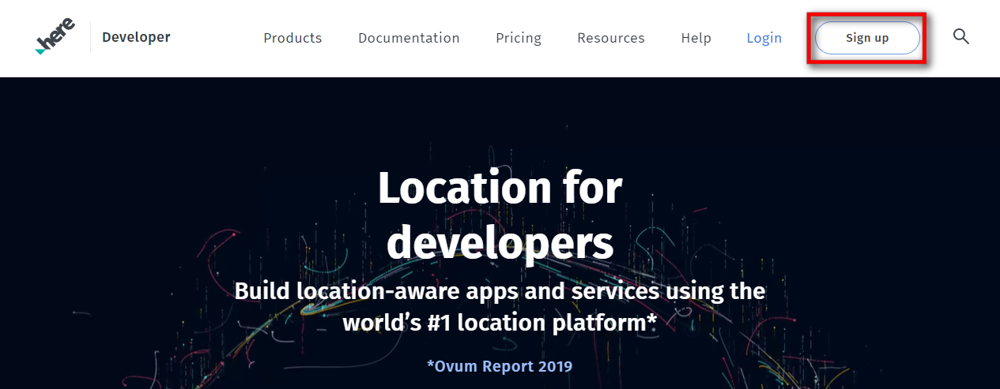
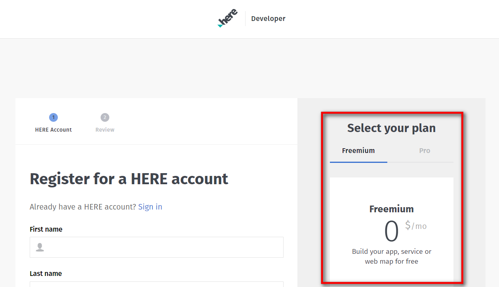
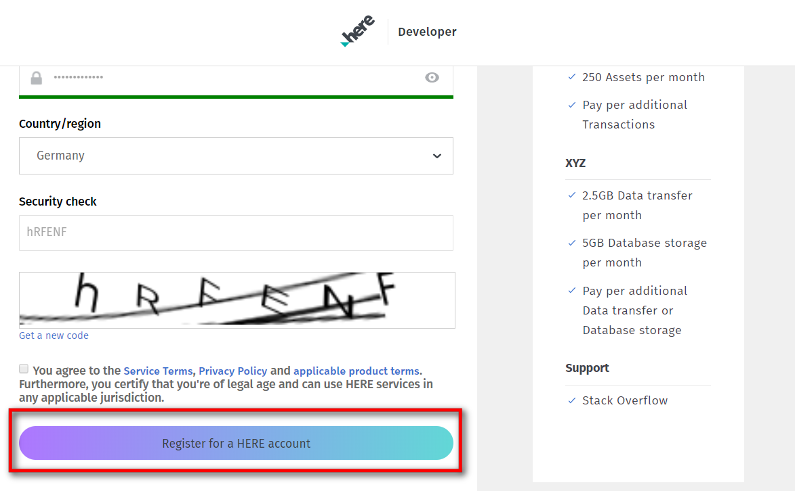
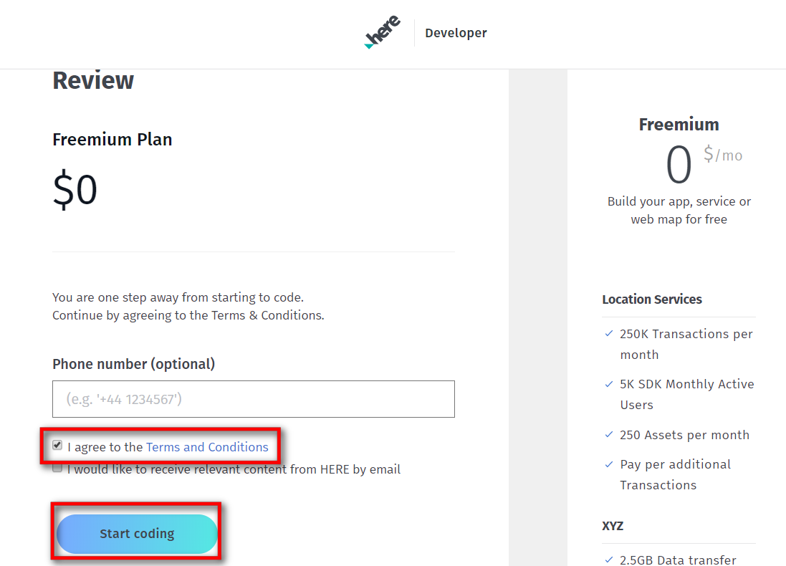
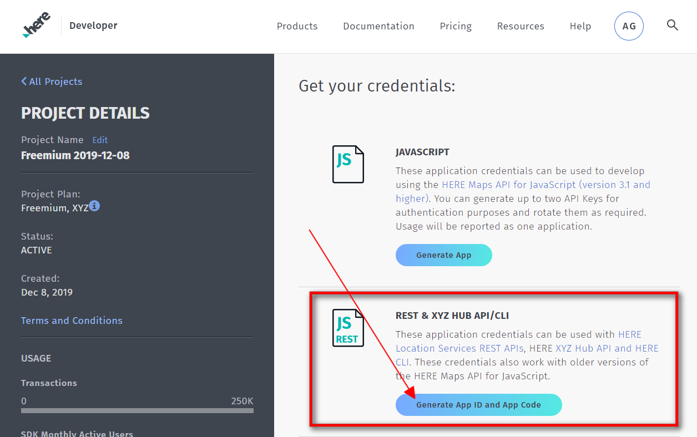
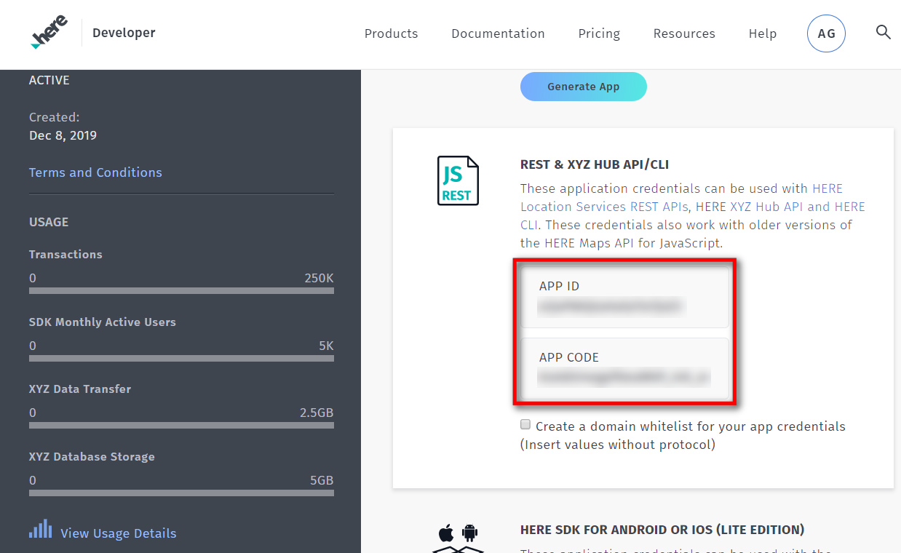

# ioBroker.roadtraffic

 

 
**Version:**  

 
**Tests:**  

<!--
## Sentry
**This adapter uses Sentry libraries to automatically report exceptions and code errors to the developers.**
For more details and for information how to disable the error reporting see [Sentry-Plugin Documentation](https://github.com/ioBroker/plugin-sentry#plugin-sentry)! Sentry reporting is used starting with js-controller 3.0.
-->

## About this Adapter
This Adapter uses HERE.com API to check the traffic on your routes. You can configure multiple routes and the adapter will check the actual traffic situation and show you how long your journey will take.
The Adapter has an alarm clock - so you can tell the Adapter at which time you have to be at work - and the Adapter starts playing Radio and makes an announcement on Alexa (Alexa2 Adapter required) - or you can use your own script to react on the alarm of the adapter..

## Getting started
So lets go:
1. Go to https://developer.here.com/sign-up?create=Freemium-Basic&keepState=true&step=account and create a HERE.com Free Developer-Account (Freemium).

2. Make sure that Freemium is selected and complete the form on the left side.. (First name, Last name, email,..)

3. Click on Register for HERE Account ... and dont forget to tick the Checkbox (Aggree to the Service Terms etc..).

4. One more time - agree to the Terms and Conditions and click the "Start Coding" Button.

5. At the next page you are already on your HERE.com Dashboard. Look for the REST Section and click on "Generate App".

6. Click on "Create API Key" - you will get an API Key .. Open the Instancesettings of the roadtraffic Adapter in ioBroker and paste the API Key into the config field.

7. Click the Plus icon in the Instance-Settings and create your first Route..

After you entered all informations to the config dialog click "Save & Close".
The Adapter should now restart and you are ready to go!

## Alarm-Clock
In the Instancesettings you can enable the Alarm-Clock by checking the "Enable Alarm-Clock feature".
You should have the Alexa2 Adapter installed & set to use push connection in the Alexa2 Instancesettings.
Select the Alexa-Device you want to be controlled by the Adapter and enter the TuneIn StationID you want to get played when the alarm is triggered.
The Alarm-Volume has a range from 0-100.
With the Speak string you can control the announcement of Alexa.
Default is:
Guten Morgen %name. Bei aktueller Verkehrslage benötigst du %dur zur Arbeit.

15 Seconds after Alexa started playing the specified TuneIn Station the String will be announced.
If you for example have a Route named 'Daniel' and the Alarm triggers Alexa will say:
Guten Morgen Daniel. Bei aktueller Verkehrslage benötigst du 29 Minuten zur Arbeit.

Leave the Speak string empty if you only want the Adapter to start playing the TuneIn Station and dont get any announcement.

Every Route has 7 Alarm-Channels (Monday-Sunday).
In each Channel you have following states:
* arrivaltime: Enter the Time you want to be at your destination (Example: 07:30 is half past seven in the morning).
* bathtime: Enter the Time you want to be added to the travelduration. (Example: 45 is 45 Minutes. Lets say you have set Arrivaltime to 10:00, Bathtime to 30 Minutes and the current travelduration is 1 hour. Then the Adapter will trigger at 08:30 (Arrivaltime - Bathtime - Travelduration).
* enabled: set to true if you want to enable the Alarm for that day
* triggered: the Adapter will set this state to true when the Alarm is triggered. (You can use it with own scripts for example..) The triggered state will be reset to false at 00:00 on the corresponding day. (Saturday trigger will be set to false at Saturday 00:00).

## Changelog
<!--
    Placeholder for the next version (at the beginning of the line):
    ### **WORK IN PROGRESS**
-->
### 1.2.0 (2024-04-25)
* (mcm1957) Adapter requires node.js >= 18 and js-controller >= 5 now
* (mcm1957) Dependencies have been updated

### 1.1.1 (2023-11-28)
* (mcm1957) Role definitions have been corrected.

### 1.1.0 (2023-11-27)
* (icastillo15) Support for HERE v8 api protocoll has been added.
* (mcm1957) Dependencies have been updated.

### 1.0.2 (2023-10-27)
* (mcm1957) Error logging has been corrected.

### 1.0.1 (2023-10-26)
* (mcm1957) Issues reported by ioBroker adapter checker and lint have been fixed.

### 1.0.0 (2023-10-26)
* (mcm1957) This adapter has been moved into iobroker-community-organization.
* (mcm1957) Adapter requires nodejs 18.x or newer now.
* (mcm1957) Dependencies have been updated.

### 0.2.0 (2019-12-21)
* (BuZZy1337) Alarm-Clock implemented. (See Readme "Alarm-Clock" section for details)

### 0.1.1 (2019-12-13)
* (BuZZy1337) HERE.com changed the Authentication.
* (BuZZy1337) Prepare for Alarm.. (NOT WORKING YET!!! - But needed to push this version because of authentication changes)

### 0.1.0 (2019-12-08)
* (BuZZy1337) Using HERE.com instead of Google API (READ THE UPDATED README!!)

### 0.0.2 (2019-02-27)
* (BuZZy1337) Release to latest repository

### 0.0.1
* (BuZZy1337) initial release

## Credits
Code adaptions to use HERE v8 pi have been provided by @icastillo15 <starwarsmalu@gmail.com>.

## License
The MIT License (MIT)

Copyright (c) 2023-2024 ioBroker Community Developers <iobroker-community-adapters@gmx.de>  
Copyright (c) 2019 BuZZy1337 <buzzy1337@outlook.de>

Permission is hereby granted, free of charge, to any person obtaining a copy
of this software and associated documentation files (the "Software"), to deal
in the Software without restriction, including without limitation the rights
to use, copy, modify, merge, publish, distribute, sublicense, and/or sell
copies of the Software, and to permit persons to whom the Software is
furnished to do so, subject to the following conditions:

The above copyright notice and this permission notice shall be included in
all copies or substantial portions of the Software.

THE SOFTWARE IS PROVIDED "AS IS", WITHOUT WARRANTY OF ANY KIND, EXPRESS OR
IMPLIED, INCLUDING BUT NOT LIMITED TO THE WARRANTIES OF MERCHANTABILITY,
FITNESS FOR A PARTICULAR PURPOSE AND NONINFRINGEMENT. IN NO EVENT SHALL THE
AUTHORS OR COPYRIGHT HOLDERS BE LIABLE FOR ANY CLAIM, DAMAGES OR OTHER
LIABILITY, WHETHER IN AN ACTION OF CONTRACT, TORT OR OTHERWISE, ARISING FROM,
OUT OF OR IN CONNECTION WITH THE SOFTWARE OR THE USE OR OTHER DEALINGS IN
THE SOFTWARE.
