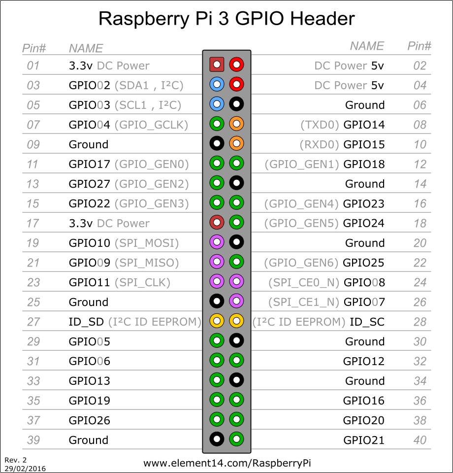

ioBroker RPI-Monitor Adapter
==============

[](https://www.npmjs.com/package/iobroker.rpi2)
[](https://www.npmjs.com/package/iobroker.rpi2)


[](https://nodei.co/npm/iobroker.rpi2/)

**Tests:** 
RPI-Monitor implementation for integration into ioBroker. It is the same implementation as for iobroker.rpi, but with GPIOs.

## Important Information
Works only with node >= 18

**ioBroker needs special permissions to control GPIOs.** On most Linux distributions this can be achieved by adding the ioBroker user to the `gpio` group (recommended) or running ioBroker under `root` (less secure).

For gpio to work, you need to install libgpiod, **before** installing the adapter, like this: `sudo apt-get install -y libgpiod-dev`

## Installation
After installation you have to configure all required modules via administration page.

After start of iobroker.rpi, all selected modules generates
an object tree in ioBroker within rpi.<instance>.<modulename>
e.g. rpi.0.cpu

Be sure, that python and build-essential are installed:

```
sudo apt-get update
sudo apt-get install -y build-essential python
sudo apt-get install -y libgpiod-dev
```
(the last one is only necessary, if you want to work with GPIOs)

Following Objects are available after selection:

#### **CPU**

- cpu_frequency
- load1
- load5
- load15

#### **Raspberry (vcgencmd is required)**

- cpu_voltage
- mem_arm
- mem_gpu

#### **Memory**

- memory_available
- memory_free
- memory_total

#### **Network (eth0)**
- net_received
- net_send

#### **SDCard**
- sdcard_boot_total
- sdcard_boot_used
- sdcard_root_total
- sdcard_root_used

#### **Swap**
- swap_total
- swap_used

#### **Temperature**
- soc_temp

#### **Uptime**
- uptime

#### **WLAN**
- wifi_received
- wifi_send

## Configuration
On configuration page you can select following modules:

- CPU
- Raspberry
- Memory
- Network
- SDCard
- Swap
- Temperature
- Uptime
- WLAN

## Logfiles / Configuration Settings

## Features

## Todo

## Tested Hardware
 - Odroid C1
 - Raspberry Pi 1

## GPIOs
You can read and control GPIOs too.
All what you need to do is to configure in the settings the GPIOs options (additional tab).



After some ports are enabled following states appear in the object tree:
- rpi.0.gpio.PORT.state

The numeration of ports is BCM (BroadComm pins on chip). You can get the enumeration with ```gpio readall```.
For instance PI2:

```
+-----+-----+---------+------+---+---Pi 2---+---+------+---------+-----+-----+
| BCM | wPi |   Name  | Mode | V | Physical | V | Mode | Name    | wPi | BCM |
+-----+-----+---------+------+---+----++----+---+------+---------+-----+-----+
|     |     |    3.3v |      |   |  1 || 2  |   |      | 5v      |     |     |
|   2 |   8 |   SDA.1 | ALT0 | 1 |  3 || 4  |   |      | 5V      |     |     |
|   3 |   9 |   SCL.1 | ALT0 | 1 |  5 || 6  |   |      | 0v      |     |     |
|   4 |   7 | GPIO. 7 |   IN | 1 |  7 || 8  | 0 | IN   | TxD     | 15  | 14  |
|     |     |      0v |      |   |  9 || 10 | 1 | IN   | RxD     | 16  | 15  |
|  17 |   0 | GPIO. 0 |   IN | 0 | 11 || 12 | 0 | IN   | GPIO. 1 | 1   | 18  |
|  27 |   2 | GPIO. 2 |   IN | 0 | 13 || 14 |   |      | 0v      |     |     |
|  22 |   3 | GPIO. 3 |   IN | 0 | 15 || 16 | 0 | IN   | GPIO. 4 | 4   | 23  |
|     |     |    3.3v |      |   | 17 || 18 | 0 | IN   | GPIO. 5 | 5   | 24  |
|  10 |  12 |    MOSI |   IN | 0 | 19 || 20 |   |      | 0v      |     |     |
|   9 |  13 |    MISO |   IN | 0 | 21 || 22 | 1 | IN   | GPIO. 6 | 6   | 25  |
|  11 |  14 |    SCLK |   IN | 0 | 23 || 24 | 1 | IN   | CE0     | 10  | 8   |
|     |     |      0v |      |   | 25 || 26 | 1 | IN   | CE1     | 11  | 7   |
|   0 |  30 |   SDA.0 |   IN | 1 | 27 || 28 | 1 | IN   | SCL.0   | 31  | 1   |
|   5 |  21 | GPIO.21 |   IN | 1 | 29 || 30 |   |      | 0v      |     |     |
|   6 |  22 | GPIO.22 |   IN | 1 | 31 || 32 | 0 | IN   | GPIO.26 | 26  | 12  |
|  13 |  23 | GPIO.23 |   IN | 0 | 33 || 34 |   |      | 0v      |     |     |
|  19 |  24 | GPIO.24 |   IN | 0 | 35 || 36 | 0 | IN   | GPIO.27 | 27  | 16  |
|  26 |  25 | GPIO.25 |  OUT | 1 | 37 || 38 | 0 | IN   | GPIO.28 | 28  | 20  |
|     |     |      0v |      |   | 39 || 40 | 0 | IN   | GPIO.29 | 29  | 21  |
+-----+-----+---------+------+---+----++----+---+------+---------+-----+-----+
| BCM | wPi |   Name  | Mode | V | Physical | V | Mode | Name    | wPi | BCM |
+-----+-----+---------+------+---+---Pi 2---+---+------+---------+-----+-----+
```

## DHTxx/AM23xx Sensors
You can read from DHT11, DHT22 and AM2302 temperature/humidity sensors.

Connect such a sensor to a GPIO pin as described on the [node-dht-sensor](https://www.npmjs.com/package/node-dht-sensor) package page. Multiple sensors can be connected to *multiple* pins (this is *not* a bus system) as discussed.


## Changelog

<!--
	PLACEHOLDER for the next version:
	### **WORK IN PROGRESS**
-->
### 2.2.1 (2024-10-15)
* (Garfonso) temperature has now proper role and type.

### 2.2.0 (2024-10-15)
* (Garfonso) rebuild config in JSONConfig.

### 2.1.2 (2024-10-13)
* (Garfonso) transmit all GPIO changes to iobroker states.

### 2.1.1 (2024-10-13)
* (Garfonso) fix gpio undefined errors.

### 2.1.0 (2024-10-13)
* (jangatzke) add support for gpios on Raspberry Zero.

## License
MIT License

Copyright (c) 2024 Garfonso <garfonso@mobo.info>

Permission is hereby granted, free of charge, to any person obtaining a copy
of this software and associated documentation files (the "Software"), to deal
in the Software without restriction, including without limitation the rights
to use, copy, modify, merge, publish, distribute, sublicense, and/or sell
copies of the Software, and to permit persons to whom the Software is
furnished to do so, subject to the following conditions:

The above copyright notice and this permission notice shall be included in all
copies or substantial portions of the Software.

THE SOFTWARE IS PROVIDED "AS IS", WITHOUT WARRANTY OF ANY KIND, EXPRESS OR
IMPLIED, INCLUDING BUT NOT LIMITED TO THE WARRANTIES OF MERCHANTABILITY,
FITNESS FOR A PARTICULAR PURPOSE AND NONINFRINGEMENT. IN NO EVENT SHALL THE
AUTHORS OR COPYRIGHT HOLDERS BE LIABLE FOR ANY CLAIM, DAMAGES OR OTHER
LIABILITY, WHETHER IN AN ACTION OF CONTRACT, TORT OR OTHERWISE, ARISING FROM,
OUT OF OR IN CONNECTION WITH THE SOFTWARE OR THE USE OR OTHER DEALINGS IN THE
SOFTWARE.
