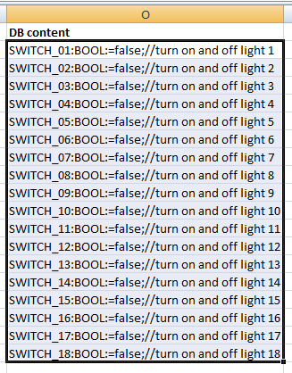
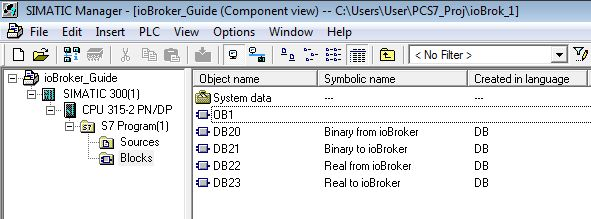
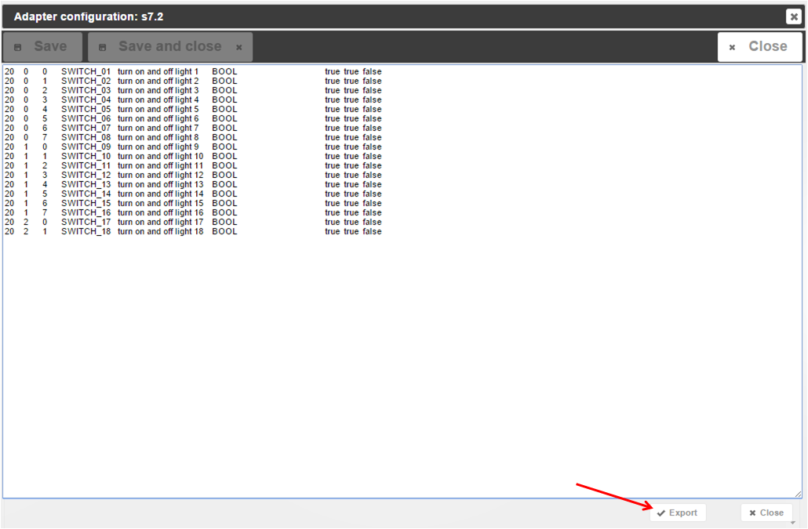

# ioBroker.S7

## Detailed description
The S7 adapter which comes with ioBroker is based on Snap7\. Snap7 will be installed during the first time installation of the adapter and handles the TCP/IP communication between the S7 PLC and ioBroker. So it is mandatory that the S7 is equipped with an Ethernet interface (integrated or external CP) in order to communicate over TCP/IP with the hardware ioBroker is running on. As a prerequisite the user has to know the basics about TCP/IP communication and he/ she has to be able to configure the S7 PLC with the Step7 software. But that shouldn’t be a challenge for someone considering to linking an S7 to ioBroker.

## Installation
This guide is based on the following configuration:

* S7-315 with integrated Ethernet interface
* Raspberry Pi 2, ioBroker running under Debian GNU/Linux 7.8 (wheezy)
* IP address range 192.168.1.xxx
* PC running:
    * Spread sheet tool like MS Excel, Apache Open Office
    * Google Chrome Browser
    * Step7 V5.5 SP4 HF5

**needed additional document:  (iobroker_adapter_S7.xlsx)[iobroker_adapter_S7.xlsx]**

### Communication through Data Blocks (DBs)
This guide describes the communication between ioBroker and the S7 PLC through data blocks. Ideally dedicated DBs can be generated for the communication. The DBs have to be integrated in the code running in the S7\. The advantage with that approach is that you can be sure that you won’t overwrite data accidentally for example in an instance data block which could lead to unwanted or unexpected reactions in your S7 software. If you have to use existing data blocks due to memory restrictions or that you can not do any modification to the S7 software, make sure that you populate the relevant data to ioBroker only in order to avoid conflicts.

### Generate communication DBs
We are going to work with 4 DBs: 
* DB20 – Binary values sent from ioBroker to the S7 (digital input from an S7 view)
* DB21 – Binary values sent to ioBroker from the S7 (digital output from an S7 view)
* DB22 – Real values sent from ioBroker to the S7 (analog input from an S7 view)
* DB23 – Real values sent to ioBroker from the S7 (analog output from an S7 view) 

The DBs will be generated using a spread sheet with one table per data block. 


#### Preparation of DB20 – Binary values sent from ioBroker to the S7


Column A through M are based on the structure in ioBroker and have to be filled in by the user based on the S7 software. You might want to make use of parts of the S7 symbol table (copy – paste). In column O the code for the S7 DB is derived from the content in column A through M.

* Column A: DB = DB Number in the S7 and first part of address in ioBroker
* Column B: Byte = Byte in DB in the S7 and second part of address in ioBroker
* Column C: Bit = Bit in DB in the S7 and third part of address in ioBroker
* Column D: Name = Name in DB in the S7 and name in ioBroker
* Column E: Description = Comment in DB in the S7 and description in ioBroker
* Column F: Type = Type in DB in the S7 and type in ioBroker
* Column G: Length = length in ioBroker
* Column H: Unit = unit in ioBroker
* Column I: Role = role in ioBroker
* Column J: Room = room in ioBroker
* Column K: Poll = data point will be polled cyclically (true/false)
* Column L: RW = data point can be written (true/false) è “true” in DB20 as we want to write data to the S7
* Column M: WP = data point will be set to “1” only for the “pulse time” defined under “General – General”


* Column N: intentionally left empty
* Column O: DB content = content which will be copied to Step7 for DB generation, formula: ```=CONCATENATE(D2;":";F2;":=";"false;";"//";E2)```

#### Preparation of DB21 – Binary values sent to ioBroker from the S7


* Column L: RW è “false” in DB21 as we want to read data from the S7

#### Preparation of DB22 – Real values sent from ioBroker to the S7


* Column B: Byte = start byte of real value (0, 4, 8, …)
* Column C: Bit = left empty
* Column L: RW è “true” in DB22 as we want to write data to the S7
* Column O: Formula: ```=CONCATENATE_ _(D2;":";F2;":=";"0.000000e+000;";"//";E2)```

#### Preparation of DB23 – Real values sent to ioBroker from the S7


* Column B: Byte = start byte of real value (0, 4, 8, …)
* Column C: Bit = left empty
* Column L: RW è “false” in DB23 as we want to read data from the S7
* Column O: Formula: ```=CONCATENATE_ _(D2;":";F2;":=";"0.000000e+000;";"//";E2)```

#### Create DB sources in Step7
We will now generate the DBs in Step7 using the code in column O of our spread sheet. In your Step7 program, insert an STL source by clicking the right mouse button on “Sources”. [

 
Rename the new source to “DB20”. 
Insert the following code in the empty source:
 
```
DATA_BLOCK DB 20
    TITLE =
    VERSION : 0.1
    STRUCT 
    END_STRUCT ;         
    BEGIN
END_DATA_BLOCK
```
 
The source should look like this: 


Copy the source “DB20” 3 times and name the copies DB21, DB22, DB23 while also changing line one in each source to:

* ```DATA_BLOCK DB 21```
* ```DATA_BLOCK DB 22```
* ```DATA_BLOCK DB 23```


Now go to the spread sheet, table DB20, and copy the code in column O (without headline): 



Paste the cells in the source called “DB20” in Step7 between “STRUCT” and “END_STRUCT;”: 


Start the compiler and the result should be 0 Errors, 0 Warnings. DB20 has now been generated and you find the new block under “Blocks” in your S7 program. 


The block looks like this:


 The address should be in correspondence with the address in the spread sheet, just do a sanity check by comparing the combination of Byte and Bit:


Repeat for DB21, DB22, DB23 and make sure you pick the column O from the right table and paste it to the correct source (table DB21 to source DB21 etc.) As DB22 and 23 will deal with REAL values, you can find below how the blocks will look.


Also here the address should correspond with the spread sheet (Byte):


We now have the 4 DBs required for the communication:



You should give them a symbolic name accordingly, that helps to maintain clarity. Don’t forget to connect them to the S7 logic and download the modified code.

### Populate DBs to ioBroker
Now that the 4 DBs are part of the code running in the S7, we will tell ioBroker how to communicate with the S7.

#### Installation of S7 Adapter instance
Adapters – hardware – Siemens S7 Adapter – +


Multiple instances are possible in case you want your ioBroker to connect with multiple S7 CPUs.   Enable the new adapter instance:


The title of the adapter (standard: Siemens S7 Adapter) can also be changed in that step. Using the IP address as part of the title would be one idea. Open the adapter configuration


and start to configure the S7 adapter: 


* Tab “General”
    * PLC Connection
        * PLC IP Address IP address of the PLC as defined in the Step7 HW Config


* S7 LOGO! In case you’re using a LOGO, not an S7 PLC
* PLC Rack Rack number of the CPU as found in the Step7 HW Config (R0/S2)
* PLC Slot Slot number of the CPU as found in the Step7 HW Config (R0/S2)


* General
    * Round real to: Number of digits real values will be rounded to after separator, e.g.: 2 -> 12.12 3 -> 12.123 … 9 -> 12.123456789
    * Poll delay: Communication update cycle in milliseconds
    * Reconnect time: <span style="line-height: 1.5;">Duration in milliseconds after a reconnect will be tried once the connection to the S7 was lost</span>
    * Pulse time: <span style="line-height: 1.5;">Time in milliseconds for “1” for data points configured as WP = true</span>
* Import symbols file:
    * Load symbols Feature to import Step7 symbols from an ASCII file – not used here
* Import DB file:
    * Add DB Feature to import Step7 DBs from an ASCII file – not used here

#### Configure ioBroker for the communication
We skip the tabs “Inputs”, “Outputs” and “Markers” and go right to “DBs”:


Here you can find the structure of the spread sheet. We’re ready for bulk engineering again. Click the “Import from CSV” button [


and you get an empty field. Now go to the spread sheet again, table DB20, and copy column A through M (without headlines). [


Paste the cells in the empty import field in ioBroker and confirm with “Export” – which is meant to be called “Import”. [



The first DB is done and ready for communication:


Repeat for DB21, DB22, DB23\. Each time you click “Import from CSV” you get an empty box, but the contents will be added to the list. You should be done in no time, no matter how many data points you want to populate. In case you want to make use of the features which come with ioBroker by filling in Length, Unit, Role, Room, you can do that in the spread sheet, too, in order to take advantage of bulk engineering. If you decide to do that later or for a couple of data points only, you can also do that directly in ioBroker under “DBs” with the integrated edit options. Don’t forget to save, though! 12 [


#### Communication test
Go to the tab “Objects” in ioBroker and find the S7 instance (e.g. s7.0, not system.adapter.S7.0). If you’re missing anything: F5 (webpage update) is king! Her you find two groups:

* DBs with the 4 DBs we configured:
    * DB20
    * DB21
    * DB22
    * DB23
* Info with information regarding the connection:
    * Connection: “true” if the S7 can be found on the network
    * pdu: PDU size Snap7 is connected with to the S7 (typically 240 for S7-300, 480 for S7-400)
    * poll_time: time in milliseconds Snap7 takes for communication - should be lower than the poll delay configured under “General” – “General” in adapter instance configuration.


 We have configured DB21 and DB23 as DBs sending information to ioBroker, i.e. if you open the DBs under “Objects”, you should see values coming in already, give that the DBs are being supplied with data from the S7 code.

## Monitoring and Operation in vis
Start ioBroker.vis from the tab “Instances”. I recommend to have the vis-hqwidgets installed. Let’s start with a switch:


Drag& drop a switch widget on your view, connect it to the Object ID of a switch in DB20 and you’re done. If you operate the switch now, you will find that the data point under “Objects” – “s7.x” – “DBs” – “DB20” will toggle and the S7 will turn on and off what ever is connected to the DB. If you monitor the DB in Step7 online, you’ll see that the data point in the DB will change from “0” to “1” etc. A binary status works exactly the same way: Drag& drop a widget in your view and connect the relevant data point from DB21 to it. And it is the same again for real values:


Important: The user is in charge of connecting the correct data points to the widgets. You can connect a real value to a binary status (e.g. light bulb), so the light bulb will show “on” once the real value is >1.0. That’s all, folks, pretty easy and straight forward, huh?

## Changelog
### **WORK IN PROGRESS**
* (bluefox) Updated GUI packages

### 1.4.3 (2024-02-17)
* (Bettman66) Fix REAL number parsing error

### 1.4.2 (2023-12-04)
* IMPORTANT: Node.js 16+ is required to run this version!
* (Apollon77) Update dependencies to make adapter work with Node.js 20+

### 1.3.15 (2022-12-23)
* (bluefox) Updated GUI packages
* (bluefox) Added ukrainian translation

### 1.3.14 (2022-09-27)
* (bluefox) Updated GUI packages

### 1.3.13 (2022-08-02)
* (bluefox) Added preparations for ioBroker cloud
* (bluefox) Migrate GUI tu muiV5

### 1.3.12 (2022-04-03)
* (jogibear9988) Removed duplicated code
* (jogibear9988) Implemented S5TIME support (must be tested on a real device)

### 1.3.11 (2022-02-13)
* (bluefox) Updated releaser

### 1.3.10 (2021-11-13)
* (Apollon77) Better handle invalid entries with empty Address

### 1.3.9 (2021-11-09)
* (Apollon77) make sure strings work correctly
* (Apollon77) Fix several crash cases (IOBROKER-S7-17, IOBROKER-S7-19, IOBROKER-S7-1C, IOBROKER-S7-18)

### 1.3.7 (2021-11-08)
* (bluefox) Corrected type of "write" attribute

### 1.3.6 (2021-07-31)
* (bluefox) Corrected import of last line

### 1.3.5 (2021-07-07)
* (bluefox) Change edit mode behaviour

### 1.3.3 (2021-06-28)
* (bluefox) Corrected the error in GUI

### 1.3.2 (2021-06-23)
* (Apollon77) Add adapter tier for js-controller 3.3

### 1.3.1 (2021-06-23)
* (bluefox) Corrected the type of states

### 1.3.0 (2021-06-17)
* (bluefox) New configuration page on react

### 1.2.5 (2021-04-17)
* (Apollon77) Fix pot crash case (Sentry IOBROKER-S7-16)

### 1.2.4 (2021-02-22)
* (Apollon77) Make sure data are of correct type (Sentry IOBROKER-S7-K)

### 1.2.3 (2021-02-17)
* (Apollon77) null values will no longer be tried to send but give error message (Sentry IOBROKER-S7-8)
* (Apollon77) Prevent some more crash cases (IOBROKER-S7-1, IOBROKER-S7-9, IOBROKER-S7-E, IOBROKER-S7-F, IOBROKER-S7-G)

### 1.2.2 (2021-01-26)
* (Apollon77) Prevent warnings in js-controller 3.2

### 1.2.1 (2021-01-25)
* (Apollon77) fix `info.connection` state

### 1.2.0 (2021-01-25)
* (Apollon77) Prevent error case (Sentry IOBROKER-S7-4)
* (Apollon77) js-controller 2.0 is now required at minimum

### 1.1.10 (2021-01-24)
* (smiling_Jack) Bugfix in the Admin

### 1.1.9 (2020-08-02)
* (Apollon77) Fix object access issue
* (Apollon77) update node-snap7 library

### 1.1.8 (2020-05-05)
* (Steff42) Make sure objects ids/names are strings

### 1.1.6 (2019.12.27)
* (Apollon77) reconnection handling on timeouts optimized

### 1.1.4 (2018.07.10)
* (Apollon77) Support for nodejs 10 on Windows

### 1.1.3 (2018.01.19)
* (bluefox) The time offset was added

### 1.1.1 (2018.01.05)
* (Apollon77) Fix LOGO! support

### 1.1.0 (2018.01.03)
* (bluefox) Fix strings
* (bluefox) fix names if they have more than one space

### 1.0.6 (2017.12.18)
* (bluefox) Decode error codes

### 1.0.5 (2017.12.17)
* (bluefox) Error by the DB import is fixed

### 1.0.4 (2017.11.30)
* (bluefox) Fix read of DB (range error)

### 1.0.2 (2017.10.30)
* (Apollon77) Enhance object data to allow writing if available
* (bluefox) Add export from Graphpic

### 1.0.1 (2017.10.24)
* (bluefox) Detect DB and db in addresses

### 1.0.0 (2017.09.25)
* (bluefox) Activate save button if something was deleted

### 0.3.2 (2017.09.20)
* (bluefox) Fix DB bit offset bug if starting not from 0

### 0.3.0 (2017.07.12)
* (Apollon77) Upgrade node-snap7 library to current version

### 0.2.6 (2017.05.19)
* (Apollon77) Fix history handling

### 0.2.5 (2016.12.09)
* (bluefox) Fix button text: Import

### 0.2.4 (2015.10.29)
* (bluefox) add comment about python
* (bluefox) implement string read and write
* (bluefox) implement auto-increment of addresses.
* (bluefox) fix length
* (bluefox) implement export import from/to CSV
* (bluefox) fix small errors in config
* (bluefox) implement import/export for inputs and outputs too.
* (bluefox) add translation

### 0.2.3 (2015.09.24)
* (bluefox) added support of Logo!

### 0.2.2 (2015.09.11)
* (bluefox) add S7time
* (bluefox) support rooms and roles
* (bluefox) it works
* (bluefox) update packets

### 0.2.1 (2015.09.09)
* (bluefox) fix creation of objects

### 0.2.0 (2015.08.15)
* (bluefox) improve performance and enable DB2 3.9 addresses.

### 0.1.8 (2015.08.10)
* (smiling_Jack) Bugfix send info states
* (smiling_Jack) Remove unneeded console.log

### 0.1.7 (2015.08.06)
* (smiling_Jack) Bugfix send to SPS
* (smiling_Jack) Bugfix reconnect on connection lost

### 0.1.6 (2015.07.31)
* (smiling_Jack) Bugfix typo (Adress, Merkers)

### 0.1.5 (2015.07.29)
* (smiling_Jack) Bugfix translation Admin

### 0.1.4 (2015.07.28)
* (smiling_Jack) Add S5Time as Type
* (smiling_Jack) Bugfix History
* (smiling_Jack) Bugfix (fast value change)

### 0.1.3 (2015.06.04)
* (bluefox) translate admin
* (bluefox) remove jshint warnings
* (bluefox) add `info.connected` and rename `info.connection` to `info.state`

### 0.1.2
* Bugfix startup
* Bugfix add states

### 0.1.1
* change import options

### 0.1.0
* redesign Admin UI
* add write as Pulse
* Bugfix delete unused objects

### 0.0.8
* Bugfix start file
* Bugfix DB import
* Working on Admin style
* Add Units

### 0.0.6
* Bugfix start file

## License
The MIT License (MIT)

Copyright (c) 2014-2024 bluefox <dogafox@gmail.com>,

Copyright (c) 2014-2016 smiling_Jack <steffen.schorling@googlemail.com>

Permission is hereby granted, free of charge, to any person obtaining a copy
of this software and associated documentation files (the "Software"), to deal
in the Software without restriction, including without limitation the rights
to use, copy, modify, merge, publish, distribute, sublicense, and/or sell
copies of the Software, and to permit persons to whom the Software is
furnished to do so, subject to the following conditions:

The above copyright notice and this permission notice shall be included in all
copies or substantial portions of the Software.

THE SOFTWARE IS PROVIDED "AS IS", WITHOUT WARRANTY OF ANY KIND, EXPRESS OR
IMPLIED, INCLUDING BUT NOT LIMITED TO THE WARRANTIES OF MERCHANTABILITY,
FITNESS FOR A PARTICULAR PURPOSE AND NONINFRINGEMENT. IN NO EVENT SHALL THE
AUTHORS OR COPYRIGHT HOLDERS BE LIABLE FOR ANY CLAIM, DAMAGES OR OTHER
LIABILITY, WHETHER IN AN ACTION OF CONTRACT, TORT OR OTHERWISE, ARISING FROM,
OUT OF OR IN CONNECTION WITH THE SOFTWARE OR THE USE OR OTHER DEALINGS IN THE
SOFTWARE.