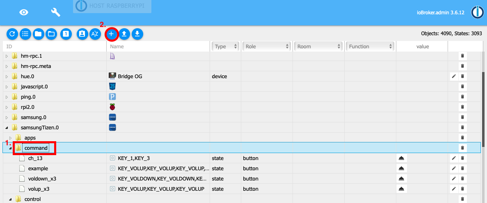

# iobroker.samsung_tizen
=====================

This adapter is to control samsung tvs with tizenOS (>=2016).
  
1. [Installation](#1-installation)  
2. [Configuration](#2-Configuration)  
2.1. [Protocol](#21-protocol)  
2.2. [IP Adress](#22-ip-address)  
2.3. [Port](#23-port)  
2.4. [Token](#24-token)  
2.5. [Mac Adress](#25-mac-adress)  
2.6. [TV State Polling](#26-tv-state-polling)  
2.7. [Command Delay](#27-command-delay)  
3. [Usage](#3-usage)  
3.1. [Control](#31-control)  
3.2. [Apps](#32-apps)  
3.3. [Commands](#33-commands)  
4. [License](#4-License)  

## 1. Installation
open iobroker admin go to the adapters tab and install the adapter from a custom source.

<details><summary>detailed installation</summary>
<p>

1. click on the github icon (install from custom URL)

2. enter this github URL https://github.com/dahuby/iobroker.samsung_tizen/tarball/master
3. click on install

4. go back to the adapters tab and search "Samsung Tizen"
5. click on "+" to add a new instance

6. configure the adapter 


</p>
</details>

## 2. Configuration
How to configure this adapter. 
First check your TV settings, switch on the TV and go to Settings / General / External Device Manager / Device Connection Manager there the access notification should be activated to "first time only"

### 2.1. Protocol
Protocol for the websocket connection to your TV.
possible values are http or wss, on newer devices use wss

### 2.2. IP Address 
IP Address of your Samsung TV

### 2.3. Port
Port for the websocket connection to your TV.
8001 unsecure port
8002 secure port

### 2.4. Token 
Token for a secure connection to your TV. 
Save the adapter with token = 0 and go to the iobroker admin object tab.
Then go to iobroker.samsung_tizen.0.config.getToken object and click the button.
If all works fine a new object iobroker.samsung_tizen.0.config.token should appear with id iobroker.samsung_tizen.0.config.token and the name is your token - copy the name (e.g. 123456789) and go back to the adapter config and paste it in the token field.
can be deactivated with value "0"

<details><summary>How to get a token manually</summary>
<p>
Install "wscat" on the device where ioBroker is running with following command:

```sh
npm install wscat
```

Turn TV on and query the token via websocket connection 

```sh
wscat -n -c wss://tvIp:8002/api/v2/channels/samsung.remote.control?name=aW9Ccm9rZXI=
```

a pop up appears on your TV that must be accepted.
take the token from the returned json response

```json
{"name":"aW9Ccm9rZXI="},"connectTime":1575818900205,"deviceName":"aW9Ccm9rZXI=","id":"12345678-797c-45b0-b0f1-233535918548","isHost":false}],"id":"12345678-797c-45b0-b0f1-233535918548","token":"10916644"},"event":"ms.channel.connect"}
```

</p>
</details>

### 2.5. MAC Address
MAC Address of your Samsung TV, will be used for WakeOnLAN. 
Does only work if your TV is connected per wire and not wireless.
If your TV is wireless connected it can only powered on from shortStandby.
wakeOnLan can be deactivated with value "0"

### 2.6. TV state polling
#### Polling Port
a port to get the power state 
default: 9110
known available ports: 9110, 9119, 9197 
#### Polling Interval 
how often the poll request shall be sent
default: 60 seconds
can be deactivated with value "0"

### 2.7. Command Delay
delay in milliseconds between the commands sent via the iobroker.samsung_tizen.0.control.sendCmd object. 

## 3. Usage

### 3.1. Control

#### Send a single key
to send a single key click the button under e.g. iobroker.samsung_tizen.0.control.KEY_MUTE

#### Send a key for a not defined button
you can send a custom (not defined) key with the iobroker.samsung_tizen.0.control.sendCmd object.
Enter the key what you want to send e.g. KEY_POWER.

#### Send multiple keys in a single command 
to send multiple key in a single command use the iobroker.samsung_tizen.0.control.sendCmd object.
enter keys separated with "," e.g. KEY_POWER,KEY_HDMI,KEY_VOLUP.

#### Create macros for commands

Go to iobroker.samsung_tizen.0.command here you can find example macros and you can create your own macros.
<a name="use_cmd">How to create a new macro</a>

### 3.2. APPS

#### Load installed Apps
to load the installed Apps click on iobroker.samsung_tizen.0.apps.getInstalledApps button.
After that, a separate object with the name start_app_name is created for each installed app.

#### Start App
you can start an app with a click on the iobroker.samsung_tizen.0.apps.start_app_name object.

### Power State 

if you have the power state polling configured as mentioned above, you get the under iobroker.samsung_tizen.0.powerOn the state true if your tv is on or false if it is off.

### 3.3. Commands

Commands can be manually sent via the iobroker.samsung_tizen.0.control.sendCmd object as mentioned in <a name="use_ctrl">Control</a> or over a custom created objects under iobroker.samsung_tizen.0.command .
There are few example commands but you can also create your own macros.
<details><summary>How to create a command macro </summary>
<p>

1. go to adapters and open iobroker.samsung_tizen.0.command
2. click on the + icon to create a new object

3. check that the parent object is iobroker.samsung_tizen.0.command
4. enter a new name for your command and check that type is datapoint and stateType = boolean.

5. under name enter the keys what you want to send.
6. role must be button 
7. and save

8. then you can send your command with the newly created object

</p>
</details>

## Credits

The first generation of this adapter has been developed by Stefan0875 (https://github.com/Stefan0875) which has been adapted and maintined by highpressure (https://github.com/Highpressure) and finaly dahuby (https://github.com/dahuby). Thanks a lot for their work and grantig a publich license.

## Changelog

<!--
    Placeholder for the next version (at the beginning of the line):
    ### **WORK IN PROGRESS**
-->

### **WORK IN PROGRESS**
- (copilot) Adapter requires js-controller >= 6.0.11 now
- (copilot) Adapter requires admin >= 7.6.17 now

### 1.1.0 (2024-04-26)
* (mcm1957) Adapter requires node.js >= 18 and js-controller >= 5 now
* (mcm1957) Dependencies have been updated

### 1.0.0 (2023-09-30)
- (mcm1957) An official release has been created

### 1.0.0-alpha.2 (2023-09-24)
- (mcm1957) Dependencies have been updated

### 1.0.0-alpha.1 (2023-09-24)
- (mcm1957) Adapter requires node 16 or newer now.
- (mcm1957) Adapter has been moved to iobroker-community-adapters organization.

## License

MIT License 


Copyright (c) 2023-2026 iobroker-community-adapters <iobroker-community-adapters@gmx.de>  
Copyright (c) 2020 dahuby

Permission is hereby granted, free of charge, to any person obtaining a copy
of this software and associated documentation files (the "Software"), to deal
in the Software without restriction, including without limitation the rights
to use, copy, modify, merge, publish, distribute, sublicense, and/or sell
copies of the Software, and to permit persons to whom the Software is
furnished to do so, subject to the following conditions:

The above copyright notice and this permission notice shall be included in all
copies or substantial portions of the Software.

THE SOFTWARE IS PROVIDED "AS IS", WITHOUT WARRANTY OF ANY KIND, EXPRESS OR
IMPLIED, INCLUDING BUT NOT LIMITED TO THE WARRANTIES OF MERCHANTABILITY,
FITNESS FOR A PARTICULAR PURPOSE AND NONINFRINGEMENT. IN NO EVENT SHALL THE
AUTHORS OR COPYRIGHT HOLDERS BE LIABLE FOR ANY CLAIM, DAMAGES OR OTHER
LIABILITY, WHETHER IN AN ACTION OF CONTRACT, TORT OR OTHERWISE, ARISING FROM,
OUT OF OR IN CONNECTION WITH THE SOFTWARE OR THE USE OR OTHER DEALINGS IN THE
SOFTWARE.
