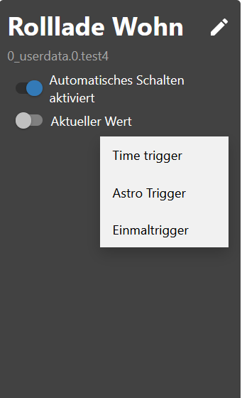
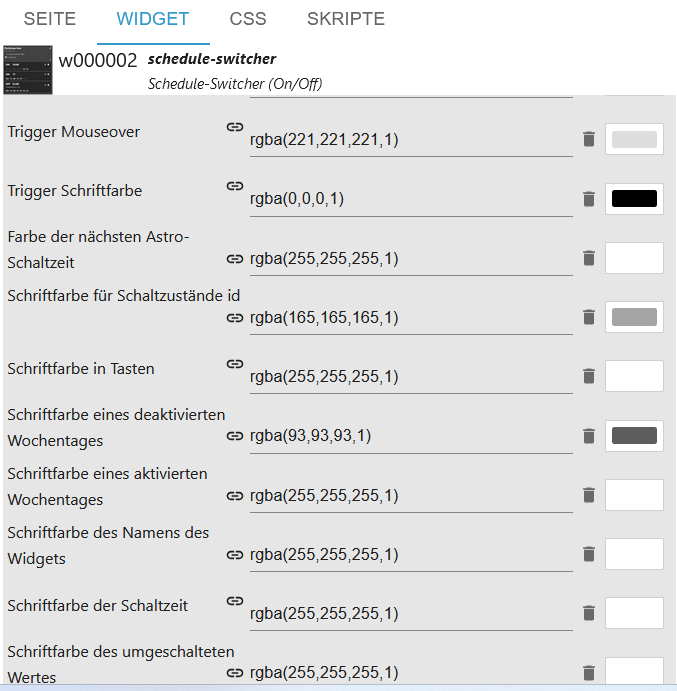
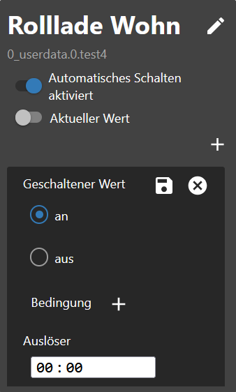
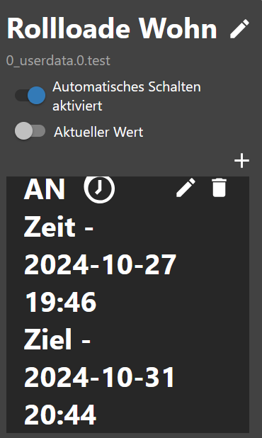

# ioBroker.schedule-switcher

[Back to the README](/README.md)

# Introduction

This adapter allows the user to switch devices on/off or 100/0 using time schedules.
The schedules can be fully configured by a vis or vis-2 widget.
One schedule switches one or more ioBroker states and consists of one or more triggers that define when and how the state should be switched.
It is possible to configure at which time and on which weekdays the trigger should be triggered. Astro triggers or countdowns can also be created.

# Summary

-   [Instance Settings](#instance-settings-schedule-switcher)
-   [Objecte](#states)
-   [Example trigger evenst as JSON](#example-trigger-events-json)
-   [Example trigger as JSON](#example-trigger-json)
-   [Example sendTo Trigger (Experts only)](#example-of-creating-or-editing-triggers-with-sendto-experts)
-   [Example widget as JSON](#example-widgets-json)
-   [Example history as JSON](#example-history-json)
-   [Example widget view as JSON](#example-widget-view-json)
-   [Create widget](#create-widget)
-   [Change name](#change-name)
-   [Create condition](#create-condition)
-   [Change text](#change-text)
-   [Use css](#use-css-description-see-css)
-   [Create trigger](#trigger)
-   [create astro trigger](#astro-trigger)
-   [Create one time trigger](#one-time-trigger)
-   [CSS](#css)

### Instance settings schedule-switcher

[Summary](#summary)

-   `+ icon`: Add new schedule
-   `ID`: object channel id
-   `Object id`: object
-   `Object name`: Name of the widget
-   `Trigger count`: Number of triggers
-   `Status`: Status enabled/disabled
-   `Delay between 2 switching operations in ms`: Prevents states from being set at the same time
-   `History switching as JSON (max 100/0 for off)` Max. history json

    

### States

[Summary](#summary)

-   onoff
-   `schedule-switcher.0.onoff.6.data` All triggers as JSON
-   `schedule-switcher.0.onoff.6.enabled` Active or Inactive
-   `schedule-switcher.0.onoff.6.views` Where widgets were created for the objects
-   Status
-   `schedule-switcher.0.counterTrigger` Number of triggers (active and inactive)
-   `schedule-switcher.0.history` History from schedules switching
-   `schedule-switcher.0.nextEvents` Next switching operations as JSON Table
-   `schedule-switcher.0.sendto` With VIS-2, changes are passed to the adapter via this object


# Example trigger events JSON

[Summary](#summary)

```json
[
    {
        "type": "TimeTrigger", // TimeTrigger, AstroTrigger or OneTimeTrigger
        "name": "Rollloade Wohn", // Name
        "triggerid": 0, // Trigger ID
        "action": "OnOffStateAction", // OnOffStateAction or Condition
        "states": ["0_userdata.0.test", "0_userdata.0.test5"], // States
        "active": true, // enabled true or false
        "hour": 16, // Hour
        "minute": 22, // Minute
        "day": 9, // Day
        "dateISO": "2024-11-09T15:22:00.000Z", // Time without timezone
        "timestamp": 1731165720000, // Timestamp without timezone
        "objectId": 1 // ObejektId schedule-switcher.0.onoff.<objectid>.data
    }
]
```

# Example trigger JSON

[Summary](#summary)

```json
{
    "type": "OnOffSchedule",
    "name": "Rolllade Wohn", // Name of the last widget created
    "onAction": {
        // Action for On
        "type": "OnOffStateAction",
        "valueType": "number",
        "onValue": 0,
        "offValue": 100,
        "booleanValue": true,
        "idsOfStatesToSet": ["0_userdata.0.test4"] // States max. 10
    },
    "offAction": {
        // Action for Off
        "type": "OnOffStateAction",
        "valueType": "number",
        "onValue": 0,
        "offValue": 100,
        "booleanValue": false,
        "idsOfStatesToSet": ["0_userdata.0.test4"] // States max. 10
    },
    "triggers": [
        {
            "type": "AstroTrigger", // Trigger - AstroTrigger - OneTimeTrigger
            "astroTime": "sunrise",
            "shiftInMinutes": 0,
            "weekdays": [1, 2, 3, 4, 5, 6],
            "id": "0",
            "action": {
                "type": "ConditionAction",
                "condition": {
                    "type": "StringStateAndConstantCondition",
                    "constant": "true",
                    "stateId": "0_userdata.0.test",
                    "sign": "=="
                },
                "action": {
                    "type": "OnOffStateAction",
                    "name": "On"
                }
            }
        }
    ]
}
```

# Example widgets JSON

[Summary](#summary)

```json
{
    "vis-2.0": {
        // Which VIS version
        "main": {
            // Project
            "w000005": {
                // Widget ID
                "prefix": "main", // Project
                "namespace": "vis-2.0", // Which VIS version
                "view": "Rollladen", // Which view
                "widgetId": "w000005", // Widget ID
                "newId": "schedule-switcher.0.onoff.6.data", // New Object
                "oldId": "timer-switch.0.onoff.1.data", // Old Object
                "enabled": "schedule-switcher.0.onoff.6.enabled", // Enabled Objekt
                "stateCount": 1, // Counter States
                "state": [
                    // States
                    {
                        "oid-stateId1": "0_userdata.0.test5"
                    }
                ],
                "conditionCount": 1, // Counter Conditions
                "condition": [
                    // States of Conditions
                    {
                        "oid-conditionStateId1": "0_userdata.0.test"
                    }
                ]
            },
            "w000006": {
                // Which VIS version
                "prefix": "main", // Project
                "namespace": "vis-2.0", // Which VIS version
                "view": "Test", // Which view
                "widgetId": "w000006", // Widget ID
                "newId": "schedule-switcher.0.onoff.6.data", // New Object
                "oldId": "timer-switch.0.onoff.1.data", // Old Object
                "enabled": "schedule-switcher.0.onoff.6.enabled", // Enabled Objekt
                "stateCount": 1, // Counter States
                "state": [
                    // States
                    {
                        "oid-stateId1": "0_userdata.0.test4"
                    }
                ],
                "conditionCount": 1, // Counter Conditions
                "condition": [] // States of Conditions
            }
        }
    }
}
```

# Example of creating or editing triggers with sendTo (experts)

[Summary](#summary)

```JSON
sendTo("schedule-switcher.0", "add-trigger", { // Create new trigger
    "dataId":"schedule-switcher.0.onoff.6.data",
    "triggerType":"TimeTrigger",
    "actionType":"OnOffStateAction"
});

sendTo("schedule-switcher.0", "update-trigger", { // Set the action for the new trigger
    "dataId":"schedule-switcher.0.onoff.6.data",
    "trigger":{
        "type":"TimeTrigger",
        "hour":12,
        "minute":32,
        "weekdays":[1,2,3,4,5],
        "id":"0", // Known ID
        "action":{
            "type":"OnOffStateAction",
            "name":"On"
        }
    }
});

sendTo("schedule-switcher.0", "add-trigger", { // Create new Astrotrigger
    "dataId":"schedule-switcher.0.onoff.6.data",
    "triggerType":"AstroTrigger",
    "actionType":"OnOffStateAction"
});

sendTo("schedule-switcher.0", "update-trigger", { // Set the action for the new trigger
    "dataId":"schedule-switcher.0.onoff.6.data",
    "trigger":{
        "type":"AstroTrigger",
        "astroTime":"sunrise", // sunrise, sunset or solarNoon
        "shiftInMinutes":0,
        "weekdays":[1,2,3,4,5],
        "id":"0", // ID abgleichen
        "action":{
            "type":"OnOffStateAction",
            "name":"On"
        }
    }
});

sendTo("schedule-switcher.0", "disable-schedule", { // deactivate trigger
    "dataId":"schedule-switcher.0.onoff.6.data"
});

sendTo("schedule-switcher.0", "enable-schedule", { // activate trigger
    "dataId":"schedule-switcher.0.onoff.6.data"
});

sendTo("schedule-switcher.0", "add-one-time-trigger", { // Create onetimetrigger
    "dataId":"schedule-switcher.0.onoff.6.data",
    "trigger":"{\"type\":\"OneTimeTrigger\",\"date\":\"2024-10-17T06:14:22.660Z\",\"timedate\":false,\"action\":{\"type\":\"OnOffStateAction\",\"name\":\"On\"}}"
});

sendTo("schedule-switcher.0", "delete-trigger", { // Delete trigger with known ID
    "dataId":"schedule-switcher.0.onoff.6.data",
    "triggerId":"0"
});
```

# Example history JSON

[Summary](#summary)

```JSON
[
  {
    "setObjectId": "0_userdata.0.test4",
    "objectId": 0,
    "value": "true",
    "object": "0_userdata.0.test4",
    "trigger": "TimeTrigger",
    "astroTime": "unknown",
    "shift": 0,
    "date": 0,
    "hour": 20,
    "minute": 48,
    "weekdays": [
      [
        1,
        2,
        3,
        4,
        5,
        6,
        0
      ]
    ],
    "time": 1729622880040
  },
  {
    "setObjectId": "0_userdata.0.test4",
    "objectId": 0,
    "value": "true",
    "object": "0_userdata.0.test4",
    "astroTime": "unknown",
    "shift": 0,
    "date": 0,
    "hour": 20,
    "minute": 47,
    "weekdays": [
      [
        1,
        2,
        3,
        4,
        5,
        6,
        0
      ]
    ],
    "time": 1729622820071
  }
]
```

# Example Widget View JSON

[Summary](#summary)

```json
{
    "vis-2.0": {
        "main": {
            "w000004": {
                "prefix": "main", // Project
                "namespace": "vis-2.0", // VIS
                "view": "default", // View
                "widgetId": "w000004", // Widget ID
                "newId": "schedule-switcher.0.onoff.3.data" // Object ID
            }
        }
    },
    "vis.0": {
        "main": {
            "w00001": {
                "prefix": "main",
                "namespace": "vis.0",
                "view": "Rollo",
                "widgetId": "w00001",
                "newId": "schedule-switcher.0.onoff.3.data"
            }
        }
    }
}
```

### Create widget

[Summary](#summary)

-   Insert a widget in a view


-   Select ID for schematic data
-   Select Schedule Activation ID
-   Select ID of the switched state (max. 10 possible)


-   Define value type and the values ​​that should be set


-   Create on time schedule



### Change name

[Summary](#summary)

-   Change names - objects are customized


### Create condition

[Summary](#summary)

-   Create a condition.


### Change text

[Summary](#summary)

-   Change text on/off and all on/all off


### Use css [Description see css](#css)

[Summary](#summary)

-   Use Enable CSS to customize the style</br>
    </br>
    </br>
    </br>
    
    </br>
    </br>
    </br>
    </br>
    

### Trigger

[Summary](#summary)

-   Click on the pen to enter the time or click on the trash can to delete the trigger


-   Select switching state
-   Select a condition (optional)
-   Enter time (hh:mm)

```:warning:
 ⚠ Does not show any time field in Firefox.
```



-   Select day of the week
-   Click save at the top right


-   Done


### Astro Trigger

[Summary](#summary)

-   Click on the pen to select the astro time or click on the trash can to delete the trigger


-   Select switching state
-   Select a condition (optional)
-   Select astro time (Sunrise, Sunset or Noon)


-   Enter offset in minutes (optional)
-   Select day of the week
-   Click save at the top right


-   Done


### One Time Trigger

[Summary](#summary)

-   Select switching state
-   Select a condition (optional)
-   Enter time (hh:mm:ss)
-   Click save at the top right


-   Done


-   Select switching state
-   Select a condition (optional)
-   Enter or select time/date (dd.mm.yyyy hh:mm:ss)
-   Click save at the top right

```:warning:
 ⚠ Does not show any time field in Firefox.
```

</br>


-   Done



### CSS

[Summary](#summary)

```
app-on-off-schedules-widget {
    /* Primary color (button background, toggle switch color) */
    --ts-widget-primary-color: #337ab7;

    /* Background color of the widget */
    --ts-widget-bg-color: #424242;
    /* Background color of the triggers */
    --ts-widget-trigger-bg-color: #272727;

    /* Foreground color (font color and scrollbar color) */
    --ts-widget-fg-color: white;
    /* Font color of the switched states id */
    --ts-widget-oid-fg-color: #a5a5a5;
    /* Font color in buttons */
    --ts-widget-btn-fg-color: white;
    /* Font color of a disabled weekday */
    --ts-widget-weekdays-disabled-fg-color: #5D5D5D;
    /* Font color of an enabled weekday */
    --ts-widget-weekdays-enabled-fg-color: white;
    /* Font color of the name of the widget (defaults to --ts-widget-fg-color) */
    --ts-widget-name-fg-color: white;
    /* Font color of switched time (defaults to --ts-widget-fg-color) */
    --ts-widget-switched-time-fg-color: white;
    /* Font color of switched value (defaults to --ts-widget-fg-color)*/
    --ts-widget-switched-value-fg-color: white;
    /* Font color of the astro time (defaults to --ts-widget-fg-color) */
    --ts-widget-astro-time-fg-color: black;
    /* Font color of the astro time's shift */
    --ts-widget-astro-shift-fg-color: #5d5d5d;
    /* Font color of condition (defaults to --ts-widget-fg-color) */
    --ts-widget-condition-fg-color: white;
    /* Font color of toogle button off */
    --ts-widget-off-color: #c0c0c0;
    /* Color background toogle button off */
    --ts-widget-off-color-container: #808080;
    /* Color of next astro switching time */
    --ts-widget-astro-next-fg-color: white;

    /* Font family used in the whole widget */
    --ts-widget-font-family: 'Roboto', 'Segoe UI', BlinkMacSystemFont, system-ui, -apple-system;
    /* Font size of the name of the widget */
    --ts-widget-name-font-size: 2em;
    /* Font size of the switched oid */
    --ts-widget-oid-font-size: 30px;
    /* Font size of switch text */
    --ts-widget-state-action-width: 65px;
    /* Font size of next astro switching time */
    --ts-widget-astro-next-font-size: 2em;
    /* Width of date time input */
    --ts-widget-datetime-width: 230px;

    /* Display of edit name button. Use 'none' to hide the button and 'block' to show it
    --ts-widget-edit-name-button-display: block;
    /* Display of condition. Use 'none' to hide the condition and 'block' to show it
    -ts-widget-condition-display: block;
    /* Display of time icon. Use 'none' to hide the button and 'block' to show it
    --ts-widget-time-icon-display: none;

    /* Applies a filter to icons used in buttons (safe, edit, remove, cancel), for
       white use invert(1) and for black invert(0) */
    --ts-widget-img-btn-filter: invert(1);

    /* Add trigger dropdown background color */
    --ts-widget-add-trigger-dropdown-bg-color: #f1f1f1;
    /* Add trigger dropdown font color */
    --ts-widget-add-trigger-dropdown-fg-color: black;
    /* Add trigger dropdown hover background color */
    --ts-widget-add-trigger-dropdown-hover-bg-color: #ddd;

    /* ! Changing these may break the layout, change at your own risk */

    /* Font size of weekdays */
    --ts-widget-weekdays-font-size: 23px;
    /* Font size of switched value (on/off) */
    --ts-widget-switched-value-font-size: 2em;
    /* Font size of switched time */
    --ts-widget-switched-time-font-size: 2em;
    /* Font size of the astro time (e.g. Sunrise, ...) */
    --ts-widget-astro-time-font-size: 1.5em;
    /* Font size of the astro time's shift */
    --ts-widget-astro-shift-font-size: 1em;
    /* Font size of condition */
    --ts-widget-condition-font-size: 1em;
}
```

## Changelog

<!--
    Placeholder for the next version (at the beginning of the line):
    ### **WORK IN PROGRESS**
-->
### 0.0.6 (2024-11-16)

-   (Lucky_ESA) Put value of state correctly
-   (Lucky_ESA) Added next triggers as JSON
-   (Lucky_ESA) Added counter trigger
-   (Lucky_ESA) Updating astro time fixed

### 0.0.5 (2024-11-06)

-   (Lucky_ESA) Crash when updating astro time fixed
-   (Lucky_ESA) Fixed some bugs

### 0.0.4 (2024-11-04)

-   (Lucky_ESA) Temporary function removed
-   (Lucky_ESA) Creation of objects adjusted
-   (Lucky_ESA) Validation check of the states
-   (Lucky_ESA) Validation check for 2 widgets with one object

### 0.0.3 (2024-10-30)

-   (Lucky_ESA) Fixed VIS translate
-   (Lucky_ESA) Added astro time in trigger
-   (Lucky_ESA) Fixed OneTimeTrigger
-   (Lucky_ESA) Added date for OneTimeTrigger
-   (Lucky_ESA) Fixed some bugs

### 0.0.2 (2024-10-22)

-   (Lucky_ESA) Fix translate
-   (Lucky_ESA) Fix background color disable Weekdays
-   (Lucky_ESA) Fix sendTo
-   (Lucky_ESA) Added jsonConfig
-   (Lucky_ESA) Added history

### 0.0.1 (2024-10-19)

-   (Lucky_ESA) initial release

## License

MIT License

Copyright (c) 2024 Lucky_ESA <github@luckyskills.de>

Permission is hereby granted, free of charge, to any person obtaining a copy
of this software and associated documentation files (the "Software"), to deal
in the Software without restriction, including without limitation the rights
to use, copy, modify, merge, publish, distribute, sublicense, and/or sell
copies of the Software, and to permit persons to whom the Software is
furnished to do so, subject to the following conditions:

The above copyright notice and this permission notice shall be included in all
copies or substantial portions of the Software.

THE SOFTWARE IS PROVIDED "AS IS", WITHOUT WARRANTY OF ANY KIND, EXPRESS OR
IMPLIED, INCLUDING BUT NOT LIMITED TO THE WARRANTIES OF MERCHANTABILITY,
FITNESS FOR A PARTICULAR PURPOSE AND NONINFRINGEMENT. IN NO EVENT SHALL THE
AUTHORS OR COPYRIGHT HOLDERS BE LIABLE FOR ANY CLAIM, DAMAGES OR OTHER
LIABILITY, WHETHER IN AN ACTION OF CONTRACT, TORT OR OTHERWISE, ARISING FROM,
OUT OF OR IN CONNECTION WITH THE SOFTWARE OR THE USE OR OTHER DEALINGS IN THE
SOFTWARE.