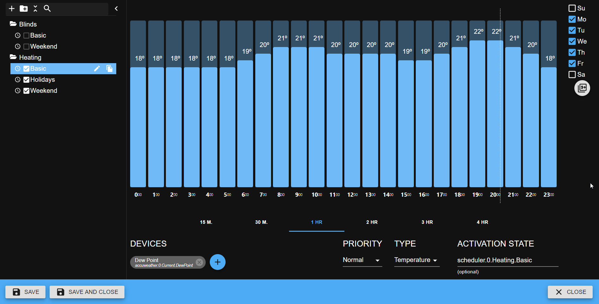

# ioBroker Scheduler Adapter

  

This adapter is designed to control devices on a schedule. For example, heating or watering control.

You can create the profiles with different priority: normal (e.g. workdays), high (e.g. weekends) and highest (e.g. for holidays).
The profile with higher priority overloads other profiles.

For every profile the active variable will be created. But the user can select own activation variable e.g. to control holidays. 

The user should add devices to profile and all devices in profile will be set to the same value.

<!--
	Placeholder for the next version (at the beginning of the line):
	### __WORK IN PROGRESS__
-->

## Changelog
### 0.1.2 (2021-09-14)
* (bluefox) "Sentry" was added
 
### 0.1.1 (2021-09-13)
* (bluefox) Initial release

### 0.1.0 (2021-05-19)
* (bluefox) Initial commit

## License
The MIT License (MIT)

Copyright (c) 2021 bluefox <dogafox@gmail.com>

Permission is hereby granted, free of charge, to any person obtaining a copy
of this software and associated documentation files (the "Software"), to deal
in the Software without restriction, including without limitation the rights
to use, copy, modify, merge, publish, distribute, sublicense, and/or sell
copies of the Software, and to permit persons to whom the Software is
furnished to do so, subject to the following conditions:

The above copyright notice and this permission notice shall be included in all
copies or substantial portions of the Software.

THE SOFTWARE IS PROVIDED "AS IS", WITHOUT WARRANTY OF ANY KIND, EXPRESS OR
IMPLIED, INCLUDING BUT NOT LIMITED TO THE WARRANTIES OF MERCHANTABILITY,
FITNESS FOR A PARTICULAR PURPOSE AND NONINFRINGEMENT. IN NO EVENT SHALL THE
AUTHORS OR COPYRIGHT HOLDERS BE LIABLE FOR ANY CLAIM, DAMAGES OR OTHER
LIABILITY, WHETHER IN AN ACTION OF CONTRACT, TORT OR OTHERWISE, ARISING FROM,
OUT OF OR IN CONNECTION WITH THE SOFTWARE OR THE USE OR OTHER DEALINGS IN THE
SOFTWARE.

