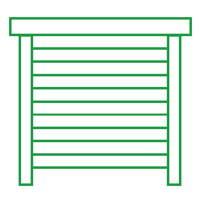

# ioBroker.selveRF

**Tests:** 

## selveRF adapter for ioBroker

Connection with Selve actuators, sensors and senders through USB-Gateway

[See the wiki for setup instructions](https://github.com/Rintrium/ioBroker.selverf/wiki)

This project is not affiliated with Selve. It is a personal project.

## Changelog
### 0.6.2 (2022-01-22)
* Fix critical error for sensors and senders

### 0.6.1 (2022-01-19)
* Stable version release
* Minor (non functional) changes

### 0.5.3 (2022-01-08)
* Improved error handling and longer wait period, before the connection with the gateway resets
* scaledPosition was split into scaledPosition and scaledTargetPosition
* Inverted states for scaledPosition and scaledTargetPosition were added
* Gateway log events now are properly logged in ioBroker as debug-messages

### 0.5.2 (2021-10-27)
* Fixed drivePos2 command for iveo actuators

### 0.5.1 (2021-10-25)
* Bugfix

### 0.5.0 (2021-10-20)
* Added support for senders
* iveo actuators now have "lastSentCommand" to keep track of the status of the actuator

### 0.4.0 (2021-09-22)
* Added iveo actuators
* Added sensors

### 0.3.7 (2021-09-16)
* Bugfix

### 0.3.6 (2021-09-16)
* Improved debug logging
* Bugfix in command enqueueing
* Added wait time after fault code from gateway before next try
* Added small delay while sending multiple messages
* Remove unsuccessful ping messages from sending queue

### 0.3.5 (2021-09-13)
* Bugfix in message receiving
* Updated dependencies

### 0.3.4 (2021-09-08)
* More robust message receiving from gateway (incomplete messages now get discarded)
* Bugfix for the reconnection routine
* Added scaled position

### 0.3.3 (2021-08-24)
* Fix fatal crash when a timeout occurs

### 0.3.2 (2021-08-24)
* Added logo
* Changes for testing

### 0.3.1 (2021-08-10)
* Implemented retries for message sending and automatic adapter restarts

### 0.3.0 (2021-07-14)
* Implemented ability to receive multiple gateway messages from one message through the serialport
* Implemented handling of of command.result
* Implemented aggregation of commands to send

### 0.2.3 (2021-07-11)
* Implemented fault code handling from gateway

### 0.2.2 (2021-07-11)
* Improved logging

### 0.2.1 (2021-07-11)
* Serialport now properly closes, when the adapter is stopped
* small bugfixes

### 0.2.0 (2021-07-11)
* Refactored parts of the code and added more comments
* Implemented more states for commeo actuators

### 0.1.0 (2021-07-10)
* First implementation of commeo actuators

### 0.0.1 (2021-06-16)
* (Rintrium) initial release

## License
MIT License

Copyright (c) 2021-2022 Rintrium <main@rintrium.de>

Permission is hereby granted, free of charge, to any person obtaining a copy
of this software and associated documentation files (the "Software"), to deal
in the Software without restriction, including without limitation the rights
to use, copy, modify, merge, publish, distribute, sublicense, and/or sell
copies of the Software, and to permit persons to whom the Software is
furnished to do so, subject to the following conditions:

The above copyright notice and this permission notice shall be included in all
copies or substantial portions of the Software.

THE SOFTWARE IS PROVIDED "AS IS", WITHOUT WARRANTY OF ANY KIND, EXPRESS OR
IMPLIED, INCLUDING BUT NOT LIMITED TO THE WARRANTIES OF MERCHANTABILITY,
FITNESS FOR A PARTICULAR PURPOSE AND NONINFRINGEMENT. IN NO EVENT SHALL THE
AUTHORS OR COPYRIGHT HOLDERS BE LIABLE FOR ANY CLAIM, DAMAGES OR OTHER
LIABILITY, WHETHER IN AN ACTION OF CONTRACT, TORT OR OTHERWISE, ARISING FROM,
OUT OF OR IN CONNECTION WITH THE SOFTWARE OR THE USE OR OTHER DEALINGS IN THE
SOFTWARE.