#  ioBroker.senec

## SENEC Adapter for ioBroker

Monitor and control your SENEC home battery storage system. The adapter supports four independent connectors that can be used individually or combined:

- **Local** (lala.cgi) — Direct LAN polling with 10-second real-time updates. Provides full BMS data, grid meter readings, wallbox data, and appliance control.
- **SENEC App API** — Cloud-based polling via the SENEC App API. Dashboard data, measurement history, system details, and wallbox information.
- **mein-senec.de** — Web portal polling. Status overview, measurement history, autarky, emergency power, peak shaving, SG-Ready, and switchable socket control.
- **SENEC.Connect** — Azure-based API. Battery and meter data via subscription key.

Not all connectors are required. Choose based on your needs — local-only setups work fine, as do cloud-only configurations for systems without local web access.

### Supported Systems

Practically every SENEC storage system works: the Home range from the early lead-acid and lithium
models through V2, V2.1 and V3, the current V4 | P4 | E4 generation, the Business models, and the
partner variants ADS Tec, OEM LG and Solarinvert.

Systems with a local web interface can use all four connectors. Those without one — the V4
generation among them — work through the SENEC App API, mein-senec.de and SENEC.Connect. Which
data points appear varies by model.

See the [full list of models](../SUPPORTED_SYSTEMS.md) to find your system by name.

## Disclaimer
**All product and company names or logos are trademarks™ or registered® trademarks of their respective holders. Use of them does not imply any affiliation with or endorsement by them or any associated subsidiaries! This personal project is maintained in spare time and has no business goal.**

**No warranty, and no liability.** This adapter is a spare-time project, provided as-is under the MIT license. It talks to an expensive appliance over interfaces SENEC neither documents nor supports, and it can send commands that change how that appliance behaves. Everything you do with it is your own responsibility. The author accepts no liability for damage to your system, lost or wrong data, missed feed-in, or any other consequence of using it — and cannot tell you whether using it affects your warranty or support arrangements with SENEC or your installer. If that is not acceptable to you, please do not use this adapter.

## Prerequisites

- ioBroker with Node.js >= 22
- SENEC battery system on the local network (for Local connector)
- mein-senec.de account (for API and Web connectors)
- ioBroker.web adapter installed (for the built-in dashboard)

## Installation

Install the adapter from the ioBroker adapter repository. After installation, create an adapter instance and configure at least one connector.

## Configuration

The adapter settings are organized in tabs — one per connector plus general settings and debug options.

### SENEC Account

Enter your mein-senec.de credentials here. These are shared by the SENEC App API and mein-senec.de connectors. You can also configure the User-Agent mode for outbound HTTP requests.

#### Two-Factor Authentication (2FA)

If two-factor authentication is enabled on your mein-senec.de account, the adapter can log in on its own — it does not need you to be there to type a code.

Enrolment shows a QR code for your authenticator app and, next to it, the same secret as text. That text secret is what goes into the **TOTP Secret** field. Take it from the setup screen while it is on display; once 2FA is active the secret is not shown again, and you would have to re-enrol to see a new one. Spaces and dashes in it do not matter.

What belongs there is the permanent secret, not the six-digit code your app shows — that changes every thirty seconds and would be stale before the adapter ever used it.

One secret covers both cloud connectors, since they authenticate against the same account. If 2FA is required and the field is empty, the adapter says so plainly in the log rather than reporting a failed login.

### Local Connection (lala.cgi)

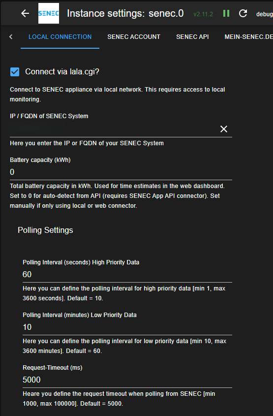

| Setting | Description | Default |
|---------|-------------|---------|
| Connect via lala.cgi | Enable local polling | On |
| SENEC System IP | IP address or FQDN of your SENEC device | — |
| Use HTTPS | Enable if your device uses HTTPS | Off |

Expand **Polling Settings** to adjust timing:

| Setting | Description | Default |
|---------|-------------|---------|
| Polling interval (high priority) | How often to poll real-time data (seconds) | 10 |
| Polling interval (low priority) | How often to poll slow-changing data (minutes) | 60 |
| Request timeout | Timeout for HTTP requests (ms) | 5000 |

The adapter retries automatically with exponential backoff on connection failures — no manual retry configuration needed. If the SENEC device is temporarily unreachable (reboot, firmware update), polling resumes automatically when the device comes back online.

#### TLS Certificate Validation

The adapter validates the SENEC device's HTTPS certificate using a multi-layer approach:

1. **User CA** — Upload the SenecGui-Root CA certificate via the dashboard (System tab → TLS Certificate). Download it from mein-senec.de (Documents / General Documents / SenecGui-Root) and upload the .pem or .zip file. SENEC distributes this certificate behind a login, so the adapter cannot bundle it.
2. **Cached CA** — If no user cert is provided, the adapter can automatically download the CA from mein-senec.de (requires the mein-senec.de connector to be enabled). The downloaded cert is cached in adapter state and persists across restarts.
3. **TOFU (Trust On First Use)** — If no CA cert validates, the adapter records the device's certificate fingerprint on first contact and compares every later connection against it. A warning is logged if the fingerprint changes (e.g. after a firmware update), and the new fingerprint is then accepted automatically.

The adapter tries each layer in order and uses the first one that validates.

TOFU is continuity monitoring, not certificate pinning: it tells you that the appliance's certificate changed, but it does not refuse the new one, and it does not verify the certificate chain. It is a deliberate trade-off for a device on your own network — a legitimate certificate change must never leave the adapter disconnected until you notice a log line. For full verification, supply the CA: uploading it is optional but it is the stronger option.

If automatic CA download failed and you want to retry, set `_local.tls.certFetchFailed` to `false` — the adapter will attempt the download again on the next restart or immediately if running.

**Important**: Polling too frequently or requesting too many data points can overload your SENEC device. This may cause the device to restart, become unresponsive, or fail to synchronize with the SENEC cloud. If you experience issues, reduce the polling frequency or stop the adapter.

#### Additional High-Priority Polling Data Points

You can add additional data sections (e.g. BMS, PV1, WALLBOX) to the high-priority polling cycle. This requires accepting a disclaimer acknowledging the risks. Only characters A-Z, digits 0-9, and commas are allowed.

### SENEC App API

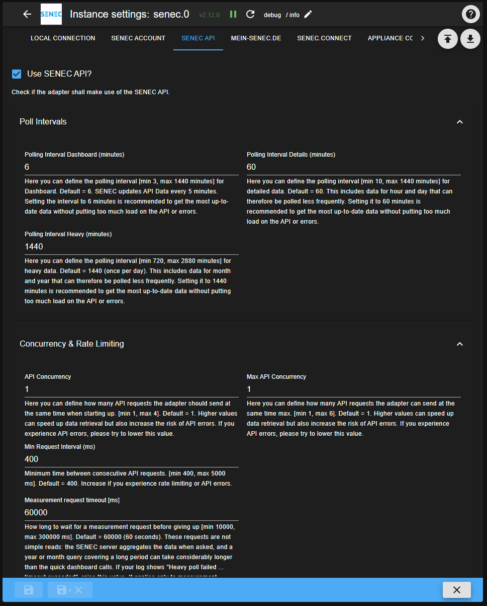

| Setting | Description | Default |
|---------|-------------|---------|
| Use SENEC App API | Enable cloud API polling | Off |
| Dashboard interval | Polling interval for dashboard/current data (minutes) | 6 |
| Details interval | Polling interval for day-level measurement data (minutes) | 60 |
| Heavy interval | Polling interval for month/year measurements (minutes) | 1440 (24h) |
| Concurrency / Max concurrency | Parallel API request limits | 1 / 1 |
| Min request interval | Minimum time between API requests (ms) | 400 |
| API request timeout | How long to wait for an ordinary API request — dashboard, system status, details (ms). Raise it if the log shows those requests timing out | 30000 |
| Measurement request timeout | How long to wait for a measurement aggregation (ms). Raise it if the log shows heavy polls timing out | 60000 |

#### History Rebuild

The API connector can rebuild historical measurement data (AllTime totals) from scratch. Configure the rebuild mode and start year if needed. This runs as a background process during the heavy polling tier.

### mein-senec.de

| Setting | Description | Default |
|---------|-------------|---------|
| Use mein-senec.de | Enable web portal polling | Off |
| Status interval | Polling interval for status data (minutes) | 6 |
| Medium interval | Polling interval for yesterday/autarky/spare capacity (minutes) | 360 (6h) |
| Slow interval | Polling interval for monthly/yearly/AllTime data (minutes) | 1440 (24h) |
| Poll measurement history | Enable measurement data polling | Off |
| Include 5-min detail data | Poll fine-grained detail data (~3,500 additional states) | Off |
| Concurrency / Max concurrency | Parallel request limits | 1 / 2 |
| Min request interval | Minimum time between requests (ms) | 500 |

### Additional Systems on the Account

If your mein-senec.de account holds more than one system — a replaced appliance still shows up alongside its successor — the adapter discovers all of them at startup and registers each under `_meinsenec.Plants.{steuereinheitnummer}.`.

Only the first system is polled by default. Each additional one gets its own switch at `control.Plants.{steuereinheitnummer}.poll`, off until you set it. Turning it on adds that system to the slow polling tier, filling the same measurement structure the main system uses:

| State | Contents |
|-------|----------|
| `_meinsenec.Plants.{sn}.System.*` | Product name, device number, plant number |
| `_meinsenec.Plants.{sn}.Measurements.Daily.today` / `.yesterday` | Hourly measurement data |
| `_meinsenec.Plants.{sn}.Measurements.Monthly.*` | Daily breakdown per month |
| `_meinsenec.Plants.{sn}.Measurements.Yearly.*` | Monthly breakdown per year |
| `_meinsenec.Plants.{sn}.Measurements.AllTime.*` | Lifetime totals |
| `_meinsenec.Plants.{sn}.Autarky.*` | Autarky per period |

Lifetime totals are fetched once when a system is first discovered, even with the switch off, so a decommissioned appliance's final figures are available without polling it continuously.

Bear in mind that each enabled system multiplies the requests made to the portal. If you only want the historical totals of an old appliance, leaving its switch off is usually enough.

### SENEC.Connect

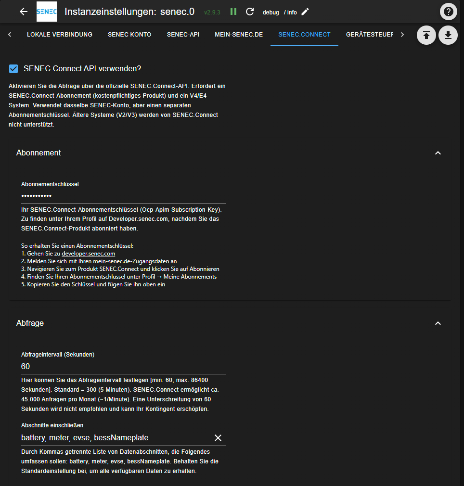

| Setting | Description | Default |
|---------|-------------|---------|
| Use SENEC.Connect | Enable Azure API polling | Off |
| Polling interval | How often to poll (seconds) | 300 |
| Subscription key | Azure API subscription key | — |
| Include sections | Which data sections to request | battery,meter |

### External Sources

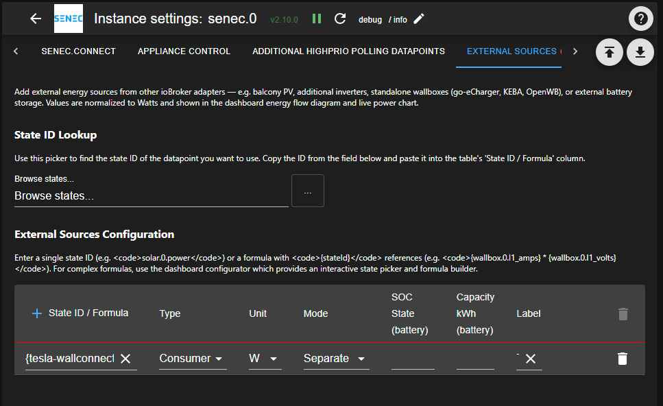

Add external energy sources from other ioBroker adapters — e.g. balcony PV, additional inverters, standalone wallboxes, heat pumps, or external battery storage. Values are normalized to Watts and shown in the dashboard energy flow diagram and live power chart.

Use the **State ID Lookup** picker to find the state ID of the datapoint you want to use, then paste it into the table.

| Column | Description |
|--------|-------------|
| State ID / Formula | Single state ID (e.g. `solar.0.power`) or formula with `{stateId}` references (e.g. `{wallbox.0.l1_amps} * {wallbox.0.l1_volts}`) |
| Type | PV, Consumer (wallbox, heat pump, etc.), or Battery |
| Unit | W or kW — applied to the final value |
| Mode | **Integrate** = add to SENEC total (single node). **Separate** = show as individual node in energy flow |
| SOC State | (Battery only) State ID for the charge level (%) |
| Capacity | (Battery only) Battery capacity in kWh — enables time estimates |
| Label | Display name shown on the energy flow diagram |

Formulas support `+ - * / ( )` operators. State IDs without curly braces are auto-detected if they contain math operators. For complex formulas, a dashboard-based configurator with interactive state pickers is planned.

### Appliance Control

Control features allow you to change settings on your SENEC device. Each control is available via specific connectors:

| Control | Local | API | Web |
|---------|:-----:|:---:|:---:|
| Force battery charging | x | | |
| Block battery discharge | x | | |
| Appliance reboot | x | | |
| Emergency power reserve | | | x |
| Peak shaving | | | x |
| SG-Ready | | | x |
| Switchable sockets | x | | x |
| Wallbox control | x | x | |

**Use at your own risk.** Control features must be explicitly enabled in the settings with a disclaimer acknowledgment. The adapter does not protect against conflicting commands from multiple connectors.

### Debug & Logging

Configurable per connector (Local, API, mein-senec.de, Connect):

- **Show polling in info log** — Promotes polling status messages from debug to info level
- **Log requests & responses** — Logs HTTP details at debug level (may log sensitive data)
- **Queue diagnostics to info log** — Promotes queue statistics to info level (API + Web only)
- **Write diagnostics to states** — Writes queue data to dedicated ioBroker states (API + Web only)

#### Collecting a Debug Log

Most problems become obvious from a log, and almost none are diagnosable without one.

1. Set the instance log level to **debug**: ioBroker admin → Instances → the senec instance → the log level dropdown (the wrench icon opens the instance settings; the level sits in the row itself). `silly` exists too, but it is rarely more useful and produces a great deal of noise.
2. In the adapter's **Debug & Logging** tab, enable *Log requests & responses* for the connector that is misbehaving. This is the setting that turns "a request failed" into "this URL answered with this status".
3. Let it run long enough to catch the problem at least once. For anything on the slow tiers — measurements, monthly or yearly data — that can mean waiting for the next cycle rather than a restart.
4. Collect the log from ioBroker's Log tab, or from `/opt/iobroker/log/` if you would rather have the file.
5. Turn the level back to **info** afterwards. Debug logging is verbose and will fill a disk over weeks.

**Before sharing a log, read through it.** Request logging includes URLs and responses, and those can contain your system ID, plant number and device serial. None of it is a password, but it is yours. Replace anything you would rather not publish.

#### Reporting an Issue

Issues go to [GitHub](https://github.com/nobl/ioBroker.senec/issues). What makes one quick to act on:

- **Which system** — the model, and the firmware version if you have it (`_local.FACTORY` and `_local.SYS_UPDATE` hold both when the local connector runs)
- **Which connectors** are enabled, since the same symptom has different causes on local and cloud
- **Adapter and ioBroker version**, plus the Node.js version
- **What you expected and what happened instead** — "the battery level is missing" is actionable; "it does not work" needs a round of questions first
- **The relevant part of the log**, at debug level, with a few lines either side of the failure rather than the single error line

Worth knowing before you file: implausible readings usually come from the appliance rather than from the adapter. It mostly passes values through, so a temperature or state of charge that looks wrong on the dashboard will generally look just as wrong in the appliance's own web interface. Checking there first often answers the question outright — and when it does not, that comparison is itself the most useful thing you can put in the report.

## Built-in Dashboard

The adapter includes a full-featured web dashboard accessible at `http://<iobroker-ip>:8082/senec/`. It requires the ioBroker.web adapter and appears on the ioBroker.web welcome page.

Features:
- Dark and light theme (toggle in the top bar)
- Internationalization — 11 languages, follows browser locale
- Real-time updates via socket.io state subscriptions
- Data from all connectors with source indicator badges
- Keyboard accessible (tab navigation, ARIA labels)

### Overview Tab

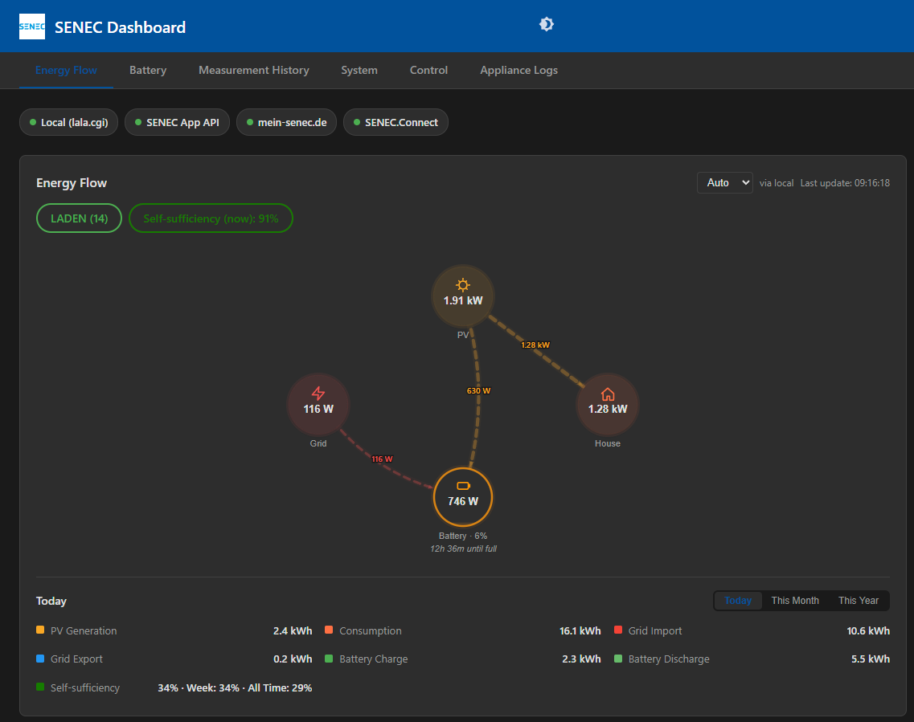

**Energy Flow Diagram** — Live SVG visualization showing power flow between PV, battery, grid, house, and wallbox. Animated curved paths with power-proportional thickness. Battery SOC gauge with fill level. Operating mode badge. Time estimates (until empty/full). Period totals (today/month/year) with autarky percentage. Data source selector (Auto/Local/API/Web).

**Live Power Curve** — Real-time line chart showing power over time for all five metrics (PV, house, grid, battery, wallbox). Smooth monotone cubic interpolation between data points. Time window presets from 10 minutes to 24 hours, plus mouse wheel zoom (5min–30 days, downsampled for performance). Drag to pan through history with lazy loading and midnight date markers. Toggle individual lines, including an optional battery level line (off by default) drawn against its own right-hand 0–100 % axis. Pause/disable controls. Click "Live" to snap back to real-time. If a history adapter (InfluxDB, SQL, or History) is enabled on the power states, the chart backfills with historical data on page load. Each state is resolved on its own, so they may be recorded by different history adapters, and a state without recording only affects its own line. The ⓘ button lists the states behind every line together with the history adapter recording them — use it to find out why a line has no past data.

**Event Timeline** — Compact 24-hour strip showing today's warnings (orange), errors (red), and panics (purple) from the device log. Hover for full details. Auto-refreshes every 10 minutes. Requires the device IP to be configured.

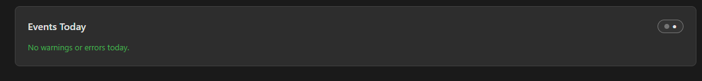

### Battery Tab

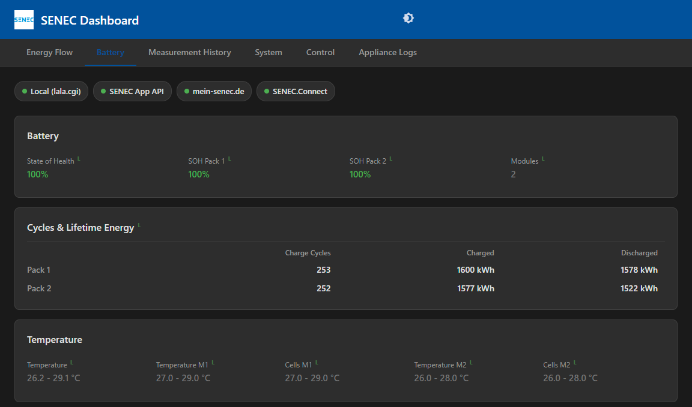

- **State of Health** — System and per-pack SOH with color-coded indicators (green > 80%, orange > 60%, red)
- **Module Status** — Active/charging/discharging module counts
- **Charge Cycles** — Per-pack cycle count and lifetime charged/discharged energy
- **Cell Voltage Heatmap** — Color-coded grid showing individual cell voltages across all modules. Red = lowest, green = highest. Per-module delta indicators. Instantly reveals cell imbalance.
- **Temperatures** — Overall, per-module, and per-cell temperatures
- **Pack Electrical** — Per-pack voltage and current

Data sourced from Local (BMS) and/or API (SystemDetails) with source badges.

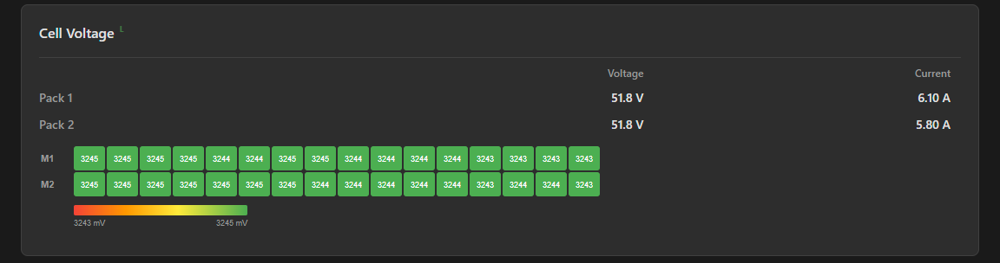

### Charts Tab

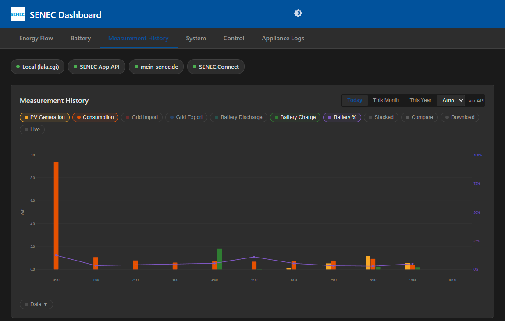

Measurement bar charts for energy data:
- **Today** — Hourly bars (auto-trims to hours with data)
- **This Month** — Daily bars
- **This Year** — Monthly bars

Features:
- Toggle individual measurement types (PV, consumption, grid import/export, battery charge/discharge)
- Stacked view (production vs. consumption)
- Comparison mode (yesterday, previous month, selectable year)
- Battery level (%) line overlay. The API connector reads it from the measurement history. mein-senec.de offers no such history, so the web connector samples the live charge level instead: hourly averages for the day view, daily averages for the month view. Those values therefore start when the adapter does — a day it was not running over midnight has no daily average, and none can be fetched retroactively. The year view has no battery level on the web connector.
- Data source selector (Auto/API/Web)
- Data table view
- PNG image export
- Auto-update mode

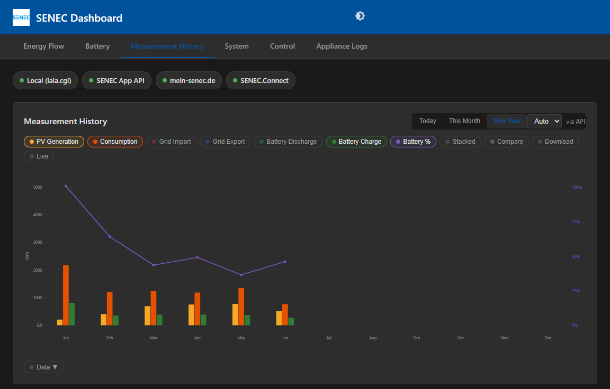

### System Tab

- **Grid Quality** — Frequency, total power, per-phase voltage/power/current. Supports EnFluRi 1 and EnFluRi 2 (auto-detected).
- **PV Strings** — Per-tracker MPP power, voltage, and current
- **Wallbox** — EV connected status, smart charge, per-phase charging current
- **Feature Flags** — Active features per connector with mismatch detection
- **System Details** — Product, firmware, GUI/NPU version, inverter state, temperatures (casing, MCU, battery, inverter), operating hours, installation date, installer contact

Source indicator badges show which connector provides each value.

### Control Tab

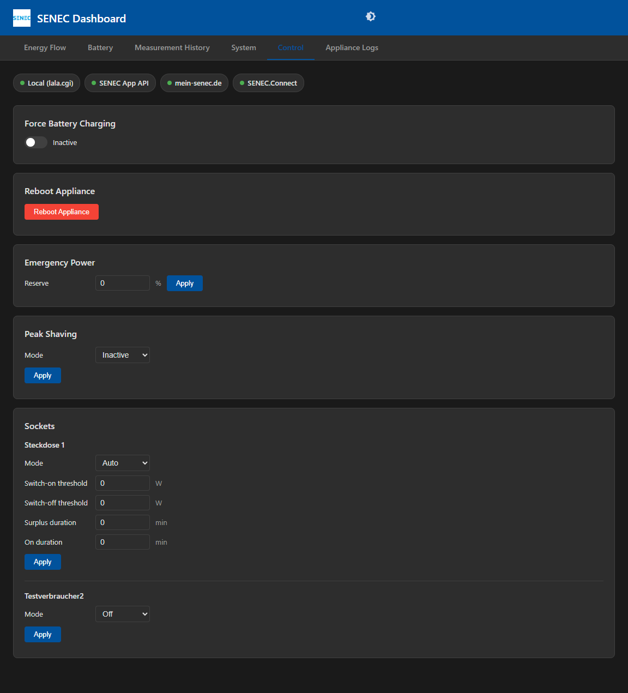

Interactive controls matching the adapter's control capabilities:
- Force battery charging (toggle)
- Appliance reboot (with confirmation dialog)
- Emergency power reserve (percentage slider)
- Peak shaving (mode-dependent fields)
- SG-Ready (enable + thresholds)
- Switchable sockets (per-socket mode, threshold settings, name editing)
- Wallbox (smart charge, current limit)

Controls check connector availability and show warnings if the required connector is not active. Apply button provides "Sent" confirmation feedback.

### Statistics Tab

mein-senec.de keeps a weekly CSV export at 5-minute resolution going back years — far more data than belongs in ioBroker states. So nothing is persisted: the adapter stores only the list of available weeks, refreshed once a day, and downloads a single week on demand when you ask for it. The data lives only as long as the tab is open.

- Plant selector, listing previous appliances on the account as well (hidden when there is only one). The plant this instance polls is preselected.
- Week selector showing each week's date range
- Day filter — narrow a ~2,000-row week to a single day
- Resolution — hourly means or raw 5-minute rows
- Column toggles for the ten exported columns, including battery voltage, current and charge level
- Sortable headers; a third click restores chronological order
- Summary row with minimum, mean and maximum of the rows shown
- Table or chart view; in the chart, power columns share a left kW axis while percentages get their own right-hand 0–100 % axis, and gaps in a series break the line rather than being bridged
- Download the current selection as CSV

Requires the mein-senec.de connector to be enabled and connected.

### Logs Tab

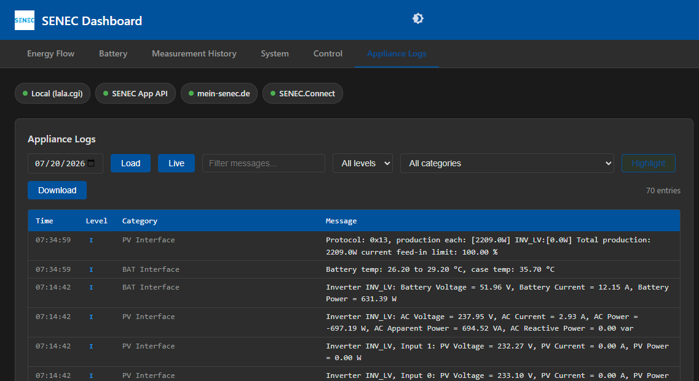

Browse SENEC device logs by date:
- Filterable table (Time, Level, Category, Message)
- Level filters: Info, Warning, Error, Panic
- Category filter (auto-populated from log entries)
- Free-text search
- Color-coded row highlighting by severity
- Newest entries first
- Live mode — auto-refreshes today's log (UTC-aware)
- Download raw log files

Requires the device IP to be configured (even if the Local connector is not enabled).

## State Reference

The adapter creates states organized by connector and data section. All states are read-only unless explicitly marked as control states.

### Connection & Status (`info.*`)

| State | Description |
|-------|-------------|
| `info.connection` | Overall connection status (true if any connector is active) |
| `info.connectionStatus` | Detailed connection status: `all` (all configured connectors connected), `partial` (some connected), `none` |
| `info.localConnected` | Local (lala.cgi) connection status |
| `info.apiConnected` | SENEC App API connection status |
| `info.webConnected` | mein-senec.de connection status |
| `info.connectConnected` | SENEC.Connect connection status |
| `info.lastPoll.HighPrio` | Timestamp of last high-priority local poll |
| `info.lastPoll.LowPrio` | Timestamp of last low-priority local poll |

### TLS States (`_local.tls.*`)

| State | Type | Write | Description |
|-------|------|:-----:|-------------|
| `_local.tls.mode` | string | no | Active TLS validation mode: `user`, `cached`, `tofu`, or `none` |
| `_local.tls.fingerprint` | string | no | SHA-256 fingerprint of the accepted device certificate (TOFU mode, encrypted) |
| `_local.tls.userCaPem` | string | yes | User-uploaded CA certificate PEM (encrypted) |
| `_local.tls.cachedCaPem` | string | no | CA certificate PEM downloaded from mein-senec.de (encrypted) |
| `_local.tls.certFetchFailed` | boolean | yes | Set to `false` to trigger a new CA download attempt |

### Local States

Data from lala.cgi polling is stored directly under the section name (e.g. `ENERGY.*`, `BMS.*`, `PV1.*`, `WIZARD.*`).

**Key ENERGY states:**

| State | Type | Description |
|-------|------|-------------|
| `ENERGY.GUI_INVERTER_POWER` | number (W) | Current PV generation |
| `ENERGY.GUI_BAT_DATA_POWER` | number (W) | Battery power (positive = charging, negative = discharging) |
| `ENERGY.GUI_GRID_POW` | number (W) | Grid power (positive = importing, negative = exporting) |
| `ENERGY.GUI_HOUSE_POW` | number (W) | Current house consumption |
| `ENERGY.GUI_BAT_DATA_FUEL_CHARGE` | number (%) | Battery state of charge |
| `ENERGY.STAT_STATE` | number | System operating state code |
| `ENERGY.STAT_STATE_Text` | string | System state in human-readable text |
| `ENERGY.STAT_HOURS_OF_OPERATION` | number (h) | System uptime |

**Key BMS states:**

| State | Type | Description |
|-------|------|-------------|
| `BMS.MODULE_COUNT` | number | Number of battery modules |
| `BMS.SOH.{n}` | number (%) | State of health per module |
| `BMS.CYCLES.{n}` | number | Charge cycles per module |
| `BMS.CELL_VOLTAGES_MODULE_{A-D}.{n}` | number (mV) | Individual cell voltages |
| `BMS.TEMP_MIN.{n}` / `BMS.TEMP_MAX.{n}` | number (°C) | Module temperature range |
| `BMS.VOLTAGE.{n}` / `BMS.CURRENT.{n}` | number (V/A) | Pack voltage and current |

### API States (`_api.*`)

Cloud API data is stored under `_api.Anlagen.{systemId}.*`:

- `Dashboard.currently.*` — Real-time power values (W)
- `Measurements.Daily.*` — Hourly measurement data (kWh)
- `Measurements.Monthly.*` — Daily measurement data (kWh)
- `Measurements.Yearly.*` — Monthly measurement data (kWh)
- `Measurements.AllTime.*` — Lifetime totals (kWh)
- `SystemDetails.*` — Battery details, temperatures, firmware
- `SystemStatus.*` — Operating state, feature flags

### Web States (`_meinsenec.*`)

mein-senec.de data is stored under `_meinsenec.*`:

- `Status.*` — Current power values (kW), operating state
- `Measurements.*` — Historical measurement data (kWh)
- `Autarky.*` — Self-sufficiency percentages (day/week/month/year/all)
- `EmergencyPower.*` — Emergency power reserve settings
- `PeakShaving.*` — Peak shaving configuration
- `SGReady.*` — SG-Ready settings
- `Sockets.*` — Switchable socket states

### Connect States (`_connect.*`)

SENEC.Connect data is stored under `_connect.Systems.{n}.*` with battery and meter subsections.

### External States (`_external.*`)

External source data is stored under `_external.{type}.{index}.*`:

| State | Description |
|-------|-------------|
| `_external.pv.{n}.power` | External PV power (W) |
| `_external.consumer.{n}.power` | External consumer power (W) |
| `_external.battery.{n}.power` | External battery power (W, signed) |
| `_external.battery.{n}.soc` | External battery state of charge (%) |
| `_external.battery.{n}.capacity` | External battery capacity (kWh) |
| `_external.{type}.{n}.label` | User-defined label |
| `_external.{type}.{n}.mode` | Display mode (integrate/separate) |
| `_external.{type}.{n}.sourceId` | Foreign state ID or formula |

### Control States (`control.*`)

Writable states for appliance control:

| State | Type | Description |
|-------|------|-------------|
| `control.ForceCharge` | boolean | Force battery charging on/off |
| `control.BlockDischarge` | boolean | Block battery discharge on/off |
| `control.RebootAppliance` | boolean | Trigger appliance reboot |
| `control.EmergencyPower.ReserveInPercent` | number | Emergency power reserve (%) |
| `control.PeakShaving.*` | various | Peak shaving settings |
| `control.SGReady.*` | various | SG-Ready settings |
| `control.Sockets.{n}.*` | various | Per-socket control |
| `control.Wallbox.{n}.*` | various | Wallbox control |

Control states are only created when the corresponding feature is enabled and available via the configured connector.

## Troubleshooting

**Device not responding / frequent restarts**: Reduce the high-priority polling interval or remove custom high-priority data points. The SENEC device has limited resources.

**No data from API/Web**: Check your mein-senec.de credentials in the SENEC Account tab. The adapter logs authentication errors at warning level.

**Dashboard not loading**: Ensure ioBroker.web is running on port 8082. The dashboard is served as a web extension at `/senec/`.

**Missing states**: Available states depend on your SENEC model, firmware version, and configured connectors. Not all states are available on all systems.

**Control states not appearing**: Control features must be explicitly enabled in the Appliance Control settings tab. Each control requires a specific connector to be active.

**TLS certificate errors on local connection**: The adapter handles certificate validation automatically. Check `_local.tls.mode` to see which validation method is active. If you see TOFU mode and want to upgrade to CA validation, enable the mein-senec.de connector — the adapter will attempt to download the CA cert automatically. If a previous download failed, set `_local.tls.certFetchFailed` to `false` to retry.

## Getting Help

For questions, setups and comparing notes with other users, there is a [dedicated thread in the ioBroker forum](https://forum.iobroker.net/topic/30620/neuer-adapter-senec-home-adapter) — mainly German, and usually the quickest way to an answer.

If something looks like a bug, open an issue on [GitHub](https://github.com/nobl/ioBroker.senec/issues). [Collecting a debug log](#collecting-a-debug-log) and [what makes a report actionable](#reporting-an-issue) are described above.

## Changelog

<!--
  Placeholder for the next version (at the beginning of the line):
  ### **WORK IN PROGRESS**
-->
### **WORK IN PROGRESS**
- Dependency updates

### 2.14.1 (2026-08-02)
- Fix: Emptying one of the additional high-priority datapoint fields left its "add datapoints to polling" box ticked, and the adapter then reported a faulty configuration on every start although nothing was configured at all. Such a field is no longer treated as an error, which also settles it for instances that are already in this state; clearing the field now unticks the box as well. Two related problems are fixed with it: a blank after a comma discarded the whole entry instead of being read as the separator it is, and a trailing comma sent a nameless datapoint to the appliance. An entry containing an invalid name is still ignored as a whole, but the warning now names the part that caused it.

### 2.14.0 (2026-08-01)
- Fix: With the local connection switched on but no IP address entered, the adapter repeatedly tried to reach 0.0.0.0 and logged a connection error on every attempt. It now says once that no address is configured and waits for one.
- Change: A new instance now starts with no connector preselected — pick the ones you want in the settings. The local connection is no longer switched on in advance, and its address field starts empty instead of showing 0.0.0.0. Existing instances keep their settings unchanged.
- Fix: When the SENEC sign-in service rejected the stored token and was itself unreachable, the adapter attempted a full login twice and then kept two recovery loops running side by side, doubling every request. It now makes one attempt and retries on a single schedule.
- Fix: If the appliance was unreachable at start-up and only answered on a later attempt, sections found during that attempt were not actually polled until the adapter was restarted.
- Fix: Four of the six mein-senec.de queue diagnostic states were always empty. They now report real values and count finished requests rather than started ones, so the success rate is no longer dragged down by work still in progress.
- Fix: The two mein-senec.de debug settings only took effect when measurement history polling happened to be switched on as well. They now work on their own.
- Fix: An external source using a formula with several references was recalculated once per reference at start-up, reading every referenced state repeatedly. It is now calculated once.
- Fix: A battery level of infinity from an external source, and a kilowatt reading too large to express in watts, are no longer written to states.
- Fix: When mein-senec.de asks the adapter to wait before retrying, a wait expressed as a date is now understood as well as one expressed in seconds. An implausibly long wait is capped at an hour so the connector always recovers on its own.
- New: The timeout for ordinary SENEC API requests is configurable, and its default is raised from 10 to 30 seconds. The API is regularly slow enough that dashboard and system status requests were timing out, which loses the whole reading until the next poll cycle. Measurement history keeps its own, longer limit.
- Fix: An error reply from mein-senec.de was treated as if it were data. A failed request could write an error page into the status states, advance the "last poll" timestamp and leave the connector reporting itself as connected. Responses are now checked centrally, so a failure is a failure everywhere.
- Fix: The adapter no longer keeps its request rate up when mein-senec.de is struggling. A server error now pauses the whole queue briefly, exactly as rate limiting already did, and the server's own requested delay is honoured. Control commands are still never repeated automatically.
- Fix: If the SENEC login had to be renewed and that renewal failed, the adapter could end up with no token, no scheduled retry and no error — silently stuck until restarted. It now retries with a growing delay, so it recovers on its own.
- Fix: Measurements for "today" and "yesterday" could be fetched for the wrong day between midnight and the UTC changeover — up to two hours every night in Central European time, and any part of the night in other time zones.
- Fix: The battery level recorded from mein-senec.de lost a full day twice a year, at the daylight-saving changeovers, because two adjacent days were not recognised as adjacent.
- Fix: Sections the appliance did not list during discovery are no longer dropped from polling. A restricted or partial answer could previously reduce the adapter to polling almost nothing, including the live values.
- Fix: A failing poll step is now counted, so a system that is only partly readable is reported instead of passing as healthy.
- Fix: External energy sources sharing one foreign state now all update. Previously only the last one configured for a given state received changes, and a state used both directly and in a formula drove only one of the two. Values are also read once at startup instead of showing 0 until the source next changes, and a formula that divides by zero no longer writes Infinity.

### 2.13.1 (2026-08-01)
- Fix: A failed API read is now retried instead of being dropped until the next poll cycle. Retries apply to transient failures only — timeout, rate limiting, server error, dropped connection. Control commands are never retried, so none can reach the appliance twice.
- API: A poll tier that could not complete now says so in the log, along with the fact that it is picked up again on the next cycle. Previously only the failure was logged, which read as if the data were lost.
- Fix: Rate limiting by mein-senec.de went unnoticed. Its responses are read directly rather than raised as errors, so a "too many requests" reply counted as a success and the adapter kept its request rate up instead of easing off. It now backs off, honours the server's own retry delay, logs the event, and reports it under the connector's rate-limit diagnostics. Most noticeable when stepping through statistics weeks quickly. The same applies to a request repeated after a session expired, which previously skipped this handling altogether.
- Fix: Downloading a statistics week ran into the short timeout meant for the portal's small JSON replies. A week at 5-minute resolution now gets a timeout that fits it.
- Fix: A statistics week the server refused to send was displayed as an empty week rather than as an error.
- Fix: A dashboard label could briefly show its key name (`stats_title`) instead of its text. Translation dictionaries are now revalidated on every load, views wait for them before drawing, and a label whose key cannot be resolved keeps its English text instead of being overwritten with the key.

### 2.13.0 (2026-08-01)
- Fix: Scaling factors defined in the state definitions were never applied to any state that also carries a unit — which is every state that defines one — so 14 local states were reported unscaled. Most visibly `BMS.SYSTEM_SOH`, which read 1000 instead of 100.0 %. Other states involved:
  - `BMS.SYSTEM_SOC`, `BAT1OBJ1.BMS_SYSTEM_SOC` — were 10× too high (%)
  - `BMS.MAX_TEMP`, `BMS.MIN_TEMP`, `BAT1OBJ1.BMS_MAX_TEMP`, `BAT1OBJ1.BMS_MIN_TEMP`, `AMPACE.MODULE_MAX_TEMP`, `AMPACE.MODULE_MIN_TEMP`, `AMPACE.CELL_TEMPERATURES_MODULE_A`, `AMPACE.CELL_TEMPERATURES_MODULE_B` — were 10× too high (°C)
  - `BMS.MAX_CELL_VOLTAGE`, `BMS.MIN_CELL_VOLTAGE` — were 100× too high (V)
  - `FACTORY.DESIGN_CAPACITY` — was 1000× too high (kWh)

  These now report their true values. History recorded before this change keeps the old scale, so logged series will step at the moment of the update.
- Live chart: Canvas renderer replaces SVG — enables touch drag and pinch-to-zoom on tablets/mobile. Hover tooltips. requestAnimationFrame throttling for smooth interaction.
- Fix: External battery and consumer energy flow direction now reflects actual power sign (charge vs discharge, feed-in vs consumption).
- Admin UI: Clarified column headers in external sources table to indicate which fields apply to which source types.
- Fix: API and web connector polling now auto-recovers after transient failures (timeout, server error) instead of permanently stopping. Connection status indicators flip correctly on failure and recovery.
- Log proxy: Reuse pooled HTTPS connections to the device (keep-alive) instead of a new TLS handshake per request — noticeably lighter in log live mode. Connections are closed on TLS re-negotiation and on unload.
- SENEC.Connect: Failed requests now log the reason reported by the server instead of only the HTTP status code — in particular when the monthly request quota is exhausted.
- Admin UI: Clarified the SENEC.Connect polling interval help — explains why 60 seconds is the lowest quota-safe value, and that the request quota belongs to the subscription key, so running the same key in another system requires a longer interval.
- Live chart: History backfill now resolves the recording adapter per state instead of deriving one adapter from a single probe state. States may be recorded by different history adapters, and a state that is not recorded (or whose query fails) only costs its own line — previously it could silently disable backfill for the whole chart.
- Live chart: New ⓘ panel lists the states behind each line and whether a history adapter records them, so a line without past data can be traced to the state that is missing. Reopening the panel re-checks, so enabling logging on a state takes effect without reloading the page.
- Fix: Live chart no longer queries the history adapter every 200 ms without end. Whenever the selected time window reached further back than the recorded data (a fresh install, a newly enabled history adapter, or any window longer than the available history), the "load older data" check re-armed itself indefinitely for as long as the dashboard was open. Delta loading now tracks the range already requested instead of the oldest data received.
- Live chart: The loading indicator and the buffer statistics line are now translated instead of English-only.
- Fix: The TLS certificate upload error message showed a literal placeholder instead of the actual error in French, Italian, Dutch, Polish, Russian, Ukrainian and Chinese.
- Charts: Battery level overlay now also works with the mein-senec.de connector, not only the App API. The portal offers no charge-level history, so the adapter samples the live value into hourly averages for the day view; the daily figures behind the month view are the portal's own daily average. Hourly values only exist for the time the adapter was running, and cannot be filled in afterwards.
- Live chart: Optional battery level line, off by default. It uses its own right-hand 0–100 % axis so it can share the chart with the power curves, and it is backfilled from a history adapter like every other line.
- Dashboard: New Statistics tab. mein-senec.de offers a weekly CSV export at 5-minute resolution reaching back years — far more than belongs in ioBroker states, so nothing is stored: the adapter keeps only the index of available weeks (refreshed daily) and fetches a single week on request. Pick a plant and week, filter to one day, switch between hourly means and 5-minute rows, show or hide columns, sort by any column, read min/mean/max of what is shown, switch between table and chart, and download the filtered result as CSV. Previous appliances on the same account are listed too, so their history is reachable as well.
- Fix: Measurement queries against the SENEC App API used the same 10 second timeout as the small dashboard calls, so the heavy year and month aggregations — which the server computes on request — could time out and lose a whole poll cycle. They now get their own timeout, configurable in the API settings and defaulting to 60 seconds.
- Documentation: Reworked readme and documentation. Two-factor authentication, collecting a debug log and reporting an issue are now explained, and so is polling additional systems on the same mein-senec.de account — a feature that had states and a control switch but no documentation at all. The supported system list moved to its own file and now uses the appliance's own naming. Issue reports go through a form asking for the model, connectors and log, and questions are pointed at the adapter thread in the ioBroker forum.
- Special thanks to everyone supporting this project — see [SUPPORTERS.md](SUPPORTERS.md).

### 2.12.0 (2026-07-23)
- Live chart: Drag to pan through history, scroll to zoom (5min–30 days). Lazy-loads history data on demand as you pan. Per-line downsampling preserves all metrics at any zoom level. Midnight date markers. View clamped to available data with progressive loading. Loading indicator and buffer stats.
- Security: Multi-layer TLS certificate validation for local SENEC connections — user-uploaded CA, cached CA (auto-downloaded from mein-senec.de), TOFU fingerprint pinning. Dashboard upload for CA certificate (.pem/.zip). TLS state values stored encrypted. Eliminates blind certificate bypass.
- Security: Fix polynomial ReDoS in formula regex, escape DOM-sourced values in log viewer, remove no-op string replace in charts.
- Dashboard: Multi-instance namespace support.

### [Former Updates](CHANGELOG_OLD.md)

## License
MIT License

Copyright (c) 2020-2026 Norbert Bluemle <github@bluemle.org>

Permission is hereby granted, free of charge, to any person obtaining a copy
of this software and associated documentation files (the "Software"), to deal
in the Software without restriction, including without limitation the rights
to use, copy, modify, merge, publish, distribute, sublicense, and/or sell
copies of the Software, and to permit persons to whom the Software is
furnished to do so, subject to the following conditions:

The above copyright notice and this permission notice shall be included in all
copies or substantial portions of the Software.

THE SOFTWARE IS PROVIDED "AS IS", WITHOUT WARRANTY OF ANY KIND, EXPRESS OR
IMPLIED, INCLUDING BUT NOT LIMITED TO THE WARRANTIES OF MERCHANTABILITY,
FITNESS FOR A PARTICULAR PURPOSE AND NONINFRINGEMENT. IN NO EVENT SHALL THE
AUTHORS OR COPYRIGHT HOLDERS BE LIABLE FOR ANY CLAIM, DAMAGES OR OTHER
LIABILITY, WHETHER IN AN ACTION OF CONTRACT, TORT OR OTHERWISE, ARISING FROM,
OUT OF OR IN CONNECTION WITH THE SOFTWARE OR THE USE OR OTHER DEALINGS IN THE
SOFTWARE.