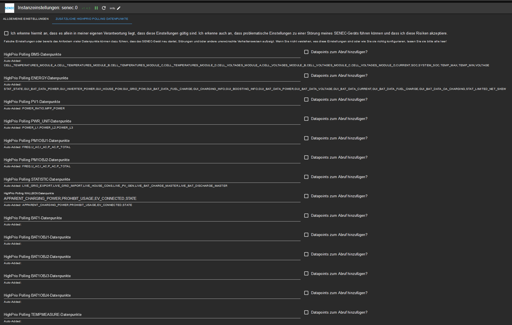

# ioBroker.senec

## senec adapter for ioBroker
Initially targeted at the Senec Home V2.1 System.
In the Senec.Home system, only selected values can be changed by the adapter. Use of this functionality is at your own risk and must be activated manually in the configuration beforehand.
Senec currently also no longer provides a reliable way to influence peak shaving via the web interface. For this purpose, mein-senec.de must be used.
Whether other systems (e.g. V3) also work with it depends on whether they are also based on lala.cgi and provide the same JSON information.
Even with integration into the Senec.Clound it is not guaranteed that the data can still be retrieved via the web interface (for this please report your experiences).

Systems that might work:
* Senec Home 4.0 / Blei
* Senec Home 6.0 Pb
* Senec Home 8.0 / Blei
* Senec Home 10.0 Pb
* Senec Home 5.0/7.5/10.0 / Lithium
* Senec Home 15.0 / Lithium
* Senec Home V2 5.0/7.5/10.0
* Senec Home V2 10.0 / Blei
* Senec Home V2.1 1ph / Lithium
* Senec.Home V3 Hybrid
* Senec.Home V3 Hybrid duo
* Senec Business 30.0 / Blei
* Senec Business V2 30.0 / Blei
* Senec Business 25.0 / Lithium
* Senec Business V2_2ph / Lithium
* Senec Business V2 3ph / Lithium
* ADS Tec
* OEM LG
* Solarinvert Storage 10.0 / Blei

SENEC Systems that don't provide a local webinterface might be monitored by using the API functionality only. Please contact the developer if you have any input on this.

## Disclaimer
**All product and company names or logos are trademarks™ or registered® trademarks of their respective holders. Use of them does not imply any affiliation with or endorsement by them or any associated subsidiaries! This personal project is maintained in spare time and has no business goal.**

## Installation
You is facilitated via the ioBroker web interface and the configuration will auto-open once installation is completed.

## Setup
In addition to the adapter installation you have to add an instance of the adapter.

### Configuration 

| Field         | Description |                                                                       
|:-------------|:-------------|
|SENEC System    |Type in the IP-address of your SENEC system (FQDN is also possible if you have a working local DNS).|
|Use https?|If the SENEC system has already been converted to https, this option must be activated.|
|Polling Interval High Priority Data|You can change the polling interval for high priority data (how often the Adapter reads from your Senec System), too. (Default: 10 seconds)|
|Polling Interval Low Priority Data|You can change the polling interval for low priority data (how often the Adapter reads from your Senec System), too. (Default: 60 minutes) 
Please be careful with high-frequency polling because this can render your SENEC machine unable to connect to the SENEC server!|
|Request-Timeout|If your network requires a higher timeout for requests sent to SENEC, please change the Request-Timeout in miliseconds accordingly. (Default: 5000 miliseconds)|
|Polling Retries|In case there is an issue communicating with SENEC the adapter will retry several times. You can adjust how often it will try to read from SENEC. (Default: 10) 
This does not apply to Adapter Start - if the System is unavailable to Adapter will stop.|
|Polling Retry Factor|To space retries apart a bit more you can adjust the Polling Retry Factor. (Default: 2) - Example: Using default settings the 1st retry will happen 20 seconds after the initial try, the 2nd will happen 40 seconds after the 2nd try. After each successful connect to SENEC, the number of retries is reset.|

Once finished setting up configuration, hit `SAVE AND CLOSE` to leave configuration dialogue. The adapter will automatically restart.

### Fenster "Additional HighPrio Polling Datapoints"

| Field         | Description |                                                                       
|:-------------|:-------------|
|Disclaimer |To make changes to the polling behavior of the adapter, it must be confirmed that you are aware of possible risks and accept them willingly and knowingly. The developer of the adapter does not bear any responsibility.
|Data points for different ranges|Here you can specify additional data points to be polled with high priority. Only characters A-Z and digits 0-9 as well as , may be used for separation.|
|Add datapoints to poll?|Confirm here again that you really want to add the datapoints you specified to high priority polling.|

Attention! If the SENEC system is queried with too high a frequency and/or too many data points, this can lead to the fact that no more data can be transmitted to the SENEC servers (e.g. no current values in the app or on mein-senec.de)! Also, the SENEC system can restart unmotivated and/or no longer respond to requests. In this case, stopping the adapter and then correcting the settings will help.

## Usage
Here you can find a description of the states (incomplete list) and how to use them. All states of this adapter are read-only states.
Depending on the individual system states might not be available or additional states could be there.
If a state is not documented (or only partially documented) and you know what it represents, please send a pull request (or open a ticket with the information).

### Example States (States differ per System and Version)

#### Channel: info

* info.connection

    |Data type|Permission|                                                                       
    |:---:|:---:|
    |boolean|R|

   *Read-only boolean which is true if the adapter is connected to the senec system.*
   
#### Channel: _calc
This channel contained calculated values. Doesn't exist any longer due to STATISTIC not available anymore.

   
#### Channel: BMS

* BL[0-3]

    |Data type|Permission|                                                                       
    |:---:|:---:|
    |number|R|

   *Read-only number, which represents ? for each battery pack.*
   
* CHARGED_ENERGY[0-3]

    |Data type|Permission|                                                                       
    |:---:|:---:|
    |number|R|

   *Read-only number, which represents the amount of charged energy per battery pack in unit ?*
   
* CHARGE_CURRENT_LIMIT[0-3]

    |Data type|Permission|                                                                       
    |:---:|:---:|
    |number|R|

   *Read-only number, which represents the current charge limit in Ampere per battery pack.*
   
* CURRENT[0-3]

    |Data type|Permission|                                                                       
    |:---:|:---:|
    |number|R|

   *Read-only number, which represents each battery pack's current in Ampere.*
   
* CYCLES[0-3]

    |Data type|Permission|                                                                       
    |:---:|:---:|
    |number|R|

   *Read-only number, which represents each battery pack's current charching cycles.*
   
* DISCHARGED_ENERGY[0-3]

    |Data type|Permission|                                                                       
    |:---:|:---:|
    |number|R|

   *Read-only number, which represents the amount of energy discharged per battery in unit ?.*
   
* DISCHARGE_CURRENT_LIMIT[0-3]

    |Data type|Permission|                                                                       
    |:---:|:---:|
    |number|R|

   *Read-only number, which represents each battery pack's current discharge limit in Ampere.*
   
* FW[0-3]

    |Data type|Permission|                                                                       
    |:---:|:---:|
    |number|R|

   *Read-only number, which represents each battery pack's firmware version.*
   
* HW_EXTENSION[0-3]

    |Data type|Permission|                                                                       
    |:---:|:---:|
    |number|R|

   *Read-only number, which represents each battery pack's ?.*
   
* HW_MAINBOARD[0-3]

    |Data type|Permission|                                                                       
    |:---:|:---:|
    |number|R|

   *Read-only number, which represents each battery pack's mainboard version.*
   
* MAX_CELL_VOTAGE[0-3]

    |Data type|Permission|                                                                       
    |:---:|:---:|
    |number|R|

   *Read-only number, which represents each battery pack's maximum cell voltage in Volts.*
   
* MIN_CELL_VOTAGE[0-3]

    |Data type|Permission|                                                                       
    |:---:|:---:|
    |number|R|

   *Read-only number, which represents each battery pack's minimum cell voltage in Volts.*
   
* SN[0-3]

    |Data type|Permission|                                                                       
    |:---:|:---:|
    |number|R|

   *Read-only number, which represents each battery pack's serial number.*
   
* SOC[0-3]

    |Data type|Permission|                                                                       
    |:---:|:---:|
    |number|R|

   *Read-only number, which represents each battery pack's state of charge.*
   
* SOH[0-3]

    |Data type|Permission|                                                                       
    |:---:|:---:|
    |number|R|

   *Read-only number, which represents each battery pack's state of health.*
   
* STATUS[0-3]

    |Data type|Permission|                                                                       
    |:---:|:---:|
    |number|R|

   *Read-only number, which represents each battery pack's status.*
   
* TEMP_MAX[0-3]

    |Data type|Permission|                                                                       
    |:---:|:---:|
    |number|R|

   *Read-only number, which represents each battery pack's maximum temperature.*
   
* TEMP_MIN[0-3]

    |Data type|Permission|                                                                       
    |:---:|:---:|
    |number|R|

   *Read-only number, which represents each battery pack's minimum temperature.*
   
* VOLTAGE[0-3]

    |Data type|Permission|                                                                       
    |:---:|:---:|
    |number|R|

   *Read-only number, which represents each battery pack's voltage in Volts.*
   
* BMS_READY_FLAG

    |Data type|Permission|                                                                       
    |:---:|:---:|
    |boolean|R|

   *Read-only boolean, which represents if the BMS is ready.*
   
* MODULES_CONFIGURED

    |Data type|Permission|                                                                       
    |:---:|:---:|
    |number|R|

   *Read-only number, which represents the number of modules currently configured in the system.*
   
* MODULE_COUNT

    |Data type|Permission|                                                                       
    |:---:|:---:|
    |number|R|

   *Read-only number, which represents the number of modules currently known the system (incl. non-configured).*
   
* START_UPDATE

    |Data type|Permission|                                                                       
    |:---:|:---:|
    |boolean|R|

   *Read-only boolean, which represents if an update is to be started.*
   
* WIZARD_ABORT

    |Data type|Permission|                                                                       
    |:---:|:---:|
    |boolean|R|

   *Read-only boolean, which represents if the setup wizard was aborted.*
   
* WIZARD_CONFIRM

    |Data type|Permission|                                                                       
    |:---:|:---:|
    |boolean|R|

   *Read-only boolean, which represents if the setup wizard was confirmed.*
   
* WIZARD_DCCONNECT

    |Data type|Permission|                                                                       
    |:---:|:---:|
    |boolean|R|

   *Read-only boolean, which represents ?.*
   
* WIZARD_START

    |Data type|Permission|                                                                       
    |:---:|:---:|
    |number|R|

   *Read-only boolean, which represents if the setup wizard is to be started.*
   
* WIZARD_STATE

    |Data type|Permission|                                                                       
    |:---:|:---:|
    |boolean|R|

   *Read-only number, which represents the setup wizard's state.*
   

#### Channel: ENERGY

* GUI_BAT_DATA_CURRENT

    |Data type|Permission|                                                                       
    |:---:|:---:|
    |number|R|

   *Read-only number, which represents the battery's current in Amps.*
   
* GUI_BAT_DATA_FUEL_CHARGE

    |Data type|Permission|                                                                       
    |:---:|:---:|
    |number|R|

   *Read-only number, which represents the current level of your battery system in %.*
   
* GUI_BAT_DATA_VOLTAGE

    |Data type|Permission|                                                                       
    |:---:|:---:|
    |number|R|

   *Read-only number, which represents the battery's current voltage in volt.*
   
* GUI_BAT_DATA_POWER

    |Data type|Permission|                                                                       
    |:---:|:---:|
    |number|R|

   *Read-only number, which represents how much power is coming from / going into the battery in Watts. Negative values are discharging.*
   
* GUI_BOOSTING_INFO

    |Data type|Permission|                                                                       
    |:---:|:---:|
    |boolean|R|

   *Read-only boolean, which we don't know the exact meaning of yet.*
   
* GUI_CHARGING_INFO

    |Data type|Permission|                                                                       
    |:---:|:---:|
    |boolean|R|

   *Read-only boolean, which represents if the battery is currently charging.*
   
* GUI_GRID_POW

    |Data type|Permission|                                                                       
    |:---:|:---:|
    |number|R|

   *Read-only number, which represents the power currenty coming from / going into the grid in Watts. Negative values are sending into the grid.*
   
* GUI_HOUSE_POW

    |Data type|Permission|                                                                       
    |:---:|:---:|
    |number|R|

   *Read-only number, which represents the power in Watts currently consumed by the house.*
   
* GUI_INVERTER_POWER

    |Data type|Permission|                                                                       
    |:---:|:---:|
    |number|R|

   *Read-only number, which represents the current power supplied by your PV system.*
   
* STAT_HOURS_OF_OPERATION

    |Data type|Permission|                                                                       
    |:---:|:---:|
    |number|R|

   *Read-only number, detailing the system's uptime in hours.*
   
* STAT_MAINT_REQUIRED

    |Data type|Permission|                                                                       
    |:---:|:---:|
    |boolean|R|

   *Read-only boolean, which represents if your senec system requires maintenance.*
   
* STAT_STATE

    |Data type|Permission|                                                                       
    |:---:|:---:|
    |number|R|

   *Read-only number, which represents the system's state.*
   
* STAT_STATE_Text

    |Data type|Permission|                                                                       
    |:---:|:---:|
    |string|R|

   *Read-only string, which represents the system's state in human readable format (sorry - we only have the german states from senec).*
   
#### Channel: STATISTIC
Doesn't exist anymore.
   
   
#### Channel: SYS_UPDATE

* NPU_IMAGE_VERSION

    |Data type|Permission|                                                                       
    |:---:|:---:|
    |number|R|

   *Read-only number, representing the Revision NPU-IMAGE*

* NPU_VER

    |Data type|Permission|                                                                       
    |:---:|:---:|
    |number|R|

   *Read-only number, representing the Revision NPU-REGS*

* UPDATE_AVAILABLE

    |Data type|Permission|                                                                       
    |:---:|:---:|
    |boolean|R|

   *boolean-value which is true if there is an update available (Updates happen automatically and are scheduled by SENEC).*
   
   
#### Channel: WIZARD

* APPLICATION_VERSION

    |Data type|Permission|                                                                       
    |:---:|:---:|
    |string|R|

   *Read-only text, representing the Revision MCU*

* CONFIG_LOADED

    |Data type|Permission|                                                                       
    |:---:|:---:|
    |boolean|R|

   *boolean-value which is true if configuration is loaded. This being false is very unlikely and it shouldn't persist as false.*
   
* INTERFACE_VERSION

    |Data type|Permission|                                                                       
    |:---:|:---:|
    |string|R|

   *Read-only text, representing the Revision GUI*
   
* SETUP_NUMBER_WALLBOXES

    |Data type|Permission|                                                                       
    |:---:|:---:|
    |number|R|

   *Read-only number, which designates how many wallboxes are configured in the system.*
   
* SETUP_WALLBOX_SERIAL[0..3]

    |Data type|Permission|                                                                       
    |:---:|:---:|
    |string|R|

   *Read-only text, which designates the serial number of wallbox [0..3].*

## Changelog

### 1.6.12 (NoBl)
* Updated license

### 1.6.11 (NoBl)
* Moving from Senec App API 3.12.0 to 4.3.3 (thanks to oakdesign@github for providing the new API!)
* This WILL invalidate all current API datapoints in the Statistik branch. Easiest solution to this: Delete the Statistik branch.
* Remember to force a rebuild of historic data in adapter settings!

### 1.6.10 (NoBl)
* Bugfix for AllTimeHistory (should work again)

### 1.6.9 (NoBl)
* Added switch in config to enable active control of appliance (you will need activate this, if you want to control the appliance via the adapter)
* Improved handling of forced loading (please report if we need more appliance-states covered by this)
* Minor improvements and bugfixes

### 1.6.8 (NoBl)
* Added switch control.ForceLoadBattery to start/stop charging battery. Use this to start/stop forced charging (like with dynamic power prices, ...).

### 1.6.7 (NoBl)
* Added option to turn off local polling.

### 1.6.6 (NoBl)
* Node 16 required
* Bugfixes
* Removed non-existing branches: _calc, Bat1Obj[2-4], Display, Statistic, File
* Added branches: CURRENT_IMBALANCE_CONTROL, BMZ_CURRENT_LIMITS, CELL_DEVIATION_ROC, SENEC_IO_OUTPUT, SENEC_IO_INPUT

### 1.6.5 (NoBl)
* Added AllTime Statistics (trigger initial calculations in adapter settings)
* https is now default for new instances

### 1.6.4 (NoBl)
* Bugfix (numbers are numbers again)

### 1.6.3 (NoBl)
* Code optimization

### 1.6.2 (NoBl)
* Added statistics values from API along with some own calculations.

### 1.6.1 (NoBl)
* Bugfixes

### 1.6.0 (NoBl)
* Added option to also poll SENEC App API. This requires user credentials for mein-senec.de
* We are starting with just some information - more to follow. But with Dashboard we at least have current values and day statistics back.

### [Former Updates](CHANGELOG_old.md)

## License
MIT License

Copyright (c) 2024 Norbert Bluemle <github@bluemle.org>

Permission is hereby granted, free of charge, to any person obtaining a copy
of this software and associated documentation files (the "Software"), to deal
in the Software without restriction, including without limitation the rights
to use, copy, modify, merge, publish, distribute, sublicense, and/or sell
copies of the Software, and to permit persons to whom the Software is
furnished to do so, subject to the following conditions:

The above copyright notice and this permission notice shall be included in all
copies or substantial portions of the Software.

THE SOFTWARE IS PROVIDED "AS IS", WITHOUT WARRANTY OF ANY KIND, EXPRESS OR
IMPLIED, INCLUDING BUT NOT LIMITED TO THE WARRANTIES OF MERCHANTABILITY,
FITNESS FOR A PARTICULAR PURPOSE AND NONINFRINGEMENT. IN NO EVENT SHALL THE
AUTHORS OR COPYRIGHT HOLDERS BE LIABLE FOR ANY CLAIM, DAMAGES OR OTHER
LIABILITY, WHETHER IN AN ACTION OF CONTRACT, TORT OR OTHERWISE, ARISING FROM,
OUT OF OR IN CONNECTION WITH THE SOFTWARE OR THE USE OR OTHER DEALINGS IN THE
SOFTWARE.