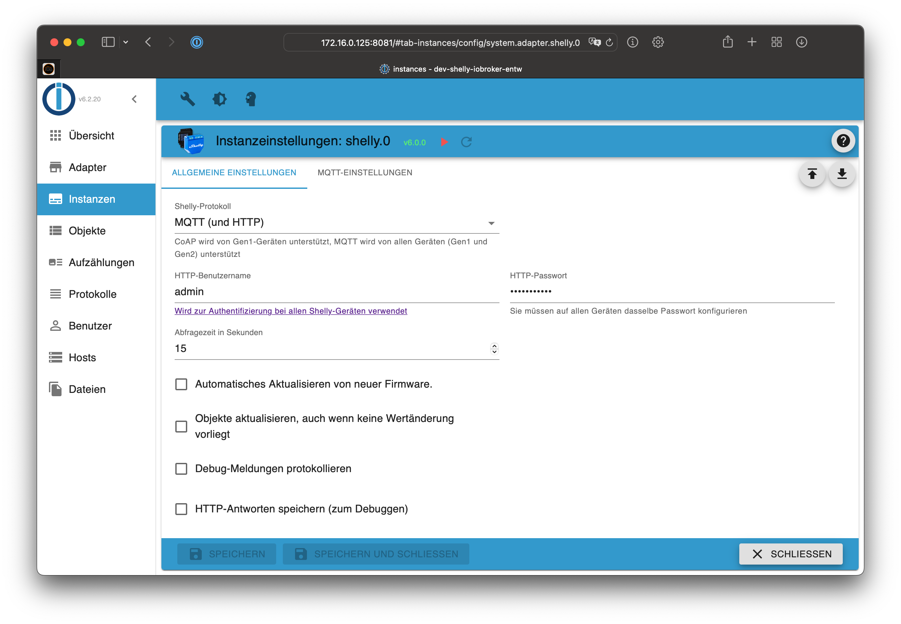

# ioBroker.shelly

This is the English documentation - [🇩🇪 German version](../de/README.md)

## Table of contents

- [MQTT protocol](protocol-mqtt.md)
- [CoAP/CoIoT protocol](protocol-coap.md)
- [Restricted login](restricted-login.md)
- [State changes](state-changes.md)
- [Debug](debug.md)
- [FAQ](faq.md)

## Requirements

1. Node.js 20 (or later)
2. js-controller 6.0.0 (or later)
3. Admin Adapter 6.6.0 (or later)

## Device generations

Check the list of *supported devices* for more details.

- **Gen 1**: ESP8266 devices, [CoAP/CoIoT](protocol-coap.md) or [MQTT](protocol-mqtt.md)
- **Gen 2+**: ESP32 devices, [MQTT](protocol-mqtt.md)

## General

The adapter can be used in MQTT (recommended) or CoAP/CoIoT mode.

- The default mode of the adapter is MQTT (see [documentation](protocol-mqtt.md) for details)
- CoAP/CoIoT is just compatible with Gen1 devices!
- **If you want to use Gen2 devices, you must use MQTT!**

Questions? Check the [FAQ](faq.md) section first!

## Changelog

<!--
  Placeholder for the next version (at the beginning of the line):
  ### **WORK IN PROGRESS**
-->
### 10.5.2 (2025-12-28)
* (@mcm1957) Monophase profile support has been fixed for shellypro3em and shellypro3em400.

### 10.5.1 (2025-12-27)
* (@mcm1957) Monophase profile support has been added to shellypro3em, shellypro3em63 and shellypro3em400. [#1016]
* (@mcm1957) ResetCounters functionality has been added to components EMData and EM1Data. This effect shellypro3em* but also other shellyem* devices gen2 and later.
* (@mcm1957) Changes to shellypro3em could affect shellyemg3 and shellyproem50.
* (@HGlab01) Several fixes for Shelly Ecowitt WS90 have been implemented. [#1293]

### 10.5.0 (2025-12-13)
* (@mcm1957) Changes to mqtt connect handling have been applied. This should fix error 'Unable to get MQTT.Prefix'[#931].
* (@mcm1957) Addon support has been **removed** from Shelly Dimmer Gen 3 (shellydimmerg3) as it is not supported by shelly for this device.
* (@mcm1957) Missing fields at light component have been added. This will effect several devices but should add additional states below light(n) only.
* (@klein0r) Added speed, dewpoint, uv_index, pressure, direction and precipitation for weather station WS 90
* (@mcm1957) Mqtt qos mode 2 has been removed from configuration as shelly does not support qos mode 2.
* (@mcm1957) Shelly Plug PM Gen 3 (shellyplugpmg3) has been added.
* (@mcm1957) Shelly Dimmer Gen 4 (shellydimmerg4) has been added. Some restrictions still exist. 
* (@mcm1957) Dependencies have been updated

### 10.4.1 (2025-11-03)
* (@mcm1957) Shelly pro 3em400 has been added as dedicated device to improve detectio (shellypro3em400) [#1269].
* (@mcm1957) Missing energy states have been added to Shelly Dimmer Gen 3 (shellydimmerg3) [#1274].
* (@klein0r) Added distance support to ble sensors
* (@mcm1957) Dependencies have been updated

### 10.4.0 (2025-10-13)

* (@mcm1957) Slat control added to Shelly ProDualCoverPM, Shelly Pro2PM, Shelly Shutter, Shelly Plus 2PM, Shelly 2PM Gen 3 and Shelly 2PM Gen 4.
* (@mcm1957) Log adapter version if unknown device is detected.
* (@mcm1957) posControl indicator has been added to devices supporting cover operation.
* (@mcm1957) Shelly Frankever Smart Sprinkler Controller (irrigation) has been added as prototype for diagnostic purposes only.
* (@mcm1957) Shelly LinkedGo Smart Thermost (st1820) has been added as prototype for diagnostic purposes only.
* (@mcm1957) Dependencies have been updated

## License

The MIT License (MIT)

Copyright (c) 2026 iobroker-community-adapters <iobroker-community-adapters@gmx.de>  
Copyright (c) 2018-2025 Thorsten Stueben <thorsten@stueben.de>,
                        Apollon77 <iobroker@fischer-ka.de> and
                        Matthias Kleine <info@haus-automatisierung.com>

Permission is hereby granted, free of charge, to any person obtaining a copy
of this software and associated documentation files (the "Software"), to deal
in the Software without restriction, including without limitation the rights
to use, copy, modify, merge, publish, distribute, sublicense, and/or sell
copies of the Software, and to permit persons to whom the Software is
furnished to do so, subject to the following conditions:

The above copyright notice and this permission notice shall be included in
all copies or substantial portions of the Software.

THE SOFTWARE IS PROVIDED "AS IS", WITHOUT WARRANTY OF ANY KIND, EXPRESS OR
IMPLIED, INCLUDING BUT NOT LIMITED TO THE WARRANTIES OF MERCHANTABILITY,
FITNESS FOR A PARTICULAR PURPOSE AND NONINFRINGEMENT. IN NO EVENT SHALL THE
AUTHORS OR COPYRIGHT HOLDERS BE LIABLE FOR ANY CLAIM, DAMAGES OR OTHER
LIABILITY, WHETHER IN AN ACTION OF CONTRACT, TORT OR OTHERWISE, ARISING FROM,
OUT OF OR IN CONNECTION WITH THE SOFTWARE OR THE USE OR OTHER DEALINGS IN
THE SOFTWARE.