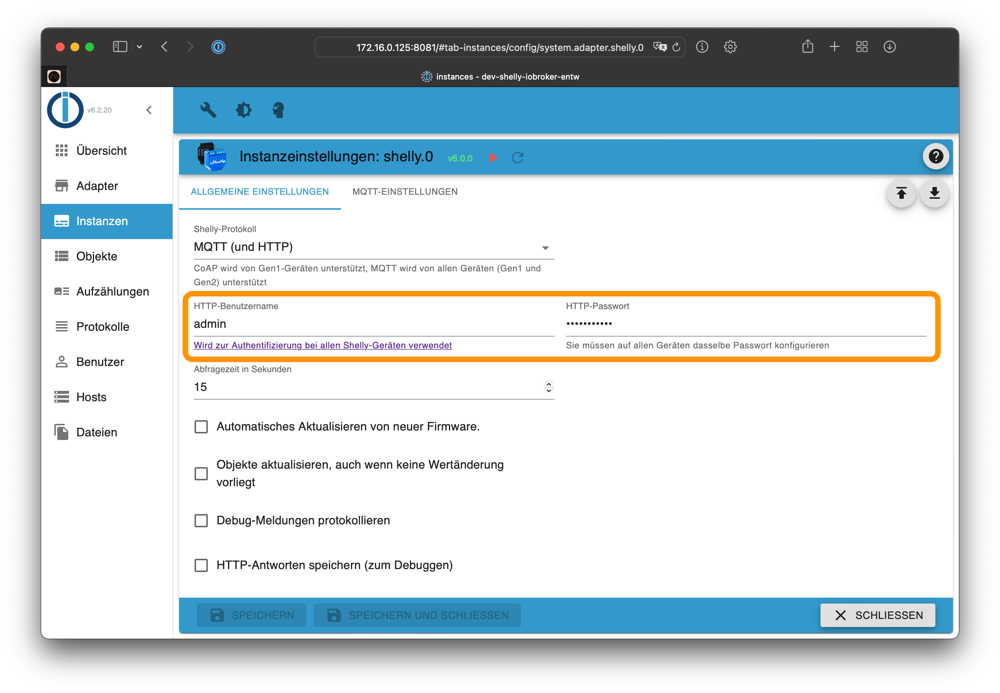

# ioBroker.shelly

## Restricted login

To protect your Shelly devices with a restricted login, choose a username and a password in the ioBroker configuration on the *general settings* tab.



Activate the login restriction on all your Shelly devices.

**Generation 2 devices don't provide a username option. If you use Gen 1 and Gen 2 devices, use the same password on all devices.**

### Gen 1

1. Open the Shelly web configuration in your webbrowser (not in the Shelly App!)
2. Go to ```Internet & Security settings -> Restricted Login```
3. Activate the checkbox and enter the previously configured username and password
4. Save the configuration - the Shelly will reboot automatically
5. Ensure to configure the same username and password on all your Shelly devices


### Gen 2

1. Open the Shelly web configuration in your webbrowser (not in the Shelly App!)
2. Go to ```Device -> Authentication```
3. Enable the authentication feature and enter the previously configured password
4. Save the configuration

