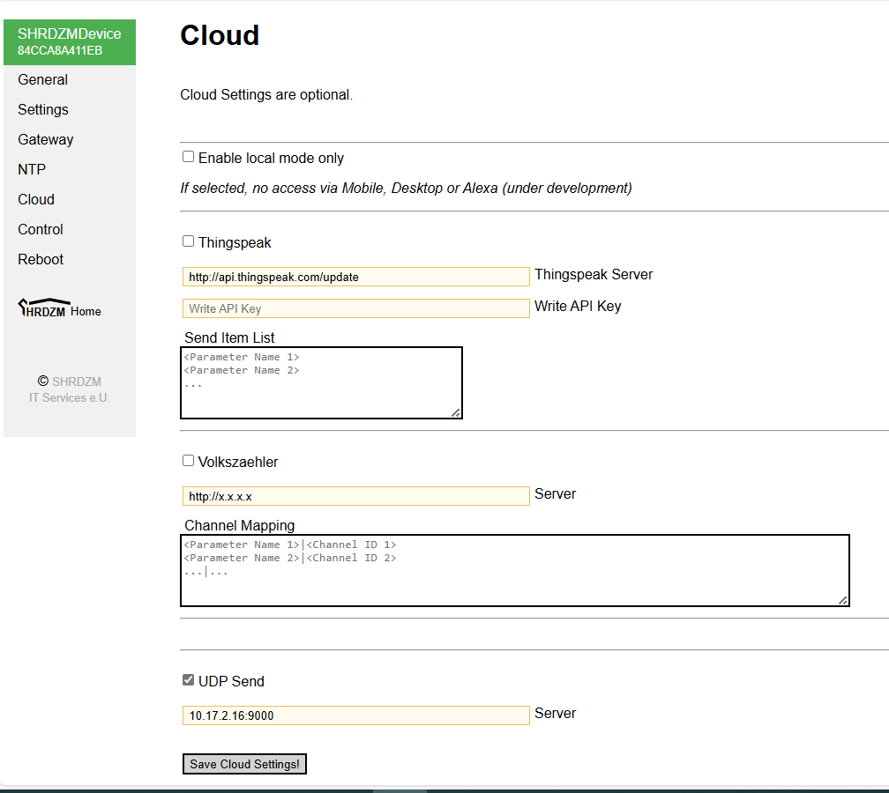

# SHRDZM Adapter Documentation

## Overview

The SHRDZM adapter integrates the SHRDZM smartmeter interface available from *SHRDZM IT Services e.U.* into ioBroker. This adapter allows you to monitor energy consumption and production data from your smart meters through the SHRDZM interface.

**Important Note:** This adapter is not related to SHRDZM IT Services e.U. in any way and no commercial relationship exists. This is an independent community project.

## Features

- **Real-time Energy Monitoring**: Receive live energy consumption and production data
- **Multiple OBIS Code Support**: Supports all standard OBIS codes for energy meters
- **Multi-device Support**: Handle data from multiple SHRDZM devices simultaneously  
- **Historical Data**: Configurable update rates for energy and power data history
- **UDP Forwarding**: Forward received data to other systems
- **Device Filtering**: Optional filtering to accept data only from specific devices
- **Raw Data Storage**: Option to store raw UDP packets for analysis

## Installation

**⚠️ Important Installation Notice**

**DO NOT** install this adapter using npm (`npm install iobroker.shrdzm`). ioBroker adapters must **never** be installed using npm directly. 

**Correct Installation Method:**
1. Open the ioBroker Admin UI
2. Navigate to the "Adapters" tab
3. Search for "SHRDZM" or browse the available adapters
4. Click the "+" button to install the adapter
5. Configure the adapter instance as described below

## SHRDZM Device Setup

### Hardware Requirements
- SHRDZM smartmeter interface device
- Smart meter compatible with the SHRDZM interface
- Network connection for the SHRDZM device
- ioBroker host on the same network

### SHRDZM Device Configuration

1. **Install and connect your SHRDZM device** according to the manufacturer's documentation
2. **Access the SHRDZM configuration interface** using a web browser:
   - Connect to your SHRDZM device's web interface
   - Navigate to the configuration page

3. **Configure Cloud Settings**:
   
   - Select "Cloud Configuration" in the SHRDZM interface
   - In the "Server" field, enter:
     - **IP Address**: IPv4 address of your ioBroker host
     - **Port**: The port number configured in the adapter (default: 9000)
   - **Activate "UDP send"**
   - **Save** the cloud settings

4. **Configure Update Interval**:
   - Navigate to the "Settings" page in the SHRDZM interface
   - Set your desired data transmission interval
   - Save the settings

The SHRDZM device will immediately start sending data to your ioBroker adapter at the configured interval.

## Adapter Configuration

### Basic Configuration

1. **Open ioBroker Admin UI**
2. **Navigate to "Instances"**
3. **Find your SHRDZM adapter instance** and click the configuration button

#### Network Settings

- **Bind IP Address**: 
  - Default: `0.0.0.0` (listen on all network interfaces)
  - Set to specific IP if you want to limit which network interface to use
- **Port**: 
  - Default: `9000`
  - Choose any free port number (1-65535)
  - Must match the port configured in your SHRDZM device

#### Device Filtering (Optional)

- **Devices**: 
  - Leave empty to accept data from all SHRDZM devices
  - Enter specific device IDs (comma-separated) to filter devices
  - Device ID format: e.g., `84CCA8A411EB`

### Advanced Configuration

#### Update Rates

- **Energy Information Update Rate**: 
  - Controls how often energy data is processed for history
  - Higher values reduce system load but lower data resolution
  - Example: Setting to 15 means every 15th data point is used for history

- **Power Information Update Rate**:
  - Controls how often power data is processed for history  
  - Similar to energy rate but for instantaneous power values

#### Data Processing Options

- **Store Raw Data**: 
  - Enable to store raw UDP packets received from devices
  - Useful for debugging and data analysis
  - **Warning**: Increases system load due to frequent updates

#### UDP Forwarding

- **Enable UDP Forwarding**: Forward received data to another system
- **UDP Forwarding Address**: Target IP address for forwarding
- **UDP Forwarding Port**: Target port for forwarding

## States Created by the Adapter

The adapter creates states for all received OBIS codes. Below is a complete list of supported states:

### Device Information States

| State | Type | Unit | Role | Description |
|-------|------|------|------|-------------|
| `<deviceId>.info.connection` | boolean | - | indicator.reachable | Connection status of the device |
| `<deviceId>.info.lastSeen` | number | - | date | Timestamp of last received data |
| `<deviceId>.uptime` | number | s | value | Device uptime information |

### Energy Consumption States (Import)

| State | Type | Unit | Role | Description |
|-------|------|------|------|-------------|
| `<deviceId>.1.8.0` | number | Wh | value.energy.consumed | Total active energy consumed |
| `<deviceId>.1.8.1` | number | Wh | value.energy.consumed | Active energy consumed tariff 1 (NT - night tariff) |
| `<deviceId>.1.8.2` | number | Wh | value.energy.consumed | Active energy consumed tariff 2 (HT - high tariff) |

### Energy Production States (Export)

| State | Type | Unit | Role | Description |
|-------|------|------|------|-------------|
| `<deviceId>.2.8.0` | number | Wh | value.energy.produced | Total active energy produced |
| `<deviceId>.2.8.1` | number | Wh | value.energy.produced | Active energy produced tariff 1 (NT) |
| `<deviceId>.2.8.2` | number | Wh | value.energy.produced | Active energy produced tariff 2 (HT) |

### Reactive Energy States

| State | Type | Unit | Role | Description |
|-------|------|------|------|-------------|
| `<deviceId>.3.8.0` | number | Var | value.energy.consumed | Total reactive energy consumed |
| `<deviceId>.4.8.0` | number | Var | value.energy.produced | Total reactive energy produced |

### Instantaneous Power States

| State | Type | Unit | Role | Description |
|-------|------|------|------|-------------|
| `<deviceId>.1.7.0` | number | W | value.power.active | Current active power consumed |
| `<deviceId>.2.7.0` | number | W | value.power.active | Current active power produced |
| `<deviceId>.3.7.0` | number | Var | value.power.reactive | Current reactive power consumed |
| `<deviceId>.4.7.0` | number | Var | value.power.reactive | Current reactive power produced |
| `<deviceId>.16.7.0` | number | W | value.power.active | Current total power (net balance) |

### Peak Power States

| State | Type | Unit | Role | Description |
|-------|------|------|------|-------------|
| `<deviceId>.1.6.0` | number | W | value.power.active | Peak active power consumed (15-minute maximum) |
| `<deviceId>.2.6.0` | number | W | value.power.active | Peak active power produced (15-minute maximum) |

### Raw Data States (if enabled)

| State | Type | Unit | Role | Description |
|-------|------|------|------|-------------|
| `<deviceId>.rawData` | string | - | text | Raw UDP packet data as received from device |

**Note**: `<deviceId>` is replaced with the actual device ID (e.g., `84CCA8A411EB`)

## Troubleshooting

### No Data Received

1. **Check Network Configuration**:
   - Ensure SHRDZM device and ioBroker are on the same network
   - Verify IP address and port settings match between device and adapter
   - Check firewall settings on ioBroker host

2. **Verify SHRDZM Configuration**:
   - Confirm "UDP send" is activated in SHRDZM cloud settings
   - Check that the correct ioBroker IP and port are configured
   - Verify data transmission interval is set appropriately

3. **Check Adapter Logs**:
   - Set adapter log level to "debug" or "silly"
   - Look for UDP receive messages in the logs
   - Check for any error messages

### High System Load

1. **Adjust Update Rates**:
   - Increase energy and power update rate values
   - This reduces the frequency of historical data processing

2. **Disable Raw Data Storage**:
   - Turn off "Store raw data" option if not needed
   - Raw data storage creates frequent state updates

3. **Device Filtering**:
   - Use device filtering to process only specific devices
   - Reduces processing load if multiple devices are present

### Data Updates Too Frequent

- Adjust the transmission interval in the SHRDZM device settings
- Increase the update rates in the adapter configuration
- Consider if real-time updates are necessary for your use case

## Support and Contributing

### Community Support
For questions, issues, and community discussions, please visit our forum topic:
[https://forum.iobroker.net/topic/80297/test-adapter-shrzdm](https://forum.iobroker.net/topic/80297/test-adapter-shrzdm)

### Issue Reporting
Please report bugs and feature requests on GitHub:
[https://github.com/mcm4iob/ioBroker.shrdzm/issues](https://github.com/mcm4iob/ioBroker.shrdzm/issues)

### Contributing
Contributions are welcome! Please:
1. Fork the repository
2. Create a feature branch
3. Make your changes
4. Submit a pull request

### Donation
**If you like this adapter, please consider a donation:**
  

## Technical Information

### OBIS Code Standard
This adapter follows the OBIS (Object Identification System) standard for energy meter data identification. OBIS codes provide a standardized way to identify different types of energy measurements.

### Data Format
The adapter receives JSON-formatted UDP packets containing:
- Device ID
- Timestamp  
- OBIS code values
- Device uptime

### Network Protocol
- **Protocol**: UDP (User Datagram Protocol)
- **IP Version**: IPv4 only
- **Data Format**: JSON
- **Port Range**: Configurable (1-65535)

## License

This adapter is licensed under the MIT License. See the LICENSE file in the repository for full details.

---

*This documentation was last updated for adapter version 1.0.0*