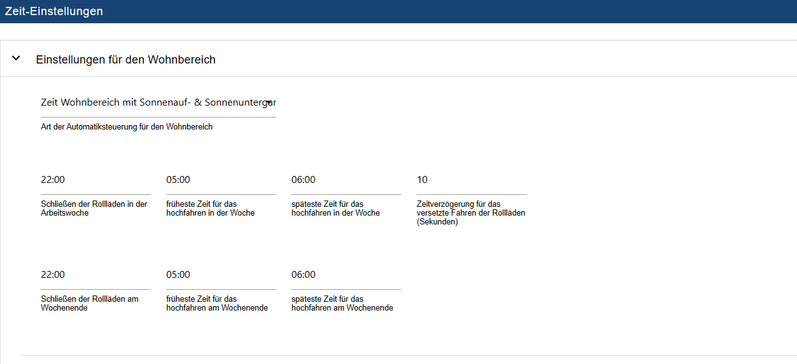
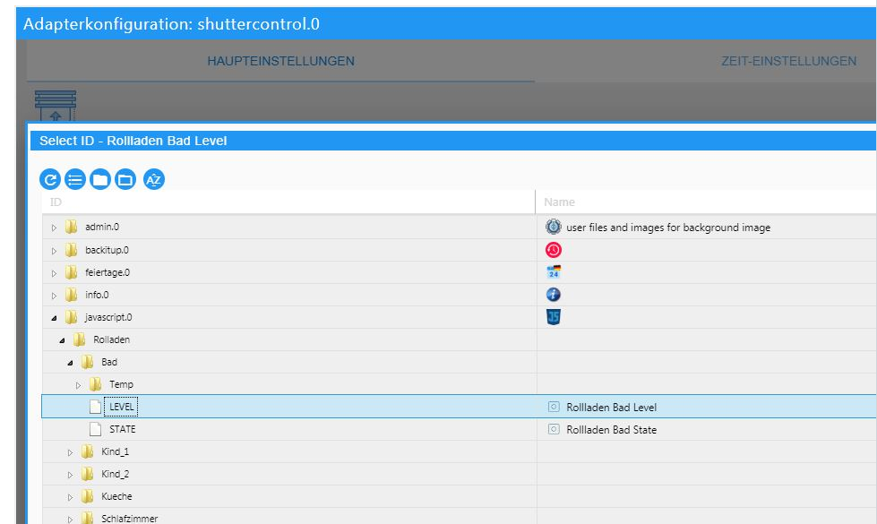
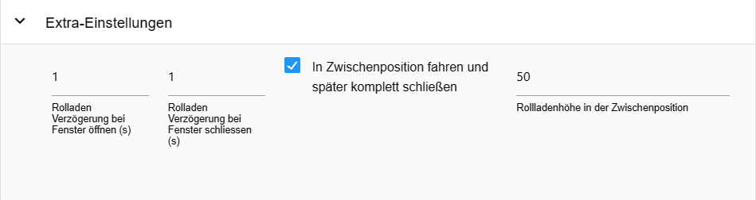
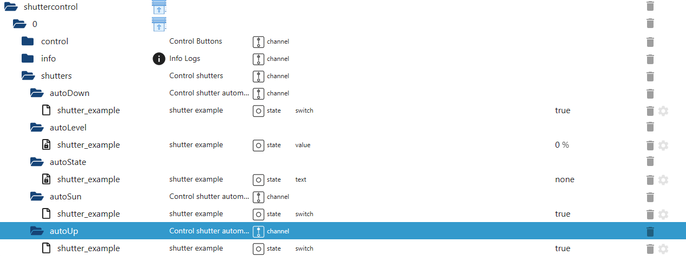

# Documentation and instructions for Shuttercontrol

 

[](https://www.npmjs.com/package/iobroker.shuttercontrol)
[](https://www.npmjs.com/package/iobroker.shuttercontrol)
[](https://snyk.io/test/github/simatec/ioBroker.shuttercontrol)


[](https://github.com/simatec/ioBroker.shuttercontrol/blob/master/LICENSE)
[](https://paypal.me/mk1676)
[](https://github.com/sponsors/simatec)

---

## Support adapter development
**If you like the adapter, please consider making a donation:**
  
[](https://paypal.me/mk1676)


---


## Basics

>:grey_exclamation: The manual is valid from version stable 1.6.2 :grey_exclamation:

Shuttercontrol is an adapter for a very comprehensive control of roller shutters,
blinds or awnings and includes both the automatic shading and the nightly
the night-time darkening.

>:point_right: For the sake of simplicity, only roller shutters are mentioned here.

A large number of adjustable parameters are available for the control, for example:
* three different global timers for e.g. living room, bedroom and children's area,
* various sun position-dependent parameters that can be set individually for each roller shutter.
can be set individually for each roller shutter,
* Triggers for door/window sensors that serve as lock-out protection or automatic opening at an individual level.
opening at an individual level when the door or window is opened,
* Various adjustable parameters for shading depending on e.g.
inside temperature, outside temperature, brightness, heat sensor or similar,
* Inclusion of the position of the sun in order to only darken rooms that are actually shaded.
are illuminated.

All configuration data points are already preset with examples so that
the adapter is quickly ready for use after installing and entering the IDs of the shutter
ready for operation.

The further configuration is then used to adapt to personal wishes.

> Shuttercontrol can only control actuators via the position, e.g. LEVEL, with values of
from 0 to 100 or 0-255 respectively. The respective shutter or blind timing must be taken over by the actuator.
be taken over by the actuator. Blind actuators that offer one object each for "height" and "slat angle" can be controlled using two blinds.
can be used with two shutter objects with the same parameterisation. 
be used.


---


## Installation
The adapter is located in the "stable" repository of ioBroker. In the "Adapter" tab 
"shuttercontrol" is selected and an instance of the shuttercontrol adapter is created via (+).

## Configuration
After the creation of the instance, the configuration window opens automatically with the 
tabs MAIN SETTINGS, TIME SETTINGS and EXTRA SETTINGS.

>:point_right: The [Time Settings](#time-settings) and [Extra Settings](#extra-settings) tabs should be edited first, 
i.e. before shutters are added via the pencil in the MAIN SETTINGS.


---


### MAIN SETTINGS


---
>:point_right: The documentation on github can be accessed via the question mark at the top right (7).

#### Save or upload adapter configuration

Click on the arrow pointing downwards (9) in the top right-hand corner to save the adapter configuration as a .json file.  
Click on the up arrow (8) to upload an existing adapter configuration in .json format.


_[Back to top](#documentation-and-instructions-for-shuttercontrol)_


---


### TIME SETTINGS
Basic time or Astro settings are made here, which are later used in the [Shutter settings](#shutter-settings) for each shutter.
the [Shutter settings](#shutter-settings) for each shutter.

>:heavy_exclamation_mark: Shuttercontrol always closes shutters **Friday** at the set time of the **weekend**.  
and **Sundays** always at the set time of the **working week** :heavy_exclamation_mark:




#### Settings for the living area, sleeping area and children's area
The individual settings are opened via dropdown. The description is given as an example for the living area and applies analogously to all areas.
for all areas.

>:point_right: Of course, this categorisation does not necessarily have to be used for a living, sleeping or children's area.
children's area, but makes it possible to define three areas in the building with different movement times of the roller shutters.

**Type of automatic control for the living area**

Pulldown is used to select between:

* **Living area time only:**  
*The roller shutters are only operated time-controlled.  

* Time living area with sunrise & sunset.  
*The roller shutters are controlled according to sunrise and sunset, but do not go up  
up before the earliest time and not down after the latest time.  

* **Time living area with Golden Hour:**  
*Analogous to the sunrise and sunset, but with the beginning and end of the "Golden Hour" as a reference.  

**Closing the shutters during the working week:** *Customary time for darkening during the week*.

**Earliest time for raising during the week:** *This is the earliest time for raising the shutters during the week.

**Latest time for raising during the week:** *This is the latest time at which the roller shutters will be raised during the week*.

**Time delay for the staggered raising of the roller shutters (seconds):** *Distance between the individual raising of the roller shutters  
of this range, e.g. to avoid radio interference or to give the impression that they are being moved manually.

**Closing of roller shutters at weekends:** *Customary time for darkening at weekends **and** on public holidays.

**Earliest time for raising at weekends:** *This is the earliest time at which the shutters are raised at weekends **and** on public holidays.

**Latest time for raising at the weekend:** *At this time the roller shutters are raised at the weekend **and** at the latest on public holidays*.  
  
>:point_right: If roller shutters are never to be raised if the sun has not yet exceeded a certain 
has not yet passed a certain position, this time must be set to the latest
time of this sun position (on 21.12.).


_[Back to top](#documentation-and-instructions-for-shuttercontrol)_


---

### EXTRA SETTINGS


#### Astro settings


**Latitude and longitude:** *Shuttercontrol takes the latitude and longitude from the ioBroker system settings.  
Shuttercontrol uses these values to calculate the position of the sun.

**Exiting the sun protection function with sun height (elevation):** *As soon as the sun falls below the height set here, the shading ends.  
the shading by Shuttercontrol ends.

>:point_right: Possibly existing premature shading due to buildings or high trees,
can be taken into account here and end the automatic shading earlier.

**Time delay for raising or lowering (minutes):** *A +/- offset can be entered here,  
by which the shutter movements should be delayed from the type of automatic control selected in [Time settings](#time-settings).

**Time delay for staggered shutter movement (seconds):** *To prevent all shutters from moving at the same time,  
a global time delay in seconds can be set here.


_[Back to top](#documentation-and-instructions-for-shuttercontrol)_

---

#### Summer settings


**Start of summer** and **End of summer:** *Here the start or end of summer can be set according to your own wishes.

Under [Shutter settings](#shutter-settings) of the respective shutter, setting the checkbox at ``Do not close shutter in summer`` prevents this shutter from closing in summer.


_[Back to top](#documentation-and-instructions-for-shuttercontrol)_


---

#### Christmas settings


**Start of the Christmas period** and **End of the Christmas period:** *Here, the start or end of the Christmas period can be set according to your own wishes.

Under [Extra settings for roller shutters](#extra-settings-roller-shutter) Christmas settings
the function desired at this time is switched on and
the desired roller shutter position.


_[Back to top](#documentation-and-instructions-for-shuttercontrol)_


---

#### Holiday and public holiday settings


**Using public holidays:** *By activating this checkbox and selecting the corresponding instance of the holiday adapter, the shutters will move on public holidays at the set times from the weekend.

>:point_right: If necessary, two instances of the public holiday adapter can be created:  
> one to display all possible public holidays and one with public holidays relevant to working time, which is then accessed by shuttercontrol.

**Object ID for setting the holiday: *This object ID sets the internal state "Holiday".  
Here, for example, a data point from the iCal adapter can be used that returns the value ``true`` in the case of a holiday and thus allows the shutters to move at the weekend times.


_[Back to top](#documentation-and-instructions-for-shuttercontrol)_


---

#### Brightness Sensor Settings


If the shutters are to be moved automatically using a brightness sensor, this is configured here.

Activation is then carried out individually for each shutter under [Main shutter settings](#main-shutter-settings). 
under **Type of control for closing (or opening) the roller shutter** by selecting the entry "Brightness sensor".

**Brightness value for closing with brightness sensor** *Brightness value from which the shutters are to be closed.

**Brightness value for opening with brightness sensor** *Brightness value from which the shutters are to be opened*.

**Object ID of brightness sensor** *The reference to the brightness sensor, e.g. from a weather station or from an outdoor motion sensor or separate brightness sensor.


_[Back to top](#documentation-and-instructions-for-shuttercontrol)_


---

#### School Holidays Settings


Here, the holiday period can be activated either via a separate data point with **Object ID for activating/deactivating school holidays** or by setting the tick the instance of the installed Schoolfree Adapter.  
The shutters then open during the holiday period at the set times for weekend driving.  
Holiday mode can be activated individually for each area.


_[Back to top](#documentation-and-instructions-for-shuttercontrol)_


---

#### Special times


**Close certain shutters later** *This option allows all shutters to be lowered again late in the evening.  
This covers the scenario when at the normal time for shutting down the window or door was still open.
window or door was still open at the normal time for closing, or if, for example, the patio door is
is opened again after shutting down.  
When the check mark is set, the setting **Time at which the configured roller shutters should close late** appears.

> This function must be activated for each shutter in the [Shutter settings](#shutter-settings) with the check mark
at **Close roller shutter late** for each roller shutter separately or deactivated if not desired.

**Close all shutters completely in the intermediate position** *Time when all shutters are completely closed in the evening (e.g. 10:00 p.m.)*.

**Open roller shutter only if last movement x minutes ago:** *The roller shutter is only opened by the adapter if the time set here has elapsed.
set here has elapsed.


_[Back to top](#documentation-and-instructions-for-shuttercontrol)_

---

#### Extra settings


**Checking the current shutter status:**  
Some users (among others shelly users) have the problem that the
level changes a little bit. For this reason there is a checkbox here.
If the checkbox is activated, shuttercontrol will check the current level after the waiting time for the 
check of the shutter status, shuttercontrol checks the current level and saves it temporarily.

**Blocking the manu mode for known shutter heights** *Rounding up or down the current shutter heights*.  
Here the position of the roller shutters can be rounded in steps of 5 or 10.


**Object ID of the trigger for the sleeping area (Auto):** *This trigger activates the auto mode of the sleeping area.

**Object ID of the living area trigger (Auto):** *This trigger activates the living area's Auto mode.

**Object ID of the trigger for the children's area (Auto):** *This trigger activates the children's area's Auto mode.

---
#### Alarm settings


>:point_right: For each alarm, a logical data point (true/false) is required for activation, 
> which activates the **alarm** = status **true** or deactivates the **alarm** = status **false**.  
>:point_right: Furthermore, the height (0-100%) to which the roller shutter moves in the event of an alarm must be defined for each alarm.  
>point_right: In the [Alarm setting](#alarm-setting) of the respective shutter, it is then defined to which alarms the shutter should react. 
shutter should react.  


Priorities of the individual alarms:  

Prio 1 (highest priority) --> Fire:  

If this alarm is triggered, the roller shutters configured for it will move to the set height in **any** case. 
>:exclamation: The shutters are then blocked and will **NOT** close automatically, even if the fire alarm is reset (false).

>:point_right:After the fire alarm has been reset, the blinds must be reinitialised using the "openAll" / "closeAll" buttons.  
This prevents the roller shutters from being closed again automatically for any reason in the event of a fire.  
It also ensures that escape routes remain open and access for the fire brigade is guaranteed.
			
Prio 2 - 5 (same priority) --> Rain, Wind2, Wind1, Frost:  

When these alarms are activated, Shuttercontrol moves the configured roller shutter to the last active alarm level.  

When deactivating the individual alarms, however, the following priority is observed:  
			Prio 1 = Fire  
			Prio 2 = Rain  
			Prio 3 = Wind 2  
			Prio 4 = Wind 1  
			Prio 5 = Frost  

The frost alarm only has a direct effect if the activated roller blinds are already closed (danger of the roller blind freezing). If the frost alarm is triggered when the roller shutter is still open, the roller shutter automatically only moves to the height set for frost alarm when it is closed. 


_[Back to top](#documentation-and-instructions-for-shuttercontrol)_


---

### Shutter settings


>:point_right: The example actuator *shutter example* is automatically created, please delete it via the waste bin (5).

Now add your own shutter actuators by clicking on the (+) (1). The ID selection opens and 
select the data point LEVEL that represents the position of the desired roller shutter. 




Structure of the table:


* **No:** *consecutive number of the listed shutters*.

* **Active:** *Checkbox for activating/deactivating the control of the corresponding roller shutter*.

* **Name:** *Name of the actuator is automatically read in from the objects when the ID is selected
and can then be changed according to your own wishes.

* **Object ID shutter:** *Unique ID of the data point to be controlled in the objects*.

* **(+)** *Change a selected roller shutter actuator* * **Pencil** * *Modify a selected roller shutter actuator

* **Pencil** *Open individual configuration of the respective roller shutter*.

* **Double sheet:** *Copy roller shutter* 

* **Arrows:** *Determine the order in which the roller shutters move with the same settings.

* Trashcan:* *Deletes the shutter actuator with all configured data.  


After the roller shutters have been created, pressing the pencil (3) on the corresponding roller shutter with the tabs
[MAIN SETTINGS for roller shutters](#main-shutter-settings), [SUN PROTECTION SETTINGS](#sun-protection-settings) and [EXTRA SETTINGS](#extra-settings)  
each shutter is further configured individually.

---

#### Main shutter settings


In the upper area, the times for opening or closing the shutter are selected
are selected separately via a pull-down menu.
> :point_right: These times have already been configured in [Time settings](#time-settings).

Selection options:
* **Off:** *Do not use timers.

* **Living area:** *The shutter moves at the times as configured in *Living area settings*.

* Living area (automatic):** * *The roller shutter moves at the times configured in *Settings for the living area*.
**and** in addition, the shutter is activated in response to the trigger defined under Extra settings.
Object ID for activating/deactivating the auto living area''. If
If this is set to false, the roller shutter will **not** be moved automatically.

* The roller shutter is moved at the times configured in *Sleeping area settings*.

* The roller shutter is moved at the times configured in *Settings for the sleeping area*.
**and** in addition, the shutter is activated in response to the trigger specified under Extra settings.
Object ID for activating/deactivating the auto-sleep area''.
If this is set to false, the roller shutter will **not** be moved automatically.

* Children's area: * *The roller shutter is moved at the times configured in *Children's area settings*.

* Children's area (automatic):* *The roller shutter moves at the times configured in *Settings for the children's area*.
**and** in addition, the shutter is activated in response to the trigger defined under Extra settings.
Object ID for activating/deactivating the auto children's area''.
If this is set to false, the shutter will **not** be moved automatically.

* Sunset/Sunrise:** * *The shutter moves at sunset or sunrise.

* Sun elevation:If the elevation falls below the value set here, the roller shutter is closed.

* Golden Hour:** * *The roller shutter closes at Golden Hour, which, depending on latitude and time of year, is approx. 1 hour before sunset or after sunrise.
before sunset or after sunrise, depending on latitude and time of year.

* Brightness sensor:** * *The roller shutter only moves according to the brightness sensor, which is set under [Brightness sensor settings](#brightness-sensor-settings).

* Manual operation only:** * *The roller shutter can only be moved manually in the selected direction.
:point_right: No movement is possible via the buttons under ``shuttercontrol.0.control``.  
point_right: This can be useful for awnings, for example, which should not be opened together with other roller shutters.
which should not be opened together with other shutters.

**Value of the window/door sensor in the closed state:** *Here, the value is defined that the trigger under **Object ID of the window/door contact** (e.g. window or door contact) can have.
(e.g. window or turn handle contact) at which the automatic roller shutter system is allowed to move indefinitely.
:point_right: Values such as true, false, 0, 1 or 2 can be selected.

> point_right: If the roller shutter is not in the uppermost position and the sensor status specified here changes, the roller shutter moves to the uppermost position.
sensor status changes, the roller shutter moves to the **roller shutter height when the window or door is opened**.

**Value of the window/door sensor in the tilted state:** *This sets the value that the trigger under **Object ID of the window/door contact** (e.g. window or door contact) is set to.
(e.g. window or turn handle contact) at which the automatic roller shutter system is allowed to move indefinitely.  
:point_right: Values such as true, false, 0, 1 or 2 can be selected.

> point_right: If the roller shutter is not in the uppermost position and the sensor status specified here changes, the roller shutter moves to the uppermost position.
sensor status changes, the roller shutter moves to the **roller shutter height when the window or door is opened**.

> :exclamation: If no window contact with tilt function is present, this value should be set to "not present".

**Move roller shutter when window/door status changes:** *Pulldown to select the function that is to be carried out when the window/door sensor moves
should be carried out:*

**Off**: no movement
* **Open**:  When opening the window/door, the shutter moves up and remains there, when closing the shutter does not move.
* **Close**:  After closing the window/door, the roller shutter moves to the blackout position, when opening, the roller shutter does not move.
**Opening and closing:** The roller shutter moves up when the window/door is opened and moves down again when it is closed.


**Roller shutter height when opening the window or door:** *Wanted roller shutter position from 0-100, e.g. for windows 25% for ventilation, or 100% for doors to be able to pass through. 
for doors to be able to pass through.

**Roller shutter height when window or door is tilted:** *Wanted roller shutter position from 0-100, e.g. for windows 25% for ventilation.

**Use automatic roller shutter even when window/door is open (lock-out protection)** * *If, at the time of automatic closing, the window/door sensor __does not__ correspond to the value entered there (window/door closed), the following will be carried out according to the selected setting:* *.

* **Off**: Lock-out protection is active in both directions, the shutters do not move when the window is open.
* **Open**: Only raising is allowed. At the end of darkening / shading, the roller shutter moves up even though the window is open. The roller shutter is not closed automatically when the window is open.
* **Close**: Only closing is permitted. At the start of darkening / shading, the roller shutter moves down despite the window being open. The roller shutter is not opened when the window is open.
* **Opening and closing**: The roller shutter may move in both directions when the window is open.


**Roller shutter height when moving down:** *Position value when the roller shutter is closed.

**Roller shutter height when raised:** *Position value when roller shutter is open*.

> :point_right: The roller shutter height must be entered according to the actuators used (0-100 or 0-255):
> 0 = closed and 100 = open or 0 = open and 100 = closed.

**Object ID of the window/door contact:**
Use the (+) to select the sensor (state) that is to prevent a roller shutter movement (e.g. door contact).  


_[Back to top](#documentation-and-instructions-for-shuttercontrol)_


---

#### Sun protection settings


**Type of sun protection control:**
The sun protection can be controlled using various triggers for the shading and its end,
The following combinations can be selected via pulldown:

* Out of
* Indoor & outdoor temperature/light sensor
* Compass direction (sun position)
* Indoor/outdoor temperature/light sensor & cardinal direction
* Outside temperature/light sensor & direction
* Outdoor temperature/light sensor
* Indoor temperature
 
> :point_right: The sun protection only triggers when ALL triggers of the selected combination are selected
are active (logical AND connection) and ends when ONE of the triggers becomes inactive.

> :point_right: An object ID must also be stored for ALL selected triggers.

> :point_right: The light sensor is always optional and may remain empty. If the light sensor is configured,
it is linked with the other parameters AND.

**Roller shutter height when moving down:** *The value of how far the roller shutter should be closed when shading.*

**Direction (sun position):** *Alignment of the window on the compass rose (0° = north; 180° = south)*

**+/- Sun position range for active sun protection:** *Area in which the sun (around the center point) would interfere with the window. There is no shading outside this area.*

**Setpoint outside temperature:** *The shading starts at this value (or higher).*

**Hysteresis outside temperature (percent):** *Here you can set a hysteresis in percent so that the roller shutter at
Fluctuations do not constantly go up and down.*
The hysteresis is the difference between the upper temperature value at which shading should begin and the lower temperature value at which shading ends again.

**Outdoor temperature object ID:**
The sensor selected here via the (+) does not necessarily have to measure the outside temperature. He can
provide any value that can be used to trigger the shading.
This can also be a heat sensor (temperature difference sensor).
If no outdoor sensor is selected as a trigger, leave this field blank.

**Setpoint of the sun protection light sensor:** *Threshold value for starting the shading.*
This value depends on the sensor selected in the **Object ID for the sun protection light sensor** field.

**Hysteresis light sensor (percent):**
Here you can set a downward hysteresis in percent so that the
Roller shutters do not constantly move up and down when there are fluctuations caused by changing clouds.
The hysteresis is the difference between the set setpoint at which the
Shading should begin, and the lower brightness value at which shading should begin
ends again.

> :point_right: Example:
Setpoint of the sun protection light sensor is set to 30,000, hysteresis to 40%:
The sun protection is active from 30,000 and remains active until the value falls below 18,000.

**Object ID of the sun protection light sensor:** *Analogue to the outside temperature sensor*
If not selected as trigger, leave blank

**Setpoint indoor temperature:**
Here you can enter a temperature of an internal temperature sensor assigned to the roller shutter
must be entered under which no shading should take place, for example in order to reduce the heat
to use radiation in winter to support heating.

**Hysteresis internal temperature (percent):** *Here you can set a hysteresis in percent so that the roller shutter at
Internal temperature fluctuations do not constantly go up and down.*
The hysteresis is the difference between the upper temperature value at which shading should begin and the lower temperature value at which shading ends again.

**Indoor temperature sensor object ID:**
Use the (+) to select the temperature sensor.
If no indoor sensor is selected as a trigger, leave this field blank.


_[Back to top](#documentation-and-instructions-for-shuttercontrol)_


---

#### Extra settings roller shutter


#### Roller shutter settings


**Close roller shutters late**
With this option the roller shutter is activated at a defined time (adjustable in the
[Special times](#special-times)) is also shut down.
> :exclamation: The lock-out protection is not taken into account here and the roller shutter is lowered despite the window being open! (Danger of being locked out!!) :exclamation:

**Do not close roller shutters in summer**
Some roller shutters should not be closed in summer. The period will be summer
in the [Summer Settings](#summer-settings).

**Driving after closing window**
The roller shutter will be set to the last requested setting after the window/door is closed
Position driven.

> :point_right: This only works if the lockout protection is not set to "Off"!


#### Christmas Settings


If the roller shutter should only be partially closed at Christmas time, because
If a candle arch or similar should remain visible, this option can be used. The
The roller shutter will then not be completely closed at the normal closing time, but will only be closed
driven to a level that can be set.
> :point_right: **The roller shutter level at Christmas time** is only visible and adjustable if
if the check mark for **The roller shutter level at Christmas time is used** is set.

The period when this function should be activated is set under [Christmas Settings](#christmas-settings)
set.
> :point_right: If the roller shutters are to be completely closed later in the evening, this option can be used
> **Close roller shutter late** or **Move to intermediate position and close completely later**
> can be used.
> :point_right: These two options can also be used independently of the Christmas settings.


#### Sun protection settings


**Keep roller shutters in sun protection**
If this option is switched on, the roller shutter remains in the sun protection, even if
There is no longer any sun protection requirement and remains in the sun protection as long as
until the “close” signal comes in the evening.
This prevents the roller shutter from going up and down several times a day.
Very practical in blind operation when the height is kept down (option checked),
and just open and close the slats.

**Delay for falling below the brightness until shading is ended (minutes)**
The time is set here at which a delay should take place if the shade is darkened and the brightness falls below the set level.
The default value is 0 and can be adjusted if required. This option only works in conjunction with a brightness sensor

**Heat protection**
This option allows the roller shutter to be completely closed in hot weather.
After activating this option, the field for entering the temperature in °C appears.

> :point_right: If a roller shutter is adjusted manually and the position does not correspond to that
automatically, the automatic system stops!

> :point_right: If the roller shutter is manually moved to the configured height for opening, closing or sun protection, the automatic function remains.


#### Extra settings


**Roller shutter delay when opening window (s)** *Parameter to delay opening of the roller shutter after the window/door has been opened (in seconds)*

**Roller shutter delay when closing window (s)** *Parameter to delay the closing of the roller shutter after the window/door has been closed (in seconds)*

**Move to intermediate position and later close completely** *When activated, **roller shutter height in the intermediate position** becomes visible. The roller shutter then moves to the set intermediate position when closing and later closes completely*

#### Alarm setting


Here the alarms predefined for the current roller shutter via [Alarm Settings](#alarm-setting) are activated or deactivated.


_[Back to top](#documentation-and-instructions-for-shuttercontrol)_


---

## Data points
Shuttercontrol creates various data points under the following folders:

* shuttercontrol.x.control
* shuttercontrol.x.info
* shuttercontrol.x.shutters

> :point_right: x stands for the respective installed instance

---

### Status of the roller shutters

A roller shutter can have the following status

* up: Roller shutter open
* down: Roller shutter closed
* sunProtect: Roller shutter in sun protection mode
* none: no status available
* OpenInSunProtect: Window or door open in sun protection mode
* Manu_Mode: manual mode (roller shutter was moved manually)
* manu_sunProtect: manually moved into sun protection mode
* Wind1: Wind level 1 alarm
* wind2: Wind level 2 alarm
* triggered: Window opened and roller shutter moved to the open position
* frost: Frost alarm
* rain: Rain alarm
* fire: Fire alarm

---


### shuttercontrol0control


Data points to control various functions such as:
*Holiday
*If ```true```, the roller shutters move at the set times on weekends and at
```false``` during weekday hours.*
> :point_right: Can use your own scripts that calculate or display vacation, days off, etc.
set to true to enable weekend settings.

* autoAll
*Button to set **all** shutters to auto mode*

* autoChildren
*If the roller shutters are controlled with **children's area (automatic)**, the automatic function is activated here
switched on with ```true``` and switched off with ```false```.*

* auto living
*If the roller shutters are controlled with **Living area (automatic)**, the automatic mode is used here
switched on with ```true``` and switched off with ```false```.*

* auto sleep
*If the roller shutters are controlled with **sleeping area (automatic)**, the automatic mode is used here
switched on with ```true``` and switched off with ```false```.*

* closeAll
*Button to close **all** roller shutters in **all areas***

* closeChildren
*Button to close **all** roller shutters in the children's area*

* closeLiving
*Button to close **all** roller shutters in the living area*

* closeSleep
*Button to close **all** shutters in the sleeping area*

* openAll
*Button to open **all** roller shutters in **all areas***

* openChildren
*Button to open **all** roller shutters in the children's area*

* openLiving
Button to open **all** roller shutters in the living area

* openSleep
*Button to open **all** shutters in the sleeping area*

* school free
*Button to manually activate the holiday season and have the roller shutters open at the set time on the weekend*

* sunProtect
*Button to move the roller shutters into the sun protection position*

* sunProtectChildren
*Button to move the roller shutters in the children's area to the sun protection position*

* sunProtectLiving
*Button to move the roller shutters in the living area to the sun protection position*

* sunProtectSleep
*Button to move the roller shutters in the sleeping area to the sun protection position*


_[Back to top](#documentation-and-instructions-for-shuttercontrol)_


---


### shuttercontrol0info
Data points for displaying calculated values and checking configured ones
Times:


_[Back to top](#documentation-and-instructions-for-shuttercontrol)_


---


### shuttercontrol0shutters


* autoDown
*For each roller shutter, automatic closing can be deactivated here with ```false```
or activated with ```true```.*

* autoLevel
*Shows the current position for each roller shutter (roller shutter cannot be controlled via this).*

* autoState
*Shows the current status (up, down, Manu_Mode, sunProtect) for each roller shutter (roller shutter cannot be controlled via this).*

* autoSun
*The sun protection function can be deactivated for each roller shutter with ```false```
or activated with ```true```.*

* autoUp
*For each roller shutter, automatic opening can be deactivated here with ```false```
or activated with ```true```.*


_[Back to top](#documentation-and-instructions-for-shuttercontrol)_

## Changelog
<!-- ### __WORK IN PROGRESS__ -->
### 2.0.5 (2025-09-03)
* (simatec) dependencies updated
* (simatec) Try & Catch for Tab-Menu added

### 2.0.4 (2025-08-31)
* (simatec) Dependencies updated

### 2.0.3 (2025-07-22)
* (simatec) Translations updated

### 2.0.2 (2025-06-29)
* (simatec) Fix Responsive Design for Tab Menu
* (simatec) Dependencies updated

### 2.0.1 (2025-03-24)
* (simatec) Fix Translations
* (simatec) Tab Icons added

### 2.0.0 (2025-03-23)
* (simatec) Dependencies updated
* (simatec) jsonTab added

### 1.8.8 (2025-01-26)
* (simatec) Design Fix
* (simatec) Fix dialog-select-member
* (simatec) Dependencies updated

### 1.8.7 (2025-01-20)
* (simatec) Design Fix

### 1.8.6 (2025-01-11)
* (simatec) eslint-config fix
* (simatec) Dependencies updated
* (simatec) Update License
* (simatec) Fix Frost Alarm

### 1.8.5 (2024-11-27)
* (simatec) Bugfix Brightness down
* (simatec) eslint-config added
* (simatec) Dependencies updated

### 1.8.4 (2024-11-07)
* (simatec) Issue Info added
* (simatec) Dependencies updated
* (simatec) Design Fix
* (simatec) Bugfix Brightness down

### 1.8.3 (2024-10-16)
* (simatec) Fix Alarm
* (simatec) Fix Design
* (simatec) Dependencies updated

### 1.8.2 (2024-09-23)
* (simatec) Responsive design Fix

### 1.8.1 (2024-09-21)
* (simatec) small Design Fix

### 1.8.0 (2024-09-16)
* (simatec) Dependencies updated
* (simatec) Fix End-Delay for Sunprotect
* (simatec) Update Translations
* (simatec) Trigger changed
* (simatec) Code revision and improvements
* (simatec) many small fixes
* (simatec) Fix Sunprotect end by Shutter up
* (simatec) Fix Shutter up when open the Window
* (simatec) Test & Release updated
* (simatec) Fix Trigger
* (simatec) Responsive Design added
* (simatec) Docu Sync2Wiki added

### 1.7.3 (2024-06-20)
* (simatec) Fix Sunprotect End-Delay

### 1.7.2 (2024-06-20)
* (simatec) Fix Shutterstate enabled

### 1.7.1 (2024-06-19)
* (simatec) Dependencies updated
* (simatec) Docu updated

### 1.7.0 (2024-02-05)
* (simatec) Dependencies updated
* (simatec) @iobroker/adapter-dev added
* (simatec) Design optimizations
* (simatec) Gulp deleted
* (simatec) Docu updated
* (simatec) many small fixes

### 1.6.3 (2023-11-01)
* (simatec) Saturday added as work week
* (simatec) Dependencies updated
* (simatec) Fix Auto-Living, Auto-Sleep & Auto-Children
* (simatec) Timeout Fix
* (FredF63) Update German Docu
* (simatec) Wiki added

### 1.6.2 (2023-08-28)
* (simatec) Dependencies updated
* (simatec) node 20 tests added
* (simatec) Fix ending Sunprotect with open door/window
* (5G7K) Fix timing & some states for sunprotect

### 1.6.1 (2023-07-17)
* (simatec) Fix Heat protection

### 1.6.0 (2023-07-16)
* (simatec) Manu mode block added
* (simatec) Heat protection added
* (simatec) Added rounding of incoming shutter states
* (simatec) Ukrainian language added
* (simatec) small Bugfixes
* (simatec) Dependencies updated

### 1.5.0 (2023-06-05)
* (simatec) new Manu-Mode Check added
* (simatec) suncalc added
* (simatec) Dependencies updated

### 1.4.29 (2023-04-26)
* (simatec) Bugfix Brightness down

### 1.4.28 (2023-04-17)
* (simatec) small Fixes

### 1.4.27 (2023-04-17)
* (simatec) small Fixes

### 1.4.26 (2023-04-14)
* (simatec) Fix Sunprotect

### 1.4.25 (2023-04-13)
* (simatec) small Fixes

### 1.4.24 (2023-04-10)
* (simatec) Fix end of Sunprotect
* (simatec) small Fixes
* (simatec) Fix shutter alarm
* (simatec) Sentry fixes
* (simatec) Bugfix Brightness down
* (simatec) Dependencies updated
* (j4nv) Fix Astro Time

### 1.4.23 (2023-03-28)
* (simatec) Bugfix Brightness-Sensor
* (simatec) Dependencies updated
* (simatec) small fixes

### 1.4.22 (2023-03-18)
* (simatec) Bugfix Brightness-Sensor
* (simatec) Dependencies updated
* (simatec) Fix Alarm Settings

### 1.4.21 (2023-02-02)
* (simatec) fix Brightness Settings
* (simatec) Dependencies updated

### 1.4.20 (2023-01-30)
* (simatec) Bugfix Brightness-Sensor

### 1.4.19 (2023-01-22)
* (simatec) Time config for Brightness-Sensor added
* (simatec) small Bugfixes
* (simatec) Dependencies updated

### 1.4.18 (2022-09-24)
* (simatec) Bugfixes Button Action

### 1.4.17 (2022-09-24)
* (simatec) small Bugfixes

### 1.4.16 (2022-09-19)
* (simatec) small Bugfixes
* (simatec) Dependencies updated
* (simatec) Dev-Dependencies updated
* (simatec) Docu updated
* (simatec) travis deleted
* (simatec) update translation
* (simatec) debug for shutterstate added

### 1.4.14 (2022-06-02)
* (simatec) delay for Lightsensor added
* (simatec) Dependencies updated
* (simatec) Dev-Dependencies updated

### 1.4.13 (2022-05-24)
* (FoxRo) Bugfix Alarm handling
* (simatec) Dependencies updated
* (simatec) Dev-Dependencies updated
* (simatec) more debuglog for Trigger

### 1.4.12 (2022-04-11)
* (FoxRo) Bugfix wrongly open after deactivation of weater alarm
* (simatec) Dependencies updated
* (simatec) Dev-Dependencies updated

### 1.4.11 (2022-02-07)
* (simatec) fix objects value
* (simatec) Dependencies updated
* (simatec) Dev-Dependencies updated

### 1.4.10 (2022-01-16)
* (simatec) Bugfix xmas time
* (simatec) Bugfix Shutter delay
* (simatec) Dependencies updated
* (simatec) Dev-Dependencies updated

### 1.4.9 (2021-12-29)
* (simatec) error handling for trigger added
* (simatec) Bugfix Trigger delay
* (simatec) Dependencies updated
* (simatec) Dev-Dependencies updated

### 1.4.8 (2021-12-25)
* (simatec) error handling for trigger added
* (simatec) Bugfix Trigger delay

### 1.4.7 (2021-12-21)
* (simatec) complete error handling for states added
* (simatec) Bugfix Down Late Option
* (simatec) small Bugfixes
* (simatec) Dependencies updated
* (simatec) Dev-Dependencies updated

### 1.4.6 (2021-12-15)
* (simatec) Bugfixes shuttersettings
* (simatec) Bugfix shutter created

### 1.4.5 (2021-12-14)
* (simatec) small Bugfixes
* (simatec) Code cleaning
* (simatec) try & catch added
* (simatec) source code was converted to async
* (simatec) Dependencies updated
* (simatec) Dev-Dependencies updated

### 1.4.4 (2021-12-08)
* (simatec) Bugfix Trigger after shutter close
* (simatec) Bugfix XMas Level by frost
* (simatec) XMas Level for Elevation added
* (simatec) Summertime for Elevation added
* (simatec) small Bugfixes
* (simatec) shutter Config check added

### 1.4.3 (2021-12-05)
* (simatec) Bugfix Trigger after shutter close
* (simatec) Bugfix XMas Level by frost
* (simatec) XMas Level for GoldenHour added
* (simatec) Summertime for Goldenhour added
* (simatec) small Bugfixes

### 1.4.2 (2021-12-02)
* (simatec) Bugfix Alarm settings
* (simatec) Bugfix move shutter after closing window
* (simatec) better translation for all languages
* (simatec) small Bugfixes

### 1.4.1 (2021-12-01)
* (simatec) Code cleaning
* (simatec) Bugfix Alarm States
* (simatec) try & catch added

### 1.4.0 (2021-11-30)
* (simatec) Source code completely redesigned
* (simatec) Much of the source code was converted to async
* (simatec) many small Bugfixes
* (simatec) Dependencies updated
* (simatec) Dev-Dependencies updated

### 1.3.9 (2021-11-25)
* (simatec) Bugfix between Level
* (simatec) many small Bugfixes
* (simatec) docu updated
* (simatec) Dependencies updated
* (simatec) Dev-Dependencies updated

### 1.3.8 (2021-11-20)
* (simatec) Bugfix XMas-Level
* (simatec) Bugfix Down Complete

### 1.3.7 (2021-11-19)
* (simatec) brightness down State added
* (simatec) BrightnessSensor fix

### 1.3.6 (2021-11-17)
* (simatec) small Bugfixes

### 1.3.5 (2021-11-16)
* (simatec) Bugfix BrightnessSensor
* (simatec) Fix Delay with value 0
* (simatec) DEPENDENCIES updated
* (simatec) Dev-DEPENDENCIES updated

### 1.3.3 (2021-11-07)
* (simatec) Bugfix trigger Tilted

### 1.3.2 (2021-11-05)
* (simatec) Bugfix BrightnessSensor
* (simatec) lastAutoAction in array added
* (simatec) Bugfix Log for alarm

### 1.3.1 (2021-11-04)
* (simatec) Bugfix BrightnessSensor
* (simatec) Object-ID for school holidays added

### 1.3.0 (2021-11-03)
* (FoxRo) alarm function added
* (simatec) Trigger Tilted Window / Door added
* (FoxRo) new Feature Sunprotect end Delay added
* (FoxRo) Bugfix in window trigger
* (FoxRo/simatec) new Features in Docu added
* (simatec) many small BugFix
* (simatec) DEPENDENCIES updated
* (simatec) Dev-DEPENDENCIES updated

### 1.2.1 (2021-06-22)
* (simatec) auto-mode button added
* (simatec) many small BugFix
* (simatec) DEPENDENCIES updated
* (simatec) Dev-DEPENDENCIES updated

### 1.2.0 (2021-05-04)
* (simatec) new Feature shutterSettings added
* (simatec) new Feature brightness sensor for opening added
* (simatec) new Feature brightness sensor for closing added
* (simatec) new Feature schoolfree adapter added
* (simatec) new Feature middle position added
* (simatec) new Feature Xmas position added
* (simatec) Bugfix
* (simatec) DEPENDENCIES updated
* (simatec) Dev-DEPENDENCIES updated
* (simatec) timeout settings for shutterstatus added

### 1.1.5 (2021-01-22)
* (simatec) BugFix io-package
* (simatec) Source code structure changed
* (FoxRo) new Feature "trigger delay"
* (FoxRo) Bugfix for trigger

### 1.1.4 (2021-01-22)
* (simatec) BugFix Log
* (simatec) DEPENDENCIES updated
* (simatec) Dev-DEPENDENCIES updated

### 1.1.3 (2021-01-21)
* (simatec) small fix for objects

### 1.1.2 (2021-01-18)
* (simatec) small fix for holiday state

### 1.1.1 (2021-01-04)
* (René) bug fix xmas time
* (simatec) copy function for shutter-table added

### 1.1.0 (2020-12-08)
* (simatec) GUI redesign
* (simatec) Intermediate position added for closing

### 1.0.5 (2020-12-05)
* (Rene) fix xMas Time

### 1.0.4 (2020-10-28)
* (simatec) fix summertime for childrenarea

### 1.0.3 (2020-10-28)
* (René) bug fix: calculation IsSummerTime
* (René) bug fix: use weekend down time already on friday instead of sunday
* (René) handling of shutters in xmas time added
* (FredF63) documentation updated
* (FredF63) words.js updated
* (simatec) some Bugfixes

### 1.0.2 (2020-10-08)
* (simatec) fix uptime for childrenarea

### 1.0.1 (2020-10-06)
* (simatec) Adjustment of the configuration menu
* (simatec) time settings for the children's area added
* (simatec) button for closing the children's area added
* (simatec) button for opening the children's area added
* (simatec) button for sun protection of the children's area added

### 1.0.0 (2020-09-28)
* (simatec) some Bugfixes
* (simatec) code cleaning
* (simatec) DEPENDENCIES updated
* (simatec) Dev-DEPENDENCIES updated
* (FoxRo) Added buttons for Sunprotect Living and Sunprotect Sleep
* (FoxRo) Included Living-Auto and Sleep-Auto in Buttons for Open/Close Sleep and Living
* (FoxRo) KeepSunprotect added
* (FoxRo) Drive after close added
* (FoxRo) Extend status handling

### 0.8.7 (2020-09-22)
* (simatec) small Bugfix for weekend

### 0.8.6 (2020-08-21)
* (simatec) small Bugfixes trigger

### 0.8.5 (2020-08-03)
* (simatec) small Bugfixes
* (5G7K) bugfixes trigger
* (FredF63) new german doku

### 0.8.4 (2020-07-17)
* (simatec) small Bugfixes
* (5G7K) debug log changed
* (simatec) Dependencies updated
* (MeisterTR) Time left to detect second sleep

### 0.8.3 (2020-07-07)
* (simatec) Bugfix IsSummerTime
* (simatec) Bugfix shutter convert

### 0.8.2 (2020-07-06)
* (simatec) small Bugfixs
* (simatec) Buttons for sunprotect operation added

### 0.8.1 (2020-07-03)
* (simatec) Bugfix shutterstates
* (simatec) support for KNX

### 0.8.0 (2020-07-02)
* (simatec) added state for current shutter Action
* (simatec) added state for current shutter Level
* (simatec) added Indicator for manual operation in the states
* (simatec) code cleanup
* (simatec) complete new structure of the code
* (simatec) Buttons for manual opening and closing operation added
* (simatec) Display in the States if the shutter was moved manually
* (5G7K) Bug fix sunprotect

### 0.7.3 (2020-06-29)
* (simatec) errorhandling for sentry.io
* (simatec) bugfixes
* (simatec) cancel all schedule by unload
* (rg-engineering) bug fix and documentation

### 0.7.2 (2020-06-26)
* (simatec) Bugfix sunprotect for outsidetemp
* (simatec) better translation for all languages
* (simatec) better overview in the user interface

### 0.7.1 (2020-06-24)
* (simatec) small bugfixes
* (simatec) errorhandling for sentry.io

### 0.7.0 (2020-06-23)
* (rg-engineering) better (userfriendly) check for adjustable times
* (rg-engineering) datapoint for Holiday incl. internal check and handling
* (rg-engineering) late all down added 
* (5G7K) Extended sun protection
* (simatec) edited User Menu for Timesettings
* (simatec) Bugfix Lightvalue to 20.000 Lux
* (simatec) added better German Translation

### 0.6.2 (18.05.2020)
* (simatec) errorhandling for sentry.io
* (simatec) Bugfix getState

### 0.6.1 (11.05.2020)
* (simatec) bugfix index_m.html

### 0.6.0 (10.05.2020)
* (simatec) added sentry.io
* (simatec) added node 14 Support
* (simatec) many small Bugfixes
* (simatec) node 8 support removed
* (5G7K) added new feature for sunprotect
* (5G7K) added more debug logs

### 0.5.1 (15.04.2020)
* (simatec) Bugfix for Adapter checker
* (simatec) Added more debug logs
* (simatec) Added node Support
* (simatec) node 8 support removed
* (Rene) late all down added
* (Rene) late all down configurable per shutter
* (Rene) in summer time not to move down (configurable)

### 0.5.0 (06.04.2020)
* (simatec) Bugfix Goldenhour
* (simatec) Bugfix delay for sunprotect
* (simatec) Bugfix Goldhour with living area
* (simatec) Added auto fill for Position
* (simatec) many small Bugfixes
* (simatec) Bugfix Translations
* (simatec) Bugfix compactmode
* (5G7K) Added debug log with more Informations

### 0.4.3 (29.12.2019)
* (simatec) Bugfix update process

### 0.4.2 (22.12.2019)
* (simatec) Fix Trigger added objects

### 0.4.1 (20.10.2019)
* (simatec) Fix update process
* (simatec) Fix appveyor

### 0.4.0 (28.08.2019)
* (simatec) Fix shutdown for Elevation
* (simatec) Fix triggerHeight
* (simatec) Fix Travis

### 0.3.2 (09.07.2019)
* (simatec) Added state check for all shutter
* (simatec) Bugfix sunprotect
* (simatec) Bugfix trigger
* (simatec) Bugfix time settings
* (Homoran) Added German Docu

### 0.3.1 (02.07.2019)
* (simatec) Fix sunprotect for shelly user

### 0.3.0 (01.07.2019)
* (simatec) Fix shutter up for Sunprotect
* (simatec) Fix input for elevation
* (simatec) Fix input for Inside temperature
* (simatec) Fix input for Outside temperature
* (simatec) Fix input for Lightsensor
* (simatec) Added Object to shutter
* (simatec) Added hysteresis for Lightsensor
* (simatec) Added hysteresis for Inside temperature
* (simatec) Added hysteresis for Outside temperature
* (simatec) Added State check after running
* (simatec) Fix autodrive
* (simatec) Added check shutter up for sunprotect
* (simatec) Added Translations
* (simatec) sunprotect changed to switch
* (Homoran/simatec) Added German Docu
* (simatec) Added English Docu

### 0.2.13 (21.06.2019)
* (simatec) small Bugfix

### 0.2.12 (21.06.2019)
* (simatec) Changed Time-Settings
* (simatec) Bugfix Trigger for up and down
* (simatec) Bugfix sunprotect with azimut
* (simatec) Added sunprotect not running on state down
* (simatec) Added debug log for any shutter states

### 0.2.11 (20.06.2019)
* (simatec) Fix debug log
* (simatec) temporary storage of the state
* (simatec) automatic stop of sun protection with manual state change

### 0.2.10 (18.06.2019)
* (simatec) edit extra menu
* (simatec) clean code
* (simatec) save current states on start

### 0.2.9 (17.06.2019)
* (simatec) Bugfix PopUp
* (simatec) Fix TriggerID

### 0.2.8 (17.06.2019)
* (simatec) Menu completely revised
* (simatec) Ease of use improved
* (simatec) Example added
* (simatec) Default settings added for each roller shutter
* (simatec) fixed some bugs

### 0.2.7 (14.06.2019)
* (simatec) Beta 0.2.7

### 0.2.6 (14.06.2019)
* (simatec) Beta 0.2.6

### 0.2.5 (11.06.2019)
* (simatec) Beta 0.2.5

### 0.2.4 (11.06.2019)
* (simatec) Beta 0.2.4

### 0.2.3 (10.06.2019)
* (simatec) Fix Elevation
* (simatec) Fix direction
* (simatec) Add all translate
* (simatec) Add new popup for shutter config
* (simatec) clean table

### 0.2.2 (01.06.2019)
* (simatec) Beta 0.2.2

### 0.2.1 (01.06.2019)
* (simatec) Shutters drive when the trigger is changed
* (simatec) Add Trigger ID for Auto-Living
* (simatec) Add Trigger ID for Auto-Sleep
* (simatec) add shutter height for trigger
* (simatec) Add boolean for drive on change Trigger

### 0.2.0 (31.05.2019)
* (simatec) complete restructuring of functions

### 0.1.0 (11.05.2019)
* (simatec) First Beta

### 0.0.1 (02.04.2019)
* (simatec) initial release


*************************************************************************************************************************************

## License
MIT License

Copyright (c) 2019 - 2025 simatec

Permission is hereby granted, free of charge, to any person obtaining a copy
of this software and associated documentation files (the "Software"), to deal
in the Software without restriction, including without limitation the rights
to use, copy, modify, merge, publish, distribute, sublicense, and/or sell
copies of the Software, and to permit persons to whom the Software is
furnished to do so, subject to the following conditions:

The above copyright notice and this permission notice shall be included in all
copies or substantial portions of the Software.

THE SOFTWARE IS PROVIDED "AS IS", WITHOUT WARRANTY OF ANY KIND, EXPRESS OR
IMPLIED, INCLUDING BUT NOT LIMITED TO THE WARRANTIES OF MERCHANTABILITY,
FITNESS FOR A PARTICULAR PURPOSE AND NONINFRINGEMENT. IN NO EVENT SHALL THE
AUTHORS OR COPYRIGHT HOLDERS BE LIABLE FOR ANY CLAIM, DAMAGES OR OTHER
LIABILITY, WHETHER IN AN ACTION OF CONTRACT, TORT OR OTHERWISE, ARISING FROM,
OUT OF OR IN CONNECTION WITH THE SOFTWARE OR THE USE OR OTHER DEALINGS IN THE
SOFTWARE.