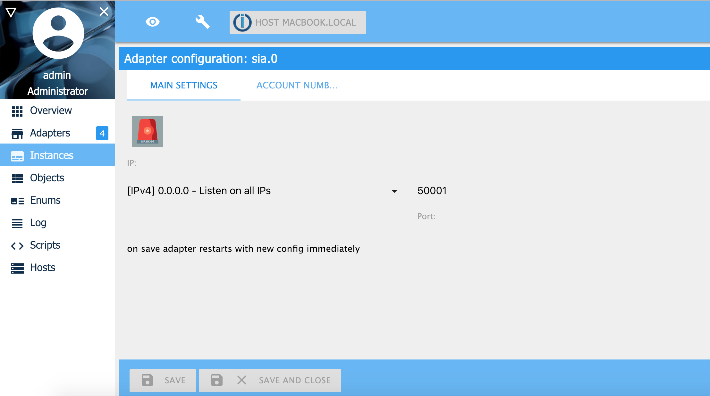

# ioBroker.sia

==================

[](https://travis-ci.org/schmupu/ioBroker.sia)
[](https://ci.appveyor.com/project/schmupu/ioBroker-sia/)
  [](https://www.npmjs.com/package/iobroker.sia)
[](https://www.npmjs.com/package/iobroker.sia)

[](https://nodei.co/npm/iobroker.sia/)

Requires node.js 20.0 or higher and Admin v5!

The protocol SIA DC-09 is used by alarm systems to communicate with the central stations by SIA-DCS, *SIA-DCS, ADM-CID and *ADM-CID.

This adapter is a SIA Server. When an alarm event is triggered, the alarm system sends over IP (TCP or UDP) the sia message to the central station.
The following ID Tokens are supported:

- SIA-DCS (SIA DCS),
- \*SIA DCS (SIA DCS encrypted),
- ADM-CID (Ademco Contact ID),
- \*ADM-CID (Ademco Contact ID encryted)

If use *SIA DCS (SIA DCS encrypted) or *ADM-CID (Ademco Contact ID encryted) you have to enable AES encrypting
and you have to enter a AES passwort in HEX format. The AES passwort has to be for AES-128 = 32 HEX characters, AES-192 = 48 HEX characters and for
AES-256 you have to enter 64 HEX characters.
An Example password for AES-128 would be: 3A1F6B8C9D4E7F20123456789ABCDEF0.

You can use ioBroker with this adapter as central station. For example. you can send a telegram message by ioBroker if you receive an alarm SIA messsage.

[SIA DC-09 protocol](https://www.yumpu.com/en/document/view/47594214/dc-09-preparing-for-ansi-public-review-security-industry-)

## Install & Configuration

1. Install the adapter
2. Configuration of the adapter:

    Choose the IP-address and port for listening for SIA requests.
    

    Register account number. If you are using AES you have to enter a password (key). The key should be 16, 24 or 32 characters (byte) long.
    If the checkbox "AES password in Hex format" is active, the password length must be 32, 48 or 64 character (byte) long.
    In the field ACK timeout, you define how old the message can be in sec. If you define 0 sec., no timeout validation will be done.
    With the checkobx "Connection close by SIA Server", you can decide if the alarmsystem has to close the connection after it received the ACK message.
    If the checkbox "Connection close by SIA Server" ist disabled, the SIA server (ioBroker) waits 30 seconds for closing the connection by the alarmsystem.
    After this 30 seconds the SIA server (ioBroker) will close the connection.

    

3. Configure your burglar system to send SIA messages

    
    - Lupusec XT1+/XT2/XT2+/XT3/XT4 (SIA-DCS):

        Einstellungen -> Contact ID : ip:/subcriber@ip-address-iobroker:port/SIA
        Example: ip://A111F@192.168.20.55:55001/SIA

    - Lupusec XT1+/XT2/XT2+/XT3/XT4 (\*SIA-DCS) encrypted:

        Einstellungen -> Contact ID : ip://subcriber@ip-address-iobroker:port/SIA/KEY/(128,196 or 256 bits key in HEX)
        Example: ip://A222F@192.168.20.55:55001/SIA/KEY/3A1F6B8C9D4E7F20123456789ABCDEF0

    - Lupusec XT1+/XT2/XT2+/XT3/XT4 (ADM-CID):

        Einstellungen -> Contact ID : ip://subcriber@ip-address-iobroker:port/SIA
        Example: ip://A333F@192.168.20.55:55001/CID_SIA

    - Lupusec XT1+/XT2/XT2+/XT3/XT4 (\*ADM-CID) encrypted:

        Einstellungen -> Contact ID : ip://subcriber@ip-address-iobroker:port/CID_SIA/KEY/(128,196 or 256 bits key in HEX)
        Example: ip://A444F@192.168.20.55:55001/SIA/KEY/3A1F6B8C9D4E7F20123456789ABCDEF0

    - Other alarm systems:

        the Adapter will work with all alarm systems, which supports
        the SIA-DCS, *SIA-DCS, ADM-CID or *ADM-CID

4. SIA Objects / States

    If you receive SIA messages, you see them in the states tree under the chanel accounts

    

    You see following object for every account:

    | Object        | Description                                             |
    | ------------- | ------------------------------------------------------- |
    | accountnumber | Accountnumber (3-16 ASCII characters, "0"-"9", "A"-"F") |
    | crc           | CRC Checksum                                            |
    | extdata       | Extended data(ACII Data)                                |
    | id            | ID Token (example SIA-DCS)                              |
    | lpref         | Account prefix                                          |
    | msgdata       | Message data and it is always represented in ASCII      |
    | rpref         | Receiver number                                         |
    | sequence      | Sequence number                                         |
    | ts            | Timestamp (only included in encrypted messages)         |

    Interessting is the object: msgdata (message data). Here you can see the thrown event of the alarm system. How to interpret the event, you have to ask your alarm system manufactor.

    An example javascript in ioBroker to get an event:

    ```
    // example message: A444F|1401 02 001
    on({ id: 'sia.0.accounts.A444F.msgdata'/*A444F - Message Data*/ },  (obj) => {
        if(obj.state.ack === true) {
            const id = getState('sia.0.accounts.A444F.id'/*A444F - ID Token*/).val;
            if(id === 'ADM-CID' || id === '*ADM-CID') {
                const cid = parseMessage(obj.state.val);
                console.log(`Contact ID Message ${JSON.stringify(cid)}`);
                console.log(`Event: ${cid.event} for accountnumber ${cid.accountNumber}`);
            }
        }
    });
    ```

    Output:

    ```
    Contact ID Message {"accountNumber":"A444F","qualifier":"1","event":"401","area":"02","zone":"001"}
    Event: 401 for accountnumber A444F
    ```

    Event 401 means "Remote Arm/Disarm, when the system is armed or disarmed by SMS message or web access"

5. Bugs / Issues

    If you have problems processing SIA messages or you found a bug, please create an issue.
    The issue should have following information:
    1. Manufacturer and type of alarm system
    2. The SIA message as a file. You can create a file if you activate it in the instance configuration.
    3. If you use encryption (AES), then I need the key to decrypt the message for testing.
    4. The debug output from ioBroker when processing the message
    5. Detailed description of the bug

    After you have completed points 2 and 3, please change the AES key.
    You can test the saved SIA message using the following command

    ```
    # cat fileanme_of_sia_message | nc ip_address_of_iobroker sia_port
    cat /tmp/sia/sia_msg_20250201_202457309.txt | nc localhost 55001
    ```

## Changelog

### **WORK IN PROGRESS**

- (Stübi) Fixing @iobroker/adapter-dev 1.0.1 specified. 1.3.0 is required as minimum, 1.3.0 is recommended (Issue #48)
- (Stübi) Fixing dependency (Issue #49)

### 2.0.4 (2025-02-06)

- (Stübi) Fixed Issue Required SIA fields Missing (Issue #19)
- (Stübi) Fixed an error by reading the length of the message
- (Stübi) Fixed Issue Socket not kept connected (Issue #20)
- (Stübi) the crc and length will be shown as HEX ASCII (4 characters) in the object crc and len
- (Stübi) timestamp will be shown in format hh:mm:ss,MM-DD-YYYY (GMT time) in the object ts

### 2.0.3 (2025-02-01)

- (Stübi) add error envent if connction close
- (Stübi) add the proctocol ADM-CID and \*ADM-CID (Ademco Contact ID)
- (Stübi) add translations
- (Stübi) fix bugs by receiving messages by udp
- (Stübi) adjust readme

### 2.0.2 (2025-01-30)

- (Stübi) add: checking accountnumber for exact syntax
- (Stübi) add: checking admin interface aes entries

### 2.0.1 (2025-01-29)

- (Stübi) Redesign of Contact ID Adapter.
- (Stübi) Wokring now with nodejs 20 and 22
- (Stübi) js-controller in version 6 and 7 will be supported
- (Stübi) Ability to save SIA messages.

### 2.0.0 (2025-01-29)

- (Stübi) Major Release

### 1.0.4 (2019-11-17)

- (Stübi) Bugfixing, changing the time calculation for ACK and NACK messages
- (Stübi) Small improvements to the SIA protocol
- (Stübi) Changed bug in encrypting. Delete appending 8 \* 0x10
- (Stübi) Support of UDP. Same port listening as TCP
- (Stübi) Saving password encrypted.
- (Stübi) ACK and NAC calculation extended.
- (Stübi) CRC can be send in 0xABCD (2 Byte) or ABCD (4 Byte, ASCII) format. Automatic recognizing
- (Stübi) AES Password can be in AES-128-CBC, AES-192-CBC or AES-256-CBC
- (Stübi) AES Password can be saved in byte or hex (length 16, 24 or 32 byte) format or hex (length 32, 48 or 64 hex) format
- (Stübi) Timeout for ACK (0 = disable, 1 - n sec)
- (Stübi) Set ioBroker States of message on ACK not on NACK
- (Stübi) Support js-controller compact mode
- (Stübi) Update Adapter Core File
- (Stübi) Bugfxing (NAK) and AES support
- (Stübi) Translations
- (Stübi) Requires nodejs 6.0 or higher
- (Stübi) Cleanup
- (Stübi) SIA regex optimized
- (Stübi) bug fixing
- (Stübi) first implementation

## License

The MIT License (MIT)

Copyright (c) 2025 Thorsten <thorsten@stueben.de>

Permission is hereby granted, free of charge, to any person obtaining a copy
of this software and associated documentation files (the "Software"), to deal
in the Software without restriction, including without limitation the rights
to use, copy, modify, merge, publish, distribute, sublicense, and/or sell
copies of the Software, and to permit persons to whom the Software is
furnished to do so, subject to the following conditions:

The above copyright notice and this permission notice shall be included in
all copies or substantial portions of the Software.

THE SOFTWARE IS PROVIDED "AS IS", WITHOUT WARRANTY OF ANY KIND, EXPRESS OR
IMPLIED, INCLUDING BUT NOT LIMITED TO THE WARRANTIES OF MERCHANTABILITY,
FITNESS FOR A PARTICULAR PURPOSE AND NONINFRINGEMENT. IN NO EVENT SHALL THE
AUTHORS OR COPYRIGHT HOLDERS BE LIABLE FOR ANY CLAIM, DAMAGES OR OTHER
LIABILITY, WHETHER IN AN ACTION OF CONTRACT, TORT OR OTHERWISE, ARISING FROM,
OUT OF OR IN CONNECTION WITH THE SOFTWARE OR THE USE OR OTHER DEALINGS IN
THE SOFTWARE.
