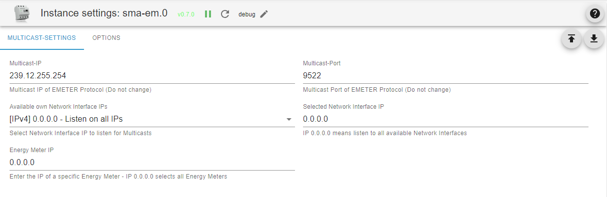
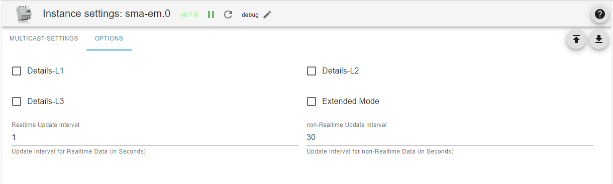
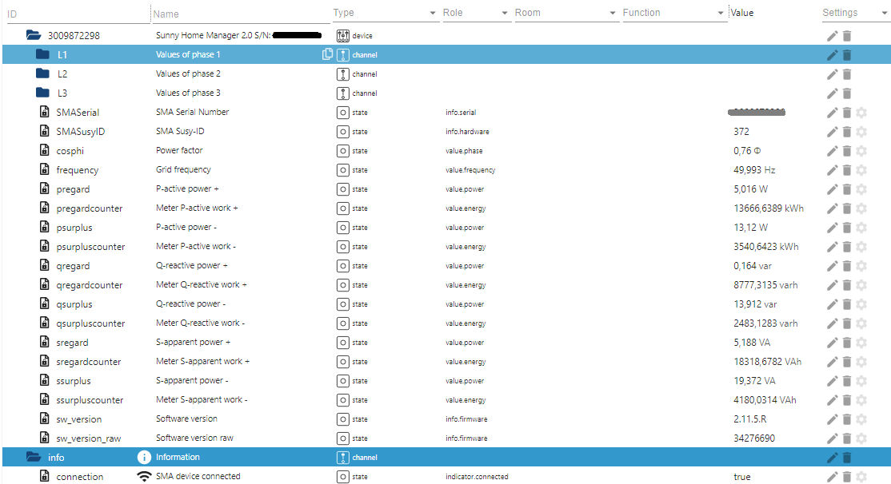

---
---
# SMA Energy Meter Adapter documentation

## General information

The SMA Energy Meter Adapter receives multicast datagrams from the Energy Meter or the Sunny Home Manager. These send data packets with their measurement data into the network every second or more often. The transmission interval of 200ms, 600ms or 1000ms can be set in Sunny Portal.

## Administration / Admin page

- Tab Multicast Settings
  - Multicast IP: The default setting and predefined by SMA is the IP address 239.12.255.254.
  - Multicast Port: The default setting and predefined by SMA is the UDP port 9522.
  - Own Network Interface IPs: Select box showing all available Network Interface IPv4s on ioBroker Server. Select the Network Interface IP to listen for Multicasts from this box.
  - Selected Network Interface IP: Currently selected Network Interface IP listening for Multicast messages. IP 0.0.0.0 means that the adapter listens on all available Network Interfaces. This setting is not recommended as it can cause problems on some networks.
  - Energy Meter IP: IP address of a specific energy meter. If this is entered, the data will only be recorded for this one energy meter in one instance of the adapter. If there are several energy meters, they can each be configured individually in other instances of the adapter. This procedure is simplified via the ioBroker discovery, which detects the SMA energy meters that can be reached in the network and offers the creation of one instance for each energy meter found.
  IP 0.0.0.0 selects all energy meters. All existing energy meters are handled by one instance of the adapter. This is the default and provides compatibility with previous versions of the adapter.

- Tab Options
  - Extended Mode: Provides more detailed information such as reactive power, apparent power, cosphi, voltages, amperage etc. This setting is disabled by default.
  - Details L1 - L3: These selection points can be used to display details of each phase.
  - Real-time update interval: The update interval for real-time data such as instantaneous power or grid frequency is set here. This serves to reduce the system load. Example: With a data packet rate of 5/s (200ms transmission interval), all values are summed up during a real-time update interval of one second and only at the end of the interval is the mean value or the median for frequency and phase updated in the corresponding ioBroker data point.
  - Non-real-time update interval: The update interval for non-real-time data such as meter readings is set here. Here the last received value is updated in the corresponding ioBroker data point only at the end of the interval.

## Folder structure / objects

After installing and starting the adapter, the folder structure shown in the picture is created. The entire data of the Energy Meter is located in the root folder. If they have been configured, the values of the individual phases are located in the subfolders L1-L3.

## Explanation of object IDs

The letters p, q and s are derived from electrical engineering and represent:

- P - Active power
- Q - Reactive power
- S - Apparent power

- The word "regard" here means "consumption". (power received from the grid)
- The word "surplus" here means "feed-in". (power fed into the grid)
- The word "counter" here means "energy meter".

From this, the object names are put together, e.g.

- pregard - active power received from the grid
- psurplus - active power fed into the grid
- pregardcounter - energy meter for the active power received from the grid
- qregard - reactive power received from the grid
- ...