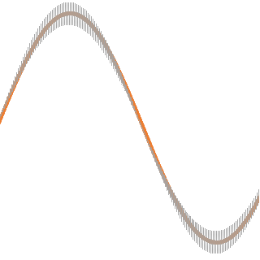
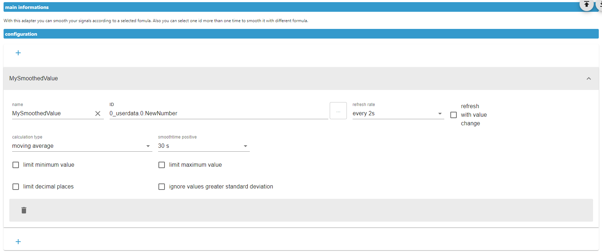

# ioBroker.smoothed

## smoothed adapter for ioBroker
This Adapter make it easy to select some icons to smooth it
according to a selected allgorithem and the smoothtime (filtertime).
You can select one id more times to smooth it in defferent allgorithems
and or times.
The destination is an id in the directory of the flger, wicht delivers you
the smoothed values.
You can limit the min- or max- values.
Limit the decimal places.
Or ignore values with a high standard deviation.

## Changelog
<!--
	Placeholder for the next version (at the beginning of the line):
	### **WORK IN PROGRESS**
-->
### 1.0.7 (2024-05-22)
* (Ben1983) reduce more times subscribtion of the same id

### 1.0.6 (2024-05-21)
* (Ben1983) solve error in setState

### 1.0.5 (2024-05-21)
* (Ben1983) change some loggings

### 1.0.4 (2024-05-21)
* (Ben1983) added more silly debugging for value changes

### 1.0.3 (2024-05-21)
* (Ben1983) added time for standard deviation in unsmeethed mode

### 1.0.2 (2024-04-24)
* (Ben1983) remove wrong warning

### 1.0.1 (2024-04-23)
* (Ben1983) Bugfix maximum Limitation & fix standard deviation

### 1.0.0 (2024-04-01)
* (Ben1983) update ioPackage and adapter-core

### 0.5.0 (2024-02-28)
* (Ben1983) do some changes in Readme and checking for vorbidden chars

### 0.4.3 (2024-02-20)
* (Ben1983) set Name of accordion content

### 0.4.2 (2023-12-23)
* (Ben1983) logging of actual ignered value improoved

### 0.4.1 (2023-12-23)
* (Ben1983) add standard deviation into last array

### 0.4.0 (2023-12-23)
* (Ben1983) calculation and limitation for changes with standard diviation

### 0.3.0 (2023-12-22)
* (Ben1983) functions outsourced in lib/modules

### 0.2.0 (2023-12-21)
* (Ben1983) lowpassfilter added to calculation type

### 0.1.0 (2023-12-20)
* (Ben1983) initial release

## License
MIT License

Copyright (c) 2024 Ben1983 <bsahrdt@gmail.com>

Permission is hereby granted, free of charge, to any person obtaining a copy
of this software and associated documentation files (the "Software"), to deal
in the Software without restriction, including without limitation the rights
to use, copy, modify, merge, publish, distribute, sublicense, and/or sell
copies of the Software, and to permit persons to whom the Software is
furnished to do so, subject to the following conditions:

The above copyright notice and this permission notice shall be included in all
copies or substantial portions of the Software.

THE SOFTWARE IS PROVIDED "AS IS", WITHOUT WARRANTY OF ANY KIND, EXPRESS OR
IMPLIED, INCLUDING BUT NOT LIMITED TO THE WARRANTIES OF MERCHANTABILITY,
FITNESS FOR A PARTICULAR PURPOSE AND NONINFRINGEMENT. IN NO EVENT SHALL THE
AUTHORS OR COPYRIGHT HOLDERS BE LIABLE FOR ANY CLAIM, DAMAGES OR OTHER
LIABILITY, WHETHER IN AN ACTION OF CONTRACT, TORT OR OTHERWISE, ARISING FROM,
OUT OF OR IN CONNECTION WITH THE SOFTWARE OR THE USE OR OTHER DEALINGS IN THE
SOFTWARE.