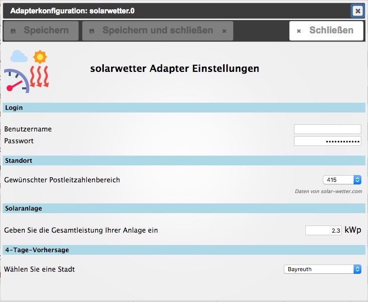

# ioBroker.solarwetter

  

## Description
This adapter delivers a forecast of the daily amount of solar power for a specific region from supplier [http://www.auswahl-plz-bereich.solar-wetter.com](http://solar-wetter.com). 

## Configuration
### User / Passwort
Since 2022/03, authentication is no longer needed.

### Location
Choose your region by selecting from the list of post-codes.
Type in power of your solar plant to calculate energy output.

### Solar plant
Put in the total power of your solar plant to calculate the daily forecast for energy production (decimal separators possible)

### 4-day-forecast
Choose a city to have the adapter build a link to a 4-day-forecast chart (datapoint `solarwetter.0.forecast.chart.__url__` ).

## Schedule
The adapter starts once a day.

## States

`solarwetter.0.forecast.__clearSky__` (*value*)

`solarwetter.0.forecast.__realSky_min__` (*value*)

`solarwetter.0.forecast.__realSky_max__` (*value*)

`solarwetter.0.forecast.__Datum__`  (*string, no timestamp*)

`solarwetter.0.forecast.__Region__` (*value*)

`solarwetter.0.forecast.home.__clearSky__` (*value*)

`solarwetter.0.forecast.home.__realSky_min__` (*value*)

`solarwetter.0.forecast.home.__realSky_max__` (*value*)

`solarwetter.0.forecast.home.__Leistung__` (*value*)

`solarwetter.0.forecast.chart.__city__` (*value*)

`solarwetter.0.forecast.chart.__url__` (*value*)

## Changelog
<!--
    Placeholder for the next version (at the beginning of the line):
    ### **WORK IN PROGRESS**
-->

### 1.1.5 (2023-08-15)
* (motuditli) Adjusted for Website Changes - removal of authentication
* (bluefox) Added compact mode and JSON config

### 1.0.0 (2017-10-15)
* (pix) End of beta, Node.js 4 or higher required

### 0.3.0 (2017-05-28)
* (pix) Login with website password & username

### 0.2.0 (2017-01-05)
* (pix) Travis CI testing added

### 0.1.2 (2016-06-21)
* (pix) city selection fixed

### 0.1.1 (2016-06-20)
* (pix) 4-Day-Forecast Chart

### 0.1.0 (2016-06-12)
* (pix) publish on npm

### 0.0.6 (2016-06-09)
* (pix) Adapter.stop() fixed

### 0.0.5 (2016-05-14)
* (pix) Settings now show correct location if already defined

### 0.0.4 (2016-05-13)
* (pix) Appearance of settings window

### 0.0.3 (2016-05-13)
* (pix) Calculates power of own solar plant

### 0.0.2 (2016-05-13)
* (pix) Post code area selectable

### 0.0.1 (2016-05-12)
* (pix) first release

## ToDo
* Translation of Datapoints
* Russian translation of a settings window

## License

The MIT License (MIT)

Copyright (c) 2020-2023 pix

Permission is hereby granted, free of charge, to any person obtaining a copy
of this software and associated documentation files (the "Software"), to deal
in the Software without restriction, including without limitation the rights
to use, copy, modify, merge, publish, distribute, sublicense, and/or sell
copies of the Software, and to permit persons to whom the Software is
furnished to do so, subject to the following conditions:

The above copyright notice and this permission notice shall be included in all
copies or substantial portions of the Software.

THE SOFTWARE IS PROVIDED "AS IS", WITHOUT WARRANTY OF ANY KIND, EXPRESS OR
IMPLIED, INCLUDING BUT NOT LIMITED TO THE WARRANTIES OF MERCHANTABILITY,
FITNESS FOR A PARTICULAR PURPOSE AND NONINFRINGEMENT. IN NO EVENT SHALL THE
AUTHORS OR COPYRIGHT HOLDERS BE LIABLE FOR ANY CLAIM, DAMAGES OR OTHER
LIABILITY, WHETHER IN AN ACTION OF CONTRACT, TORT OR OTHERWISE, ARISING FROM,
OUT OF OR IN CONNECTION WITH THE SOFTWARE OR THE USE OR OTHER DEALINGS IN THE
SOFTWARE.

---
*Logo is partly crafted by CHALLENGER* :+1:
