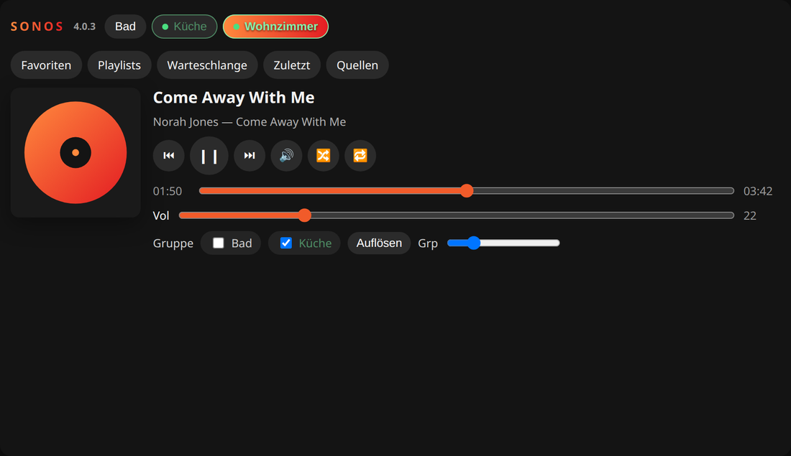
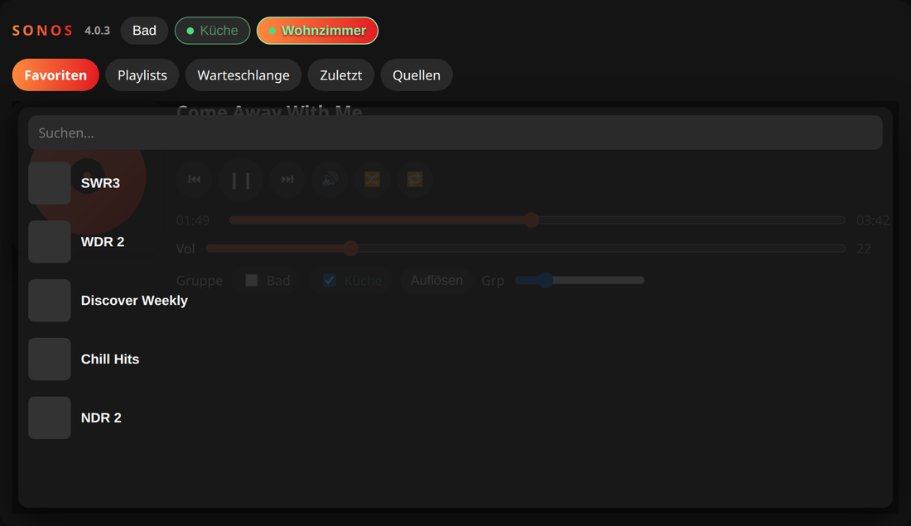

# ioBroker.sonos


[](https://www.npmjs.com/package/iobroker.sonos)


[](https://weblate.iobroker.net/engage/adapters/?utm_source=widget)
[](https://www.npmjs.com/package/iobroker.sonos)

Control and monitor SONOS devices with ioBroker.

## Widgets

The adapter ships one widget for both visualisation adapters. Both are installed with the adapter;
**vis** and **vis-2** are restarted automatically, and the editor needs a hard reload (Ctrl+F5).

**Sonos Control** switches rooms, controls playback, forms groups and starts favorites, playlists,
queue tracks, recent tracks and sources. Bind it to an *instance*, for example `sonos.0` - not to a
single state such as `play`. The widget discovers every speaker of that instance on its own.

Every discovered speaker appears as a chip at the top. Group membership is toggled with the
checkboxes. If a room belongs to a group, the now-playing area shows the track of the group, not the
last local title of that room. The library buttons (**Favorites**, **Playlists**, **Queue**,
**Recent**, **Sources**) open a sheet below them. **Recent** lists the last tracks of the selected
room.



*Rooms, grouping and now-playing*



*The library buttons open a sheet below the rooms*


*Sources: TuneIn, the music library, network shares, line-in and TV HDMI*


*TV HDMI: title TV, format, mute, night sound and speech enhancement*

### vis-2 and vis 1

There are two implementations of **Sonos Control** under the same template id `tplSonosControl`:
a React one for vis-2 (`src-widgets`) and the original jQuery one for vis 1 (`widgets/sonos.html`).

Each editor only ever shows one of them. Because the adapter declares `common.visWidgets`, vis-2
skips `widgets/sonos.html` completely and loads the React widget; vis 1 does not know about React
widget sets and loads the jQuery one. Views that were built with the vis-1 widget keep their
`oid` binding when they are opened in vis-2.

vis-2 additionally offers **Sonos room**, one speaker as a compact card with cover, title, transport
and volume. Its last button opens the same source selection in a dialog, so a single card can also
start a favorite, a playlist or a source. It has no vis-1 counterpart.

In vis-2 each part of Sonos Control (rooms, groups, volume, library) can be switched off, and the
widget can start on a given room.

### Sources

**Sources** browses TuneIn radio, the music library, network shares and line-in through the
speaker's content directory. Music services are listed only when the household actually reports
them, and services with a SMAPI catalog (Spotify for example) can be searched after a one-time
sign-in. Services without such a catalog only show what is already saved in the Sonos app as a
favorite or playlist.

**TV** appears only on speakers that really have an HDMI or optical input (Arc, Beam, Playbar,
Playbase, Ray, Amp). On the TV input there is no transport control - play, pause, seek, next and
previous are not offered; mute, night sound and speech enhancement are.

## Widgets for ioBroker.devices

Besides the vis widgets the adapter delivers two widgets for the dashboard of the
**ioBroker.devices** adapter. They are added there with **+ → SONOS player** / **SONOS rooms**, and
every widget is configured with its own settings dialog - no state has to be picked by hand.

**SONOS player** is one speaker. The settings ask for the instance and the speaker; the list of
speakers comes from the adapter itself, so it always matches the devices on the *SONOS devices* tab.

| Size     | What is shown                                                                   |
|----------|---------------------------------------------------------------------------------|
| 1x1      | The cover as background, the room, the title and play/pause                     |
| 2x0.5    | A strip: cover thumbnail, title, previous/play/next, mute                       |
| 2x1, 2x2 | The whole player: cover, title, transport, shuffle, repeat, progress and volume |

Cover, progress, volume, the shuffle/repeat buttons and the source button can be switched off
individually. On a speaker that plays its TV input the transport buttons are hidden, because the
HDMI input cannot be controlled - only mute stays.

The source button opens the same selection the vis widget shows - favorites, playlists, the queue,
recently played and the browsable sources of the speaker - as a dialog on top of the tile.

**SONOS rooms** is the whole household in one widget: how many speakers are playing, what each of
them plays, and their volume. The small sizes show the counter and open the list in a dialog; 2x1
and 2x2 show the list directly.

Every row also has a source button that opens the source selection for that speaker, so a
favorite or a playlist can be started without leaving the overview.

It also forms groups: the link button of a speaker marks it as the group master, and the link
button of every other speaker then adds it to that group or removes it again. Clicking the master a
second time leaves the mode.

## Control tab in admin

The instance settings have a third tab, **Control**. It is the same player as in vis, but inside
admin: pick a speaker on the left, and control it on the right - transport, progress, volume,
grouping, and the library with favorites, playlists, queue, recently played and sources.

This is meant for checking that a freshly added speaker really answers, without leaving the adapter
configuration. The tab talks to the running instance, so it stays empty while the instance is
stopped.

## Control page in the browser

The adapter ships a control page for the **web** adapter. It is reachable at

```
http://<ioBroker>:8082/sonos/
```

and offers the same as the vis widget: the room chips, what is playing with its cover, transport,
progress, volume, the grouping checkboxes and the source selection with favorites, playlists,
queue, recently played and the browsable sources of the speaker.

No web extension is involved. `iobroker upload sonos` puts the `www/` folder of the adapter into
its ioBroker file storage, and the web adapter serves it from there - its catch-all route reads the
first path segment of the URL as the adapter name. That is the same mechanism the adapter already
uses to hand a TTS file to a speaker.

The page talks to ioBroker through the socket of the web instance that serves it, so it inherits
that instance's authentication and its user rights. The socket client is not bundled: the page asks
the web adapter for `socket.io.js` and gets whatever that instance uses - socket.io or
`@iobroker/ws`.

`?instance=sonos.1` pins the page to one instance, `?room=Kitchen` opens it on a given speaker.
Otherwise, the first instance is used and the last speaker is remembered in the browser.

In admin the page also appears as a tile on the overview, next to the tiles of the other adapters.

## Handling of groups
* States for handling SONOS groups:
   * **`coordinator`**: set/get the coordinator, so the SONOS device which is the master and coordinating the group. It requires the IP address (channel name) of the SONOS device to be the coordinator, but with underscore `_` instead of dot `.`, so use for example `192_168_0_100` for IP address `192.168.0.100`. If the device does not belong to any group, then the value is equal to the own channel name (IP).
   * **`group_volume`**: the volume of the group
   * **`group_muted`**: mute status of the group.
   * **`add_to_group`**: Add a certain SONOS device to the SONOS device under which this state is. Use IP address with underscores (see above).
   * **`remove_from_group`**: Remove a certain SONOS device from the SONOS device under which this state is. Use IP address with underscores (see above).

*) These states will be updated if changes are made in the SONOS app.

## Using it with the sayIt adapter
To use the [sayit adapter](https://github.com/ioBroker/ioBroker.sayit) with this SONOS adapter, ensure that the [web adapter](https://github.com/ioBroker/ioBroker.web) is instantiated and running too. The web adapter is required to allow the SONOS adapter to read the generated MP3 file from the sayit adapter.

### Warning: Stability problems in combination with sayIt adapter
Please note: This SONOS adapter has stability issues if using 'text to speech' with the sayIt adapter. Symptoms observed:
1. Arbitrary change of volume to 0 or 100 %.
2. No response after a random number of text to speech sequences

Workaround for text to speech is to use the [SONOS HTTP API](https://github.com/jishi/node-sonos-http-api).

## Favorites & Queue in VIS
Use states `favorites_list_html` and `queue_html` to show playlists and current queue with basic html widget in VIS. By clicking on a row, the playlist or track will be played immediately.

For an own UI the same lists are available as JSON: `favorites_list_array`, `playlist_list_array`
and `queue_array`. `queue` joins the tracks with a comma and cannot be split back reliably, so use
`queue_array` - it carries one `{ artist, title, album, cover }` entry per track, and the index of
an entry is the value for `current_track_number`.
Format the table with the following CSS classes:

### Favorites
* `sonosFavoriteTable`: hole favorite table
* `sonosFavoriteRow`: rows with favorite information
* `sonosFavoriteNumber`: Number of favorites
* `sonosFavoriteCover`: Album art of favorite (grab image with `.sonosFavoriteCover img`)
* `sonosFavoriteTitle`: Name of favorite

### Queue
* `.sonosQueueTable`: hole table
* `.sonosQueueRow`: rows containing track information
* `.currentTrack`: added to the row containg the current playing track
* `.sonosQueueTrackNumber`: Number or track
* `.sonosQueueTrackCover`: Album art of track (grab image with `.sonosQueueTrackCover img`)
* `.sonosQueueTrackArtist`: Name of artist
* `.sonosQueueTrackAlbum`: Name of album (use `display:none`if not needed)
* `.sonosQueueTrackTitle`: Name of title

For long lists add `overflow:auto;` or `overflow-y:auto;` to basic html widget.
Please note: highlighting current playing favorite is not supported.

### Sample CSS
```
.sonosFavoriteTable {
    color: #bbb;
    font-size: 12px;
}
.sonosFavoriteRow {
    cursor: pointer;
}
.sonosFavoriteNumber {}
.sonosFavoriteCover img {
    width: 30px;
    height: 30px;
}
.sonosFavoriteTitle {}

.sonosQueueTable {
    color: #bbb;
    font-size: 12px;
}
.sonosQueueRow {
    display: table-row;
    cursor: pointer;
}
.sonosQueueRow.currentTrack {
    color: #fff;
    font-weight: bold;
}
.sonosQueueTrackNumber {}
.sonosQueueTrackCover img {
    width: 30px;
    height: 30px;
    display: table-column;
}
.sonosQueueTrackArtist {
    display: table-row;
}
.sonosQueueTrackAlbum {
    display: none;
}
.sonosQueueTrackTitle {
    display: table-row;
}
```

## Development

Four front-ends live next to the adapter, all built with vite - the first three additionally with
module federation:

| Sources        | Build output        | Loaded by                                    |
|----------------|---------------------|----------------------------------------------|
| `src-widgets/` | `widgets/sonos/`    | vis-2                                        |
| `src-admin/`   | `admin/custom/`     | the **Control** tab of the instance settings |
| `src-devices/` | `admin/dm-widgets/` | the dashboard of ioBroker.devices            |
| `src-web/`     | `www/`              | the **web** adapter, at `/sonos/`            |

```bash
npm run npm:all        # install the adapter and all four front-ends
npm run build          # adapter + vis-2 widgets + web page - what CI and npm publish run
npm run build:web      # the control page          -> www/
npm run build:admin    # the Control tab component -> admin/custom
npm run build:devices  # the ioBroker.devices widgets -> admin/dm-widgets
npm run build:all      # everything
```

`admin/custom/` and `admin/dm-widgets/` are committed, because a cold module federation build
pre-builds the whole shared GUI stack and takes several minutes - rebuild them with the scripts
above whenever something below `src-admin/` or `src-devices/` changed, and commit the result.

`src-devices` has a dev harness: `cd src-devices && npm start` opens the widgets on
`http://localhost:3000` against a real ioBroker admin on `localhost:8081`, so they can be developed
without rebuilding into ioBroker.devices every time.

`src-web` has the same: `cd src-web && npm start` serves the control page on
`http://localhost:4174` and proxies the socket, the socket client and the cover images to a web
instance on `localhost:8082`.

## To Do
* Rewrite with https://github.com/svrooij/node-sonos-ts

## Configuration
- Web server - [optional] If web server enabled or not
- Update of elapsed time(ms) - Interval in ms how often to update elapsed timer when the title is playing. (Default 2000)
- Sonos library - which client library talks to the speakers, see below

### Sonos library

The adapter ships two client libraries and the setting picks one. Nothing else changes:
the states, their names and their values are the same either way.

| Setting                         | Library           | Status                               |
|---------------------------------|-------------------|--------------------------------------|
| `sonos-discovery (default)`     | `sonos-discovery` | What the adapter has always used     |
| `@svrooij/sonos (experimental)` | `@svrooij/sonos`  | Maintained replacement, being tested |

`sonos-discovery` has not seen a release since 2022 and one of its dependencies broke the
adapter on start, so the replacement is being prepared. It is offered here so that it can be
tried on real households - there is no SONOS hardware in the CI, and the parts that only real
speakers exercise cannot be covered by tests.

If you try it, the interesting cases are grouping speakers and dissolving the group again,
announcements over running playback, starting a favorite or a playlist, the TV input on a
soundbar, and searching a music service. **Switch back to the default if anything misbehaves**
and please report what you saw - the setting exists so that nobody has to downgrade the
adapter to get a working state back.

<!--
	Placeholder for the next version (at the beginning of the line):
	### **WORK IN PROGRESS**
-->
## Changelog
### 4.2.6 (2026-09-09)
* (@GermanBluefox) Corrected devices widget

### 4.2.5 (2026-09-08)
* (@GermanBluefox) Added a control page for the web adapter under `/sonos/`, plus a tile on the admin overview
* (@GermanBluefox) Added the source selection (favorites, playlists, queue, recently played, sources) to all four widgets
* (@GermanBluefox) Added `queue_array`, the play queue as JSON - `queue` joins the tracks with a comma and cannot be split back reliably

### 4.2.2 (2026-09-08)
* (@GermanBluefox) Added two widgets for the `ioBroker.devices` dashboard: SONOS player and SONOS rooms
* (@GermanBluefox) Added a "Control" tab to the instance settings, which plays and groups the speakers directly in admin

### 4.2.0 (2026-09-06)
* (@GermanBluefox) The client library can be switched in the instance settings
* (@GermanBluefox) Added `@svrooij/sonos` as an experimental alternative to `sonos-discovery`
* (@GermanBluefox) The adapter talks to a backend interface now, so both libraries fill the same states

### 4.1.0 (2026-09-06)
* (@GermanBluefox) Added a React implementation of `Sonos Control` for vis-2, plus the new `Sonos room` widget
* (kosmix1980) vis widget: rooms, groups, favorites, playlists, queue, recent tracks and sources
* (kosmix1980) Sources: TuneIn, music library, network shares, line-in and SMAPI catalog search
* (kosmix1980) TV HDMI as a playable source with format, cover, night sound and speech enhancement
* (kosmix1980) Added `playlist_list` / `playlist_list_array` and per-room `recent_tracks`
* (kosmix1980) Group members follow the coordinator's now-playing and transport
* (@GermanBluefox) TV is offered only on speakers that have an HDMI/optical input
* (@GermanBluefox) Music services are listed only when the household reports them
* (@GermanBluefox) Removed the YouTube Music catalog search: it used a private, undocumented Google endpoint
* (@GermanBluefox) Only the group coordinator updates the elapsed time of the group now
* (@GermanBluefox) SMAPI account tokens are stored with restrictive file permissions

## License

The MIT License (MIT)

Copyright (c) 2014-2026, bluefox <dogafox@gmail.com>

Permission is hereby granted, free of charge, to any person obtaining a copy
of this software and associated documentation files (the "Software"), to deal
in the Software without restriction, including without limitation the rights
to use, copy, modify, merge, publish, distribute, sublicense, and/or sell
copies of the Software, and to permit persons to whom the Software is
furnished to do so, subject to the following conditions:

The above copyright notice and this permission notice shall be included in
all copies or substantial portions of the Software.

THE SOFTWARE IS PROVIDED "AS IS", WITHOUT WARRANTY OF ANY KIND, EXPRESS OR
IMPLIED, INCLUDING BUT NOT LIMITED TO THE WARRANTIES OF MERCHANTABILITY,
FITNESS FOR A PARTICULAR PURPOSE AND NONINFRINGEMENT. IN NO EVENT SHALL THE
AUTHORS OR COPYRIGHT HOLDERS BE LIABLE FOR ANY CLAIM, DAMAGES OR OTHER
LIABILITY, WHETHER IN AN ACTION OF CONTRACT, TORT OR OTHERWISE, ARISING FROM,
OUT OF OR IN CONNECTION WITH THE SOFTWARE OR THE USE OR OTHER DEALINGS IN
THE SOFTWARE.
