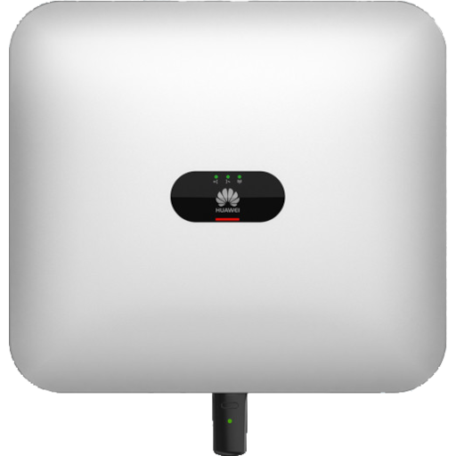

# ioBroker.sun2000-modbus

**This adapter uses Sentry libraries to automatically report exceptions and code errors to the developers.**\
For more details and for information how to disable the error reporting see [Sentry-Plugin Documentation](https://github.com/ioBroker/plugin-sentry#plugin-sentry)!\
Sentry reporting is used starting with js-controller 3.0.

## Huawei SUN2000 inverter adapter for ioBroker

Read data from Huawei SUN2000 inverter and LUNA2000 Storage using Modbus TCP.

Huawei products page: [solar.huawei.com](https://solar.huawei.com/at/professionals/all-products)

## Documentation

see the [documentation page](./docs/README.md)

## Changelog

### **WORK IN PROGRESS**

* ...

### 0.1.2 (2024-03-11)

* Add update interval to state description
* Update of  fixed 
* Fixed battery temperature gain (Reg: 37022, 'storage.batteryTemperature')

### 0.1.1 (2024-03-11)

* Fixed setting connected flag

### 0.1.0 (2024-03-10)

* [#34](https://github.com/daolis/ioBroker.sun2000-modbus/issues/34) Added Battery registers: totalCharge, totalDischarge, batteryTemperature
* [#32](https://github.com/daolis/ioBroker.sun2000-modbus/issues/32) Fixed: No data for ChargePower and CurrentDayChargeCapacity
* [#20](https://github.com/daolis/ioBroker.sun2000-modbus/issues/20) Read alarm registers from inverter (alarms = bits, alarmsJSON = json array with alarms (name, id, level))
* [#29](https://github.com/daolis/ioBroker.sun2000-modbus/issues/29) Added PVn Voltage and Current for available PV Strings 
* Added initial documentation - WIP
* [#26](https://github.com/daolis/ioBroker.sun2000-modbus/issues/26) Renamed stateOfCapacity to stateOfCharge\
  Migration of historical data: see [Migration of historical data (on state name change)](docs/migration.md)
* Blocked reading of registers - faster when fetching data from inverter

### 0.0.2 (2024-01-08)

* Added storage CurrentDayChargeCapacity and CurrentDayDischargeCapacity
* Changes from [Add sun2000-modbus to latest](https://github.com/ioBroker/ioBroker.repositories/pull/3038)

### 0.0.1 (2023-11-26)

* (daolis) initial release

## License
MIT License

Copyright (c) 2024 daolis <stephan.bechter@gmail.com>
