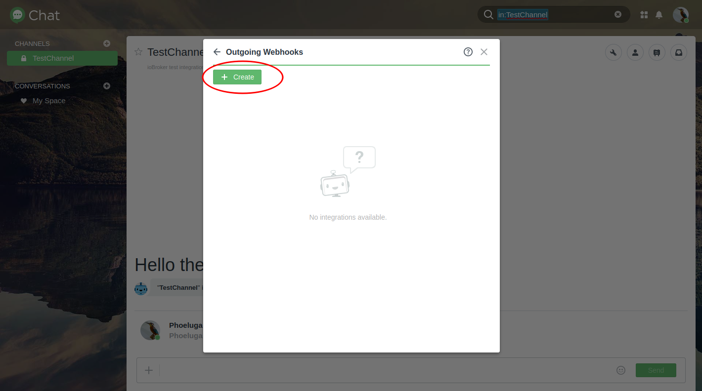
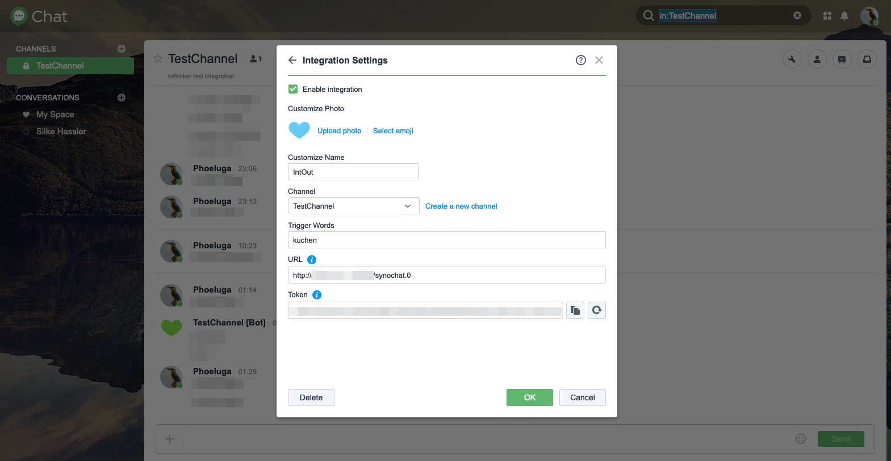
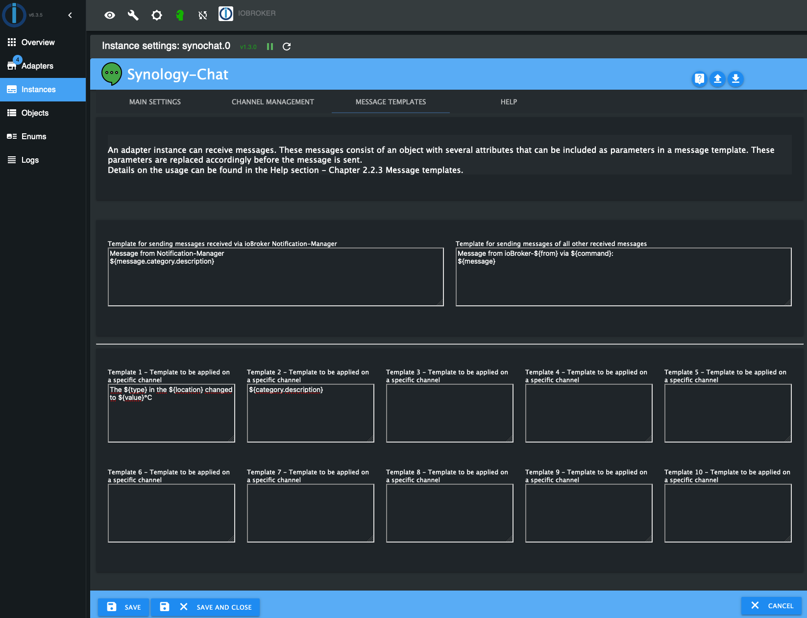
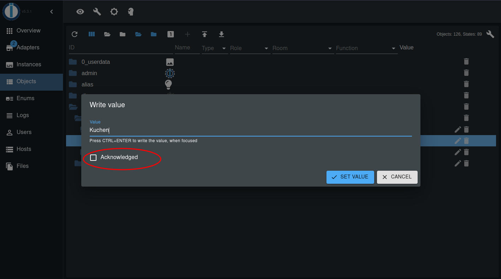

#  Synology-Chat adapter for ioBroker


[](https://www.npmjs.com/package/iobroker.synochat)
[](https://www.npmjs.com/package/iobroker.synochat)


[](https://nodei.co/npm/iobroker.synochat/)

[![Donate][donate-badge2]][donate-link]

## What is it? 
This adapter provides an interface between the Synology Chat and ioBroker.\
For this purpose, the standard integration features provided by Synology Chat and the corresponding REST API endpoints are used.
Incoming and Outgoing integrations can be used to send messages to the Synology chat server or update a message object within your ioBroker instance to receive messages.

---

# Manual

## 1. Installation
The adapter can be instantiated from the adapter section in your ioBroker installation.
More information can be found in the official [ioBroker documentation](https://www.iobroker.net/#de/documentation/admin/adapter.md).

## 2. Configuration

<div id="synology-chat-configuration"></div>

### 2.1. Synology chat configuration
- The Synology Chat offers the possibility to handle incoming and outgoing messages. In the following, both options will be examined in more detail.

- To create messages via the Synology Chat interface, an integration must be created in Synology Chat:


  	#### 2.1.1. Incoming integration

	For the integration of an incoming message in the Synology chat, a token is needed, which can be taken from the URL generated during the creation.
	
	

	<div id="synologyChatConfigurationOutgoingIntegration"></div>

  	#### 2.1.2. Outgoing integration
	For the integration of an outgoing message in the Synology chat, a web hook URL needs to be provided. You will get this web hook URL from the instance objects after instantiating the `synochat` adapter. More details can be found in [3. Usage > 3.1 General](#web-hook-location)
	
	

***NOTE:***
*The channel type (incoming; outgoing) is specified from the perspective of the Synology chat. For example, 'Incoming' means that the messages will be sent to the Synology chat server.*

For more details on how to handle integrations within Synology chat, please refer to Synology's official documentation [HERE](https://kb.synology.com/DSM/help/Chat/chat_integration)

### 2.2. ioBroker adapter instance configuration
- The configuration of this adapter can be done in the instance settings.
    #### 2.2.1. Main settings:
	
    
	* **Synology URL/IP**

        With this property a URL to your Synology-Chat app will be provided. Please note to use an absolute URL including `http://` or `https://` and do not provide an postfix like `/`.
		A specific port can be provided as usual behind the URL using `:`.

		***Sample for valid values:***
		- https://mychat.mydomain.tld
		- https://192.168.1.1:8080

    * **Validate SSL certificate**

        It is of course always recommended to encrypt data transfers.
		Often, self-signed certificates are used for encrypted connections in home environments. In this case, it may be necessary to disable SSL certificate verification of an HTTP connection.
		Disable this property to turn off certificate validation.
	
	* **Hostname / IP address of ioBroker instance**

        This property allows you to specify the hostname or IP address at which your ioBroker instance is accessible via URL. This value is automatically set to the current IP address of the host operating system of your ioBroker installation after the initial adapter instantiation.

		In case of using ioBroker as a Docker instance, it may be necessary to change this value, e.g. if a reverse proxy or similar is used to reach your ioBroker instance.

		This value is used to generate the web hook URL for channels that receive messages from the Synology chat server.

	<div id="configurationAdapterWebInstance"></div>

	* **Web instance for messages send from Synology chat to ioBroker adapter instance**

        The `synochat` adapter is using a `web` adapter to make web hooks available. You need to select a specific instance of the `web` adapter to provide a dedicated web hook to the Synology chat integration.

	<div id="channel-configuration"></div>

    #### 2.2.2. Channel management / configuration:
	

	* **Channel enabled**

		This option can be used to disable the handling of incoming or outgoing messages.

		This can be useful if e.g. the user wants to disable the use of a channel only temporarily and wants to keep the settings like the access token or similar to prevent to collect them again.

    * **Channel name**

		This setting specifies the name of the channel from/to which messages are sent. This name is free to choose in case of channels of type `Send data to Synology chat server - Incoming integration` and is used for referencing.

		The channel name to be configured here should be identical to the channel name of the Synology chat.

		For channels of type `Get data from Synology chat server - Outgoing integration` the name must be identical to the channel name of the Synology chat channel in order to receive messages.
		The mapping of the channel names is case sensitive (upper and lower case must be taken into account).

	* **Channel token**

		This setting provides the access token to the Synology chat channel. Depending on the channel type, the creation of this varies.
		More details can be found in chapter [Synology chat configuration](#synology-chat-configuration).

		***NOTE:***\
		*Depending on the integration, when create the Synology chat integration, you will get a link similar to the following example:*

			https://mychat.mydomain.tld/webapi/entry.cgi?api=SYNO.Chat.External&method=incoming&version=2&token=%22QF5DWyG7M47Ls3cv%22
		
		*In this example, the token is included in the URL. Encoded control characters - `%22` - are specified here at the beginning and end of the setting.\
		**These have to be removed!**\
		In this example the token to be entered would be `QF5DWyG7M47Ls3cv`.*
		
	* **Channel type**
  
		***NOTE:***\
		*The channel type must be specified from the perspective of the Synology chat. For example, selecting 'Incoming' in the configuration means that the messages will be sent to the Synology chat.*

		This setting specifies the type of Synology chat channel that will be used depending on the integration selected in Synology chat.

		* **Send data to Synology chat server - Incoming integration**\
			This option enables the channel to send the new value of the ioBroker message object ([see usage chapter](#usage)) as soon as the object value changes.

        * **Get data from Synology chat server - Outgoing integration**\
			This option enables the channel to receive messages from the Synology chat server and update the new value of the ioBroker message object ([see usage chapter](#usage)).

			Please note that when using this channel type, the channel name of the ioBroker adapter instance configuration must be identical to the channel name of the Synology chat channel in order to receive messages.
			The mapping of the channel names is case sensitive (upper and lower case must be taken into account).

			> Note: Please make sure not to select the '*react on*' options for outgoing channels

		If a channel should be configured in both, sending and receiving messages, simply add a second channel with the same name and select the other channel type.

    * **Object value template**
        
		If the value of a channel message object contains a JSON value, you can select a template that parses this object value into a human-readable value before sending it to the Synology chat channel.
        
		The related message template can be configured in the [Message templates](#message-templates) section.

    * **React on Notification-Manager**
  
        The `synochat` is able to receive messages from [ioBroker Notification-Manager](https://github.com/foxriver76/ioBroker.notification-manager). This option allows you to choose whether the corresponding channel should react to messages from Notification Manager and forward them to Synology Chat accordingly.

		The related message template can be configured in the [Message templates](#messageTemplates) section.

    * **React on all ioBroker messages**
        
		Beside the messages from the [ioBroker Notification-Manager](https://github.com/foxriver76/ioBroker.notification-manager) `synochat` is able to receive also other messages from other adapters. This option allows you to choose whether the corresponding channel should react to messages from all other senders and forward them to Synology Chat accordingly.
		
		An adapter instance can receive messages. These messages consist of an object with several attributes that can be included as parameters in a message template. These parameters are replaced accordingly before the message is sent.

		The related message template can be configured in the [Message templates](#message-templates) section.

	* **Validate SSL certificate - For non-text messages**
	
		In case that for an incoming channel type a content other than a text, for example an image, is to be sent, this is specified from an HTTP source via a URL. If this content is provided with a self-signed certificate, the certificate check can be enabled or disabled with this setting.
		For details on sending non-text content, see chapter [Synology chat configuration](#synology-chat-configuration)..
    
	<div id="message-templates"></div>

	#### 2.2.3. Message templates:
    It is possible to define message templates that are processed before sending a message to Synology Chat Server. These templates can contain patterns that are replaced during the sending process.
    
	

	Patterns must always start with `${` and end with `}`. e.g. `${foo}`. While processing the message the pattern `${foo}` will be replaces with the corresponding JSON value of the attribute `foo`.

	**Sample:**

	If a channel configured to send data to Synology Chat receives an object change to its message object, it may contain a JSON value like the following:
	```json
    {
        "sensor": {
            "id": "temp0815",
            "name": "Temperature - Living room",
            "type": "temperature",
            "location": "living room",
            "value": "23.4"
        }
    }
	```
	You can access the inner attributes of this value by providing them in a path like `${sensor.value}`.

    If you would like to send a text like
	> The temperature in the living room changed to 23.4°C

	your message template would look like this:

	`The ${type} in the ${location} changed to ${value}°C`

	**NOTE AND RESTRICTIONS:**

    1. If you are trying to access an attribute with a key containing dots (`.`) you have to escape them with the chars `/-`!

    	e.g. if your message object value look like this:
    
    	```JSON
    	{
            "category": {
                "instances": {
                    "system.adapter.notification-manager.0": {
                        "notification": "Test notification",
                    }
                }
            }
        }
    	```
        
    	and you want to access the attribute `notification`, your pattern will be `${category.instances.system/-adapter/-notification-manager/-0.notification}`
	
	2. It is not possible to access specific items in arrays.
	    
		e.g. if your message object value look like this:
    
    	```JSON
    	{
            "messages": [
                {
                "text": "Lorem"
                },
                {
                "text": "Ipsum"
                }
            ]
        }
    	```
        
		you cannot access the `text` attribute in the `message` object. In this case you need to prepare the object value outside this adapter before passing it to the `synochat` channel message object.

	* **Template for sending messages received via ioBroker Notification-Manager**
  
        This template will define the message of messages received from the Notification-Manager. As parameters in your template you can use attribute names of the `iobroker.Message` object and the embedded Notification-Manager message object.
		
		The internal received object is of type `iobroker.Message`:

		```javascript
		/** A message being passed between adapter instances */
        interface Message {
            /** The command to be executed */
            command: string;
            /** The message payload */
            message: MessagePayload;
            /** The source of this message */
            from: string;
            /** ID of this message */
            _id: number;
            /** Callback information. This is set when the source expects a response */
            callback: MessageCallbackInfo;
        }
		```
        
		As per description, the Notification-Manager will provide its own message object embedded in the `message` attribute as part of the `iobroker.Message`.

		You can access these data via the `message` attribute by using the pattern `${message.NOTIFICATION_MANAGER_ATTRIBUTES}`.

		**Available patterns:**

		* `${command}` - Pattern related to the `iobroker.Message` object
		* `${message}` - Pattern related to the `iobroker.Message` object
		* `${from}` - Pattern related to the `iobroker.Message` object
		* `${_id}` - Pattern related to the `iobroker.Message` object
		* `${instances}` - Pattern will be replaced with a list of instances related to the received notification of the Notification-Manager

        More information about the structure of the [Notification-Manager](https://github.com/foxriver76/ioBroker.notification-manager) message object can be found in the [README](https://github.com/foxriver76/ioBroker.notification-manager).
        
		> Note: Please make sure not to select the '*react on*' options for outgoing channels

    * **Template for sending messages of all other received messages**
        
        The same `iobroker.Message` object as described above is used for sending all kinds of messages to an adapter instance.
        
		```javascript
		/** A message being passed between adapter instances */
        interface Message {
            /** The command to be executed */
            command: string;
            /** The message payload */
            message: MessagePayload;
            /** The source of this message */
            from: string;
            /** ID of this message */
            _id: number;
            /** Callback information. This is set when the source expects a response */
            callback: MessageCallbackInfo;
        }
		```
    
		From this object itself it is possible to use the following patterns to access the values of the related attributes.

		**Available patterns:**

		* `${command}` - Pattern related to the `iobroker.Message` object
		* `${message}` - Pattern related to the `iobroker.Message` object
		* `${from}` - Pattern related to the `iobroker.Message` object
		* `${_id}` - Pattern related to the `iobroker.Message` object

        The pattern `${message}` is always the one what will contain the information from the corresponding sender. If the message is only containing a `String` you only need to provide the pattern `${message}`. Is it providing a JSON value you can also access the inner attributes by providing the path to the value like `${message.foo.bar}`.

		> Note: Please make sure not to select the '*react on*' options for outgoing channels

    * **Template 1-10 - Template to be applied on a specific channel**

        You can also provide a JSON value to a message object of a specific channel. In this case, you can define up to ten user-specific templates, that can be applied before sending the message to the Synology Chat server.

		The JSON attributes can be accessed by providing the path to the value as a pattern like `${foo.bar}`.

		A template can be associated to a channel in the [Channel configuration](#channel-configuration).

		**Available patterns:**

		The available patterns are related to the customer JSON value that will be provided to the channel message object.

	#### 2.2.4. Help:
   	* This tab usually redirects to the official GitHub page of this project, where detailed help and usage instructions are given.
	* If there are any open questions, suggestions for changes, unwanted behavior or bugs, please create a [GitHub issue](https://github.com/phoeluga/ioBroker.synochat/issues/new/choose) to ensure the quality of this project.

<div id="configurationWebInstance"></div>

### 2.3. Configuration of the `web` instance
For receiving messages from the Synology chat server an outgoing integration is needed to be configured - See [Outgoing integration](#synologyChatConfigurationOutgoingIntegration).

This requires an instance of the `web` adapter to be running and configures in the [`synochat` adapter instance configured](#configurationAdapterWebInstance).

If the used `web` instance is configured to use a secure connection over HTTPS, **ensure that you provide a valid certificate or import your own certificate to the trusted certificates in your Synology**.\
Otherwise, no messages are sent from the Synology chat server to your ioBroker adapter instance.
The communication will not be established and unfortunately there will be no direct indication to the user on both sites that the message was rejected due to an invalid certificate.

<div id="usage"></div>

## 3. Usage
### 3.1 General
* After configuring the adapter instance, a folder with the channel name is created for each configured channel in the objects of the respective adapter instance.
	

* In this folder a message object of the respective channel can be found, which represents the sent or received message.
  
  ***NOTE:***\
	*When sending a message or when the message object is changed by the user, make sure that the Ack flag is not set. The Ack flag will be set by the adapter after confirmation of successful receipt of the message by the Synology chat server.*\
	**If the Ack flag is set by the user while changing the message value in the ioBroker object view, the message will not be processed!***
		
	

* When the message object is changed and the channel type is set to `Send data to Synology chat server`, this message is passed to the Synology chat.
	

* To receive messages from Synology Chat Server and for the message object to be updated accordingly, make sure that the configured `Trigger word` (see [Synology chat configuration](#synology-chat-configuration)) is in the message without punctuation. So it must stand alone.

    **Example:**\
        If the `Trigger word` would be `Alarm`, the message in Synology chat should look like this:\
        `An alarm was triggered in the hallway.`

	Please note that the `Trigger word` is case sensitive (upper and lower case must be taken into account).

<div id="web-hook-location"></div>

* The web hook URL / address will be provided as an object value in the info folder of the adapter instance and is valid for all channels withing one adapter instance.
	

### 3.2 Message content type

Besides sending plain text messages, other content types such as images can also be sent to an incoming channel.\
To realize this, the content must be available as a web resource. To send an image, just set the URL as the value of the the message object of the Syno-Chat adapter instance mentioned in [3. Usage > 3.1 General](#usage).

**Example of a use case of a surveillance camera:**\
Many surveillance cameras provide a stream or interface to retrieve an image that is updated at a specified time interval or when motion is detected.\
This URL provides image that needs to be set as the value of the the message object.


### 3.3 Debugging in case of issues

To get more detailed information about the adapter behaviors in case of issues, you can increase the log level of the `synochat` adapter instance to `debug`.

Since this adapter is using a `web` adapter instance to provide web hooks to the Synology chat server, the configured `web` instance is executing some functions. In order to get more detailed information in case of receiving message issues you need to increase the log level of the configured `web` instance as well to `debug`. Log messages related to the `synochat` adapter can be identified by the log message prefix `synochat.<INSTANCE_NUMBER>`.

---

## Changelog
<!--
    Placeholder for the next version (at the beginning of the line):
    ### **WORK IN PROGRESS**
-->
### 1.3.3 (2025-01-26)
- *[@phoeluga]* Updated admin UI to fix desponsive design (mobile view) - #28

### 1.3.2 (2025-01-04)
- *[@phoeluga]* Fixed issue with 5 digit port number when using a IP for property Synology URL/IP - #20
- *[@phoeluga]* Addressed W[171],W[105],W[109] - #18
- *[@phoeluga]* Updated admin style.css and classes to support scrolling on mobile device view - #24
- *[@phoeluga]* Updated several dependencies to met the current overall config - #21
- *[@phoeluga]* Update test-workflow to be prepared for Node.js v22 - #22
- *[@phoeluga]* Bumped min. Node.js version to v18 - #22
- *[@phoeluga]* Bumped @iobroker/adapter-core to version >= 3.x.x - #23
- *[@phoeluga]* Updated ESLint usage and config - Migration to ESLint 9 - #25

### 1.3.1 (2023-08-13)
- *[@phoeluga]* Fixed TypeError issue with empty initial value of outgoing channels - #13
- *[@phoeluga]* Updated information about handling of outgoing channels - #14
- *[@phoeluga]* Fixed special character escaping issue - #16
- *[@phoeluga]* Added text mapping for 'human readable' descriptions of the message parent objects - #14

### 1.3.0 (2023-07-23)
- *[@phoeluga]* Added feature to react on messages from Notification-Manager - #9
- *[@phoeluga]* Added feature to react on general received messages sent to the `synochat` adapter instance.
- *[@phoeluga]* Added message templates for received messages from other adapters.
- *[@phoeluga]* Added message templates for object values related to an associated channel.

### 1.2.1 (2022-05-18)
- *[@phoeluga]* The IP family check to determine the local IP address of the ioBroker instance has been adjusted.

### 1.2.0 (2022-05-17)

- *[@phoeluga]* Added enhancement #6 - Delayed sending of messages has been added to work around the limitations of messages sent to the Synology Chat Server in a certain time interval.
- *[@phoeluga]* Regarding #6, a message queue has been added to ensure that the order of messages to be sent is respected when the sending of messages is delayed.
- *[@phoeluga]* Implementation of the [requirements](https://github.com/ioBroker/ioBroker.repositories/pull/1759#issuecomment-1127520995) for adding the adapter in the ioBroker repository - Adding MIT license hint to the Readme.
- *[@phoeluga]* Implementation of the [requirements](https://github.com/ioBroker/ioBroker.repositories/pull/1759#issuecomment-1127520995) for adding the adapter in the ioBroker repository - Moved adapter instance object subscription after initial connectivity check.
- *[@phoeluga]* Implementation of the [requirements](https://github.com/ioBroker/ioBroker.repositories/pull/1759#issuecomment-1127520995) for adding the adapter in the ioBroker repository - Added exception handling to cover https://github.com/nodejs/node/issues/43014 in Nodejs 18
- *[@phoeluga]* Implementation of the [requirements](https://github.com/ioBroker/ioBroker.repositories/pull/1759#issuecomment-1127527703) for adding the adapter in the ioBroker repository - Added axios as dependency in package.json

### 1.1.1 (2022-04-16)

- *[@phoeluga]* Fixed issue #4 - Issue while migrating data from version < 1.1.0
- *[@phoeluga]* Added collecting and loading of default values when loading the initial configuration of the adapter instance
- *[@phoeluga]* The channel search behavior has been adjusted to react accordingly to deactivated channels and to query the remaining channels.

### 1.1.0 (2022-04-14)

- *[@phoeluga]* Added the ability to manage multiple channels in one adapter instance per Synology chat server.
- *[@phoeluga]* A possibility of ioBroker hostname / IP address configuration has been introduced.\
(May be helpful when using an ioBroker Docker instance).
- *[@phoeluga]* A functionality to receive incoming messages from the Synology chat server using WebHooks has been added.\
(An instance of the web adapter is required to use this feature)
- *[@phoeluga]* The translation of the UI properties was added.
- *[@phoeluga]* Added function to migrate channel data from an older version to a new channel object in the list approach.
- *[@phoeluga]* Added possibility for a user to disable dedicated channels from being processed.

### 1.0.1 (2022-04-06)

- *[@phoeluga]* Resolved #1 - Unable to send messages with special characters
- *[@phoeluga]* Resolved #2 - Send images


### 1.0.0 (2022-04-05)

- *[@phoeluga]* Initial release


### 0.0.1 (2022-04-03) - ALPHA

- *[@phoeluga]* Start of development


## License

This code is licensed under 'The MIT License (MIT)' license specified in the [LICENSE](./LICENSE) file.

Copyright (c) 2025 phoeluga <phoeluga@gmail.com>


## Other disclosures
#### Resource attribution
- [Chat icons created by Pixel perfect - Flaticon](https://www.flaticon.com/free-icons/chat)


[donate-badge]:https://img.shields.io/static/v1?label=Treat%20a%20coffee&message=donate%20a%20tip&color=2a9cde&logo=data:image/svg+xml;base64,PHN2ZyB2aWV3Qm94PSIwIDAgMjQgMjQiIHhtbG5zPSJodHRwOi8vd3d3LnczLm9yZy8yMDAwL3N2ZyI+PHBhdGggZD0iTTcgMjJoMTBhMSAxIDAgMCAwIC45OS0uODU4TDE5Ljg2NyA4SDIxVjZoLTEuMzgybC0xLjcyNC0zLjQ0N0EuOTk4Ljk5OCAwIDAgMCAxNyAySDdjLS4zNzkgMC0uNzI1LjIxNC0uODk1LjU1M0w0LjM4MiA2SDN2MmgxLjEzM0w2LjAxIDIxLjE0MkExIDEgMCAwIDAgNyAyMnptMTAuNDE4LTExSDYuNTgybC0uNDI5LTNoMTEuNjkzbC0uNDI4IDN6bS05LjU1MSA5LS40MjktM2g5LjEyM2wtLjQyOSAzSDcuODY3ek03LjYxOCA0aDguNzY0bDEgMkg2LjYxOGwxLTJ6IiBmaWxsPSIjZWRmMmZhIiBjbGFzcz0iZmlsbC0wMDAwMDAiPjwvcGF0aD48L3N2Zz4=
[donate-badge2]:https://img.shields.io/static/v1?label=Treat%20a%20coffee&message=donate%20a%20tip&color=2a9cde&logo=data:image/svg+xml;base64,PHN2ZyBkYXRhLW5hbWU9IkxheWVyIDEiIHZpZXdCb3g9IjAgMCAzMiAzMiIgeG1sbnM9Imh0dHA6Ly93d3cudzMub3JnLzIwMDAvc3ZnIj48cGF0aCBkPSJNMjYuNSAxNUgyNnYtMWEyIDIgMCAwIDAtMi0ySDJhMiAyIDAgMCAwLTIgMnY2YTEwLjY0IDEwLjY0IDAgMCAwIDExIDExaDRhMTAuNzkgMTAuNzkgMCAwIDAgOS4zMS01aDIuMTlhNS41IDUuNSAwIDAgMCAwLTExWk0xNSAyN2gtNGE2LjcgNi43IDAgMCAxLTctN3YtNGgxOHY0YTYuNzcgNi43NyAwIDAgMS03IDdabTExLjQ0LTQuNzdoLS43OGExMy43NSAxMy43NSAwIDAgMCAuMi0yLjMxdi0xLjE1aC41OGExLjczIDEuNzMgMCAwIDEgMCAzLjQ2Wk0xMyAxMGEyIDIgMCAwIDAgMi0yVjJhMiAyIDAgMSAwLTQgMHY2YTIgMiAwIDAgMCAyIDJaTTIwIDEwYTIgMiAwIDAgMCAyLTJWN2EyIDIgMCAwIDAtNCAwdjFhMiAyIDAgMCAwIDIgMlpNNiAxMGEyIDIgMCAwIDAgMi0yVjZhMiAyIDAgMCAwLTQgMHYyYTIgMiAwIDAgMCAyIDJaIiBmaWxsPSIjZjBmNWZhIiBjbGFzcz0iZmlsbC1iYTYzYzYiPjwvcGF0aD48L3N2Zz4=
[donate-link]: https://www.paypal.com/donate/?hosted_button_id=9MLB29CKX5674
