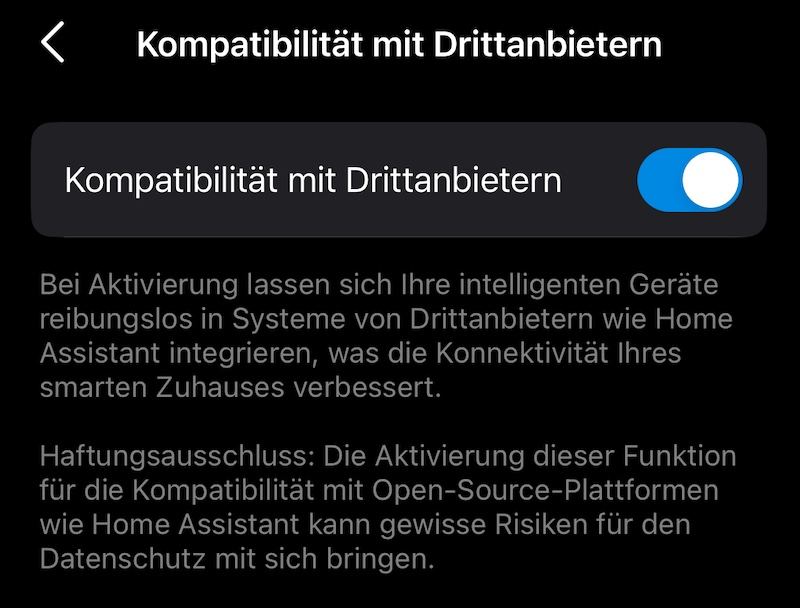

# ioBroker.tapo

[](https://www.npmjs.com/package/iobroker.tapo)
[](https://www.npmjs.com/package/iobroker.tapo)


[](https://nodei.co/npm/iobroker.tapo/)

**Tests:** 

## tapo adapter for ioBroker

Adapter for TP-Link Tapo

based on
https://github.com/apatsufas/homebridge-tapo-p100

## Loginablauf

Die Tapo Mail und Passwort eingeben. Es werden die Geräte via Cloud abgerufen, aber lokal gesteuert.
Wenn die IP nicht gefunden wird muss sie manuell unter tapo.0.id.ip gesetzt werden.

## Status-Werte (eingehend)

Alle Geraete werden regelmaessig gepollt. Die Werte werden automatisch unter `tapo.0.id.*` angelegt.

### Alle Geraete

Beispiel: `tapo.0.80A5897B21C7.nickname`, `tapo.0.80A5897B21C7.device_on`

| Wert | Typ | Beschreibung |
| --- | --- | --- |
| nickname | string | Geraetename |
| device_id | string | Geraete-ID |
| model | string | Modellbezeichnung |
| fw_ver | string | Firmware-Version |
| hw_ver | string | Hardware-Version |
| mac | string | MAC-Adresse |
| device_on | boolean | Geraet ein/aus |
| on_time | number | Einschaltdauer in Sekunden |
| rssi | number | WLAN-Signalstaerke |
| signal_level | number | Signalstaerke (1-3) |
| ssid | string | WLAN-Name |
| ip | string | IP-Adresse |
| overheated | boolean | Ueberhitzungsstatus |

### Lampen (zusaetzlich)

Beispiel: `tapo.0.80A5897B21C7.brightness`, `tapo.0.80A5897B21C7.hue`

| Wert | Typ | Beschreibung |
| --- | --- | --- |
| brightness | number | Helligkeit (0-100) |
| color_temp | number | Farbtemperatur in Kelvin |
| hue | number | Farbton (0-360, nur L530/L630) |
| saturation | number | Saettigung (0-100, nur L530/L630) |

### P110/P115 Energiedaten (zusaetzlich)

Beispiel: `tapo.0.80A5897B21C7.current_power`, `tapo.0.80A5897B21C7.voltage_mv`

| Wert | Typ | Beschreibung |
| --- | --- | --- |
| current_power | number | Aktuelle Leistung (mW) |
| today_energy | number | Energieverbrauch heute (Wh) |
| month_energy | number | Energieverbrauch Monat (Wh) |
| voltage_mv | number | Spannung (mV) |
| current_ma | number | Strom (mA) |
| power_mw | number | Leistung (mW) |
| current (consumption) | number | Aktuelle Leistung (W, berechnet) |
| total (consumption) | number | Energie heute (kWh, berechnet) |

### Hub-Sensoren (Child Devices)

Beispiel: `tapo.0.80A5897B21C7.child_SENSOR_ID.current_temp`

| Sensor | Werte | Beschreibung |
| --- | --- | --- |
| T100 (Bewegung) | detected | Bewegung erkannt |
| T110 (Kontakt) | open | Tuer/Fenster offen |
| T300 (Wasserleck) | water_leak_status, in_alarm | Wasserleck-Status |
| T310/T315 (Temp/Feuchte) | current_temp, current_humidity, temp_unit | Temperatur und Luftfeuchtigkeit |
| KE100 (Thermostat) | target_temp, current_temp, frost_protection_on, trv_states | Thermostat-Status |

Alle Sensoren liefern zusaetzlich `battery_percentage`, `at_low_battery` und `signal_level`.

### Kamera-Status

Beispiel: `tapo.0.80A5897B21C7.alarm`, `tapo.0.80A5897B21C7.personDetection`

| Wert | Typ | Beschreibung |
| --- | --- | --- |
| alarm | boolean | Alarm aktiv |
| eyes | boolean | Privacy-Modus (invertiert: true = Kamera sieht) |
| notifications | boolean | Push-Benachrichtigungen aktiv |
| motionDetection | boolean | Bewegungserkennung aktiv |
| led | boolean | LED aktiv |
| autoTrack | boolean | Auto-Tracking aktiv |
| personDetection | boolean | Personenerkennung aktiv |
| vehicleDetection | boolean | Fahrzeugerkennung aktiv |
| petDetection | boolean | Tiererkennung aktiv |
| babyCryDetection | boolean | Baby-Schrei-Erkennung aktiv |
| barkDetection | boolean | Bellen-Erkennung aktiv |
| meowDetection | boolean | Miauen-Erkennung aktiv |
| glassBreakDetection | boolean | Glasbruch-Erkennung aktiv |
| tamperDetection | boolean | Manipulations-Erkennung aktiv |
| imageFlip | boolean | Bild vertikal gespiegelt |
| ldc | boolean | Linsenverzerrungskorrektur aktiv |
| recordAudio | boolean | Audio-Aufnahme aktiv |
| autoUpgrade | boolean | Firmware Auto-Update aktiv |

Nicht jedes Geraet liefert alle Werte. Felder die das Geraet nicht unterstuetzt werden nicht angelegt.

### Kamera-Erkennungsereignisse

Beispiel: `tapo.0.80A5897B21C7.detection.active`, `tapo.0.80A5897B21C7.detection.events.0.alarm_type`

Die Kamera wird lokal gepollt und liefert Erkennungs-Events (Bewegung, Personen, etc.). Die letzten 10 Events werden abgerufen (`searchDetectionList`), neuestes Event zuerst.

| Wert | Typ | Beschreibung |
| --- | --- | --- |
| detection.active | boolean | true wenn Erkennung in den letzten 30 Sekunden |
| detection.eventCount | number | Anzahl Ereignisse in den letzten 10 Minuten |
| detection.events.0.start_time | number | Unix-Timestamp Start des neuesten Events |
| detection.events.0.end_time | number | Unix-Timestamp Ende des neuesten Events |
| detection.events.0.alarm_type | number | Erkennungstyp (siehe Tabelle unten) |
| detection.events.1.start_time | number | Zweitneuestes Event (usw. bis 9) |
| motionEvent | boolean | ONVIF Echtzeit-Bewegungserkennung |

#### alarm_type Werte

| ID | Beschreibung |
| --- | --- |
| 2 | Bewegung (motion) |
| 3 | Manipulation (tamper) |
| 4 | Linienueberquerung (line crossing) |
| 5 | Bereichsintrusion (area intrusion) |
| 6 | Person (human) |
| 7 | Baby-Schrei (baby cry) |
| 8 | Fahrzeug (vehicle) |
| 9 | Tier (pet) |
| 11 | Bellen (bark) |
| 12 | Miauen (meow) |
| 13 | Glasbruch (glass break) |
| 14 | Rauch (smoke) |
| 15 | Paket abgelegt (package delivery) |
| 16 | Paket abgeholt (package pick-up) |
| 20 | Gesichtserkennung (face detection) |
| 32 | Herumlungern (loitering) |

Nicht jede Kamera liefert alle Typen. Die verfuegbaren Werte haengen von Modell und Firmware ab.

### Alarm-Konfiguration

Beispiel: `tapo.0.80A5897B21C7.alarmInfo.enabled`, `tapo.0.80A5897B21C7.alarmInfo.alarm_volume`

| Wert | Typ | Beschreibung |
| --- | --- | --- |
| alarmInfo.enabled | string | Alarm aktiv (on/off) |
| alarmInfo.alarm_mode | mixed | Alarm-Modus (z.B. sound, light) |
| alarmInfo.alarm_volume | string | Lautstaerke |
| alarmInfo.alarm_duration | string | Dauer in Sekunden |
| alarmInfo.alarm_type | string | Sirenen-Typ |
| alarmInfo.light_type | string | Licht-Typ |
| alarmInfo.light_alarm_enabled | string | Licht-Alarm aktiv (on/off) |
| alarmInfo.sound_alarm_enabled | string | Sound-Alarm aktiv (on/off) |

### Alarm-Event-Typen (welche Erkennungen loesen Alarm aus)

Beispiel: `tapo.0.80A5897B21C7.alertEventTypes.motion`, `tapo.0.80A5897B21C7.alertEventTypes.person`

| Wert | Typ | Beschreibung |
| --- | --- | --- |
| alertEventTypes.motion | boolean | Alarm bei Bewegung |
| alertEventTypes.person | boolean | Alarm bei Person |
| alertEventTypes.vehicle | boolean | Alarm bei Fahrzeug |
| alertEventTypes.pet | boolean | Alarm bei Tier |

### Benachrichtigungen einrichten

Fuer Benachrichtigungen bei Erkennung ein ioBroker-Skript auf `detection.events.0.start_time` triggern:

```javascript
const alarmTypen = { 2:'Bewegung', 3:'Manipulation', 4:'Linienueberquerung', 5:'Bereichsintrusion',
  6:'Person', 7:'Baby-Schrei', 8:'Fahrzeug', 9:'Tier', 11:'Bellen', 12:'Miauen',
  13:'Glasbruch', 14:'Rauch', 15:'Paket abgelegt', 16:'Paket abgeholt', 20:'Gesicht', 32:'Herumlungern' };

on({ id: 'tapo.0.DEVICE_ID.detection.events.0.start_time', change: 'ne' }, (obj) => {
  const typ = getState('tapo.0.DEVICE_ID.detection.events.0.alarm_type').val;
  sendTo('telegram.0', {
    text: (alarmTypen[typ] || 'Typ ' + typ) + ' um ' + new Date(obj.state.val * 1000).toLocaleString()
  });
});
```

Blockly-Beispiel (als XML importierbar):

```xml
<xml xmlns="https://developers.google.com/blockly/xml">
  <block type="on_ext" x="38" y="13">
    <mutation xmlns="http://www.w3.org/1999/xhtml" items="1"></mutation>
    <field name="CONDITION">ne</field>
    <field name="ACK_CONDITION"></field>
    <value name="OID0">
      <shadow type="field_oid">
        <field name="oid">tapo.0.DEVICE_ID.detection.events.0.start_time</field>
      </shadow>
    </value>
    <statement name="STATEMENT">
      <block type="telegram">
        <field name="INSTANCE">.0</field>
        <field name="LOG"></field>
        <value name="MESSAGE">
          <block type="text_join">
            <mutation items="3"></mutation>
            <value name="ADD0">
              <block type="text">
                <field name="TEXT">Tapo Erkennung: Typ </field>
              </block>
            </value>
            <value name="ADD1">
              <block type="get_value">
                <field name="ATTR">val</field>
                <field name="OID">tapo.0.DEVICE_ID.detection.events.0.alarm_type</field>
              </block>
            </value>
            <value name="ADD2">
              <block type="text">
                <field name="TEXT"> erkannt</field>
              </block>
            </value>
          </block>
        </value>
      </block>
    </statement>
  </block>
</xml>
```

Das Polling-Intervall ist in den Adaptereinstellungen konfigurierbar (Standard: 10 Sekunden). Alles lokal, kein Cloud-Zugriff noetig.

## Steuern

tapo.0.id.remote auf true/false setzen steuert den jeweiligen Befehl. Der Befehl wird lokal an das Gerät gesendet.

### Plugs / Switches (P100, P110, P115, ...)

| Remote | Typ | Beschreibung |
| --- | --- | --- |
| refresh | boolean | Manueller Status-Refresh |
| setPowerState | boolean | Ein/Aus |
| setPowerStateChild | string | Child-Device steuern: `childId,true` oder `childId,false` |
| setLedEnabled | boolean | LED Indikator ein/aus |
| setAutoOff | boolean | Auto-Off Timer ein/aus |
| setAutoOffDelay | number | Auto-Off Verzoegerung in Minuten |
| setChildProtection | boolean | Tastensperre (Button Lock) ein/aus |
| setPowerProtection | boolean | Ueberlastschutz ein/aus |
| setPowerProtectionThreshold | number | Ueberlast-Schwellwert in Watt |
| setAutoUpdate | boolean | Firmware Auto-Update ein/aus |

P110/P115 liefern zusaetzlich Energiedaten (Leistung, Spannung, Strom).

### Lampen (L510E, L520E, L530, L630, L900, L920, ...)

Alle Plug-Remotes plus:

| Remote | Typ | Beschreibung |
| --- | --- | --- |
| setBrightness | number | Helligkeit setzen |
| setColorTemp | number | Farbtemperatur (2500-6500K) |
| setColor | string | Farbe setzen: `hue, saturation` |
| setLightEffect | string | Lichteffekt ID oder `off` |
| setGradualOnOff | boolean | Sanftes Ein-/Ausschalten |

### Fans (F1xx)

| Remote | Typ | Beschreibung |
| --- | --- | --- |
| setFanSpeedLevel | number | Geschwindigkeit 0-4 (0 = aus) |
| setFanSleepMode | boolean | Schlafmodus ein/aus |

### Hub (H100, H200)

| Remote | Typ | Beschreibung |
| --- | --- | --- |
| playAlarm | boolean | Alarm abspielen |
| stopAlarm | boolean | Alarm stoppen |
| setAlarmVolume | string | Alarm Lautstaerke: mute/low/normal/high |
| setAlarmDuration | number | Alarm Dauer in Sekunden |

### Thermostat / TRV (KE100)

| Remote | Typ | Beschreibung |
| --- | --- | --- |
| setTargetTemperature | number | Zieltemperatur setzen |
| setTemperatureOffset | number | Temperatur-Offset (-10 bis 10) |
| setFrostProtection | boolean | Frostschutz ein/aus |

### Hub-Sensoren (T100, T110, T300, T310, T315)

Sensordaten (Temperatur, Luftfeuchtigkeit, Bewegung, Kontakt, Wasserleck) werden automatisch via `getChildDeviceList` abgerufen und als Status angezeigt.

### Kameras (C200, C310, C520, TC70, ...)

| Remote | Typ | Beschreibung |
| --- | --- | --- |
| refresh | boolean | Manueller Status-Refresh |
| setAlertConfig | boolean | Alarm ein/aus |
| setLensMaskConfig | boolean | Privacy (Eyes) ein/aus |
| setForceWhitelampState | boolean | Weisslicht ein/aus |
| setLedStatus | boolean | LED ein/aus |
| setMsgPushConfig | boolean | Benachrichtigungen ein/aus |
| setDetectionConfig | boolean | Bewegungserkennung ein/aus |
| setAutoTrackTarget | boolean | Auto-Tracking ein/aus |
| setPersonDetection | boolean | Personenerkennung ein/aus |
| setVehicleDetection | boolean | Fahrzeugerkennung ein/aus |
| setPetDetection | boolean | Tiererkennung ein/aus |
| setBabyCryDetection | boolean | Baby-Schrei-Erkennung ein/aus |
| setBarkDetection | boolean | Bellen-Erkennung ein/aus |
| setMeowDetection | boolean | Miauen-Erkennung ein/aus |
| setGlassBreakDetection | boolean | Glasbruch-Erkennung ein/aus |
| setTamperDetection | boolean | Manipulations-Erkennung ein/aus |
| setImageFlipVertical | boolean | Bild vertikal spiegeln |
| setLensDistortionCorrection | boolean | Linsenverzerrungskorrektur ein/aus |
| setRecordAudio | boolean | Audio aufnehmen ein/aus |
| setAutoUpgrade | boolean | Firmware Auto-Update ein/aus |
| setHDR | boolean | HDR ein/aus |
| setCoverConfig | boolean | Privacy Zones ein/aus |
| setRecordPlan | boolean | SD-Karten Aufnahme ein/aus |
| moveMotor | string | Kamera bewegen: `x, y` (-360..360, -45..45) |
| moveMotorStep | string | Schrittwinkel (0-360) |
| moveToPreset | string | Zu Preset fahren (ID) |
| calibrateMotor | boolean | Motor kalibrieren |
| savePreset | string | Preset speichern (Name) |
| deletePreset | string | Preset loeschen (ID) |
| setCruise | string | Patrol: x/y/off |
| startManualAlarm | boolean | Manuellen Alarm starten |
| stopManualAlarm | boolean | Manuellen Alarm stoppen |
| setAlarmMode | string | Alarm-Modus: both/light/sound/off |
| setDayNightMode | string | Tag/Nacht-Modus: auto/on/off |
| setLightFrequencyMode | string | Lichtfrequenz: auto/50/60 |
| setSpeakerVolume | number | Lautsprecher-Lautstaerke (0-100) |
| setMicrophoneVolume | number | Mikrofon-Lautstaerke (0-100) |
| setMotionDetectionSensitivity | string | Bewegungs-Sensitivitaet: high/normal/low |
| setPersonDetectionSensitivity | string | Personen-Sensitivitaet: high/normal/low |
| setOsd | string | OSD Beschriftungstext |
| reboot | boolean | Kamera neustarten |
| formatSdCard | boolean | SD-Karte formatieren |

Nicht jede Kamera unterstuetzt alle Funktionen. Nicht unterstuetzte Befehle werden mit einer Fehlermeldung im Log quittiert.

## Kamerasteuerung aktivieren




## Diskussion und Fragen

<https://forum.iobroker.net/topic/57336/test-adapter-tp-link-tapo/>

## Changelog
### 0.5.0 (2026-04-02)

- Support for TPAP/SPAKE2+ protocol (P100 FW 1.4.3+ and newer devices)
- Support for KLAP v1 (md5) handshake
- Fix camera connection for firmware 1.9.1+ (C310 etc.)
- 30+ new camera remotes (detection, motor, alarm, cruise, presets, image/audio, OSD)
- New data points for camera status and detection events
- New remotes for plugs, lamps, fans, hubs and thermostats
- Device-specific remotes (only relevant controls per device type)
- Energy data (voltage, current) for P110/P115
- Automatic reconnect for devices that go offline and come back
- Less log spam for unreachable devices

### 0.4.8 (2025-02-04)

- disable sentry to prevent crashes

### 0.4.7 (2025-01-14)

- disable battery devices
- improved wrong formatted mail adresses

### 0.4.6 (2025-01-10)

- add checks for battery devices

### 0.4.5 (2024-12-16)

- fix camera remotes

### 0.4.4 (2024-12-12)

- improve handshake if e-mail is not entered in lowercase

### 0.4.3 (2024-12-09)

- fix handshake for device with HW v1.20

### 0.4.1 (2024-11-29)

- fixed Get Device Info failed error

### 0.3.4 (2024-11-10)

- update Tapo local lib

### 0.3.3 (2024-06-17)

- ignore ssl legacy error
-

### 0.3.2 (2024-05-27)

update onvif lib to fix issues with newer cameras

### 0.2.9 (2024-01-30)

- fix tapo Plugs and setLensMask

### 0.0.2

- (TA2k) initial release

## License

MIT License

Copyright (c) 2024-2030 TA2k <tombox2020@gmail.com>

Permission is hereby granted, free of charge, to any person obtaining a copy
of this software and associated documentation files (the "Software"), to deal
in the Software without restriction, including without limitation the rights
to use, copy, modify, merge, publish, distribute, sublicense, and/or sell
copies of the Software, and to permit persons to whom the Software is
furnished to do so, subject to the following conditions:

The above copyright notice and this permission notice shall be included in all
copies or substantial portions of the Software.

THE SOFTWARE IS PROVIDED "AS IS", WITHOUT WARRANTY OF ANY KIND, EXPRESS OR
IMPLIED, INCLUDING BUT NOT LIMITED TO THE WARRANTIES OF MERCHANTABILITY,
FITNESS FOR A PARTICULAR PURPOSE AND NONINFRINGEMENT. IN NO EVENT SHALL THE
AUTHORS OR COPYRIGHT HOLDERS BE LIABLE FOR ANY CLAIM, DAMAGES OR OTHER
LIABILITY, WHETHER IN AN ACTION OF CONTRACT, TORT OR OTHERWISE, ARISING FROM,
OUT OF OR IN CONNECTION WITH THE SOFTWARE OR THE USE OR OTHER DEALINGS IN THE
SOFTWARE.
