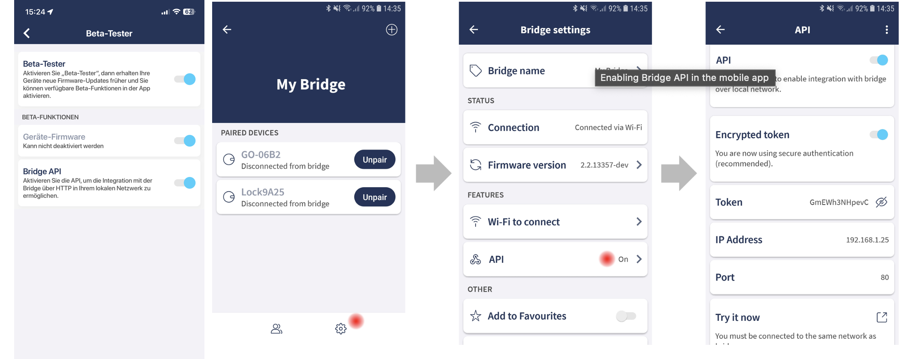

# ioBroker.tedee

**Tests:** 

**This adapter uses Sentry libraries to automatically report exceptions and code errors to the developers.** For more details and for information how to disable the error reporting see [Sentry-Plugin Documentation](https://github.com/ioBroker/plugin-sentry#plugin-sentry)! Sentry reporting is used starting with js-controller 3.0.

## tedee adapter for ioBroker

Adapter for Tedee Locks

This Adapter uses the local bridge API to control a tedee lock

All Lock devices by Tedee are supported.

1. Activate Beta Testing in your user profile
2. Enable API in the bridge settings
3. Copy the IP and the token in the instance settings

The Adapter receives all status update immediatly via webhooks. The interval in the settings is only a backup for continuously refreshs.

Current State of a lock:
tedee.0.id.state

- 0 Uncalibrated
- 1 Calibrating
- 2 Unlocked
- 3 SemiLocked
- 4 Unlocking
- 5 Locking
- 6 Locked
- 7 Pulled
- 8 Pulling
- 9 Unknown
- 18 Updating

## Usage

You can control the tedee lock via tedee.0.id.remote

- lock to Lock/Unlock
- pull to Pull
- unlock unlock

Unlock modes:

- 0 - (or no parameter set) - Normal. From close position: unlock only or unlock with auto pull if enabled. From open position: nothing.
- 2 - Force. Force movement until lock hits resistance.
- 3 - Without Pull. From close position: unlock only without auto pull. From open position: nothing.
- 4 - Unlock or Pull. From close position: unlock only or unlock with auto pull if enabled. From open position: pull.

## Changelog

<!--
    Placeholder for the next version (at the beginning of the line):
    ### **WORK IN PROGRESS**
-->

### 0.3.0 (2023-12-16)

- (TA2k) initial release

## Disclaimer

Tedee is a trademark of tedee. I am in no way endorsed by or affiliated with tedee, or any associated subsidiaries, logos or trademarks

## License

MIT License

Copyright (c) 2023 TA2k <tombox2020@gmail.com>

Permission is hereby granted, free of charge, to any person obtaining a copy
of this software and associated documentation files (the "Software"), to deal
in the Software without restriction, including without limitation the rights
to use, copy, modify, merge, publish, distribute, sublicense, and/or sell
copies of the Software, and to permit persons to whom the Software is
furnished to do so, subject to the following conditions:

The above copyright notice and this permission notice shall be included in all
copies or substantial portions of the Software.

THE SOFTWARE IS PROVIDED "AS IS", WITHOUT WARRANTY OF ANY KIND, EXPRESS OR
IMPLIED, INCLUDING BUT NOT LIMITED TO THE WARRANTIES OF MERCHANTABILITY,
FITNESS FOR A PARTICULAR PURPOSE AND NONINFRINGEMENT. IN NO EVENT SHALL THE
AUTHORS OR COPYRIGHT HOLDERS BE LIABLE FOR ANY CLAIM, DAMAGES OR OTHER
LIABILITY, WHETHER IN AN ACTION OF CONTRACT, TORT OR OTHERWISE, ARISING FROM,
OUT OF OR IN CONNECTION WITH THE SOFTWARE OR THE USE OR OTHER DEALINGS IN THE
SOFTWARE.
