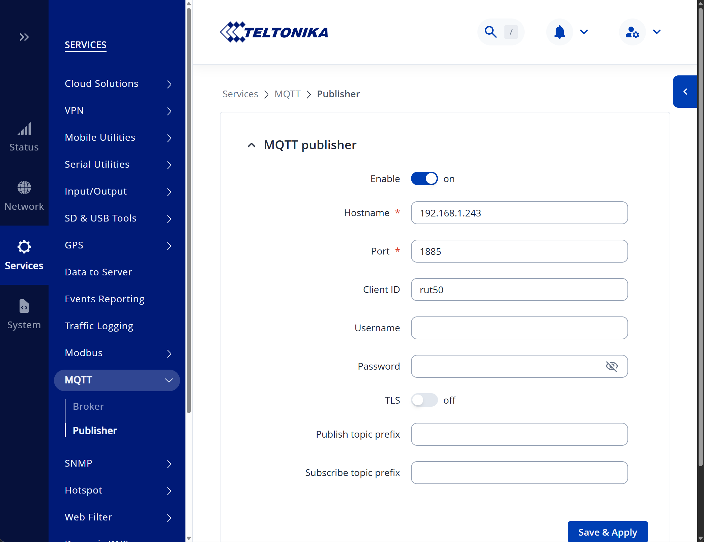

# ioBroker Teltonika


[](https://www.npmjs.com/package/iobroker.teltonika)


[](https://weblate.iobroker.net/engage/adapters/?utm_source=widget)
[](https://www.npmjs.com/package/iobroker.teltonika)

**This adapter uses Sentry libraries to automatically report exceptions and code errors to the developers.** For more details and for information how to disable the error reporting see [Sentry-Plugin Documentation](https://github.com/ioBroker/plugin-sentry#plugin-sentry)! Sentry reporting is used starting with js-controller 3.0.

This adapter reads data from Teltonika routers via MQTT and from Teltonika devices via SNMP.

Routers connect to the adapter themselves over MQTT. Devices without an MQTT publisher — the TSW managed
switches, for example — are polled over SNMP instead; enter them under the SNMP tab, or let the network scan
find them. A router that offers both is only ever read once, over SNMP.

Over MQTT it can read the following information: 
- temperature ('RUT2', 'RUT9', 'RUTX', 'RUT3', 'RUT1', 'TRB2', 'TRB5', 'OTD', 'RUTM', 'RUTC')
- signal strength
- mobile operator
- network state
- connection type (2G/3G/4G/5G)
- wan IP address
- uptime
- name
- digital input 1 ('RUT9')
- digital input 2 ('RUT9')
- analog input ('RUT9', 'TRB2', 'TRB141')
- pin 2 status ('TRB2')
- pin 3 status ('RUT1', 'RUT2', 'RUT9', 'RUTX', 'RUT3', 'TRB1', 'TRB2', 'TRB5', 'RUTM')
- pin 4 status ('RUT1', 'RUT2', 'RUT9', 'RUTX', 'RUT3', 'TRB1', 'TRB2', 'TRB5', 'RUTM')

## Usage
Steps:
- Start the instance first
- Go to your router and open MQTT settings
  
  - Enable MQTT publisher
  - Set the MQTT broker address to the address of your ioBroker instance
  - Set the MQTT broker port. Important: the default port of this adapter is 1885 to not interfere with other MQTT adapters
  - Save the settings
  - Some routers need a restart to apply the settings
- After some time, the data points will be created in the adapter instance

**Notice**: tested is only with `RUTC` and `TSW202` devices.

### SNMP
Devices that offer no MQTT publisher are read over SNMP:
- Enable the SNMP agent on the device under *Services → SNMP → SNMP Settings* and set a read-only community
- In the adapter, open the *SNMP* tab, enter an address range and press *Scan*, or add the device by hand
- Supported today are the `RUTC` and `TSW2` families. Other models fall back to the values every Teltonika
  device shares (serial, name, uptime, CPU); to read them fully, download the MIB from the device under
  *SNMP System Summary*, drop it into `MIBs/` and run `npm run generate-oids`

Beside the values listed above, SNMP also provides per-port statistics on switches (link, speed, duplex,
transferred bytes and rates) and the named digital inputs and outputs of a router.

Four further branches are available but switched **off** by default, because they expose the location of the
device and identifiable clients, and because they change on every poll:
- *GPS position* — latitude, longitude, accuracy, satellites and fix time
- *Wi-Fi radios and networks* — radio state and channel, and per SSID the encryption, mode and client count
- *Hotspot sessions* — the IP, user and authorisation state of each session
- *Wi-Fi client list* — `<device>.wifiClients.count` and `<device>.wifiClients.list`, the latter holding the MAC
  address and SSID of every associated station as JSON

Only the count and that one JSON state: a channel per MAC address would leave every phone that ever joined the
network behind in the object tree. For the devices that matter, use presence below — it needs no branch.

### Presence
Each row of the *Presence* tab becomes `presence.<name>`, set while one of the polled routers reports that MAC
address as associated to its Wi-Fi:

```
teltonika.<n>.presence.anyone           boolean — any of the configured devices present
teltonika.<n>.presence.count            number  — how many of them
teltonika.<n>.presence.<name>.connected boolean
teltonika.<n>.presence.<name>.lastSeen  number  — timestamp of the last sighting
teltonika.<n>.presence.<name>.router    string  — which device reported it
teltonika.<n>.presence.<name>.ssid      string
```

Only the configured devices appear; a station nobody asked about is counted nowhere and kept nowhere, which is
why presence works without switching the *Wi-Fi client list* on.

The addresses do not have to be typed: **Read connected devices** asks every configured SNMP device for its
association list and appends what is not listed yet, as inactive rows named `client_<last three octets>`. The
log then names each station with its SSID and says whether its address is a random one — that is how a phone
is told from a printer, because iOS and Android make up a *locally administered* address per network while a
printer or a TV answers with the one burnt into it. Rename the rows that matter, tick *Active*, delete the
rest. The button talks to the running instance, so start it first.

Three things to know before building automations on it:
- **Enter the MAC address the router shows**, under *Status → Wireless*, not the one printed on the phone.
  Phones use a separate random address per network. It is stable as long as the network stays known to them,
  and changes again once the network is forgotten and rejoined.
- A phone drops out of the association list while it sleeps and reappears seconds later. A sighting therefore
  counts for the **grace period** (180 s by default, or per row), so leaving is noticed that late and arriving
  immediately. Below about a minute the states start to flicker.
- It is read over **SNMP only**. The MQTT publisher of a router answers a fixed set of parameters that does not
  include its clients, so a router that only connects over MQTT reports no presence.

### Switching ports
Fill in a *write community* for a device and its ports become switchable through `<device>.ports.<name>.enabled`.
Left empty, the adapter only reads and the state is created without the write flag.

The switch rides on `ifAdminStatus` of the standard IF-MIB, because the Teltonika MIB exposes nothing writable
at all. **PoE cannot be controlled**: these devices answer with no objects under the POWER-ETHERNET-MIB.

A port only becomes switchable when its name matches exactly one interface. On a TSW202 that covers every port,
since both tables say `port1`…`port8`. A RUTC reports four ports named `LAN` against interfaces `lan1`…`lan4`,
which cannot be paired with any certainty, so only its `WAN` port is switchable.

### Widgets for the device manager
Two components are registered for the *devices* adapter:

- **Teltonika devices** — every router and switch of an instance as a tile: reachability, a strip showing the
  link state of each port, and for a router the operator, connection type and signal. Clicking opens the full
  detail with the front panel, the digital inputs and outputs, and the WAN addresses.
- **Teltonika ports** — the front panel of a single device on its own tile, with link, speed, duplex and
  transferred bytes per port. Ports are drawn the way they are printed on the hardware: odd numbers on the
  upper row, even below, fibre cages in their own group. The device is picked from a dropdown that the adapter
  fills, and clicking the tile opens the same detail dialog for that one device.

A router additionally shows its **WAN interfaces** as mwan3 tracks them: name, failover status (`online`,
`standby`, `notracking`), whether the interface is enabled, and for how long it has been up. Note that the
address column of the WebUI has no counterpart here — over SNMP mwan3 reports the hosts it pings to judge a
link, not the address the interface holds.

Where a write community is configured, a port can be switched from the panel. There is deliberately no PoE
indicator — see above, these devices expose no PoE objects at all, so a bolt icon would stand in for data that
does not exist.

The widgets discover devices from the object tree rather than the adapter configuration, because MQTT routers
announce themselves and SNMP devices appear on their first poll.

### Widgets for vis-2
The same two views are available as a widget set for **vis-2** (set *Teltonika*):

- **Teltonika devices** — all devices of an instance, shown as a summary (devices online, port strips), as one
  tile per device, or with the full detail of every device right inside the widget. Clicking the summary or a
  tile opens the detail dialog.
- **Teltonika ports** — the front panel of one device, picked from a list of the instance's devices, or its full
  detail inside the widget.

Switching ports from the widgets is off by default and has to be enabled in the widget's settings.

### Traps
The adapter can listen for SNMP traps. Enable it under the *SNMP* tab and point the device at this host under
*Services → SNMP → Trap Settings*. Note that port 162 is privileged on Linux, so a higher port may be needed.

Each notification appears as `<device>.traps.<name>` holding the time it last arrived, and `<device>.traps.last`
names the most recent one. Most Teltonika notifications declare no payload — of the seven a RUTC defines, only
`signalChangeNotification` carries anything — so a trap is recorded and then triggers an immediate poll of that
device, which is where the actual values come from. A TSW202 defines no traps at all.

<!--
	Placeholder for the next version (at the beginning of the line):
	### **WORK IN PROGRESS**
-->
## Changelog
### **WORK IN PROGRESS**
* (@GermanBluefox) Added presence detection: a device named with its MAC address becomes `presence.<name>` while a router reports it as associated to Wi-Fi
* (@GermanBluefox) Added the optional Wi-Fi client list, with the MAC address and SSID of every associated station as JSON
* (@GermanBluefox) Added a button that fills the presence table from the devices currently connected to the routers
* (@GermanBluefox) Fixed the log being flooded with `received pubrel ... for unknown messageId`: a QoS 2 release is now always answered, which is what stops the router from repeating it
* (@GermanBluefox) Removed the `retransmitInterval` and `retransmitCount` settings, which were read and never used, and gave an unreleased QoS 2 message an expiry instead of keeping it for the life of the connection

### 1.0.1 (2026-09-23)
* (iobroker-bot) Adapter requires node.js >= 22 now.
* (@GermanBluefox) Added vis-2 widgets: overview of all devices and front panel of one device
* (@GermanBluefox) Fixed the device manager widgets failing to load now and then with React error #527

### 1.0.0 (2026-08-10)
* (bluefox) Added SNMP support for devices without an MQTT publisher, such as the TSW switches
* (bluefox) Added a network scan that finds Teltonika devices and fills the device table
* (bluefox) Split the configuration into an MQTT and an SNMP tab
* (bluefox) Added optional SNMP branches for GPS, Wi-Fi and hotspot sessions, switched off by default
* (bluefox) Removed the router type setting, which was never evaluated
* (bluefox) Split the modem address: `wan` keeps the IPv4 address, `wanIPv6` is added where the device has one
* (bluefox) Added an SNMP trap receiver that records notifications and polls the device that sent one
* (bluefox) Community strings and SNMPv3 keys are now stored encrypted
* (bluefox) Ports can be switched through `ports.<name>.enabled` when a write community is configured
* (bluefox) Added two device manager widgets: an overview of all devices and a front panel view of the ports
* (bluefox) `info.connection` now also lists the devices polled over SNMP, so an instance without MQTT clients
  no longer appears disconnected
* (bluefox) Added the WAN interfaces of a router under `interfaces.<name>`: status, enabled and uptime
* (bluefox) A port state created before a write community was configured now becomes writable instead of
  staying read-only forever

### 0.1.0 (2025-12-07)
* (bluefox) Changed roles of the states

### 0.0.2 (2025-12-03)
* (bluefox) initial commit

## License

The MIT License (MIT)

Copyright (c) 2025-2026, bluefox <dogafox@gmail.com>

Permission is hereby granted, free of charge, to any person obtaining a copy
of this software and associated documentation files (the "Software"), to deal
in the Software without restriction, including without limitation the rights
to use, copy, modify, merge, publish, distribute, sublicense, and/or sell
copies of the Software, and to permit persons to whom the Software is
furnished to do so, subject to the following conditions:

The above copyright notice and this permission notice shall be included in
all copies or substantial portions of the Software.

THE SOFTWARE IS PROVIDED "AS IS", WITHOUT WARRANTY OF ANY KIND, EXPRESS OR
IMPLIED, INCLUDING BUT NOT LIMITED TO THE WARRANTIES OF MERCHANTABILITY,
FITNESS FOR A PARTICULAR PURPOSE AND NONINFRINGEMENT. IN NO EVENT SHALL THE
AUTHORS OR COPYRIGHT HOLDERS BE LIABLE FOR ANY CLAIM, DAMAGES OR OTHER
LIABILITY, WHETHER IN AN ACTION OF CONTRACT, TORT OR OTHERWISE, ARISING FROM,
OUT OF OR IN CONNECTION WITH THE SOFTWARE OR THE USE OR OTHER DEALINGS IN
THE SOFTWARE.