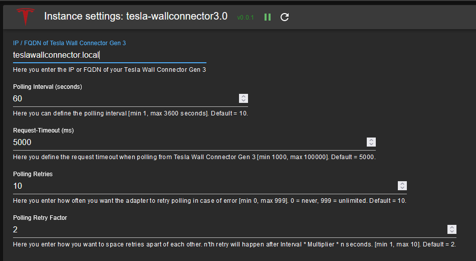

# ioBroker.tesla-wallconnector3

## Tesla wall connector gen 3 adapter for ioBroker
Targeted at the Tesla Wall Connector Gen 3.
Only provides read access to API data (write isn't supported by the API).

## Installation
Installation is facilitated via the ioBroker web interface and the configuration will auto-open once installation is completed.

## Setup
In addition to the adapter installation you have to add an instance of the adapter.

### Configuration 

| Field         | Description |                                                                       
|:-------------|:-------------|
|Tesla Wall Connector Gen 3 |Type in the IP-address of your Tesla Wall Connector Gen 3 (FQDN is also possible if you have a working local DNS).|
|Polling Interval|You can change the polling interval for high priority data (how often the Adapter reads from your Tesla Wall Connector Gen 3), too. (Default: 10 seconds)|
|Request-Timeout|If your network requires a higher timeout for requests sent to Tesla Wall Connector Gen 3, please change the Request-Timeout in miliseconds accordingly. (Default: 5000 miliseconds)|
|Polling Retries|In case there is an issue communicating with Tesla Wall Connector Gen 3 the adapter will retry several times. You can adjust how often it will try to read from Tesla Wall Connector Gen 3. (Default: 10) 
This does not apply to Adapter Start - if the System is unavailable to Adapter will stop.|
|Polling Retry Factor|To space retries apart a bit more you can adjust the Polling Retry Factor. (Default: 2) - Example: Using default settings the 1st retry will happen 20 seconds after the initial try, the 2nd will happen 40 seconds after the 2nd try. After each successful connect to SENEC, the number of retries is reset.|

Once finished setting up configuration, hit `SAVE AND CLOSE` to leave configuration dialogue. The adapter will automatically restart.

## Usage
Here you can find a description of the states and how to use them. All states of this adapter are read-only states. 
Please be aware that most (if not all) descriptions might be way off and might require confirmation or corrections. Pull-Requests with updates are welcome and encouraged!

### Known States

#### Channel: info

* info.connection

    |Data type|Permission|                                                                       
    |:---:|:---:|
    |boolean|R|

   *Read-only boolean which is true if the adapter is connected to the Tesla Wall Connector Gen 3.*
   
#### Channel: lifetime
   
* alert_count

    |Data type|Permission|                                                                       
    |:---:|:---:|
    |number|R|

   *Read-only number, representing the number of alerts.*
   
* avg_startup_temp

    |Data type|Permission|                                                                       
    |:---:|:---:|
    |number|R|

   *Read-only number, representing if the average startup temperature.*
   
* charge_starts

    |Data type|Permission|                                                                       
    |:---:|:---:|
    |number|R|

   *Read-only string, representing the number of charging starts.*
   
* charging_time_s

    |Data type|Permission|                                                                       
    |:---:|:---:|
    |number|R|

   *Read-only number, representing the charging time in seconds of the WC3*
   
* connector_cycles

    |Data type|Permission|                                                                       
    |:---:|:---:|
    |number|R|

   *Read-only number, representing the number of connector cycles (plugging in and out most likely counting each as 1).*
   
* contactor_cycles

    |Data type|Permission|                                                                       
    |:---:|:---:|
    |number|R|

   *Read-only number, representing the number of state-changes of the relais so far.*
   
* contactor_cycles_loaded

    |Data type|Permission|                                                                       
    |:---:|:---:|
    |number|R|

   *Read-only number, representing the number of charging cycles.*
   
* energy_wh

    |Data type|Permission|                                                                       
    |:---:|:---:|
    |number|R|

   *Read-only number, representing the amount of energy supplied in Wh.*
   
* thermal_foldbacks

    |Data type|Permission|                                                                       
    |:---:|:---:|
    |number|R|

   *Read-only number, representing the ???*
   
* uptime_s

    |Data type|Permission|                                                                       
    |:---:|:---:|
    |number|R|

   *Read-only number, representing the uptime in seconds of the WC3*
   
#### Channel: version

* firmware_version

    |Data type|Permission|                                                                       
    |:---:|:---:|
    |string|R|

   *Firmware version on the Tesla Wall Connector Gen 3*
   
* part_number

    |Data type|Permission|                                                                       
    |:---:|:---:|
    |string|R|

   *Part number of the Tesla Wall Connector Gen 3*
   
* serial_number

    |Data type|Permission|                                                                       
    |:---:|:---:|
    |string|R|

   *Serial number of the Tesla Wall Connector Gen 3*
   
#### Channel: vitals

* current_alerts

    |Data type|Permission|                                                                       
    |:---:|:---:|
    |string|R|

   *Read-Only string with details about alerts.*
   
* contactor_closed

    |Data type|Permission|                                                                       
    |:---:|:---:|
    |boolean|R|

   *Read-Only boolean indicating if the relais is closed.*
   
* grid_hz

    |Data type|Permission|                                                                       
    |:---:|:---:|
    |number|R|

   *Read-Only number representing the grids frequency.*
   
* config_status

    |Data type|Permission|                                                                       
    |:---:|:---:|
    |number|R|

   *Read-Only number representing the config status. Please help with details!*
   
* current[A,B,C,N]_a

    |Data type|Permission|                                                                       
    |:---:|:---:|
    |number|R|

   *Read-Only number representing the current of line [A,B,C,N] in ampere.*
   
* evse_state

    |Data type|Permission|                                                                       
    |:---:|:---:|
    |number|R|

   *Read-Only number representing the evse state. We seem to know so far: 0=booting, 1=idle, 2=connect but not ready, 3=???, 4=connected and ready, 5=???, 6=vehicle plugged in and handshaking, 7=???, 8=charging completed/interrupted, 9=ready for charging but waiting on car, 10=charging with reduced power (less than 3 phases, 16 amps each), 11=charging full power (3 Phases, 16 amps each), 12=??? *
   
* grid_v

    |Data type|Permission|                                                                       
    |:---:|:---:|
    |number|R|

   *Read-Only number representing the grids voltage.*
   
* handle_temp_c

    |Data type|Permission|                                                                       
    |:---:|:---:|
    |number|R|

   *Read-Only number representing the handle's tempearture in °C.*
   
* input_thermopile_uv

    |Data type|Permission|                                                                       
    |:---:|:---:|
    |number|R|

   *Read-Only number representing ???.*
   
* mcu_temp_c

    |Data type|Permission|                                                                       
    |:---:|:---:|
    |number|R|

   *Read-Only number representing the master control unit's tempearture in °C.*
   
* pcba_temp_c

    |Data type|Permission|                                                                       
    |:---:|:---:|
    |number|R|

   *Read-Only number representing the printed circuit board's tempearture in °C.*
   
* pilot_high_v

    |Data type|Permission|                                                                       
    |:---:|:---:|
    |number|R|

   *Read-Only number representing the pilot line's high voltage.*
   
* pilot_low_v

    |Data type|Permission|                                                                       
    |:---:|:---:|
    |number|R|

   *Read-Only number representing the pilot line's low voltage.*
   
* prox_v

    |Data type|Permission|                                                                       
    |:---:|:---:|
    |number|R|

   *Read-Only number representing ???.*
   
* relay_coil_v

    |Data type|Permission|                                                                       
    |:---:|:---:|
    |number|R|

   *Read-Only number representing the relay coils voltage.*
   
* session_s

    |Data type|Permission|                                                                       
    |:---:|:---:|
    |number|R|

   *Read-Only number representing the duration of the current charging session in seconds.*
   
* session_energy_wh

    |Data type|Permission|                                                                       
    |:---:|:---:|
    |number|R|

   *Read-Only number representing the energy supplied in the current session in Wh.*
   
* uptime_s

    |Data type|Permission|                                                                       
    |:---:|:---:|
    |number|R|

   *Read-Only number representing the WC3's uptime in seconds.*
   
* vehicle_connected

    |Data type|Permission|                                                                       
    |:---:|:---:|
    |boolean|R|

   *Read-Only boolean indicating if a vehicle is connected.*
   
* vehicle_current_a

    |Data type|Permission|                                                                       
    |:---:|:---:|
    |number|R|

   *Read-Only number representing vehicles current in ampere.*
   
* voltage[A,B,C]_v

    |Data type|Permission|                                                                       
    |:---:|:---:|
    |number|R|

   *Read-Only number representing the voltage of line [A,B,C].*
   
#### Channel: wifi_status

* internet

    |Data type|Permission|                                                                       
    |:---:|:---:|
    |boolean|R|

   *Read-only boolean, representing if the Tesla Wall Connector Gen 3 is connected to the internet.*
   
* wifi_connected

    |Data type|Permission|                                                                       
    |:---:|:---:|
    |boolean|R|

   *Read-only boolean, representing if the Tesla Wall Connector Gen 3 is connected to wifi.*
   
* wifi_infra_ip

    |Data type|Permission|                                                                       
    |:---:|:---:|
    |string|R|

   *Read-only string, representing the IP of the Tesla Wall Connector Gen 3.*
   
* wifi_mac

    |Data type|Permission|                                                                       
    |:---:|:---:|
    |string|R|

   *Read-only string, representing the MAC address of the Tesla Wall Connector Gen 3.*
   
* wifi_rssi

    |Data type|Permission|                                                                       
    |:---:|:---:|
    |number|R|

   *Read-only number, representing the rssi of the wifi the Tesla Wall Connector Gen 3 is connected to.*
   
* wifi_signal_strength

    |Data type|Permission|                                                                       
    |:---:|:---:|
    |number|R|

   *Read-only number, representing the signal strength of the wifi the Tesla Wall Connector Gen 3 is connected to.*
   
* wifi_snr

    |Data type|Permission|                                                                       
    |:---:|:---:|
    |number|R|

   *Read-only number, representing the snr of the wifi the Tesla Wall Connector Gen 3 is connected to.*
     
* wifi_ssid

    |Data type|Permission|                                                                       
    |:---:|:---:|
    |string|R|

   *SSID the Tesla Wall Connector Gen 3 is connected to.*

## Changelog

### 1.0.6 (NoBl)
* Maintenance update (dependencies, ...)

## License
MIT License

Copyright (c) 2024 Norbert Bluemle <github@bluemle.org>

Permission is hereby granted, free of charge, to any person obtaining a copy
of this software and associated documentation files (the "Software"), to deal
in the Software without restriction, including without limitation the rights
to use, copy, modify, merge, publish, distribute, sublicense, and/or sell
copies of the Software, and to permit persons to whom the Software is
furnished to do so, subject to the following conditions:

The above copyright notice and this permission notice shall be included in all
copies or substantial portions of the Software.

THE SOFTWARE IS PROVIDED "AS IS", WITHOUT WARRANTY OF ANY KIND, EXPRESS OR
IMPLIED, INCLUDING BUT NOT LIMITED TO THE WARRANTIES OF MERCHANTABILITY,
FITNESS FOR A PARTICULAR PURPOSE AND NONINFRINGEMENT. IN NO EVENT SHALL THE
AUTHORS OR COPYRIGHT HOLDERS BE LIABLE FOR ANY CLAIM, DAMAGES OR OTHER
LIABILITY, WHETHER IN AN ACTION OF CONTRACT, TORT OR OTHERWISE, ARISING FROM,
OUT OF OR IN CONNECTION WITH THE SOFTWARE OR THE USE OR OTHER DEALINGS IN THE
SOFTWARE.