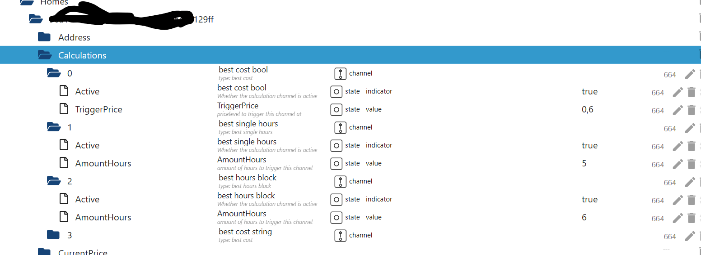
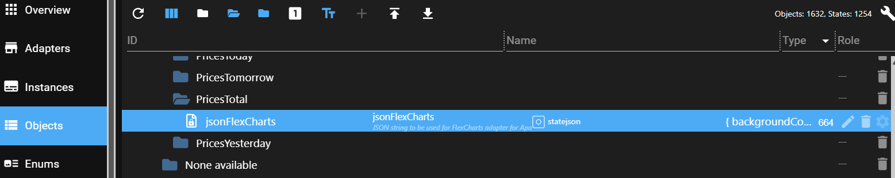
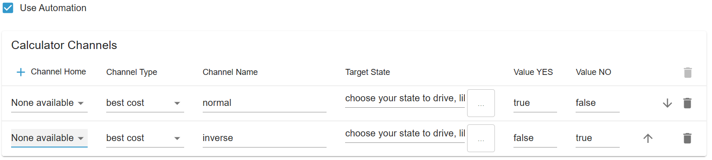

# ioBroker.tibberlink

[](https://www.npmjs.com/package/iobroker.tibberlink)
[](https://www.npmjs.com/package/iobroker.tibberlink)


[](https://github.com/hombach/ioBroker.tibberlink/actions/workflows/codeql-analysis.yml)
[](https://ci.appveyor.com/project/hombach/iobroker-tibberlink)
[](https://snyk.io/test/github/hombach/ioBroker.tibberlink)

## Versions


[](https://nodei.co/npm/iobroker.tibberlink/)

## Adapter for Utilizing TIBBER energy data in ioBroker

This adapter facilitates the connection of data from your Tibber account's API to be used within ioBroker, whether for a single home or multiple residences.
New Feature: The adapter now supports direct local reading of the Tibber Pulse Sensor through your home network, allowing for real-time monitoring and data collection without relying solely on the cloud API.

If you're not currently a Tibber user, I would greatly appreciate it if you could use my referral link: [Tibber Referral Link](https://invite.tibber.com/mu8c82n5).

## Standard Configuration

- Begin by creating a new instance of the adapter.
- You'll also require an API token from Tibber, which you can obtain here: [Tibber Developer API](https://developer.tibber.com).
- Enter your Tibber API token in the standard settings and configure at least one line for live feed settings (select "None available").
- Save the settings and exit the configuration to restart the adapter; this step allows your home(s) to be queried the first time from the Tibber server.
- Return to the configuration screen and select the homes from which you wish to fetch real-time data using your Tibber Pulse. You can also select homes and disable the feed (Note: This works only if the hardware is installed and the Tibber server has verified the connection to Pulse).
- Note: If you have more than one home actively in your Tibber account you have to add all of them to get rid of error message caused by potentially not needed homes. Add them all and disable the options.
- You have the option to deactivate the retrieval of price data for today and tomorrow, for instance, if you only intend to utilize Pulse live feeds
- Optionally, you can enable the retrieval of historical consumption data. Please specify the number of datasets for hours, days, weeks, months, and years. You can use "0" to disable one or more of these intervals based on your preferences.
- Note: It's essential to be mindful of the dataset size, as excessively large requests may result in a lack of response from the Tibber Server. We recommend experimenting with the dataset size to ensure optimal functionality. Adjusting the intervals and dataset numbers can help strike the right balance between obtaining insightful data and maintaining server responsiveness. E.g. 48 is a quite good amount for hours.
- Save the settings.

## Calculator Configuration

- Now that the Tibber connection is up and running, you can also leverage the Calculator to incorporate additional automation features into the TibberLink adapter.
- The Calculator operates using channels, with each channel linked to a selected home.
- These states are designed to serve as external, dynamic inputs for TibberLink, allowing you to, for example, adjust the marginal cost ("TriggerPrice") from an external source or enable the calculator channel ("Active").
- These channels have to be activated or deactivated based on corresponding states.
- The states of a calculator channel are positioned adjacent to the home states and named according to the channel number. Hereby the channelname choosen in admin screen is shown here to better identify your configurations.  
  
- The behavior of each channel is determined by its type: "best cost (LTF)", "best single hours (LTF)", "best hours block (LTF)" or "smart battery buffer".
- Each channel populates one or two external states as output, which has to be selected in the settings tab. For instance, this state might be "0_userdata.0.example_state" or any other writeable external state.
- If no external output state is selected, an internal state within the channel's range will be created.
- The values to be written to the output state can be defined in "value YES" and "value NO," e.g., "true" for boolean states or a number or text to be written.
- Outputs:
    - "Best cost": Utilizes the "TriggerPrice" state as input, producing a "YES" output every hour when the current Tibber energy cost is below the trigger price.
    - "Best single hours": Generates a "YES" output during the least expensive hours, with the number defined in the "AmountHours" state.
    - "Best hours block": Outputs "YES" during the most cost-effective block of hours, with the number of hours specified in the "AmountHours" state.  
      Additionally, the average total cost in the determined block is written to a state "AverageTotalCost" nearby the input states of this channel. Also start and end hour of the block is written to "BlockStartFullHour" and "BlockEndFullHour" as a result of the calculation.
    - "Best percentage": Outputs "YES" during the least expensive hour and any other hours where the price falls within the percentage range specified in the "Percentage" settings state.
    - "Best cost LTF": "Best cost" within a Limited Time Frame (LTF).
    - "Best single hours LTF": "Best single hours" within a Limited Time Frame (LTF).
    - "Best hours block LTF": "Best hours block" within a Limited Time Frame (LTF).
    - "Best percentage LTF": "Best percentage" within a Limited Time Frame (LTF).
    - "Smart Battery Buffer": Utilize the "EfficiencyLoss" parameter to specify the efficiency loss of the battery system. The "EfficiencyLoss" parameter can range from 0 to 1, where 0 represents no efficiency loss and 1 represents complete efficiency loss. For example, a value of 0.25 indicates a 25% efficiency loss for a charge/discharge cycle.  
      Use the "AmountHours" parameter to input the desired number of hours for battery charging. The calculator will activate battery charging ("value YES") and deactivate battery feed ("value 2 NO") during the specified "AmountHours" cheapest hours. Conversely, it will deactivate battery charging ("value NO") and activate battery feed ("value 2 YES") during hours with the highest cost, provided the cost is higher than the highest total price among the cheap hours. In the remaining normal hours where energy buffering by the battery is not economically viable, both outputs will be switched off.
- LTF channels: These operate similarly to standard channels but are active only within a time frame defined by the 'StartTime' and 'StopTime' state objects. After 'StopTime,' the channel automatically deactivates. 'StartTime' and 'StopTime' can span two calendar days, as Tibber does not provide data beyond a 48-hour window. Both states require a date-time string in ISO-8601 format with a timezone offset, e.g., '2024-12-24T18:00:00.000+01:00'." Additionally, the LTF channels feature a new state parameter called 'RepeatDays,' which defaults to 0. When 'RepeatDays' is set to a positive integer, the channel will repeat its cycle by incrementing both 'StartTime' and 'StopTime' by the specified number of days after 'StopTime' is reached. For example, set 'RepeatDays' to 1 for daily repetition.

## Graph Output Configuration

The adapter helps visualize price trends and calculator results. It provides three levels of complexity, each offering different options.
These three methods provide various options for visualizing price trends and calculator results. Depending on your requirements, you can choose from a simple JSON-based approach to a fully customized JavaScript solution.

### 1. **(Under Development) Visualization using the "E-Charts" Adapter**

This method requires the "E-Charts" adapter to be installed separately.

- JSON data can be used, generated in the Calculator States section as `Output-E-Charts`.
- The capabilities are limited by the constraints of the E-Charts adapter.

### 2. **Using the "FlexCharts" (or "Fully Featured eCharts") Adapter with JSON**

This method requires the "FlexCharts" adapter to be installed separately.

- The TibberLink adapter creates a state called `jsonFlexCharts`.

    

- The FlexCharts adapter renders this state via the following URL:
    ```
    http://[YOUR IP of FLEXCHARTS]:8082/flexcharts/echarts.html?source=state&id=tibberlink.0.Homes.[TIBBER-HOME-ID].PricesTotal.jsonFlexCharts
    ```
- Refer to the [FlexCharts adapter documentation](https://github.com/MyHomeMyData/ioBroker.flexcharts) for more details.

#### **JSON Template Usage**

- The `jsonFlexCharts` state is generated based on a template configured via the JSON editor in the adapter settings.
- **Important:** The built-in JSON editor in ioBroker.Admin does not support JSON5, which may cause false error messages.
- A sample template can be downloaded from: [TemplateFlexChart01.md](docu/TemplateFlexChart01.md).
- Copy and paste the template into the JSON editor.
- The template contains the placeholders:
    - `%%xAxisData%%` and `%%yAxisData%%` (populated with price information at runtime).
    - `%%CalcChannelsData%%` (populated with selected calculator channel data).
- The rest of the template follows the Apache ECharts configuration. For reference, see [Apache ECharts Examples](https://echarts.apache.org/examples/en/index.html).
- **Recommendation:** Test the TibberLink adapter without a real template using the default string:
    ```
    %%xAxisData%%\n\n%%yAxisData%%\n\n%%CalcChannelsData%%
    ```
    This helps understand its functionality.
- Template adjustments can be tested on Apache ECharts examples pages using the "Output-E-Charts" state data.
- Good templates will be shared within the TibberLink adapter community.

### 3. **Using "FlexCharts" with Custom JavaScript Code**

For maximum flexibility and customization, the FlexCharts adapter can be used with custom JavaScript.

- Both the "FlexCharts" and "JavaScript" adapters need to be installed separately.
- This approach allows the creation of multiple customized graphs.
- For more details, refer to the [FlexCharts Adapter Discussion](https://github.com/MyHomeMyData/ioBroker.flexcharts/discussions/67).

## Hints

### Inverse Usage

To obtain, for example, peak hours instead of optimal hours, simply invert the usage and parameters:

By swapping true <-> false, you will receive a true at a low cost in the first line and a true at a high cost in the second line (Channel names are not triggers and are still free to choose).

Attention: For peak single hours, such as in the example, you also need to adjust the number of hours. Original: 5 -> Inverse (24-5) = 19 -> You will obtain a true result during the 5 peak hours.

### LTF channels

The calculation is performed for "multiday" data. As we only have information for "today" and "tomorrow" (available after approximately 13:00), the time scope is effectively limited to a maximum of 35 hours. However, it's crucial to be mindful of this behavior because the calculated result may/will change around 13:00 when new data for tomorrow's prices becomes available.

To observe this dynamic change in the time scope for a standard channel, you may opt for a Limited Time Frame (LTF) spanning several years. This is particularly useful for the "Best Single Hours LTF" scenario.

## Direct local poll of Pulse data

To make it work, you need to modify the web interface of the Bridge to remain permanently enabled.
marq24 has described how to do this excellently for his HomeAssistant integration here:

https://github.com/marq24/ha-tibber-pulse-local

If everything works correctly, the meter data will be written to IoBroker states every 2 seconds.

## Sentry

This adapter employs Sentry libraries to automatically report exceptions and code errors to the developers. For more details and information on how to disable error reporting, please consult the [Sentry-Plugin Documentation](https://github.com/ioBroker/plugin-sentry#plugin-sentry)! Sentry reporting is initiated starting with js-controller 3.0.

## Donate

<a href="https://www.paypal.com/donate/?hosted_button_id=F7NM9R2E2DUYS"></a>  
If you enjoyed this project — or just feeling generous, consider buying me a beer. Cheers! :beers:

## Changelog

<!--
  Placeholder for the next version (at the beginning of the line):
  ### **WORK IN PROGRESS**
-->

### **WORK IN PROGRESS**

- (HombachC) optimize sentry
- (HombachC) update axios
- (HombachC) update FlexChart template
- (HombachC) update dependencies

### 6.0.2 (2025-10-24)

- (HombachC) update NPM deployment
- (HombachC) update dependencies

### 6.0.1 (2025-10-09)

- (HombachC) fix error in cleaning tomorrow data
- (HombachC) update release management to 4.x.x

### 6.0.0 (2025-10-06)

- (HombachC) BREAKING: hourly price states (0...23) are now quarterhourly (0...95)
- (HombachC) BREAKING: adapted calculator time blocks need reentry of "AmountHours" values
- (HombachC) change price updates to 15 minutes resolution as default
- (HombachC) change current price updates to use existing today values instead of Tibber calls
- (HombachC) more timely precision for current price and calculator
- (HombachC) adapt chart generation
- (HombachC) fix error in efficiency loss
- (HombachC) adapt calculator time blocks
- (HombachC) update tibber-api to 5.5.2
- (HombachC) update typescript to 5.9.3 (#777)
- (HombachC) add names to price states folders

### 5.0.4 (2025-09-27)

- (HombachC) prepared price updates to 15 minutes resolution (#384)
- (HombachC) update tibber-api to 5.4.2
- (HombachC) update chai system

### 5.0.3 (2025-09-17)

- (HombachC) fix jsonconfig schema definition (#762)
- (HombachC) optimize cron jobs
- (HombachC) update axios

### Old Changes see [CHANGELOG OLD](CHANGELOG_OLD.md)

## License

GNU General Public License v3.0 only

Copyright (c) 2023-2025 C.Hombach <TibberLink@homba.ch>
