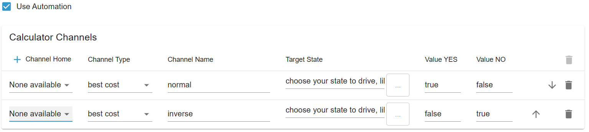

# Calculator Configuration

_Part of the [ioBroker.tibberlink documentation](/#/adapters/tibberlink)._

- Now that the Tibber connection is up and running, you can also leverage the Calculator to incorporate additional automation features into the TibberLink adapter.
- The Calculator operates using channels, with each channel linked to a selected home.
- These states are designed to serve as external, dynamic inputs for TibberLink, allowing you to, for example, adjust the marginal cost ("TriggerPrice") from an external source or enable the calculator channel ("Active").
- These channels have to be activated or deactivated based on corresponding states.
- The states of a calculator channel are positioned adjacent to the home states and named according to the channel number. The channel name entered in the admin screen is displayed here to help identify your configurations.  
  
- The behavior of each channel is determined by its type: "best cost (LTF)", "best single hours (LTF)", "best hours block (LTF)" or "smart battery buffer".
- Each channel populates one or two external states as output, which have to be selected in the settings tab. For instance, this state might be "0_userdata.0.example_state" or any other writeable external state.
- If no external output state is selected, an internal state within the channel's range will be created.
- The values to be written to the output state can be defined in "value YES" and "value NO," e.g., "true" for boolean states or a number or text to be written.
- Outputs:
    - "Best cost": Utilizes the "TriggerPrice" state as input, producing a "YES" output every hour when the current Tibber energy cost is below the trigger price.
    - "Best single hours": Generates a "YES" output during the least expensive hours, with the number defined in the "AmountHours" state.
    - "Best hours block": Outputs "YES" during the most cost-effective block of hours, with the number of hours specified in the "AmountHours" state.  
      Additionally, the average total cost in the determined block is written to a state "AverageTotalCost" nearby the input states of this channel. Also start and end hour of the block is written to "BlockStartFullHour" and "BlockEndFullHour" as a result of the calculation.
    - "Best percentage": Outputs "YES" during the least expensive hour and any other hours where the price falls within the percentage range specified in the "Percentage" settings state.
    - "Best cost LTF": "Best cost" within a Limited Time Frame (LTF).
    - "Best single hours LTF": "Best single hours" within a Limited Time Frame (LTF).
    - "Best hours block LTF": "Best hours block" within a Limited Time Frame (LTF).
    - "Best percentage LTF": "Best percentage" within a Limited Time Frame (LTF).
    - "Smart Battery Buffer":
        - The "EfficiencyLoss" parameter defines the efficiency loss of the battery system. Its value ranges from 0 to 1, where 0 means no efficiency loss and 1 represents complete energy loss. For example, a value of 0.25 indicates a 25% efficiency loss per charge/discharge cycle.
        - The "AmountHours" parameter specifies the maximum number of hours the system may use for battery charging, rounded to quarter hours. Important: this is an upper limit, not a guaranteed number of hours. The actual number of charging timeslots is determined dynamically based on energy prices and the efficiency loss. Only timeslots where charging is economically worthwhile (i.e., price is sufficiently below the most expensive slot, considering EfficiencyLoss) will be selected.
        - The calculator works as follows:
            - Cheap timeslots: Battery charging is enabled (value YES) and feed into the home energy system is disabled (value 2 NO). These are the slots with the lowest prices that pass the efficiency filter, up to AmountHours.
            - Expensive timeslots: Battery charging is disabled (value NO) and feed into the home energy system is enabled (value 2 YES). These slots have the highest prices, above the dynamically calculated threshold based on the cheapest timeslot prices and efficiency loss.
            - Normal timeslots: Where charging is not economically viable, both outputs are disabled.
        - This approach ensures that the battery is only used when it is economically beneficial, rather than strictly adhering to a fixed number of hours.
- LTF channels: These operate similarly to standard channels but are active only within a time frame defined by the 'StartTime' and 'StopTime' state objects. After 'StopTime,' the channel automatically deactivates. 'StartTime' and 'StopTime' can span two calendar days, as Tibber does not provide data beyond a 48-hour window. Both states require a date-time string in ISO-8601 format with a timezone offset, e.g., '2024-12-24T18:00:00.000+01:00'. Additionally, the LTF channels feature a new state parameter called 'RepeatDays,' which defaults to 0. When 'RepeatDays' is set to a positive integer, the channel will repeat its cycle by incrementing both 'StartTime' and 'StopTime' by the specified number of days after 'StopTime' is reached. For example, set 'RepeatDays' to 1 for daily repetition.

## Hints

### Inverse Usage

To obtain, for example, peak hours instead of optimal hours, simply invert the usage and parameters:

By swapping true <-> false, you will receive a true at a low cost in the first line and a true at a high cost in the second line (channel names are just examples and can be freely chosen).

Attention: For peak single hours, such as in the example, you also need to adjust the number of hours. Original: 5 -> Inverse (24-5) = 19 -> You will obtain a 'true' output during the 5 peak hours.

### LTF channels

The calculation is performed for "multiday" data. As we only have information for "today" and "tomorrow" (available after approximately 13:00), the time scope covers up to 48 hours, though typically around 35 hours immediately after the 13:00 price update. However, it's crucial to be mindful of this behavior because the calculated result may/will change around 13:00 when new data for tomorrow's prices becomes available.

To observe this dynamic change in the time scope for a standard channel, you may opt for a Limited Time Frame (LTF) spanning several years. This is particularly useful for the "Best Single Hours LTF" scenario.